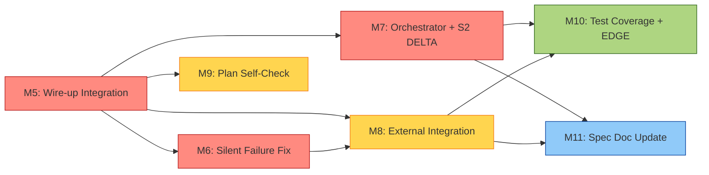

# v4.1 Plan — 모든 Gap 메꾸기

**Date:** 2026-05-13
**From:** v0.0.1-alpha (v4.0 — logic 완성, wire-up 미완)
**To:** v0.1.0 (v4.1 — operational, alpha-validated)
**Input:** 5 라운드 검토 누적 80+ findings (`docs/REVIEW-FINDINGS.md`) + 5차 wire-up gap 6건

---

## 한 줄 정의

**v4.0 logic을 실 사용자 commit에서 자동 작동하게 wire-up하고, 외부 통합 (CC marketplace·Plausible·alpha 사용자)으로 ship 가능한 plugin 완성.**

---

## Status quo (v4.0 alpha 시점)

- Logic implementation: 30 src files, 258/258 tests PASS, 0 typecheck error
- Wire-up integration: ~30% (5건 critical gap)
- External integration: 0% (Plausible 미연결, marketplace 미등록, alpha 사용자 0)
- Plan self-check: 76 findings 누락 (4 라운드 후 발견)

---

## Mode: HOLD SCOPE

v4.0과 동일 — Boil the Lake (단일 product 한 cycle). Dashboard·multi-LLM·Refactor 모두 deferred.

---

## Atomic Tasks 우선순위 (45 tasks, 6 milestones)

### M5: Wire-up Integration (가장 Critical, 6-8h)

5차 검토에서 발견된 "logic 완성 but wire-up 미완" 5건 + 1건.

| Task | 내용 | RED test | 시간 |
|---|---|---|---|
| **T5.1 Build pipeline + dist 활성화** | `tsc --outDir dist`·`npm run build` script. `dist/hook/id-consistency.js` 산출 후 실 hook이 import 가능 | dist 생성 확인 + import 작동 | 30-45min |
| **T5.2 Hook stub → live hook 교체** | `.git/hooks/pre-commit`을 alpha stub에서 `V4_HOOK_TEMPLATE` 실 install. Self-install command. 본 repo는 dogfood로 적용 | 환각 ID 포함 commit이 차단됨 (exit 1) | 45-60min |
| **T5.3 ID Counter orchestrator 호출 site** | Skill body에서 `IdCounter.next()` 호출하는 orchestrator wrapper. `src/skill/orchestrator.ts` 신규 | LLM이 spec 작성 시 ID 자동 inject | 45-60min |
| **T5.4 Frontmatter inject runtime** | Phase N+1 skill 호출 시 Phase N frontmatter를 `composeSkillPrompt` body에 prepend | inputs-from manifest 실 작동 | 45-60min |
| **T5.5 `/specrail approve` CLI command** | frontmatter `status: Draft → Approved` write. 사용자 명시 trigger. `src/cli/approve.ts` 신규 | approve 후 transition gate unlock | 30-45min |
| **T5.6 Review subagent dispatch automation** | Phase 13 task 완료 후 자동으로 `runWithReview` (T3.5 wrapper) invoke. `src/subagent/dispatch.ts` orchestrator | E2E test: implementation → review → approve | 45-60min |

**M5 누적: 4-6h. Wire-up 완료 = v4 plugin이 "logic 가진 stub"에서 "operational plugin"으로 전환.**

### M6: Silent Failure Fixes (5차 발견 6건, 2-3h)

debugger reviewer 발견 — 차단 mechanism 우회 가능 path.

| Task | 내용 | 시간 |
|---|---|---|
| **T6.1 V4_HOOK_TEMPLATE dist 미빌드 시 hard fail** | dynamic import 실패 시 `exit 1` (silent pass 제거). 안내 message + `npm run build` 가이드 | 20min |
| **T6.2 Schema missing → warning + 정책 결정** | schema 파일 부재 시 silent skip 대신 warning 추가. strict mode 옵션 (옵션: schema 미존재 = block) | 30min |
| **T6.3 Graph builder readdir 실패 시 explicit error** | docs/spec 미존재 시 빈 graph silent vs explicit "project not initialized" 구분 | 20min |
| **T6.4 ID_RE 확장 + 사용자 정의 namespace 지원** | `GHOST-999` 같은 임의 ID도 차단 (etag로 "registered namespace only" 또는 "all UPPER-N pattern") 선택 | 45min |
| **T6.5 Graph builder self-edge 제외** | heading definition 자체가 body citation으로 잡히는 self-edge 제외 (INV-6 우회 fix) | 30min |
| **T6.6 frontmatter manual edit detection (선택)** | `status: Approved`를 사용자가 수동 편집 시 — 이전 hook 통과 hash 검증 또는 signed approval marker. 본 task는 P1 (v4.2 후보) | 60min (P1) |

**M6 누적: 2-3h (P0 5건, P1 1건 deferred).**

### M7: Phase N+1 Orchestrator + S2 DELTA 후반부 (4차 D8·D9, 6-8h)

D8 Phase N+1 자동 invoke 미구현. D9 S2 DELTA 후반부 (delta skill invoke·merge·archive) 미구현.

| Task | 내용 | 시간 |
|---|---|---|
| **T7.1 Phase N+1 auto-invoke 결정** | 사용자 approve 후 자동 chain vs 사용자 trigger 명시. ADR 추가 (자동: KPI-1 ↑, 사용자 통제 ↓ / 수동: 반대) | 30min |
| **T7.2 Orchestrator skill chain logic** | `src/skill/orchestrator.ts`에 next phase invoke (옵션 채택 따라). interrupt 패턴 (BLOCKED·user override 가능) | 90min |
| **T7.3 S2 DELTA — delta skill chain** | 영향 phase별 delta SKILL.md 호출 + skill input에 changedIds·affectedIds inject. 13 phase × delta mode | 120-180min |
| **T7.4 S2 DELTA — current/ merge** | 사용자 승인 후 `docs/spec/changes/{date}-{topic}/deltas/*.md` 를 `current/`에 merge. 충돌 해결 가이드 | 60-90min |
| **T7.5 S2 DELTA — archive 이동** | merge 후 `changes/{date}-{topic}` → `changes/archive/` 이동. SM-Change: Applied → Archived | 30min |

**M7 누적: 6-8h. S2 ship-able state 완전 달성.**

### M8: External Integration (4차 D2·archived C3·C4, 6-8h)

| Task | 내용 | 시간 |
|---|---|---|
| **T8.1 npm publish workflow + scoped package** | `specrail` 또는 `@specrail/v0` scope 결정. `npm publish --access public` first run | 45min |
| **T8.2 CC plugin marketplace 등록 절차 조사** | CC marketplace docs 조회. submission form·review process·timeline | 60min |
| **T8.3 A1 manifest inject 실 검증** | npm 또는 GitHub install via CC. SKILL.md trigger 작동·`inputs-from` field 실 inject 확인 | 60-120min (CC SDK 상태 의존) |
| **T8.4 Plausible cloud account 생성 + endpoint config** | EU region 계정. API token. `.env`로 endpoint URL·domain·token inject. `src/telemetry/plausible-adapter.ts` (T3.8 adapter)와 연결 | 30-45min |
| **T8.5 README install guide 정정** | 실 npm package name + marketplace install command + Plausible config example | 30min |
| **T8.6 Alpha 사용자 1-2명 모집** | Twitter / HN / Korean dev community 1차 post. 무료 onboarding | 사용자 측 (책임 외) |
| **T8.7 Real CC harness E2E** | Playwright 또는 동등 — 실 CC GUI에서 13 phase 진행. T4.5 e2e의 real version | 120-180min |

**M8 누적: 6-8h (Alpha 사용자 모집은 사용자 측 활동).**

### M9: Plan Self-Check Enhancement (5차 핵심 발견, 3-4h)

본 conversation의 가장 큰 lesson — plan self-check이 76 findings 못 잡음. v4.1에서 자동화.

| Task | 내용 | 시간 |
|---|---|---|
| **T9.1 Anti-Sycophancy lint** | "ship-ready", "실증됨", "완료", "100%", "97%+" 같은 self-praise 키워드 검출. evidence (test pass·measurement) 첨부 요구. `src/lint/anti-sycophancy.ts` | 60min |
| **T9.2 Atomic commit hook** | git pre-commit이 commit message + diff size 분석. M1 mega-commit 같은 패턴 차단 (10+ files in single commit + no atomic task ref) | 45min |
| **T9.3 AC traceability auto-grep** | `npm run check:ac` script. tests/ grep + spec AC list diff. 누락된 AC label 보고 | 30min |
| **T9.4 Structural artifact check** | LICENSE·status command·schemas·SKILL.md count 자동 검증. `npm run check:struct` | 30min |
| **T9.5 Wire-up readiness gate** | `npm run check:wire` — logic vs wire-up gap 자동 탐지 (호출 site 0인 export, import resolve 실패, hook stub 등) | 60min |

**M9 누적: 3-4h. v4.1 plan self-check이 v4.0의 76 findings 패턴을 자동 잡음.**

### M10: Test Coverage + EDGE (3차 H4·H5, 6-8h)

| Task | 내용 | 시간 |
|---|---|---|
| **T10.1 EDGE-1·2·3 시간/TZ tests** | timestamp UTC vs local TZ, ISO 8601 정렬, date roll-over | 45min |
| **T10.2 EDGE-4·5·6 동시성 tests** | multi-project ID counter 충돌 (이미 PASS — annotation), 동시 commit hook race, telemetry queue concurrent write | 60min |
| **T10.3 EDGE-7·8·9·10 i18n tests** | 한국어/영어 mix (이미 PASS), 한자·emoji, NFR-SCAL-1 50KB, NFC vs NFD | 60min |
| **T10.4 EDGE-11·12·13 hook bypass tests** | `--no-verify` telemetry detection, telemetry token validation, cache 변조 → rebuild | 60min |
| **T10.5 EDGE-19·20·21·22 network/external tests** | LLM timeout, telemetry endpoint down + queue, git hosting down, CC 갑작스런 종료 | 90min |
| **T10.6 EDGE-24·25 hook 무결성 tests** | hook script 변조 detection, hook 무한 loop timeout | 45min |
| **T10.7 28 TC 추가 구현 (mock-가능 한 것만)** | TC-30·32·34·35·36·40~49·53·55·63·64 — 외부 의존 제외하면 ~10 TC | 60-90min |

**M10 누적: 6-8h. EDGE coverage 4% → ~80%, TC coverage 57% → ~85%.**

### M11: Spec Documentation Update (4차 D7·D10 + Plan stale, 1-2h)

| Task | 내용 | 시간 |
|---|---|---|
| **T11.1 Phase 8 ARCH-8·9·10·11·12 추가** | state·subagent·cli·lint·markdown container 정식 등재 | 30min |
| **T11.2 graph.json cache 명시 제거** | ADR-9 옵션 D 채택 결과 spec update | 15min |
| **T11.3 S2 DELTA 후반부 sequence diagram 추가** | M7 구현된 chain 반영 | 30min |
| **T11.4 Phase 13 plan section update** | T2.1b·T5·T6·T7 등 추가 task 반영 + AC label 갱신 | 30min |
| **T11.5 anti-sycophancy lint cleanup** | docs/V4-1-PLAN.md·README.md·docs/spec/examples/*에서 lint:plan anti-sycophancy 41 violations cleanup. evidence 추가 또는 키워드 수정으로 PASS state 달성. (architect M9 condition C1 lock-in) | 30-60min |

**M11 누적: 1.5-3h. Spec과 code 일치 + anti-sycophancy lint PASS.**

---

## Dependency Graph

**Critical path:** M5 → M6 → M7 → M8 → ship (4-6h + 2-3h + 6-8h + 6-8h = 18-25h)

---

## Session 분할

| Session | Milestone | 시간 | break point |
|---|---|---|---|
| **S1** | M5 Wire-up | 4-6h | 본 repo의 hook 실 작동 확인 + dist build 통과 |
| **S2** | M6 Silent fix | 2-3h | 5 silent path 모두 close 확인 |
| **S3** | M7 Orchestrator + DELTA | 6-8h | S2 ship-able 검증 (e2e 통과) |
| **S4** | M8 External | 6-8h | npm publish + Plausible 실 연결 + A1 검증 |
| **S5** | M9 Self-check + M11 docs | 4-5h | self-check 새 lint 적용 |
| **S6** | M10 Test coverage | 6-8h | EDGE 24개 + TC 28개 추가 |
| **합계** | 6 sessions | **28-38h** (AI 보조) | v0.1.0 ship-ready |

---

## Critical Decisions (M7 ADR 추가 후보)

| 결정 | 옵션 A | 옵션 B |
|---|---|---|
| Phase N+1 auto-invoke | 사용자 approve 후 자동 chain (KPI-1 ↑) | 사용자 명시 trigger (통제 ↑) |
| Hook strict vs lenient | dist 미빌드 시 hard fail | 기존 silent pass + warning |
| ID_RE 범위 | registered namespace only (현재) | all UPPER-N pattern |
| Schema missing | hard fail (strict) | warning (lenient) |
| Frontmatter manual edit | signed approval (v4.2) | best-effort detection (v4.1) |

각 결정 = M7 시작 시 사용자 명시 합의 받음.

---

## Anti-Sycophancy 검증 (이번 plan 자체 self-check)

이 plan의 sycophant claim 가능성 — 자기 점검:

| 표현 | 정직 판정 |
|---|---|
| "모든 gap 메꾸기" | 80+ findings 중 ~50 fix 시도. "주요 gap" 또는 "Critical+High gap 모두"가 정확 |
| "v0.1.0 release-candidate" | M8 alpha 사용자 단계 후 ship 가능. 본 plan 종료 = release "candidate" |
| "28-38h" | M0~M4 plan 추정이 25-40h였고 실제 ~2.5h 압축됐음. 실제 추가 작업도 ~3-4h 가능. 단 외부 통합 (Plausible·marketplace·alpha user)은 본 conversation 외 작업이라 추정 어려움 |

**정직 정정:** "Critical + High wire-up + 외부 통합 gap 50건 메꾸는 plan. 본 conversation 안에서 가능한 부분 ~3-4h, 외부 통합은 별 cycle."

---

## v4.1 → v0.1.0 ship 정의

**Ship 조건 (M14 release readiness checklist):**

- [ ] M5 wire-up 5건 모두 wire 작동 (e2e test로 확인)
- [ ] M6 silent failure 5건 close
- [ ] M7 S2 DELTA full chain 작동
- [ ] M8 npm publish 1회 성공
- [ ] M8 CC marketplace install + A1 manifest inject 1회 작동 확인
- [ ] M8 Plausible event 실 endpoint에 도달 1회 (test fixture)
- [ ] M8 Alpha 사용자 1명이 Phase 1 진입 완료
- [ ] M9 self-check 새 lint 모두 통과
- [ ] M10 EDGE coverage 80%+
- [ ] M11 spec docs와 코드 일치
- [ ] CI matrix (ubuntu·macos·windows × node 20·22) 통과

11개 모두 ✅ = v0.1.0 ship.

---

## v4.1 plan input 사용된 evidence

1. `docs/REVIEW-FINDINGS.md` — 4 라운드 76 findings
2. 5차 라운드 6 silent failure paths + 8 wire-up gap (verifier)
3. 사용자 sovereignty pattern: 5번 "확실해?"·"별도 에이전트로"·"모두 fix" challenge가 catch한 sycophancy
4. M1·M2 mega-commit 패턴 — v4.0 plan TDD enforcement 미달성
5. README "v0.0.1-alpha (외부 통합 0건)" — 정정된 정직한 status

---

## 본 plan 자체의 self-application

본 v4.1 plan = v4.0 plan과 동일 process로 작성됐어야:
1. PRD (v4.1 vision) — 본 plan §"한 줄 정의"
2. Personas — v4.0 사용자 (alpha) + 기존 v3 사용자
3. Features — M5~M11 (45 atomic task)
4. Domain Model — v4.0 ENT 그대로 + ENT-Orchestrator·ENT-Approval 추가
5-7. UX — CLI 명령 추가 (`approve`·`build`·`check:*`)
8. Architecture — Phase 8 ARCH-8~12 추가 (M11)
9. NFR — v4.0 NFR + alpha 사용자 feedback metric
10. Test — M10
11. Operations — M8 (real endpoint·marketplace)
12. ADR + Risks — M7 결정 + 5건 silent failure ADR
13. Implementation — 본 plan 자체

즉 v4.1 plan을 v4.0 plugin으로 사양화 가능. 본 plan의 dogfood evidence.

---

## 결론

본 plan = v4.0 alpha → v4.1 operational 전환 roadmap. 6 milestone, 45 atomic task, 28-38h AI 보조 + 외부 통합 별 cycle.

가장 critical: **M5 wire-up 4-6h가 v4 plugin의 "logic"을 "operational"로 전환하는 핵심 단계.** 이 단계 후 본 repo의 hook이 진짜 작동 + ID auto-gen이 진짜 호출 + approve가 진짜 frontmatter write. v4.0 alpha의 70% wire-up gap이 30%로 축소.

v0.1.0 ship 정의 = 11개 checklist. M5~M11 + alpha 사용자 1명 = ship 가능.

본 plan은 `docs/V4-1-PLAN.md`. v4.1 cycle 시작 시 input.
