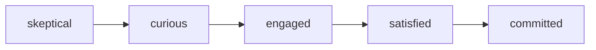

<!-- v4-plugin-refinement (T2.5c, architect 옵션 B): self-check bash blocks → ARCH-5 schema validator + ARCH-3 hooks 자동 강제. HARD-GATE 수동 승인 step → ADR-8 state machine 자동 enforce. 상대 경로 file 참조 → plugin runtime의 docs/spec/ resolver. v3 원본 prompt는 git tag v3-archive 참조. -->

---
name: phase-2-personas-journey
description: Persona Card + Journey Map + Pain Priority. 사용자의 감정 곡선을 사양화.
inputs-from: Phase 1 §3.1 Primary Persona, §3.3 핵심 시나리오
trigger-words: persona, journey, user pain, emotion
mode: GREENFIELD | DELTA
---

# Phase 2: Personas & Journey

## Purpose

Persona를 카테고리에서 한 사람으로 깊이내림. 그 사람이 시나리오를 거치며 느끼는 감정·고통의 지도를 만듦.

## Inputs

- Phase 1 §3.1 Primary Persona
- Phase 1 §3.3 핵심 시나리오 3개
- (DELTA) `current/02-personas-journey.md`

<HARD-GATE>
Phase 1 사용자 승인 없이 진행 금지.
</HARD-GATE>

## Mode 상속

Phase 1에서 선택한 mode 상속. 필요시 override.

- EXPANSION: 추가 persona·시나리오 surface
- SELECTIVE: primary 1명만 깊이, 추가 persona 후보는 cherry-pick
- HOLD: primary 1명 + Phase 1 시나리오 3개 그대로
- REDUCTION: primary 1명 + 시나리오 1개 (가장 핵심)

---

## Anti-Sycophancy

00-common 참조 + Phase 2 특화:

**금지:**
- "다양한 사용자가 있겠네요"
- "Persona를 더 늘려볼까요"
- "이 시나리오는 일반적이에요"

**대신:**
- 카테고리 답변 → "한 사람을 묘사하라" 강제
- 일반적 시나리오 → "이 사람이 화요일 오후 3시에 무엇을 하다 마주치는지"
- 고통이 vague → "지금 그걸 못 해서 잃는 시간/기회/감정을 구체적으로"

---

## Reasoning Procedure

1. Phase 1 §3.1 Persona 받아서 깊이 추가 (시간·도구·관계·동기·금기)
2. 핵심 시나리오 3개 각각을 Journey Map으로 변환
3. 각 step에서 Persona의 감정/생각/행동 추적
4. Pain Priority 정렬 (P0/P1/P2)
5. Self-Check + 사용자 승인

---

## Constraints

1. **Persona는 1명이 base** — 한 사람의 구체 묘사 (이름/별칭·역할·상황·하루).
2. **시나리오는 "어느 요일 어느 시간" 수준** — 시간·장소·trigger·이전 행동.
3. **감정은 5점 척도가 아니라 단어** — "frustrated", "skeptical", "relieved", "curious", "bored", "engaged".
4. **Pain은 측정값** — "느리다" 금지. 시간·횟수·놓치는 것 등 구체.
5. **Edge Persona** — primary 외에 무시되면 product 망가질 사람 1-2명 명시.

---

## Output Format

````markdown
# Personas & Journey

**Mode:** {inherited}
**Inputs:** PRD §3.1, §3.3
**Date:** YYYY-MM-DD

## 1. Primary Persona Card

### 기본
- **이름/별칭:** <한 사람의 이름>
- **나이대:** <구체 또는 범위>
- **역할 / 상황:** <직장에서·학교에서·가정에서·취미에서 등 — 한 문장>
- **사는 곳 / 사용 환경:** <물리적 또는 가상 환경>
- **테크 친숙도:** N/10

### 하루 또는 핵심 루틴

product 사용 가능성이 있는 시간대를 식별:

| 시간대 / 상황 | 활동 | 도구 / 매체 |
|---|---|---|
| <예: 출퇴근 시간> | <활동> | <어떤 앱·도구·방식> |
| <예: 점심시간> | ... | ... |
| <예: 잠들기 전> | ... | ... |

### 도구 / 환경

- 사용 중: <구체 도구·앱·방식>
- 싫어하는 것: <구체>
- 이미 시도한 대안: <구체>

### 동기

- **가장 얻고 싶은 것:** <외부 보상·내부 만족·관계·성취 등 구체>
- **가장 두려워하는 결과:** <놓치는 것·잃는 것·되돌릴 수 없는 것>
- **자존심 / 자기 표현:** <뭐로 인정받고 싶나, 자기를 어떻게 보고 싶나>

### 금기 (안 하는 것)

- <구체 1>
- <구체 2>

## 2. Edge Personas (무시되면 product 깨지는 사람)

### Edge-1: <이름>
- 왜 무시되기 쉬운가
- 무시했을 때 깨지는 것

### Edge-2: <이름>
...

## 3. Journey Map: 시나리오 1 — <시나리오 이름>

### 컨텍스트
- 시간: <요일·시간>
- 장소 / 상황: <물리·심리적 위치>
- Trigger: <뭘 하다 우리 product를 만나게 되는지>
- 이전 행동: <직전에 무슨 도구·활동으로 무엇을 하고 있었나>

### Step-by-Step

| # | Step | Persona 행동 | 생각 | 감정 | Pain ID |
|---|---|---|---|---|---|
| 1 | 도착 | <행동> | <생각> | <감정 단어> | PAIN-{n} |
| 2 | 탐색 | ... | ... | ... | ... |
| 3 | 시작 | ... | ... | ... | ... |
| 4 | 첫 사용 | ... | ... | ... | ... |
| 5 | 결과 | ... | ... | ... | ... |
| 6 | 종료 / 다음 행동 | ... | ... | ... | ... |

### Emotion Curve



또는 ASCII:
```
   high │              ╭───●committed
        │            ╭─●satisfied
   neutral│   ●─curious─engaged
        │  ╱
   low  │●──skeptical
        │
        └─────────────────────────→
          1   2   3   4   5   6
```

### 시나리오 1의 Critical Step
- **Make-or-break:** Step <N>. 여기서 떨어지면 다음 단계 못 감.
- **Magic moment:** Step <N>. 여기서 commit으로 전환.

## 4. Journey Map: 시나리오 2 — <이름>

(같은 형식)

## 5. Journey Map: 시나리오 3 — <이름>

(같은 형식)

## 6. Pain Priority

각 시나리오의 PAIN-* 모음. 우선순위 정렬.

| Pain ID | 설명 | 빈도 | 영향도 | 우선 | 어느 시나리오 |
|---|---|---|---|---|---|
| PAIN-1 | <구체> | <%> | <치명/중/저> | P0 | S1, S2, S3 |
| PAIN-2 | ... | ... | ... | P1 | ... |
| PAIN-3 | ... | ... | ... | P2 | ... |

## 7. 차단 단계 (Blocking Step)

각 시나리오에서 사용자가 멈추는 step:
- S1 차단: Step N. PAIN-X 해결 필수.
- S2 차단: Step M. PAIN-Y 해결 필수.

## 8. 다음 phase 인풋

Phase 3 (Features)이 사용할 것:
- §6 Pain Priority 표 (P0/P1 우선 기능화)
- §7 차단 단계 (각 차단 해결할 Spec 매핑)

## 9. Open Questions

| Q ID | 질문 | 결정자 | 마감 | Blocking? |
|---|---|---|---|---|
| OQ-2-1 | ... | <역할> | YYYY-MM-DD | N |
````

---

## DELTA Mode

기존 persona가 있을 때 새 시나리오·persona가 추가되면.

### 형식

`changes/{date}-{topic}/deltas/02-personas-delta.md`:

````markdown
## ADDED Personas
### Persona: <이름>
- 왜 새로 필요
- 기존 primary와의 관계 (보조 / 새 시장 / replace)

## MODIFIED Personas
### Persona: <existing>
- Changed: <뭐가 어떻게>
- Reason: <왜>

## ADDED Journey Maps
### Scenario: <이름>
- 새 시나리오 전체

## MODIFIED Journey Maps
### Scenario: <existing>
- Changed Step N: <뭐가 어떻게>
- Reason

## ADDED Pain Items
| Pain ID | 설명 | 우선 |

## REMOVED Pain Items
- PAIN-N: 해결 완료 / 더 이상 유효 안 함
````

---

## Self-Check

```bash
# Persona 카테고리 단어 검출
grep -iE "사용자들|개발자들|기업들|학생들|초보자들|게이머들" 02-personas-journey.md

# 시간 명시 누락 (시나리오에)
grep -L "시간\|요일\|아침\|저녁\|시작\|중간" 02-personas-journey.md

# 측정 단위 없는 pain
grep -iE "느림|복잡함|어려움|불편함" 02-personas-journey.md && echo "측정 없는 표현"

# Emotion 단어 vs 점수
grep -E "[1-5]/5|[1-9]/10" 02-personas-journey.md && grep -B2 "[1-5]/5" 02-personas-journey.md | head
```

체크리스트:
- [ ] Primary Persona 1명만 (카테고리 X)
- [ ] 하루 또는 핵심 루틴 시간 분포
- [ ] 동기·금기 명시
- [ ] Edge Persona 1-2명
- [ ] 시나리오마다 시간·장소·trigger·이전 행동
- [ ] Step별로 행동·생각·감정 칸 채움
- [ ] Emotion curve 다이어그램
- [ ] Critical Step (make-or-break + magic moment) 명시
- [ ] Pain Priority P0/P1/P2 분류
- [ ] 각 시나리오 차단 단계 명시
- [ ] PAIN ID가 후속 phase에서 인용 가능 형식

---

<HARD-GATE>
Self-check 통과. 사용자 명시 승인. 그 후 Phase 3.
승인 없이 Phase 3 시작 금지.
</HARD-GATE>