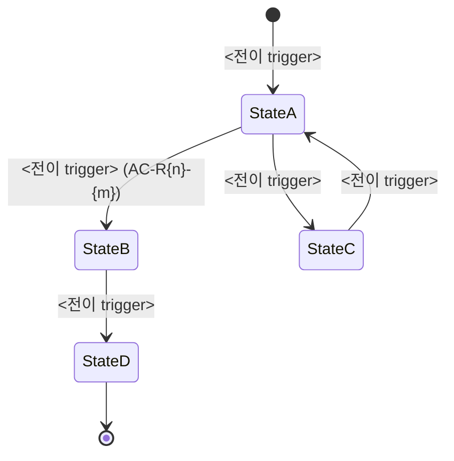

# Phase 4: Domain Model

## Purpose

시스템이 다루는 사물(Entity)·관계(Relation)·생애(State Machine)·불변식(Invariant) 사양화. 구현 기술과 무관.

## Inputs

- Phase 3 모든 R/F/S 목록
- Phase 3 Spec Description의 명사 (Entity 후보)
- (DELTA) `current/04-domain-model.md`

<HARD-GATE>
Phase 3 사용자 승인 없이 진행 금지.
</HARD-GATE>

## Mode 상속

- EXPANSION: 추가 Entity·Invariant surface
- SELECTIVE: Phase 3 Spec cover하는 Entity만 base
- HOLD: Phase 3 Spec에 직접 매칭되는 Entity만
- REDUCTION: P0 Spec cover하는 minimum Entity set

---

## Anti-Sycophancy

00-common 참조 + Phase 4 특화:

**금지:**
- "확장성을 위해 Entity 추가"
- "나중에 쓸 수 있는 속성"
- "유연성을 위해 generic하게"

**대신:**
- 모든 Entity는 Phase 3 Spec ID 인용 강제
- 모든 Attribute는 어느 AC가 요구하는지 명시
- Invariant는 위반 시 시스템이 깨지는 것만

---

## Reasoning Procedure

1. Phase 3 Spec Description에서 명사 추출
2. 명사 동의어 통합 (예: 사용자/유저/회원 → 한 entity)
3. Entity 도출: 핵심 명사 (Aggregate root 가능성)
4. Attribute 도출: 각 Entity의 속성. AC 요구하는 것만.
5. Relation: Entity 간 (1:1, 1:N, N:M)
6. State Machine: 상태 가지는 Entity
7. Invariant: 시스템 무결성 보장 규칙
8. Mermaid erDiagram + stateDiagram 강제 작성
9. Self-Check + 승인

---

## Constraints

1. **도메인 타입만** — `varchar(255)`·`int(11)`·`uuid` 같은 DB 타입 금지. 도메인 의미 가진 타입만 (예: `Email`, `Money`, `ISODate` 같은).
2. **Aggregate root 명시** — 어느 Entity가 transaction 경계인가.
3. **모든 Entity ID 형식: `ENT-{Name}`**.
4. **상태 가지는 Entity는 SM 필수** — `SM-{Entity}-{Topic}`.
5. **Invariant는 violations 시 시스템 깨지는 것만** — "이렇게 하면 좋다"는 not invariant.
6. **mermaid erDiagram 필수** — ASCII만 있으면 미흡.
7. **mermaid stateDiagram-v2 필수** — 상태 있는 모든 Entity.
8. **No Placeholders** — "기타 속성은 나중에" 금지.

---

## Output Format

````markdown
# Domain Model

**Mode:** {inherited}
**Inputs:** Phase 3 R/F/S, Spec Description nouns
**Date:** YYYY-MM-DD

## 1. Entity Catalog

### ENT-<Name>

**Description:** <이 사물이 무엇인가 1-2줄>
**Aggregate root:** Yes | No (어느 root에 속하나)
**Source spec:** S{x.y.z}, S{x.y.z}

#### Attributes

| Name | Type | Required | Source | 설명 |
|---|---|---|---|---|
| id | <DomainName>Id | Y | system | 시스템 식별자 |
| <attr> | <DomainType> | Y/N | AC-R{n}-{m} | <설명> |
| ... | ... | ... | ... | ... |

### ENT-<Name2>

(같은 형식 반복)

## 2. Relations

### Mermaid erDiagram

```mermaid
erDiagram
    EntityA ||--o{ EntityB : <관계 이름>
    EntityB ||--|{ EntityC : <관계 이름>
    EntityA ||--o| EntityD : <관계 이름>

    EntityA {
        <Type>Id id PK
        <Type> attr1
        ...
    }

    EntityB {
        <Type>Id id PK
        <Type>Id parentId FK
        <Type> attr2
    }
```

### Relation 표

| 관계 | A | 카디널리티 | B | 의미 |
|---|---|---|---|---|
| <이름> | EntityA | 1:N | EntityB | <설명> |
| <이름> | EntityB | N:M (via EntityX) | EntityC | <설명> |

## 3. State Machines

### SM-<Entity>-<Topic>



#### 상태 정의

| 상태 | 설명 | 진입 조건 | 이탈 조건 |
|---|---|---|---|
| StateA | <설명> | <조건> | <조건> |
| StateB | ... | ... | ... |

#### 불가능한 전이

| 시도 | 차단 이유 | 어떻게 막나 |
|---|---|---|
| StateB → StateA | <왜 안 되는지> | <검증 메커니즘> |

### SM-<Entity2>-<Topic>

(같은 형식)

## 4. Invariants

각 Invariant는 위반 시 시스템 깨지는 것.

### INV-1: <규칙 이름>

**규칙:** <조건. SQL-like 또는 자연어로 명확히.>
**위반 시:** <어떤 user-visible 또는 system-internal 깨짐>
**검증:** <DB constraint / 트랜잭션 / 검증 함수 / 테스트>

### INV-2: <규칙 이름>

**규칙:** ...
**위반 시:** ...
**검증:** ...

### INV-3: <규칙 이름>

...

## 5. Domain Types Glossary

DB 타입 아닌 도메인 타입 정의:

| Domain Type | 정의 |
|---|---|
| <Type1>Id | 시스템 내부 식별자 (불투명) |
| <Type2> | <도메인 의미·제약·정규화 규칙> |
| <Type3> | enum: <값1> \| <값2> \| <값3> |
| ISODateTime | UTC, ISO 8601 |
| Money | { amount: int(cents), currency: ISO4217 } |

## 6. Open Questions

| Q ID | 질문 | 결정자 | Blocking? |
|---|---|---|---|
| OQ-4-1 | ... | <역할> | Y/N |

## 7. 다음 phase 인풋

Phase 5 (User Flow)에:
- Entity ID + State Machine (Node 상태 매핑)

Phase 8 (System Architecture)에:
- 모든 Entity (Storage Strategy 매핑)

Phase 10 (Test Strategy)에:
- 모든 INV (테스트 케이스 매핑)

Phase 13 (Implementation)에:
- Entity + Aggregate root (모듈 구조 매핑)
````

---

## DELTA Mode

기존 도메인 위에 변경.

### 형식

`changes/{date}-{topic}/deltas/04-domain-delta.md`:

````markdown
## ADDED Entities

### ENT-<NewName>
- Aggregate root: Y/N
- Source spec
- Attributes (full)
- Relations to existing Entities

## MODIFIED Entities

### ENT-<existing>
- Added Attribute: <name> (<Type>, Required)
- Source: AC-R{n}-{m}
- Migration: <기존 데이터를 어떻게 채울지>

## ADDED State Transitions

### SM-<existing>-<topic>
- Added: StateX → StateY (<조건>)

## ADDED Invariants

### INV-{n}: <이름>
- 규칙
- 위반 시
- 검증

## MODIFIED Invariants

### INV-{existing}
- Changed: 추가 조건 X
- Reason

## REMOVED

### ENT-<LegacyName>
- Migration: <어떻게 처리>

## ER Δ Diagram
```mermaid
erDiagram
    EntityA ||--o| NewEntity : has  %% NEW
```
````

---

## Self-Check

```bash
# DB 타입 노출 검출
grep -iE "varchar|int\(|uuid|bigint|timestamp[^z]" 04-domain-model.md && echo "DB 타입 사용"

# Mermaid erDiagram 존재
grep "erDiagram" 04-domain-model.md

# Mermaid stateDiagram 존재 (상태 있는 Entity 수만큼)
grep -c "stateDiagram-v2" 04-domain-model.md

# Entity ID 형식
grep -E "^### ENT-[A-Z]" 04-domain-model.md | wc -l

# State Machine ID 형식
grep -E "^### SM-[A-Z][a-z]+-" 04-domain-model.md

# Invariant ID 형식
grep -E "^### INV-[0-9]+" 04-domain-model.md | wc -l

# Aggregate root 명시
grep -A2 "^### ENT-" 04-domain-model.md | grep "Aggregate root:"

# Source spec 인용
grep -A3 "^### ENT-" 04-domain-model.md | grep "Source spec:"

# Domain Types Glossary 존재
grep "Domain Types Glossary" 04-domain-model.md
```

체크리스트:
- [ ] 모든 Entity가 Source spec 인용
- [ ] 모든 Entity가 Aggregate root 표시 (Y/N)
- [ ] 모든 Attribute가 Source AC 인용
- [ ] DB 타입 노출 0건
- [ ] erDiagram 1개 (전체)
- [ ] stateDiagram-v2 (상태 있는 Entity 수만큼)
- [ ] 모든 SM에 불가능 전이 차단 메커니즘 명시
- [ ] 모든 INV에 위반 시 결과 + 검증 방법
- [ ] Domain Types Glossary 채움
- [ ] Open Questions Blocking 표시

---

<HARD-GATE>
Self-check 통과 + 사용자 승인. Phase 5 진행.
</HARD-GATE>
