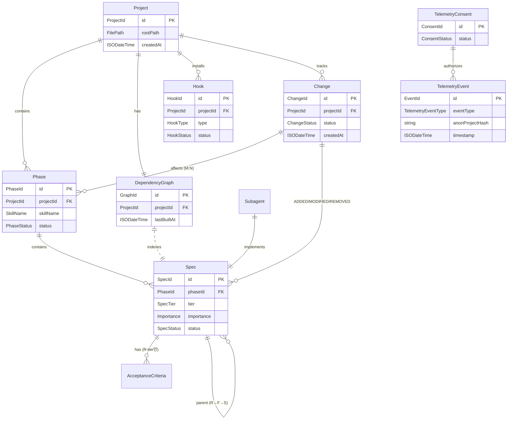
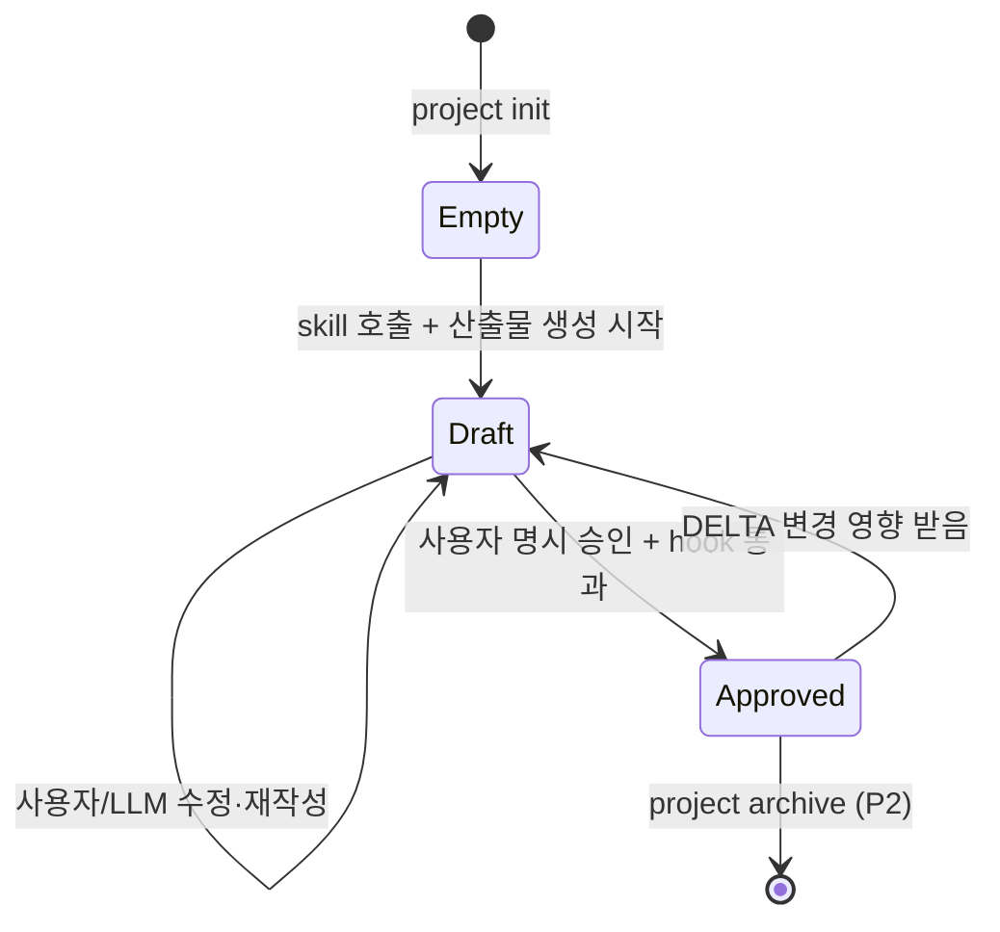
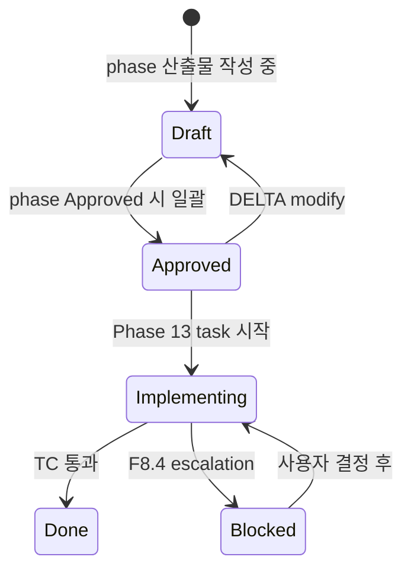
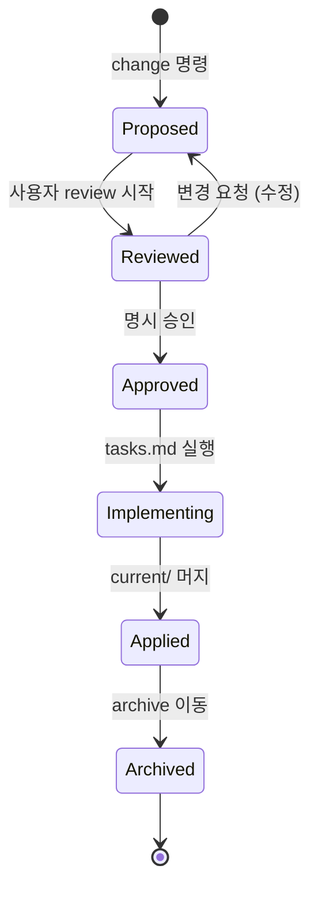
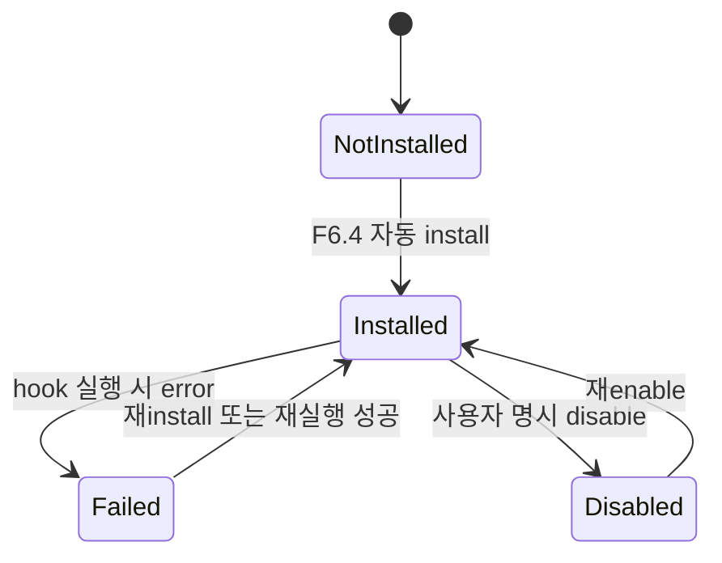
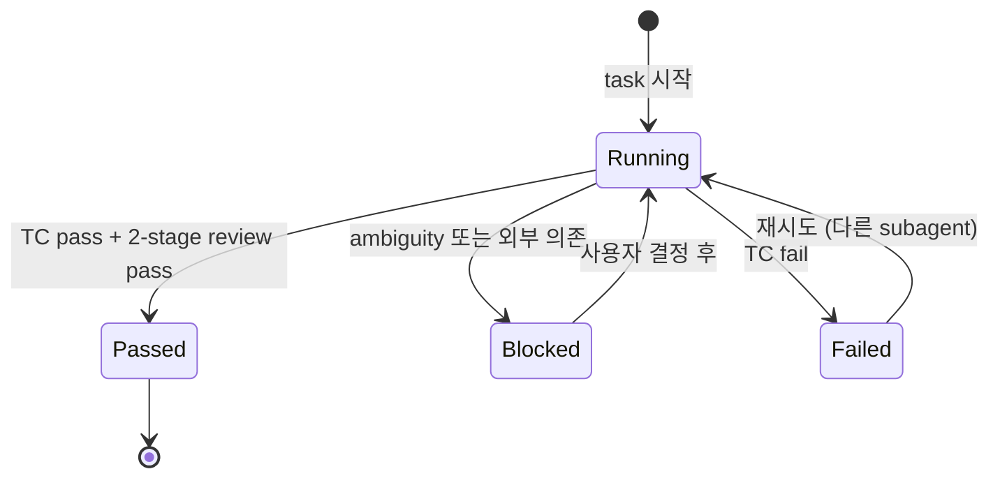
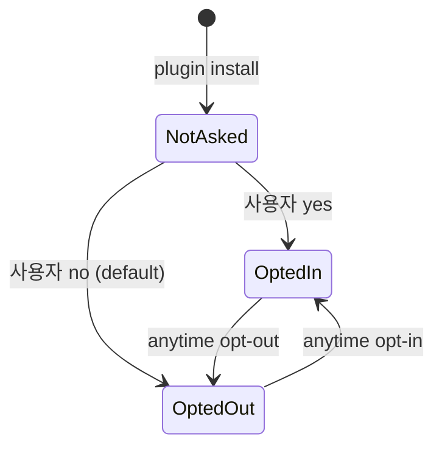

# Domain Model

**Mode:** HOLD SCOPE (retroactive — PRD §10 변경 2026-05-12)
**Inputs:** Phase 3 R/F/S, Spec Description 명사
**Date:** 2026-05-10 (DELTA 2026-05-12: INV-3 Phase 1 예외 + ENT-Phase state source 명시)

## 1. Entity Catalog

### ENT-Project

**Description:** plugin이 관리하는 한 사용자 product 사양화 단위. docs/spec/ 디렉토리 = 1 Project.
**Aggregate root:** Yes
**Source spec:** R6 (install·setup)

| Name | Type | Required | Source | 설명 |
|---|---|---|---|---|
| id | ProjectId | Y | system | 디렉토리 hash 또는 user-named slug |
| rootPath | FilePath | Y | system | docs/spec/ absolute path |
| createdAt | ISODateTime | Y | system | 첫 init |
| name | string | N | AC-R6-2 | 사용자 명시 또는 directory name |

### ENT-Phase

**Description:** 13단계 중 하나. 각 phase는 skill 1개 + 산출물 file 1개.
**Aggregate root:** No (Project에 속함)
**Source spec:** R5 (orchestration), R1 (frontmatter)

| Name | Type | Required | Source | 설명 |
|---|---|---|---|---|
| id | PhaseId | Y | system | 1-13 정수 |
| name | PhaseName | Y | system | "01-prd" 등 kebab-case |
| projectId | ProjectId | Y | FK | 부모 Project |
| skillName | SkillName | Y | system | "phase-1-prd" 등 |
| status | PhaseStatus | Y | SM-Phase-Lifecycle | Empty/Draft/Approved |
| outputPath | FilePath | Y | system | 산출물 markdown path |
| approvedAt | ISODateTime | N | AC-R5-3 | 명시 승인 timestamp |

### ENT-Spec

**Description:** 산출물 안의 한 결정 단위 (R/F/S 3-tier).
**Aggregate root:** No (Phase에 속함)
**Source spec:** R1 (ID auto-gen), R5 (산출물 형식)

| Name | Type | Required | Source | 설명 |
|---|---|---|---|---|
| id | SpecId | Y | AC-R1-3 | "R1", "F1.1", "S1.1.1" 형식, plugin auto-generated |
| tier | SpecTier | Y | system | Requirement / Feature / Specification |
| phaseId | PhaseId | Y | FK | 정의된 phase |
| description | string | Y | AC | 1-2줄 |
| importance | Importance | Y | spec | P0/P1/P2/P3 |
| status | SpecStatus | Y | SM-Spec-Status | Draft/Approved/Implementing/Done |
| sourcePainIds | PainId[] | N | F2 의존 | 인용된 PAIN |
| frontmatterRaw | YAML | Y | F1.1 | structured form |

### ENT-AcceptanceCriteria

**Description:** Requirement 수준 testable 조건. plugin이 frontmatter parse → structured.
**Aggregate root:** No
**Source spec:** R1 (frontmatter), R2 (hook validation)

| Name | Type | Required | Source | 설명 |
|---|---|---|---|---|
| id | AcId | Y | AC-R1-3 | "AC-R1-1" 형식 |
| requirementId | SpecId | Y | FK | 부모 R |
| given | string | Y | spec | 전제 |
| when | string | Y | spec | 행동 |
| then | string | Y | spec | 기대 결과 |

### ENT-DependencyGraph

**Description:** Phase 간 ID 인용 관계 그래프. R4 영향 phase 자동 식별 + INV-2 환각 ID 검증의 source. (dashboard 시각화도 동일 graph 소비.)
**Aggregate root:** Yes (per Project)
**Source spec:** R4 (DELTA), R2 (hook validation)

> **Note (ADR-9 option D)**: graph state는 in-memory only. `graph.json` 또는 persistent cache 파일은 작성되지 않는다.

| Name | Type | Required | Source | 설명 |
|---|---|---|---|---|
| id | GraphId | Y | system | per Project 1개 |
| projectId | ProjectId | Y | FK | - |
| nodes | GraphNode[] | Y | F4.1 | 모든 정의된 ID |
| edges | GraphEdge[] | Y | F4.1 | 인용 관계 (from→to) |
| lastBuiltAt | ISODateTime | Y | system | rebuild timestamp |

#### GraphNode (sub-entity)
- specId: SpecId
- phaseId: PhaseId
- definedAt: FilePath + line

#### GraphEdge (sub-entity)
- from: SpecId (인용한 ID)
- to: SpecId (인용된 ID)
- citedAt: FilePath + line
- type: ReferenceType (uses / extends / implements / blocks)

### ENT-Hook

**Description:** Plugin이 install·관리하는 검증 hook 정의.
**Aggregate root:** No (Project에 속함)
**Source spec:** R2 (모든 F)

| Name | Type | Required | Source | 설명 |
|---|---|---|---|---|
| id | HookId | Y | system | "pre-commit-self-check" 등 |
| type | HookType | Y | F2.x | PreCommit / PhaseTransition / SchemaValidation |
| projectId | ProjectId | Y | FK | - |
| installPath | FilePath | Y | F6.4 | .git/hooks/pre-commit 등 |
| status | HookStatus | Y | SM-Hook | Installed / Failed / Disabled |

### ENT-Change (DELTA mode)

**Description:** 기존 spec 위 변경 단위. ADDED/MODIFIED/REMOVED + 영향 phase 자동 식별 결과.
**Aggregate root:** Yes
**Source spec:** R4 (모든), R10 cherry-pick (timeline)

| Name | Type | Required | Source | 설명 |
|---|---|---|---|---|
| id | ChangeId | Y | system | "{date}-{topic}" 형식 |
| projectId | ProjectId | Y | FK | - |
| capability | CapabilityId | Y | spec | kebab-case |
| status | ChangeStatus | Y | SM-Change | Proposed/Reviewed/Approved/Applied/Archived |
| affectedPhases | PhaseId[] | Y | AC-R4-1 | plugin auto-extracted |
| addedSpecIds | SpecId[] | N | spec | - |
| modifiedSpecIds | SpecId[] | N | spec | - |
| removedSpecIds | SpecId[] | N | spec | - |
| createdAt | ISODateTime | Y | system | timeline anchor |
| appliedAt | ISODateTime | N | system | - |

### ENT-Skill

**Description:** Claude Code skill 정의. plugin install 시 13개 skill + orchestrator 1개 등록.
**Aggregate root:** No (plugin 자체 속함, project-independent)
**Source spec:** R5 (orchestration), R8 (implementation)

| Name | Type | Required | Source | 설명 |
|---|---|---|---|---|
| name | SkillName | Y | system | "phase-1-prd" 등 |
| version | SemVer | Y | system | plugin 버전 |
| triggerWords | string[] | Y | spec | LLM 자동 trigger |
| inputSchema | JSONSchema | Y | F1.2 | 이전 phase frontmatter |
| outputSchema | JSONSchema | Y | F1.1 | 산출물 frontmatter |
| requiresPhaseStatus | PhaseStatus[] | Y | F2.2 | 호출 전제 (이전 phase Approved) |

### ENT-Subagent (Phase 13 implementation)

**Description:** Superpowers 패턴 fresh subagent. Phase 13 atomic task별.
**Aggregate root:** No (Project·Implementation session 속함)
**Source spec:** R8 (모든)

| Name | Type | Required | Source | 설명 |
|---|---|---|---|---|
| id | SubagentId | Y | system | per task 1개 |
| taskId | TaskId | Y | FK | Phase 13 atomic task |
| stage | SubagentStage | Y | F8.3 | Implementation / SpecReview / QualityReview |
| status | SubagentStatus | Y | SM-Subagent | Running / Passed / Blocked / Failed |
| escalationReason | string | N | F8.4 | BLOCKED 사유 |

### ENT-TelemetryEvent (R13)

**Description:** opt-in 사용자의 익명 metric event.
**Aggregate root:** Yes (telemetry stream 자체)
**Source spec:** R13

| Name | Type | Required | Source | 설명 |
|---|---|---|---|---|
| id | EventId | Y | system | UUID |
| eventType | TelemetryEventType | Y | spec | PhaseStarted / PhaseApproved / HookBlock / ChangeProposed / ImplementationStarted 등 |
| anonProjectHash | string | Y | AC-R13-2 | 사용자 식별 X — project root path SHA256 (irreversible) |
| timestamp | ISODateTime | Y | system | - |
| pluginVersion | SemVer | Y | system | - |
| metadata | json | N | spec | event-specific (phase number, duration 등 — spec 내용 제외) |

### ENT-TelemetryConsent

**Description:** 사용자 opt-in 동의 상태. Local storage.
**Aggregate root:** Yes
**Source spec:** R13

| Name | Type | Required | Source | 설명 |
|---|---|---|---|---|
| id | ConsentId | Y | system | per machine·user |
| status | ConsentStatus | Y | SM-Consent | NotAsked / OptedIn / OptedOut |
| consentedAt | ISODateTime | N | AC-R13-1 | opt-in 시각 |
| revokedAt | ISODateTime | N | AC-R13-3 | opt-out 시각 |

## 2. Relations

## 3. State Machines

### SM-Phase-Lifecycle

| 상태 | 설명 | 진입 | 이탈 |
|---|---|---|---|
| Empty | 산출물 file 없음 | project init | skill 첫 호출 |
| Draft | 작성 중 | skill 호출 | 명시 승인 |
| Approved | 승인 완료, 다음 phase 진입 가능 | 사용자 명시 + hook pass | DELTA 또는 archive |

#### 불가능 전이

| 시도 | 차단 | 메커니즘 |
|---|---|---|
| Empty → Approved | skill 작업 우회 | F2.2 phase transition gate |
| Draft → Approved (hook fail) | self-check 미통과 | F2.1 pre-commit hook |

### SM-Spec-Status

### SM-Change-Lifecycle

### SM-Hook

### SM-Subagent

### SM-Consent (R13)

## 4. Invariants

### INV-1: Spec ID는 Project 내 unique

**규칙:** 같은 Project의 모든 Spec.id는 unique. 두 Phase에서 같은 ID 정의 X.
**위반 시:** ID 인용 ambiguous → cross-reference 깨짐.
**검증:** plugin auto-generation (F1.3)이 unique 보장. hook이 commit 시 verify.

### INV-2: 인용 ID는 정의된 ID set 안

**규칙:** 모든 Spec/AC의 본문에서 인용된 ID는 같은 Project에 정의되어 있어야.
**위반 시:** 환각 ID — dangling reference.
**검증:** F2.3 ID consistency hook (commit 차단). 또는 LLM 작성 시점에 F1.4 resolver가 valid list만 노출.

### INV-3: Phase N+1 진입 시 Phase N status=Approved

**규칙:** PhaseStatus enum 순서 강제. Empty→Draft→Approved 외 전이 X.
**예외:** Phase 1은 predecessor 없음 — `canInvokePhase(target=1)`은 항상 allowed (다른 검증 부재).
**State source-of-truth:** ENT-Phase.status가 frontmatter에 저장된 값이 authoritative. `.specrail-cache/state.json`은 derived (rebuild 가능). 불일치 시 frontmatter 기준으로 cache 재생성.
**위반 시:** 사양 안 된 phase 위에 작업 — LLM hallucination 위험.
**검증:** F2.2 phase transition gate (skill 호출 거부). ENT-Skill.requiresPhaseStatus. Hook이 commit 시 frontmatter vs cache 일치 검증.

### INV-4: 모든 P0 Spec은 PRD 시나리오 cover

**규칙:** Importance=P0 set이 PRD §3.3 시나리오 cover.
**위반 시:** MVP 출시 후 핵심 시나리오 깨짐.
**검증:** Phase 13 self-check matrix.

### INV-5: AC는 R-tier만, GIVEN/WHEN/THEN 형식

**규칙:** AcceptanceCriteria.requirementId는 항상 R-tier Spec.id. F·S tier에 AC 부여 X. 모든 AC는 given/when/then 모두 비어있지 않음.
**위반 시:** 검증 ambiguous 또는 중복.
**검증:** F2.4 schema hook + Phase 3 self-check.

### INV-6: 모든 Change에 affectedPhases ≥ 1

**규칙:** Change.affectedPhases 빈 배열 X. plugin이 자동 추출.
**위반 시:** delta 영향 미식별 — 모순 spec.
**검증:** AC-R4-1 plugin enforce.

### INV-7: ADR alternatives ≥ 2 + 거절 이유

**규칙:** Phase 12에서 만들 ADR은 alternatives 길이 ≥ 2, 각 거절은 이유 포함.
**위반 시:** 단일 옵션만 검토 — 더 좋은 길 놓침.
**검증:** Phase 12 self-check.

### INV-8: Telemetry는 anonProjectHash·spec 내용 제외 (R13 privacy)

**규칙:** TelemetryEvent.anonProjectHash는 SHA256 (irreversible). metadata에 spec 내용·사용자 식별자 0건.
**위반 시:** Privacy 위반 — opt-in 신뢰 깨짐.
**검증:** F13.2 schema hook + 코드 review.

### INV-9: TelemetryConsent default = NotAsked → OptedOut (default off)

**규칙:** 사용자 명시 yes 없이 OptedIn 전이 X.
**위반 시:** opt-in 정신 위반.
**검증:** F13.1 install flow.

### INV-10: 기존 사용자 pre-commit hook 보존 (analyst 재검토 — 정식 INV 등재)

**규칙:** Plugin install 시 기존 `.git/hooks/pre-commit` (husky·lefthook·plain script)을 절대 덮어쓰지 않음. Chain 방식으로 기존 hook을 backup + sequential 실행.
**위반 시:** 사용자 기존 lint·format·CI pipeline 파괴 — R6 install이 사용자 환경 손상시키는 결정적 결함.
**검증:** AC-R6-3 + T1.7 chain 방식 + commit 전 backup hash record. Phase 10 TC-14 확장 — 기존 husky 사용자 시나리오 cover.

## 5. Domain Types Glossary

| Domain Type | 정의 |
|---|---|
| ProjectId | path-derived hash 또는 user slug |
| FilePath | absolute path |
| PhaseId | 1-13 정수 |
| PhaseName | "01-prd" 등 kebab-case |
| PhaseStatus | enum: Empty \| Draft \| Approved |
| SpecId | "R{n}" \| "F{n}.{m}" \| "S{n}.{m}.{k}" |
| SpecTier | enum: Requirement \| Feature \| Specification |
| Importance | enum: P0 \| P1 \| P2 \| P3 |
| SpecStatus | enum: Draft \| Approved \| Implementing \| Blocked \| Done |
| AcId | "AC-R{n}-{m}" |
| GraphId | per Project 1 |
| ReferenceType | enum: uses \| extends \| implements \| blocks |
| HookId | string |
| HookType | enum: PreCommit \| PhaseTransition \| SchemaValidation |
| HookStatus | enum: Installed \| Failed \| Disabled \| NotInstalled |
| ChangeId | "{YYYY-MM-DD}-{kebab-topic}" |
| CapabilityId | kebab-case |
| ChangeStatus | enum: Proposed \| Reviewed \| Approved \| Implementing \| Applied \| Archived |
| SkillName | "phase-N-{name}" 또는 "orchestrator" |
| SemVer | "{major}.{minor}.{patch}" |
| JSONSchema | JSON Schema spec |
| SubagentId | UUID |
| TaskId | "T{n}.{m}" |
| SubagentStage | enum: Implementation \| SpecReview \| QualityReview |
| SubagentStatus | enum: Running \| Passed \| Blocked \| Failed |
| EventId | UUID |
| TelemetryEventType | enum: PhaseStarted \| PhaseApproved \| HookBlock \| ChangeProposed \| ImplementationStarted \| Other |
| ConsentId | per-machine UUID |
| ConsentStatus | enum: NotAsked \| OptedIn \| OptedOut |
| PainId | "PAIN-{name}" |
| ISODateTime | UTC ISO 8601 |

## 6. Open Questions

| Q ID | 질문 | 결정자 | Blocking? |
|---|---|---|---|
| OQ-4-1 | Subagent stage 3개 (Impl/SpecReview/QualityReview) — Spec/Quality review 동시 또는 순차 | maintainer | Phase 8 |
| OQ-4-2 | TelemetryEvent backend (자체 host vs plausible.io 같은 자체 hosted vs Supabase 등) | maintainer | Phase 8·12 (ADR-CAND) |
| OQ-4-3 | ChangeId capability 수동 vs 자동 (kebab-case 어떻게) | maintainer | Phase 7 |
| OQ-4-4 | ENT-Skill input/output JSONSchema — 13 phase별로 다 정의? frontmatter schema와 sync? | maintainer | Phase 8 |

## 7. 다음 phase 인풋

Phase 5 (User Flow):
- Entity ID + State Machine (Node 매핑)
- 핵심 SM: Phase-Lifecycle (S1·S2 모두), Change-Lifecycle (S2), Subagent (Phase 13 후), Consent (install 시)

Phase 8 (Architecture):
- 모든 Entity → Storage 매핑 후보 (file system vs SQLite vs JSON)
- ENT-Skill·ENT-Hook → Claude Code plugin SDK 매핑
- ENT-DependencyGraph → 빌드 component (skill·hook 의존; dashboard 추가 소비)
- ENT-TelemetryEvent → external endpoint (ADR-CAND)

Phase 10 (Test):
- INV-1 ~ INV-9 → integration test
- INV-8 (privacy) 강조

Phase 13 (Implementation):
- Aggregate root별 모듈 (Project·Change·DependencyGraph·TelemetryConsent)
