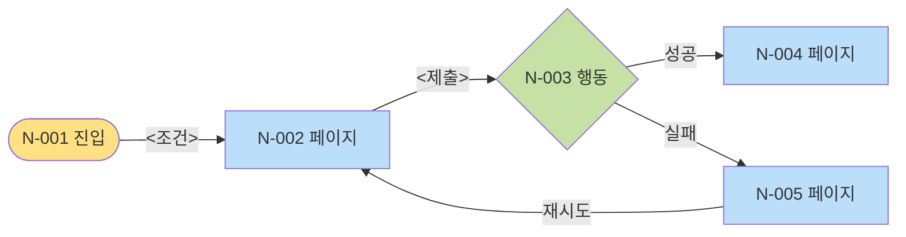

<!-- plugin-refinement (T2.5c, architect 옵션 B): self-check bash blocks → ARCH-5 schema validator + ARCH-3 hooks 자동 강제. HARD-GATE 수동 승인 step → ADR-8 state machine 자동 enforce. 상대 경로 file 참조 → plugin runtime의 docs/spec/ resolver. -->

---
name: phase-5-user-flow
description: User Flow. Section + Node(시작/페이지/행동/섹션 최상위) + Edge graph. 매니패스트 모델 차용.
inputs-from: Phase 1 Role + Phase 3 Spec ID + Phase 4 ENT·State Machine
trigger-words: user flow, navigation, screen flow
mode: GREENFIELD | DELTA
---

# Phase 5: User Flow

## Purpose

사용자가 목표까지 도달하는 모든 경로를 그래프로 사양화.

```
Section          — 큰 묶음 (UX 영역)
  Node           — 4종류
    시작            - 진입점 (URL, 알림, 외부 링크)
    섹션 최상위 페이지 - section의 landing
    페이지           - 일반 페이지 / 화면
    행동            - 페이지 내 사용자 행동 (버튼·폼·제스처)
  Edge           — Node 간 전이 (조건 명시)
```

## Inputs

- Phase 1 §3.2 Role
- Phase 3 모든 Spec ID + 이름
- Phase 4 Entity ID + State Machine
- (DELTA) `current/05-user-flow.md`

<HARD-GATE>
Phase 4 사용자 승인 없이 진행 금지.
</HARD-GATE>

## Mode 상속

- EXPANSION: 추가 진입점·optional path surface
- SELECTIVE: PRD 시나리오 cover하는 path만 base, 추가 cherry-pick
- HOLD: PRD 시나리오 cover만
- REDUCTION: P0 Spec만 cover

---

## Anti-Sycophancy

00-common 참조 + Phase 5 특화:

**금지:**
- "여러 진입점이 가능해요"
- "이 path는 optional이에요"
- "유연성을 위해 분기 추가"

**대신:**
- 모든 Node는 Spec ID 인용 강제
- 정당화 없는 분기 → 거부
- "이 분기에 도달하는 사용자 수는?" 못 답하면 cut

---

## Reasoning Procedure

1. PRD 시나리오를 path 후보로 받기
2. Section 도출 — 큰 묶음 (보통 3-7개)
3. 각 Section 내 Node — 4종 분류
4. Edge — Node 간 전이 (조건 명시)
5. State Machine 전이를 일으키는 Node 표시
6. Spec ID 매핑 — 어느 Node가 어느 Spec을 충족
7. Mermaid graph 작성
8. Self-Check + 승인

---

## Constraints

1. **Node 4종 엄격** — 다른 종류 만들지 말 것.
2. **모든 Node는 Spec ID 인용** — 정당화 없는 Node 금지 (시작 Node 제외).
3. **Edge는 조건 명시** — "다음 클릭"만 적지 말 것. 조건·valid 상태 등 구체.
4. **State Machine 영향 명시** — 상태 변경 일으키는 Node에 SM 전이 표시.
5. **Mermaid graph 필수** — section별 또는 전체.
6. **Section ID `SEC-{n}`, Node ID `N-{nnn}`**.
7. **Dead end 검증** — 진입은 있는데 못 빠져나가는 Node 0개 (종료 Node 제외).
8. **Loop 검증** — 의도 없는 무한 루프 0개.

---

## Output Format

````markdown
# User Flow

**Mode:** {inherited}
**Inputs:** Phase 1 Role, Phase 3 Spec ID, Phase 4 ENT/SM
**Date:** YYYY-MM-DD

## 1. Section 목록

| Section ID | 이름 | 포함 시나리오 |
|---|---|---|
| SEC-1 | <영역 1> | <시나리오> |
| SEC-2 | <영역 2> | ... |
| SEC-3 | <영역 3> | ... |

## 2. Node Catalog

### SEC-1: <영역 1>

| Node ID | Type | 이름 | Spec | SM 영향 |
|---|---|---|---|---|
| N-001 | 시작 | <진입점> | - | - |
| N-002 | 페이지 | <페이지> | S{x.y.z} | - |
| N-003 | 행동 | <행동> | S{x.y.z} | SM-<Entity>: <state1>→<state2> |
| N-004 | 페이지 | <페이지> | S{x.y.z} | - |
| ... | ... | ... | ... | ... |

### SEC-2: <영역 2>

(같은 형식)

### SEC-3: <영역 3>

(같은 형식)

## 3. Edge Catalog

| Edge ID | From | To | 조건 |
|---|---|---|---|
| E-1 | N-001 | N-002 | <조건> |
| E-2 | N-002 | N-003 | <폼 valid 또는 클릭 등> |
| E-3 | N-003 | N-004 | <성공 결과> |
| E-4 | N-003 | N-005 | <실패 / 분기 결과> |
| ... | ... | ... | ... |

## 4. Mermaid Graph (전체 또는 Section별)

### SEC-1 흐름



(범례: 노란=시작, 파랑=페이지, 초록=행동, 분홍=섹션최상위)

### SEC-2 흐름


## 5. State Machine 전이 매핑

이 표는 Node가 어느 SM 전이를 일으키는지 인덱스.

| Node ID | SM | 전이 |
|---|---|---|
| N-{n} | SM-<Entity>-<topic> | <state1> → <state2> |
| N-{m} | SM-<Entity2>-<topic> | <state1> → <state2> |

## 6. Cross-Section Path (시나리오 정렬)

각 PRD 시나리오의 Node 시퀀스:

### S1: <시나리오 1>
N-001 → N-002 → N-003 → ... → N-{end}

### S2: <시나리오 2>
N-{start} → ... → N-{end}

### S3: <시나리오 3>
...

## 7. Dead End / Loop 검증

| Node | In | Out | 평가 |
|---|---|---|---|
| N-{n} | E-{x} | E-{y} | OK |
| N-{m} | E-{x} | (없음) | ❌ Dead end. Outgoing edge 추가 필수. |

## 8. Open Questions

| Q ID | 질문 | 결정자 | Blocking? |
|---|---|---|---|
| OQ-5-1 | <엣지 case 처리> | <역할> | Y |

## 9. 다음 phase 인풋

Phase 6 (IA)에:
- §1 Section 목록
- §2 Node 중 type=페이지·섹션최상위인 것

Phase 7 (Wireframe)에:
- 페이지 Node + 들어오는·나가는 Edge

Phase 8 (Architecture)에:
- 행동 Node (API endpoint 후보)

Phase 10 (Test)에:
- 시나리오 정렬 path (E2E test)
````

---

## DELTA Mode

기존 flow 위에 변경.

### 형식

`changes/{date}-{topic}/deltas/05-flow-delta.md`:

````markdown
## ADDED Sections
### SEC-{n+1}: <이름>
| Node ID | Type | 이름 | Spec |

## ADDED Nodes (existing section에)
### SEC-{existing}에 추가
| Node ID | Type | 이름 | Spec |

## ADDED Edges
| Edge ID | From | To | 조건 |

## MODIFIED Nodes
### N-{existing}
- Changed: <뭐가 어떻게>
- Reason

## MODIFIED Edges
| Edge ID | Before | After |

## REMOVED
- N-{x}: <이유, 어디로 redirect 또는 삭제>
- E-{y}: <이유>

## SM 전이 Δ
새로 추가된 Node가 일으키는 전이.

## Path Δ
영향받는 시나리오의 새 path.
````

---

## Self-Check

```bash
# Node ID 형식
grep -E "^\| N-[0-9]{3}" 05-user-flow.md | wc -l

# Edge ID 형식
grep -E "^\| E-[0-9]+" 05-user-flow.md | wc -l

# Section ID 형식
grep -E "^### SEC-[0-9]+" 05-user-flow.md | wc -l

# 모든 Node가 Spec ID 인용 (시작 Node 제외)
grep -E "N-[0-9]{3}" 05-user-flow.md | grep -c "S[0-9]\+\.[0-9]\+\.[0-9]\+"

# Mermaid graph 존재 (Section별 또는 전체)
grep -c "graph " 05-user-flow.md

# Spec ID 환각 검출
grep -oE 'S[0-9]+\.[0-9]+\.[0-9]+' 05-user-flow.md | sort -u > used.txt
grep -oE '^#### S[0-9]+\.[0-9]+\.[0-9]+' 03-features.md | sed 's/#### //' | sort -u > defined.txt
diff defined.txt used.txt   # 정의 없는 Spec ID 사용 검출

# Node Type 4종 외
grep -E "Type:" 05-user-flow.md | grep -vE "시작|섹션 최상위 페이지|페이지|행동"
```

체크리스트:
- [ ] Node Type 4종 엄격
- [ ] 모든 Node가 Spec ID 인용 (시작 Node 제외)
- [ ] 모든 Edge에 조건 명시
- [ ] State Machine 영향 받는 Node 명시
- [ ] Mermaid graph (섹션별 또는 전체)
- [ ] §6 시나리오별 Path 정렬
- [ ] §7 Dead End 검증 표 (모든 Node 검토)
- [ ] §7 Loop 검증
- [ ] Spec ID 환각 0건

---

<HARD-GATE>
Self-check 통과 + 사용자 승인. Phase 6 진행.
</HARD-GATE>