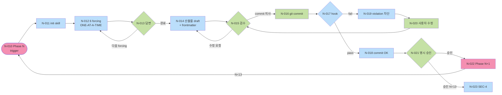
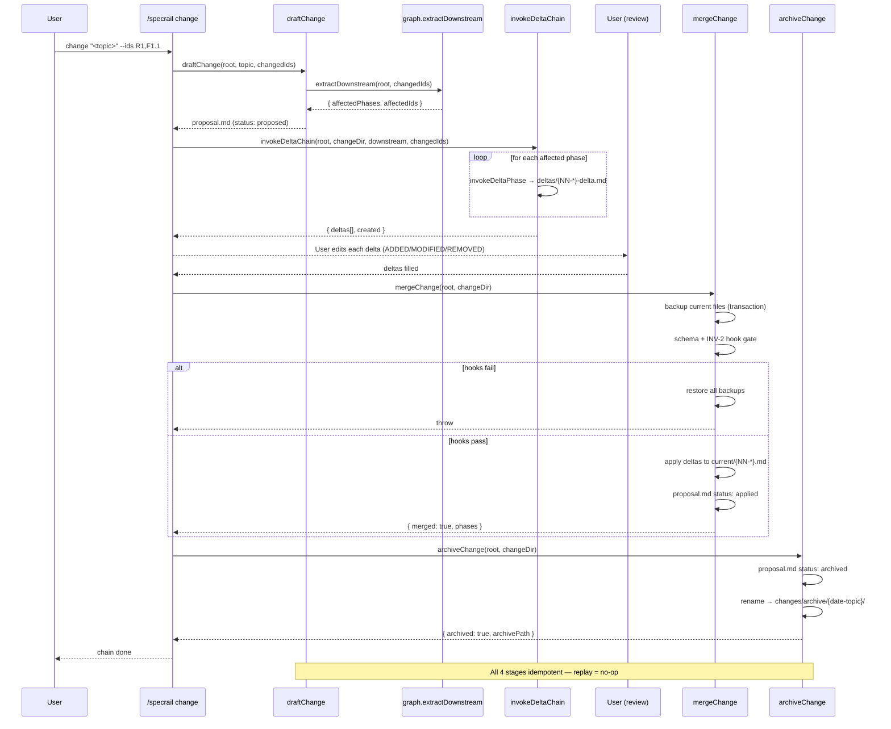

# User Flow

**Mode:** HOLD SCOPE (retroactive — PRD §10 변경 2026-05-12)
**Inputs:** PRD §3 single-user, Phase 3 R/F/S, Phase 4 ENT/SM
**Date:** 2026-05-10 (Mode 갱신 2026-05-12)

## 1. Section 목록

| Section ID | 이름 | 포함 시나리오 |
|---|---|---|
| SEC-1 | Plugin install·setup | S1 (S2 skip) |
| SEC-2 | Greenfield phase 진행 (1→13) | S1 |
| SEC-3 | DELTA 변경 | S2 |
| SEC-4 | Implementation 핸드오프 (Phase 13 후) | S1, S2 |
| SEC-6 | Telemetry consent lifecycle | All (background) |

(SEC-5 Dashboard 검토 — 향후 cycle로 이동.)

## 2. Node Catalog

### SEC-1: Install·Setup

| Node ID | Type | 이름 | Spec | SM 영향 |
|---|---|---|---|---|
| N-001 | 시작 | 사용자 install 결정 | - | - |
| N-002 | 페이지 | GitHub README · Claude Code marketplace | - | - |
| N-003 | 행동 | Plugin install 명령 (단일) | F6.1 (R6.F1) | - |
| N-004 | 페이지 | Install 진행 상태 | - | - |
| N-005 | 행동 | Telemetry opt-in 질문 응답 | F13.1 (R13.F1) | SM-Consent: NotAsked → OptedIn 또는 OptedOut |
| N-006 | 페이지 | Setup 완료 안내 + Phase 1 trigger 방법 | F6.2 | - |

### SEC-2: Greenfield Phase 진행

| Node ID | Type | 이름 | Spec | SM 영향 |
|---|---|---|---|---|
| N-010 | 섹션 최상위 | Phase N 시작 trigger | F5.1 (R5.F1) | - |
| N-011 | 페이지 | Plugin docs/spec 자동 생성 + Phase 1 skill 호출 | F6.2 | SM-Phase: Empty (모두) |
| N-012 | 페이지 | Phase 0 reframing — 6 forcing questions ONE-AT-A-TIME | F5.2, F5.3 | - |
| N-013 | 행동 | 사용자 답변 | - | - |
| N-014 | 페이지 | Phase 산출물 draft 출력 + frontmatter structured | F1.1 (R1.F1), F1.3 (R1.F3) | SM-Phase: Empty → Draft, SM-Spec: ∅ → Draft |
| N-015 | 행동 | 사용자 검수 (Claude Code 응답 또는 markdown rendered) | - | - |
| N-016 | 행동 | git commit 시도 | - | - |
| N-017 | 페이지 | Pre-commit hook 자동 실행 | F2.1, F2.3, F2.4 (R2) | SM-Hook (transient: Installed 사용) |
| N-018 | 행동 | Hook 결과 — pass | - | - |
| N-019 | 페이지 | Hook fail → 차단 + violation 표시 | F2.1 (R2.F1) | - |
| N-020 | 행동 | 사용자 수정 후 재commit (N-015 loop) | - | - |
| N-021 | 행동 | 사용자 명시 승인 (예: "approve phase N") | F5.4 (R5.F4 ONE-AT-A-TIME) | SM-Phase: Draft → Approved, SM-Spec: Draft → Approved (모든 spec) |
| N-022 | 섹션 최상위 | Phase N+1 자동 호출 (transition gate 통과) | F2.2 (R2.F2), F1.2 (R1.F2) | (다시 N-010 loop) |
| N-023 | 페이지 | Phase 13 완료 → SEC-4 진입 | - | - |

### SEC-3: DELTA 변경

| Node ID | Type | 이름 | Spec | SM 영향 |
|---|---|---|---|---|
| N-030 | 시작 | 사용자 변경 결정 | - | - |
| N-031 | 행동 | `/specrail change "<topic>"` | F4.3 (R4.F3) | SM-Change: ∅ → Proposed |
| N-032 | 페이지 | Plugin이 dependency graph 분석 + 영향 phase list 출력 | F4.1, F4.2 (R4.F1·R4.F2) | - |
| N-033 | 페이지 | ADDED/MODIFIED/REMOVED proposal 자동 draft | F4.3 | - |
| N-034 | 행동 | 사용자 검수 (proposal.md) | - | SM-Change: Proposed → Reviewed |
| N-035 | 페이지 | 영향 phase 별 delta 작성 (skill 호출, 영향 spec만 input) | F1.2 (R1.F2) | SM-Spec: Approved → Draft (modified) |
| N-036 | 행동 | 사용자 검수·승인 | - | SM-Change: Reviewed → Approved |
| N-037 | 페이지 | tasks.md (Phase 13 DELTA) | F8.1 (R8.F1) | - |
| N-038 | 행동 | Implementation 시작 (SEC-4) | - | SM-Change: Approved → Implementing |
| N-039 | 페이지 | current/ 머지 + archive 이동 | F4.3 | SM-Change: Implementing → Applied → Archived |

### SEC-4: Implementation 핸드오프

| Node ID | Type | 이름 | Spec | SM 영향 |
|---|---|---|---|---|
| N-040 | 시작 | Phase 13 status=Approved | - | - |
| N-041 | 행동 | Plugin Implementation skill chain 시작 (자동 또는 명령) | F8.1 (R8.F1) | - |
| N-042 | 페이지 | Atomic task N — fresh subagent 호출 | F8.2 (R8.F2) | SM-Subagent: ∅ → Running (Implementation stage) |
| N-043 | 행동 | Subagent: RED test 작성 + verify fails | - | - |
| N-044 | 행동 | Subagent: minimal implementation | - | - |
| N-045 | 행동 | Subagent: GREEN verify | - | - |
| N-046 | 페이지 | Spec compliance review subagent 호출 | F8.3 (R8.F3 stage 1) | SM-Subagent: stage Implementation → SpecReview |
| N-047 | 페이지 | Quality review subagent 호출 | F8.3 (R8.F3 stage 2) | SM-Subagent: SpecReview → QualityReview |
| N-048 | 행동 | Pass → commit | - | SM-Subagent: QualityReview → Passed; SM-Spec: Implementing → Done |
| N-049 | 페이지 | Fail / Blocked → escalate to main session | F8.4 (R8.F4) | SM-Subagent: → Blocked 또는 Failed |
| N-050 | 행동 | 사용자 결정 후 재시도 또는 다음 task | - | SM-Spec: Done 또는 Blocked |
| N-051 | 페이지 | 모든 task 완료 | - | - |

### SEC-6: Telemetry consent lifecycle

| Node ID | Type | 이름 | Spec | SM 영향 |
|---|---|---|---|---|
| N-070 | 시작 | Plugin install 첫 사용 (= N-005와 join) | - | - |
| N-071 | 페이지 | Opt-in 질문 (default no) | F13.1 (R13.F1) | - |
| N-072 | 행동 | yes/no 선택 | - | SM-Consent: NotAsked → OptedIn 또는 OptedOut |
| N-073 | 페이지 | 옵트인이면 metric 전송 (background) | F13.2 (R13.F2) | - |
| N-074 | 행동 | Anytime opt-out 명령 | F13.3 (R13.F3) | SM-Consent: OptedIn → OptedOut |
| N-075 | 행동 | 데이터 삭제 요청 (opt-out 후 옵션) | F13.3 | - |

## 3. Edge Catalog (핵심)

| Edge ID | From | To | 조건 |
|---|---|---|---|
| E-1 | N-001 | N-002 | 정보 탐색 |
| E-2 | N-002 | N-003 | install 의사 |
| E-3 | N-003 | N-004 | 명령 실행 |
| E-4 | N-004 | N-005 | install 성공 |
| E-5 | N-005 | N-006 | telemetry 응답 완료 |
| E-6 | N-006 | N-010 | "Phase 1 시작" trigger |
| E-7 | N-011 | N-012 | skill 호출 완료 |
| E-8 | N-012 | N-013 | forcing question 출력 |
| E-9 | N-013 | N-012 | 다음 forcing question |
| E-10 | N-013 | N-014 | 모든 forcing 답변 완료 (또는 Smart Routing skip) |
| E-11 | N-014 | N-015 | 산출물 파일 작성 완료 |
| E-12 | N-015 | N-014 | 사용자 수정 요청 |
| E-13 | N-015 | N-016 | 검수 완료, commit 의사 |
| E-14 | N-016 | N-017 | git pre-commit trigger |
| E-15 | N-017 | N-018 | hook pass |
| E-16 | N-017 | N-019 | hook fail |
| E-17 | N-019 | N-020 | 사용자 수정 |
| E-18 | N-020 | N-015 | 재검수 |
| E-19 | N-018 | N-021 | commit 후 사용자 명시 승인 |
| E-20 | N-021 | N-022 | Phase N<13 |
| E-21 | N-022 | N-010 | 다음 phase trigger |
| E-22 | N-021 | N-023 | Phase N=13 |
| E-23 | N-023 | N-040 | Implementation 진입 |
| E-30 | N-030 | N-031 | 변경 결정 |
| E-31 | N-031 | N-032 | 명령 실행 |
| E-32 | N-032 | N-033 | 영향 식별 완료 |
| E-33 | N-033 | N-034 | proposal draft 출력 |
| E-34 | N-034 | N-033 | 수정 요청 |
| E-35 | N-034 | N-035 | 검수 완료 |
| E-36 | N-035 | N-036 | delta 작성 완료 |
| E-37 | N-036 | N-035 | 수정 |
| E-38 | N-036 | N-037 | 승인 |
| E-39 | N-037 | N-038 | tasks.md 완료 |
| E-40 | N-038 | N-040 | implementation 진입 (loop SEC-4) |
| E-41 | (SEC-4 끝) | N-039 | 모든 task Done, current/ 머지 |
| E-42 | N-040 | N-041 | Phase 13 Approved 도달 |
| E-43 | N-041 | N-042 | task 1 |
| E-44 | N-042 | N-043 | subagent 시작 |
| E-45 | N-043 | N-044 | RED 확인 |
| E-46 | N-044 | N-045 | impl 완료 |
| E-47 | N-045 | N-046 | GREEN 확인 |
| E-48 | N-046 | N-047 | spec review pass |
| E-49 | N-046 | N-049 | spec review fail |
| E-50 | N-047 | N-048 | quality review pass |
| E-51 | N-047 | N-049 | quality review fail |
| E-52 | N-049 | N-050 | escalation 결정 |
| E-53 | N-050 | N-042 | 재시도 (다른 subagent) |
| E-54 | N-048 | N-042 | 다음 task |
| E-55 | N-048 | N-051 | 마지막 task 완료 |
| E-71 | (anytime) | N-074 | opt-out 명령 |

## 4. Mermaid Graph

### SEC-2 Phase 진행 핵심 루프 (가장 자주 발생)

### SEC-3 DELTA 흐름

## S2 DELTA Chain Sequence (M7 implementation)

The diagram captures the M7 implementation: idempotent loop on each stage, transaction in merge, frontmatter status flips.

### SEC-4 Implementation (Superpowers 패턴)

## 5. State Machine 전이 매핑

| Node ID | SM | 전이 |
|---|---|---|
| N-005 / N-072 | SM-Consent | NotAsked → OptedIn 또는 OptedOut |
| N-011 | SM-Phase | ∅ → Empty (모든 13 phase) |
| N-014 | SM-Phase | Empty → Draft (해당 phase) |
| N-014 | SM-Spec | ∅ → Draft (해당 phase의 모든 Spec) |
| N-021 | SM-Phase | Draft → Approved |
| N-021 | SM-Spec | Draft → Approved (해당 phase 모든 Spec) |
| N-031 | SM-Change | ∅ → Proposed |
| N-034 | SM-Change | Proposed → Reviewed |
| N-035 | SM-Spec | Approved → Draft (modified — DELTA) |
| N-036 | SM-Change | Reviewed → Approved |
| N-038 | SM-Change | Approved → Implementing |
| N-039 | SM-Change | Implementing → Applied → Archived |
| N-042 | SM-Subagent | ∅ → Running (Implementation stage) |
| N-046 | SM-Subagent | Running → SpecReview |
| N-047 | SM-Subagent | SpecReview → QualityReview |
| N-048 | SM-Subagent | QualityReview → Passed |
| N-048 | SM-Spec | Implementing → Done |
| N-049 | SM-Subagent | Running → Blocked / Failed |
| N-074 | SM-Consent | OptedIn → OptedOut |

## 6. Cross-Section Path (시나리오 정렬)

### S1: Greenfield
N-001 → N-002 → N-003 → N-004 → N-005 (= N-072) → N-006 → [SEC-2: N-010 ~ N-022 13회 반복] → N-023 → [SEC-4: N-040 ~ N-051]

(검토는 markdown rendered: GitHub UI · VS Code preview)

### S2: DELTA
[기존 install 상태] → N-030 → N-031 → ... → N-039 → [SEC-4 다시 N-040 ~]

(검토 동일)

### S3: Refactor (P1 — scope 외)
잠정.

## 7. Dead End / Loop 검증

| Node | In | Out | 평가 |
|---|---|---|---|
| N-013 (forcing 답변) | E-8 | E-9 (loop), E-10 (완료) | OK |
| N-015 (검수) | E-11, E-18 | E-12 (수정 loop), E-13 (commit) | OK |
| N-019 (hook fail) | E-16 | E-17 (수정) | OK |
| N-020 (사용자 수정) | E-17 | E-18 (재검수) | OK — 의도 loop |
| N-049 (escalate) | E-49, E-51 | E-52 (사용자 결정) | OK |
| N-050 (재시도) | E-52 | E-53 (재시도) | OK — 사용자 결정 후 |
| N-051 (모든 task 완료) | E-55 | (terminal) | OK |
| N-039 (archive) | E-41 | (terminal) | OK |
| N-006 → N-010 | E-6 | trigger 의존 — 사용자가 안 시작하면 idle | OK (의도된 idle) |

Loop 검증:
- N-014 ↔ N-015 (수정 loop): 의도 — 사용자 수동 종료
- N-015 ↔ N-019 ↔ N-020: 의도 — hook 통과까지
- N-046/047 → N-049 → N-050 → N-042: 의도 — escalation 후 재시도
- 무한 loop 후보 0건 (모두 사용자 결정 종료 가능)

## 8. Open Questions

| Q ID | 질문 | 결정자 | Blocking? |
|---|---|---|---|
| OQ-5-2 | N-049 escalate 형식 — Claude Code session interrupt vs queue | maintainer | Phase 8 |
| OQ-5-3 | N-005 telemetry 질문 timing — install 직후 vs 첫 phase 시작 직전 | maintainer | Phase 7 wireframe |
| OQ-5-4 | N-074 opt-out 명령 surface — Claude Code 명령 (향후 dashboard UI 추가) | maintainer | Phase 6/7 |

## 9. 다음 phase 인풋

Phase 6 (IA)에:
- §1 Section 5개 (SEC-5 dashboard 제거)
- §2 페이지 노드 (N-002, N-006, N-011, N-014, N-019, N-022, N-032, N-033, N-035, N-039, N-042, N-046, N-047, N-051, N-071, N-073)
- 단일 surface (Claude Code session) IA

Phase 7 (Wireframe):
- 페이지 Node + 들어오는·나가는 Edge
- Claude Code 응답 (markdown zone) wireframe만

Phase 8 (Architecture):
- 행동 Node (skill 호출, hook 실행, telemetry endpoint)
- 시나리오 별 sequence diagram

Phase 10 (Test):
- 시나리오 path E2E test
