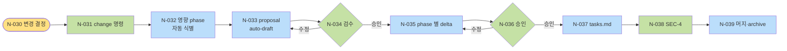
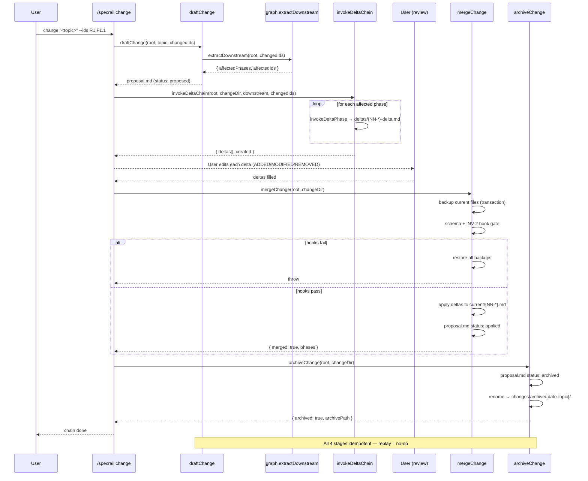
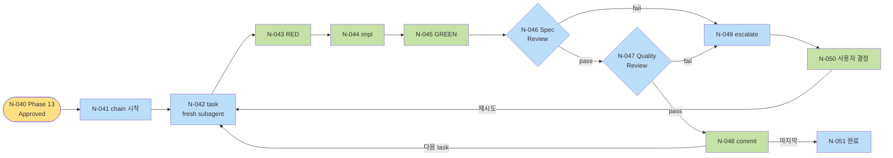

# User Flow

**Mode:** HOLD SCOPE (retroactive — PRD §10 변경 2026-05-12)
**Inputs:** PRD §3 single-user, Phase 3 R/F/S, Phase 4 ENT/SM
**Date:** 2026-05-10 (Mode 갱신 2026-05-12)

## 1. Section 목록

| Section ID | 이름 | 포함 시나리오 |
|---|---|---|
| SEC-1 | Plugin install·setup | S1 (S2 skip) |
| SEC-2 | Greenfield phase 진행 (1→13) | S1 |
| SEC-3 | DELTA 변경 | S2 |
| SEC-4 | Implementation 핸드오프 (Phase 13 후) | S1, S2 |
| SEC-6 | Telemetry consent lifecycle | All (background) |

(SEC-5 Dashboard 검토 — 향후 cycle로 이동.)

## 2. Node Catalog

### SEC-1: Install·Setup

| Node ID | Type | 이름 | Spec | SM 영향 |
|---|---|---|---|---|
| FLN-1 | 시작 | 사용자 install 결정 | - | - |
| FLN-2 | 페이지 | GitHub README · Claude Code marketplace | - | - |
| FLN-3 | 행동 | Plugin install 명령 (단일) | F6.1 (R6.F1) | - |
| FLN-4 | 페이지 | Install 진행 상태 | - | - |
| FLN-5 | 행동 | Telemetry opt-in 질문 응답 | F13.1 (R13.F1) | SM-Consent: NotAsked → OptedIn 또는 OptedOut |
| FLN-6 | 페이지 | Setup 완료 안내 + Phase 1 trigger 방법 | F6.2 | - |

### SEC-2: Greenfield Phase 진행

| Node ID | Type | 이름 | Spec | SM 영향 |
|---|---|---|---|---|
| FLN-10 | 섹션 최상위 | Phase N 시작 trigger | F5.1 (R5.F1) | - |
| FLN-11 | 페이지 | Plugin docs/spec 자동 생성 + Phase 1 skill 호출 | F6.2 | SM-Phase: Empty (모두) |
| FLN-12 | 페이지 | Phase 0 reframing — 6 forcing questions ONE-AT-A-TIME | F5.2, F5.3 | - |
| FLN-13 | 행동 | 사용자 답변 | - | - |
| FLN-14 | 페이지 | Phase 산출물 draft 출력 + frontmatter structured | F1.1 (R1.F1), F1.3 (R1.F3) | SM-Phase: Empty → Draft, SM-Spec: ∅ → Draft |
| FLN-15 | 행동 | 사용자 검수 (Claude Code 응답 또는 markdown rendered) | - | - |
| FLN-16 | 행동 | git commit 시도 | - | - |
| FLN-17 | 페이지 | Pre-commit hook 자동 실행 | F2.1, F2.3, F2.4 (R2) | SM-Hook (transient: Installed 사용) |
| FLN-18 | 행동 | Hook 결과 — pass | - | - |
| FLN-19 | 페이지 | Hook fail → 차단 + violation 표시 | F2.1 (R2.F1) | - |
| FLN-20 | 행동 | 사용자 수정 후 재commit (FLN-15 loop) | - | - |
| FLN-21 | 행동 | 사용자 명시 승인 (예: "approve phase N") | F5.4 (R5.F4 ONE-AT-A-TIME) | SM-Phase: Draft → Approved, SM-Spec: Draft → Approved (모든 spec) |
| FLN-22 | 섹션 최상위 | Phase N+1 자동 호출 (transition gate 통과) | F2.2 (R2.F2), F1.2 (R1.F2) | (다시 FLN-10 loop) |
| FLN-23 | 페이지 | Phase 13 완료 → SEC-4 진입 | - | - |

### SEC-3: DELTA 변경

| Node ID | Type | 이름 | Spec | SM 영향 |
|---|---|---|---|---|
| FLN-30 | 시작 | 사용자 변경 결정 | - | - |
| FLN-31 | 행동 | `/specrail change "<topic>"` | F4.3 (R4.F3) | SM-Change: ∅ → Proposed |
| FLN-32 | 페이지 | Plugin이 dependency graph 분석 + 영향 phase list 출력 | F4.1, F4.2 (R4.F1·R4.F2) | - |
| FLN-33 | 페이지 | ADDED/MODIFIED/REMOVED proposal 자동 draft | F4.3 | - |
| FLN-34 | 행동 | 사용자 검수 (proposal.md) | - | SM-Change: Proposed → Reviewed |
| FLN-35 | 페이지 | 영향 phase 별 delta 작성 (skill 호출, 영향 spec만 input) | F1.2 (R1.F2) | SM-Spec: Approved → Draft (modified) |
| FLN-36 | 행동 | 사용자 검수·승인 | - | SM-Change: Reviewed → Approved |
| FLN-37 | 페이지 | tasks.md (Phase 13 DELTA) | F8.1 (R8.F1) | - |
| FLN-38 | 행동 | Implementation 시작 (SEC-4) | - | SM-Change: Approved → Implementing |
| FLN-39 | 페이지 | current/ 머지 + archive 이동 | F4.3 | SM-Change: Implementing → Applied → Archived |

### SEC-4: Implementation 핸드오프

| Node ID | Type | 이름 | Spec | SM 영향 |
|---|---|---|---|---|
| FLN-40 | 시작 | Phase 13 status=Approved | - | - |
| FLN-41 | 행동 | Plugin Implementation skill chain 시작 (자동 또는 명령) | F8.1 (R8.F1) | - |
| FLN-42 | 페이지 | Atomic task N — fresh subagent 호출 | F8.2 (R8.F2) | SM-Subagent: ∅ → Running (Implementation stage) |
| FLN-43 | 행동 | Subagent: RED test 작성 + verify fails | - | - |
| FLN-44 | 행동 | Subagent: minimal implementation | - | - |
| FLN-45 | 행동 | Subagent: GREEN verify | - | - |
| FLN-46 | 페이지 | Spec compliance review subagent 호출 | F8.3 (R8.F3 stage 1) | SM-Subagent: stage Implementation → SpecReview |
| FLN-47 | 페이지 | Quality review subagent 호출 | F8.3 (R8.F3 stage 2) | SM-Subagent: SpecReview → QualityReview |
| FLN-48 | 행동 | Pass → commit | - | SM-Subagent: QualityReview → Passed; SM-Spec: Implementing → Done |
| FLN-49 | 페이지 | Fail / Blocked → escalate to main session | F8.4 (R8.F4) | SM-Subagent: → Blocked 또는 Failed |
| FLN-50 | 행동 | 사용자 결정 후 재시도 또는 다음 task | - | SM-Spec: Done 또는 Blocked |
| FLN-51 | 페이지 | 모든 task 완료 | - | - |

### SEC-6: Telemetry consent lifecycle

| Node ID | Type | 이름 | Spec | SM 영향 |
|---|---|---|---|---|
| FLN-70 | 시작 | Plugin install 첫 사용 (= FLN-5와 join) | - | - |
| FLN-71 | 페이지 | Opt-in 질문 (default no) | F13.1 (R13.F1) | - |
| FLN-72 | 행동 | yes/no 선택 | - | SM-Consent: NotAsked → OptedIn 또는 OptedOut |
| FLN-73 | 페이지 | 옵트인이면 metric 전송 (background) | F13.2 (R13.F2) | - |
| FLN-74 | 행동 | Anytime opt-out 명령 | F13.3 (R13.F3) | SM-Consent: OptedIn → OptedOut |
| FLN-75 | 행동 | 데이터 삭제 요청 (opt-out 후 옵션) | F13.3 | - |

## 3. Edge Catalog (핵심)

| Edge ID | From | To | 조건 |
|---|---|---|---|
| FLE-1 | FLN-1 | FLN-2 | 정보 탐색 |
| FLE-2 | FLN-2 | FLN-3 | install 의사 |
| FLE-3 | FLN-3 | FLN-4 | 명령 실행 |
| FLE-4 | FLN-4 | FLN-5 | install 성공 |
| FLE-5 | FLN-5 | FLN-6 | telemetry 응답 완료 |
| FLE-6 | FLN-6 | FLN-10 | "Phase 1 시작" trigger |
| FLE-7 | FLN-11 | FLN-12 | skill 호출 완료 |
| FLE-8 | FLN-12 | FLN-13 | forcing question 출력 |
| FLE-9 | FLN-13 | FLN-12 | 다음 forcing question |
| FLE-10 | FLN-13 | FLN-14 | 모든 forcing 답변 완료 (또는 Smart Routing skip) |
| FLE-11 | FLN-14 | FLN-15 | 산출물 파일 작성 완료 |
| FLE-12 | FLN-15 | FLN-14 | 사용자 수정 요청 |
| FLE-13 | FLN-15 | FLN-16 | 검수 완료, commit 의사 |
| FLE-14 | FLN-16 | FLN-17 | git pre-commit trigger |
| FLE-15 | FLN-17 | FLN-18 | hook pass |
| FLE-16 | FLN-17 | FLN-19 | hook fail |
| FLE-17 | FLN-19 | FLN-20 | 사용자 수정 |
| FLE-18 | FLN-20 | FLN-15 | 재검수 |
| FLE-19 | FLN-18 | FLN-21 | commit 후 사용자 명시 승인 |
| FLE-20 | FLN-21 | FLN-22 | Phase N<13 |
| FLE-21 | FLN-22 | FLN-10 | 다음 phase trigger |
| FLE-22 | FLN-21 | FLN-23 | Phase N=13 |
| FLE-23 | FLN-23 | FLN-40 | Implementation 진입 |
| FLE-30 | FLN-30 | FLN-31 | 변경 결정 |
| FLE-31 | FLN-31 | FLN-32 | 명령 실행 |
| FLE-32 | FLN-32 | FLN-33 | 영향 식별 완료 |
| FLE-33 | FLN-33 | FLN-34 | proposal draft 출력 |
| FLE-34 | FLN-34 | FLN-33 | 수정 요청 |
| FLE-35 | FLN-34 | FLN-35 | 검수 완료 |
| FLE-36 | FLN-35 | FLN-36 | delta 작성 완료 |
| FLE-37 | FLN-36 | FLN-35 | 수정 |
| FLE-38 | FLN-36 | FLN-37 | 승인 |
| FLE-39 | FLN-37 | FLN-38 | tasks.md 완료 |
| FLE-40 | FLN-38 | FLN-40 | implementation 진입 (loop SEC-4) |
| FLE-41 | (SEC-4 끝) | FLN-39 | 모든 task Done, current/ 머지 |
| FLE-42 | FLN-40 | FLN-41 | Phase 13 Approved 도달 |
| FLE-43 | FLN-41 | FLN-42 | task 1 |
| FLE-44 | FLN-42 | FLN-43 | subagent 시작 |
| FLE-45 | FLN-43 | FLN-44 | RED 확인 |
| FLE-46 | FLN-44 | FLN-45 | impl 완료 |
| FLE-47 | FLN-45 | FLN-46 | GREEN 확인 |
| FLE-48 | FLN-46 | FLN-47 | spec review pass |
| FLE-49 | FLN-46 | FLN-49 | spec review fail |
| FLE-50 | FLN-47 | FLN-48 | quality review pass |
| FLE-51 | FLN-47 | FLN-49 | quality review fail |
| FLE-52 | FLN-49 | FLN-50 | escalation 결정 |
| FLE-53 | FLN-50 | FLN-42 | 재시도 (다른 subagent) |
| FLE-54 | FLN-48 | FLN-42 | 다음 task |
| FLE-55 | FLN-48 | FLN-51 | 마지막 task 완료 |
| FLE-71 | (anytime) | FLN-74 | opt-out 명령 |

## 4. Mermaid Graph

### SEC-2 Phase 진행 핵심 루프 (가장 자주 발생)


### SEC-3 DELTA 흐름



## S2 DELTA Chain Sequence (M7 implementation)



The diagram captures the M7 implementation: idempotent loop on each stage, transaction in merge, frontmatter status flips.

### SEC-4 Implementation (Superpowers 패턴)



## 5. State Machine 전이 매핑

| Node ID | SM | 전이 |
|---|---|---|
| FLN-5 / FLN-72 | SM-Consent | NotAsked → OptedIn 또는 OptedOut |
| FLN-11 | SM-Phase | ∅ → Empty (모든 13 phase) |
| FLN-14 | SM-Phase | Empty → Draft (해당 phase) |
| FLN-14 | SM-Spec | ∅ → Draft (해당 phase의 모든 Spec) |
| FLN-21 | SM-Phase | Draft → Approved |
| FLN-21 | SM-Spec | Draft → Approved (해당 phase 모든 Spec) |
| FLN-31 | SM-Change | ∅ → Proposed |
| FLN-34 | SM-Change | Proposed → Reviewed |
| FLN-35 | SM-Spec | Approved → Draft (modified — DELTA) |
| FLN-36 | SM-Change | Reviewed → Approved |
| FLN-38 | SM-Change | Approved → Implementing |
| FLN-39 | SM-Change | Implementing → Applied → Archived |
| FLN-42 | SM-Subagent | ∅ → Running (Implementation stage) |
| FLN-46 | SM-Subagent | Running → SpecReview |
| FLN-47 | SM-Subagent | SpecReview → QualityReview |
| FLN-48 | SM-Subagent | QualityReview → Passed |
| FLN-48 | SM-Spec | Implementing → Done |
| FLN-49 | SM-Subagent | Running → Blocked / Failed |
| FLN-74 | SM-Consent | OptedIn → OptedOut |

## 6. Cross-Section Path (시나리오 정렬)

### S1: Greenfield
FLN-1 → FLN-2 → FLN-3 → FLN-4 → FLN-5 (= FLN-72) → FLN-6 → [SEC-2: FLN-10 ~ FLN-22 13회 반복] → FLN-23 → [SEC-4: FLN-40 ~ FLN-51]

(검토는 markdown rendered: GitHub UI · VS Code preview)

### S2: DELTA
[기존 install 상태] → FLN-30 → FLN-31 → ... → FLN-39 → [SEC-4 다시 FLN-40 ~]

(검토 동일)

### S3: Refactor (P1 — scope 외)
잠정.

## 7. Dead End / Loop 검증

| Node | In | Out | 평가 |
|---|---|---|---|
| FLN-13 (forcing 답변) | FLE-8 | FLE-9 (loop), FLE-10 (완료) | OK |
| FLN-15 (검수) | FLE-11, FLE-18 | FLE-12 (수정 loop), FLE-13 (commit) | OK |
| FLN-19 (hook fail) | FLE-16 | FLE-17 (수정) | OK |
| FLN-20 (사용자 수정) | FLE-17 | FLE-18 (재검수) | OK — 의도 loop |
| FLN-49 (escalate) | FLE-49, FLE-51 | FLE-52 (사용자 결정) | OK |
| FLN-50 (재시도) | FLE-52 | FLE-53 (재시도) | OK — 사용자 결정 후 |
| FLN-51 (모든 task 완료) | FLE-55 | (terminal) | OK |
| FLN-39 (archive) | FLE-41 | (terminal) | OK |
| FLN-6 → FLN-10 | FLE-6 | trigger 의존 — 사용자가 안 시작하면 idle | OK (의도된 idle) |

Loop 검증:
- FLN-14 ↔ FLN-15 (수정 loop): 의도 — 사용자 수동 종료
- FLN-15 ↔ FLN-19 ↔ FLN-20: 의도 — hook 통과까지
- FLN-46/047 → FLN-49 → FLN-50 → FLN-42: 의도 — escalation 후 재시도
- 무한 loop 후보 0건 (모두 사용자 결정 종료 가능)

## 8. Open Questions

| Q ID | 질문 | 결정자 | Blocking? |
|---|---|---|---|
| OQ-5-2 | FLN-49 escalate 형식 — Claude Code session interrupt vs queue | maintainer | Phase 8 |
| OQ-5-3 | FLN-5 telemetry 질문 timing — install 직후 vs 첫 phase 시작 직전 | maintainer | Phase 7 wireframe |
| OQ-5-4 | FLN-74 opt-out 명령 surface — Claude Code 명령 (향후 dashboard UI 추가) | maintainer | Phase 6/7 |

## 9. 다음 phase 인풋

Phase 6 (IA)에:
- §1 Section 5개 (SEC-5 dashboard 제거)
- §2 페이지 노드 (FLN-2, FLN-6, FLN-11, FLN-14, FLN-19, FLN-22, FLN-32, FLN-33, FLN-35, FLN-39, FLN-42, FLN-46, FLN-47, FLN-51, FLN-71, FLN-73)
- 단일 surface (Claude Code session) IA

Phase 7 (Wireframe):
- 페이지 Node + 들어오는·나가는 Edge
- Claude Code 응답 (markdown zone) wireframe만

Phase 8 (Architecture):
- 행동 Node (skill 호출, hook 실행, telemetry endpoint)
- 시나리오 별 sequence diagram

Phase 10 (Test):
- 시나리오 path E2E test


---

## 11. Attrs blocks (M-CSA - schema v1.0)

Per skills/_common/principles.md FLN nodes (section 2) and FLE edges (section 3) are table-defined; attrs blocks aggregate here. scenario derived from SEC heading; step-order is per-section running count; feature extracted from Spec column when present.

<!-- specrail:attrs id=FLN-1 -->
```yaml
status: Approved
scenario: SCEN-1
step-order: 1
surface: cli
last-modified: 2026-05-16
```
<!-- /specrail:attrs -->

<!-- specrail:attrs id=FLN-2 -->
```yaml
status: Approved
scenario: SCEN-1
step-order: 2
surface: cli
last-modified: 2026-05-16
```
<!-- /specrail:attrs -->

<!-- specrail:attrs id=FLN-3 -->
```yaml
status: Approved
scenario: SCEN-1
step-order: 3
feature: F6.1
surface: cli
last-modified: 2026-05-16
```
<!-- /specrail:attrs -->

<!-- specrail:attrs id=FLN-4 -->
```yaml
status: Approved
scenario: SCEN-1
step-order: 4
surface: cli
last-modified: 2026-05-16
```
<!-- /specrail:attrs -->

<!-- specrail:attrs id=FLN-5 -->
```yaml
status: Approved
scenario: SCEN-1
step-order: 5
feature: F13.1
surface: cli
last-modified: 2026-05-16
```
<!-- /specrail:attrs -->

<!-- specrail:attrs id=FLN-6 -->
```yaml
status: Approved
scenario: SCEN-1
step-order: 6
feature: F6.2
surface: cli
last-modified: 2026-05-16
```
<!-- /specrail:attrs -->

<!-- specrail:attrs id=FLN-10 -->
```yaml
status: Approved
scenario: SCEN-1
step-order: 1
feature: F5.1
surface: cli
last-modified: 2026-05-16
```
<!-- /specrail:attrs -->

<!-- specrail:attrs id=FLN-11 -->
```yaml
status: Approved
scenario: SCEN-1
step-order: 2
feature: F6.2
surface: cli
last-modified: 2026-05-16
```
<!-- /specrail:attrs -->

<!-- specrail:attrs id=FLN-12 -->
```yaml
status: Approved
scenario: SCEN-1
step-order: 3
feature: F5.2
surface: cli
last-modified: 2026-05-16
```
<!-- /specrail:attrs -->

<!-- specrail:attrs id=FLN-13 -->
```yaml
status: Approved
scenario: SCEN-1
step-order: 4
surface: cli
last-modified: 2026-05-16
```
<!-- /specrail:attrs -->

<!-- specrail:attrs id=FLN-14 -->
```yaml
status: Approved
scenario: SCEN-1
step-order: 5
feature: F1.1
surface: cli
last-modified: 2026-05-16
```
<!-- /specrail:attrs -->

<!-- specrail:attrs id=FLN-15 -->
```yaml
status: Approved
scenario: SCEN-1
step-order: 6
surface: cli
last-modified: 2026-05-16
```
<!-- /specrail:attrs -->

<!-- specrail:attrs id=FLN-16 -->
```yaml
status: Approved
scenario: SCEN-1
step-order: 7
surface: cli
last-modified: 2026-05-16
```
<!-- /specrail:attrs -->

<!-- specrail:attrs id=FLN-17 -->
```yaml
status: Approved
scenario: SCEN-1
step-order: 8
feature: F2.1
surface: cli
last-modified: 2026-05-16
```
<!-- /specrail:attrs -->

<!-- specrail:attrs id=FLN-18 -->
```yaml
status: Approved
scenario: SCEN-1
step-order: 9
surface: cli
last-modified: 2026-05-16
```
<!-- /specrail:attrs -->

<!-- specrail:attrs id=FLN-19 -->
```yaml
status: Approved
scenario: SCEN-1
step-order: 10
feature: F2.1
surface: cli
last-modified: 2026-05-16
```
<!-- /specrail:attrs -->

<!-- specrail:attrs id=FLN-20 -->
```yaml
status: Approved
scenario: SCEN-1
step-order: 11
surface: cli
last-modified: 2026-05-16
```
<!-- /specrail:attrs -->

<!-- specrail:attrs id=FLN-21 -->
```yaml
status: Approved
scenario: SCEN-1
step-order: 12
feature: F5.4
surface: cli
last-modified: 2026-05-16
```
<!-- /specrail:attrs -->

<!-- specrail:attrs id=FLN-22 -->
```yaml
status: Approved
scenario: SCEN-1
step-order: 13
feature: F2.2
surface: cli
last-modified: 2026-05-16
```
<!-- /specrail:attrs -->

<!-- specrail:attrs id=FLN-23 -->
```yaml
status: Approved
scenario: SCEN-1
step-order: 14
surface: cli
last-modified: 2026-05-16
```
<!-- /specrail:attrs -->

<!-- specrail:attrs id=FLN-30 -->
```yaml
status: Approved
scenario: SCEN-2
step-order: 1
surface: cli
last-modified: 2026-05-16
```
<!-- /specrail:attrs -->

<!-- specrail:attrs id=FLN-31 -->
```yaml
status: Approved
scenario: SCEN-2
step-order: 2
feature: F4.3
surface: cli
last-modified: 2026-05-16
```
<!-- /specrail:attrs -->

<!-- specrail:attrs id=FLN-32 -->
```yaml
status: Approved
scenario: SCEN-2
step-order: 3
feature: F4.1
surface: cli
last-modified: 2026-05-16
```
<!-- /specrail:attrs -->

<!-- specrail:attrs id=FLN-33 -->
```yaml
status: Approved
scenario: SCEN-2
step-order: 4
feature: F4.3
surface: cli
last-modified: 2026-05-16
```
<!-- /specrail:attrs -->

<!-- specrail:attrs id=FLN-34 -->
```yaml
status: Approved
scenario: SCEN-2
step-order: 5
surface: cli
last-modified: 2026-05-16
```
<!-- /specrail:attrs -->

<!-- specrail:attrs id=FLN-35 -->
```yaml
status: Approved
scenario: SCEN-2
step-order: 6
feature: F1.2
surface: cli
last-modified: 2026-05-16
```
<!-- /specrail:attrs -->

<!-- specrail:attrs id=FLN-36 -->
```yaml
status: Approved
scenario: SCEN-2
step-order: 7
surface: cli
last-modified: 2026-05-16
```
<!-- /specrail:attrs -->

<!-- specrail:attrs id=FLN-37 -->
```yaml
status: Approved
scenario: SCEN-2
step-order: 8
feature: F8.1
surface: cli
last-modified: 2026-05-16
```
<!-- /specrail:attrs -->

<!-- specrail:attrs id=FLN-38 -->
```yaml
status: Approved
scenario: SCEN-2
step-order: 9
surface: cli
last-modified: 2026-05-16
```
<!-- /specrail:attrs -->

<!-- specrail:attrs id=FLN-39 -->
```yaml
status: Approved
scenario: SCEN-2
step-order: 10
feature: F4.3
surface: cli
last-modified: 2026-05-16
```
<!-- /specrail:attrs -->

<!-- specrail:attrs id=FLN-40 -->
```yaml
status: Approved
scenario: SCEN-1
step-order: 1
surface: cli
last-modified: 2026-05-16
```
<!-- /specrail:attrs -->

<!-- specrail:attrs id=FLN-41 -->
```yaml
status: Approved
scenario: SCEN-1
step-order: 2
feature: F8.1
surface: cli
last-modified: 2026-05-16
```
<!-- /specrail:attrs -->

<!-- specrail:attrs id=FLN-42 -->
```yaml
status: Approved
scenario: SCEN-1
step-order: 3
feature: F8.2
surface: cli
last-modified: 2026-05-16
```
<!-- /specrail:attrs -->

<!-- specrail:attrs id=FLN-43 -->
```yaml
status: Approved
scenario: SCEN-1
step-order: 4
surface: cli
last-modified: 2026-05-16
```
<!-- /specrail:attrs -->

<!-- specrail:attrs id=FLN-44 -->
```yaml
status: Approved
scenario: SCEN-1
step-order: 5
surface: cli
last-modified: 2026-05-16
```
<!-- /specrail:attrs -->

<!-- specrail:attrs id=FLN-45 -->
```yaml
status: Approved
scenario: SCEN-1
step-order: 6
surface: cli
last-modified: 2026-05-16
```
<!-- /specrail:attrs -->

<!-- specrail:attrs id=FLN-46 -->
```yaml
status: Approved
scenario: SCEN-1
step-order: 7
feature: F8.3
surface: cli
last-modified: 2026-05-16
```
<!-- /specrail:attrs -->

<!-- specrail:attrs id=FLN-47 -->
```yaml
status: Approved
scenario: SCEN-1
step-order: 8
feature: F8.3
surface: cli
last-modified: 2026-05-16
```
<!-- /specrail:attrs -->

<!-- specrail:attrs id=FLN-48 -->
```yaml
status: Approved
scenario: SCEN-1
step-order: 9
surface: cli
last-modified: 2026-05-16
```
<!-- /specrail:attrs -->

<!-- specrail:attrs id=FLN-49 -->
```yaml
status: Approved
scenario: SCEN-1
step-order: 10
feature: F8.4
surface: cli
last-modified: 2026-05-16
```
<!-- /specrail:attrs -->

<!-- specrail:attrs id=FLN-50 -->
```yaml
status: Approved
scenario: SCEN-1
step-order: 11
surface: cli
last-modified: 2026-05-16
```
<!-- /specrail:attrs -->

<!-- specrail:attrs id=FLN-51 -->
```yaml
status: Approved
scenario: SCEN-1
step-order: 12
surface: cli
last-modified: 2026-05-16
```
<!-- /specrail:attrs -->

<!-- specrail:attrs id=FLN-70 -->
```yaml
status: Approved
scenario: SCEN-1
step-order: 1
surface: cli
last-modified: 2026-05-16
```
<!-- /specrail:attrs -->

<!-- specrail:attrs id=FLN-71 -->
```yaml
status: Approved
scenario: SCEN-1
step-order: 2
feature: F13.1
surface: cli
last-modified: 2026-05-16
```
<!-- /specrail:attrs -->

<!-- specrail:attrs id=FLN-72 -->
```yaml
status: Approved
scenario: SCEN-1
step-order: 3
surface: cli
last-modified: 2026-05-16
```
<!-- /specrail:attrs -->

<!-- specrail:attrs id=FLN-73 -->
```yaml
status: Approved
scenario: SCEN-1
step-order: 4
feature: F13.2
surface: cli
last-modified: 2026-05-16
```
<!-- /specrail:attrs -->

<!-- specrail:attrs id=FLN-74 -->
```yaml
status: Approved
scenario: SCEN-1
step-order: 5
feature: F13.3
surface: cli
last-modified: 2026-05-16
```
<!-- /specrail:attrs -->

<!-- specrail:attrs id=FLN-75 -->
```yaml
status: Approved
scenario: SCEN-1
step-order: 6
feature: F13.3
surface: cli
last-modified: 2026-05-16
```
<!-- /specrail:attrs -->

<!-- specrail:attrs id=FLE-1 -->
```yaml
status: Approved
from: FLN-1
to: FLN-2
trigger: "정보 탐색"
last-modified: 2026-05-16
```
<!-- /specrail:attrs -->

<!-- specrail:attrs id=FLE-2 -->
```yaml
status: Approved
from: FLN-2
to: FLN-3
trigger: "install 의사"
last-modified: 2026-05-16
```
<!-- /specrail:attrs -->

<!-- specrail:attrs id=FLE-3 -->
```yaml
status: Approved
from: FLN-3
to: FLN-4
trigger: "명령 실행"
last-modified: 2026-05-16
```
<!-- /specrail:attrs -->

<!-- specrail:attrs id=FLE-4 -->
```yaml
status: Approved
from: FLN-4
to: FLN-5
trigger: "install 성공"
last-modified: 2026-05-16
```
<!-- /specrail:attrs -->

<!-- specrail:attrs id=FLE-5 -->
```yaml
status: Approved
from: FLN-5
to: FLN-6
trigger: "telemetry 응답 완료"
last-modified: 2026-05-16
```
<!-- /specrail:attrs -->

<!-- specrail:attrs id=FLE-6 -->
```yaml
status: Approved
from: FLN-6
to: FLN-10
trigger: "\"Phase 1 시작\" trigger"
last-modified: 2026-05-16
```
<!-- /specrail:attrs -->

<!-- specrail:attrs id=FLE-7 -->
```yaml
status: Approved
from: FLN-11
to: FLN-12
trigger: "skill 호출 완료"
last-modified: 2026-05-16
```
<!-- /specrail:attrs -->

<!-- specrail:attrs id=FLE-8 -->
```yaml
status: Approved
from: FLN-12
to: FLN-13
trigger: "forcing question 출력"
last-modified: 2026-05-16
```
<!-- /specrail:attrs -->

<!-- specrail:attrs id=FLE-9 -->
```yaml
status: Approved
from: FLN-13
to: FLN-12
trigger: "다음 forcing question"
last-modified: 2026-05-16
```
<!-- /specrail:attrs -->

<!-- specrail:attrs id=FLE-10 -->
```yaml
status: Approved
from: FLN-13
to: FLN-14
trigger: "모든 forcing 답변 완료 (또는 Smart Routing skip)"
last-modified: 2026-05-16
```
<!-- /specrail:attrs -->

<!-- specrail:attrs id=FLE-11 -->
```yaml
status: Approved
from: FLN-14
to: FLN-15
trigger: "산출물 파일 작성 완료"
last-modified: 2026-05-16
```
<!-- /specrail:attrs -->

<!-- specrail:attrs id=FLE-12 -->
```yaml
status: Approved
from: FLN-15
to: FLN-14
trigger: "사용자 수정 요청"
last-modified: 2026-05-16
```
<!-- /specrail:attrs -->

<!-- specrail:attrs id=FLE-13 -->
```yaml
status: Approved
from: FLN-15
to: FLN-16
trigger: "검수 완료, commit 의사"
last-modified: 2026-05-16
```
<!-- /specrail:attrs -->

<!-- specrail:attrs id=FLE-14 -->
```yaml
status: Approved
from: FLN-16
to: FLN-17
trigger: "git pre-commit trigger"
last-modified: 2026-05-16
```
<!-- /specrail:attrs -->

<!-- specrail:attrs id=FLE-15 -->
```yaml
status: Approved
from: FLN-17
to: FLN-18
trigger: "hook pass"
last-modified: 2026-05-16
```
<!-- /specrail:attrs -->

<!-- specrail:attrs id=FLE-16 -->
```yaml
status: Approved
from: FLN-17
to: FLN-19
trigger: "hook fail"
last-modified: 2026-05-16
```
<!-- /specrail:attrs -->

<!-- specrail:attrs id=FLE-17 -->
```yaml
status: Approved
from: FLN-19
to: FLN-20
trigger: "사용자 수정"
last-modified: 2026-05-16
```
<!-- /specrail:attrs -->

<!-- specrail:attrs id=FLE-18 -->
```yaml
status: Approved
from: FLN-20
to: FLN-15
trigger: "재검수"
last-modified: 2026-05-16
```
<!-- /specrail:attrs -->

<!-- specrail:attrs id=FLE-19 -->
```yaml
status: Approved
from: FLN-18
to: FLN-21
trigger: "commit 후 사용자 명시 승인"
last-modified: 2026-05-16
```
<!-- /specrail:attrs -->

<!-- specrail:attrs id=FLE-20 -->
```yaml
status: Approved
from: FLN-21
to: FLN-22
trigger: "Phase N<13"
last-modified: 2026-05-16
```
<!-- /specrail:attrs -->

<!-- specrail:attrs id=FLE-21 -->
```yaml
status: Approved
from: FLN-22
to: FLN-10
trigger: "다음 phase trigger"
last-modified: 2026-05-16
```
<!-- /specrail:attrs -->

<!-- specrail:attrs id=FLE-22 -->
```yaml
status: Approved
from: FLN-21
to: FLN-23
trigger: "Phase N=13"
last-modified: 2026-05-16
```
<!-- /specrail:attrs -->

<!-- specrail:attrs id=FLE-23 -->
```yaml
status: Approved
from: FLN-23
to: FLN-40
trigger: "Implementation 진입"
last-modified: 2026-05-16
```
<!-- /specrail:attrs -->

<!-- specrail:attrs id=FLE-30 -->
```yaml
status: Approved
from: FLN-30
to: FLN-31
trigger: "변경 결정"
last-modified: 2026-05-16
```
<!-- /specrail:attrs -->

<!-- specrail:attrs id=FLE-31 -->
```yaml
status: Approved
from: FLN-31
to: FLN-32
trigger: "명령 실행"
last-modified: 2026-05-16
```
<!-- /specrail:attrs -->

<!-- specrail:attrs id=FLE-32 -->
```yaml
status: Approved
from: FLN-32
to: FLN-33
trigger: "영향 식별 완료"
last-modified: 2026-05-16
```
<!-- /specrail:attrs -->

<!-- specrail:attrs id=FLE-33 -->
```yaml
status: Approved
from: FLN-33
to: FLN-34
trigger: "proposal draft 출력"
last-modified: 2026-05-16
```
<!-- /specrail:attrs -->

<!-- specrail:attrs id=FLE-34 -->
```yaml
status: Approved
from: FLN-34
to: FLN-33
trigger: "수정 요청"
last-modified: 2026-05-16
```
<!-- /specrail:attrs -->

<!-- specrail:attrs id=FLE-35 -->
```yaml
status: Approved
from: FLN-34
to: FLN-35
trigger: "검수 완료"
last-modified: 2026-05-16
```
<!-- /specrail:attrs -->

<!-- specrail:attrs id=FLE-36 -->
```yaml
status: Approved
from: FLN-35
to: FLN-36
trigger: "delta 작성 완료"
last-modified: 2026-05-16
```
<!-- /specrail:attrs -->

<!-- specrail:attrs id=FLE-37 -->
```yaml
status: Approved
from: FLN-36
to: FLN-35
trigger: "수정"
last-modified: 2026-05-16
```
<!-- /specrail:attrs -->

<!-- specrail:attrs id=FLE-38 -->
```yaml
status: Approved
from: FLN-36
to: FLN-37
trigger: "승인"
last-modified: 2026-05-16
```
<!-- /specrail:attrs -->

<!-- specrail:attrs id=FLE-39 -->
```yaml
status: Approved
from: FLN-37
to: FLN-38
trigger: "tasks.md 완료"
last-modified: 2026-05-16
```
<!-- /specrail:attrs -->

<!-- specrail:attrs id=FLE-40 -->
```yaml
status: Approved
from: FLN-38
to: FLN-40
trigger: "implementation 진입 (loop SEC-4)"
last-modified: 2026-05-16
```
<!-- /specrail:attrs -->

<!-- specrail:attrs id=FLE-41 -->
```yaml
status: Approved
from: (SEC-4 끝)
to: FLN-39
trigger: "모든 task Done, current/ 머지"
last-modified: 2026-05-16
```
<!-- /specrail:attrs -->

<!-- specrail:attrs id=FLE-42 -->
```yaml
status: Approved
from: FLN-40
to: FLN-41
trigger: "Phase 13 Approved 도달"
last-modified: 2026-05-16
```
<!-- /specrail:attrs -->

<!-- specrail:attrs id=FLE-43 -->
```yaml
status: Approved
from: FLN-41
to: FLN-42
trigger: "task 1"
last-modified: 2026-05-16
```
<!-- /specrail:attrs -->

<!-- specrail:attrs id=FLE-44 -->
```yaml
status: Approved
from: FLN-42
to: FLN-43
trigger: "subagent 시작"
last-modified: 2026-05-16
```
<!-- /specrail:attrs -->

<!-- specrail:attrs id=FLE-45 -->
```yaml
status: Approved
from: FLN-43
to: FLN-44
trigger: "RED 확인"
last-modified: 2026-05-16
```
<!-- /specrail:attrs -->

<!-- specrail:attrs id=FLE-46 -->
```yaml
status: Approved
from: FLN-44
to: FLN-45
trigger: "impl 완료"
last-modified: 2026-05-16
```
<!-- /specrail:attrs -->

<!-- specrail:attrs id=FLE-47 -->
```yaml
status: Approved
from: FLN-45
to: FLN-46
trigger: "GREEN 확인"
last-modified: 2026-05-16
```
<!-- /specrail:attrs -->

<!-- specrail:attrs id=FLE-48 -->
```yaml
status: Approved
from: FLN-46
to: FLN-47
trigger: "spec review pass"
last-modified: 2026-05-16
```
<!-- /specrail:attrs -->

<!-- specrail:attrs id=FLE-49 -->
```yaml
status: Approved
from: FLN-46
to: FLN-49
trigger: "spec review fail"
last-modified: 2026-05-16
```
<!-- /specrail:attrs -->

<!-- specrail:attrs id=FLE-50 -->
```yaml
status: Approved
from: FLN-47
to: FLN-48
trigger: "quality review pass"
last-modified: 2026-05-16
```
<!-- /specrail:attrs -->

<!-- specrail:attrs id=FLE-51 -->
```yaml
status: Approved
from: FLN-47
to: FLN-49
trigger: "quality review fail"
last-modified: 2026-05-16
```
<!-- /specrail:attrs -->

<!-- specrail:attrs id=FLE-52 -->
```yaml
status: Approved
from: FLN-49
to: FLN-50
trigger: "escalation 결정"
last-modified: 2026-05-16
```
<!-- /specrail:attrs -->

<!-- specrail:attrs id=FLE-53 -->
```yaml
status: Approved
from: FLN-50
to: FLN-42
trigger: "재시도 (다른 subagent)"
last-modified: 2026-05-16
```
<!-- /specrail:attrs -->

<!-- specrail:attrs id=FLE-54 -->
```yaml
status: Approved
from: FLN-48
to: FLN-42
trigger: "다음 task"
last-modified: 2026-05-16
```
<!-- /specrail:attrs -->

<!-- specrail:attrs id=FLE-55 -->
```yaml
status: Approved
from: FLN-48
to: FLN-51
trigger: "마지막 task 완료"
last-modified: 2026-05-16
```
<!-- /specrail:attrs -->

<!-- specrail:attrs id=FLE-71 -->
```yaml
status: Approved
from: (anytime)
to: FLN-74
trigger: "opt-out 명령"
last-modified: 2026-05-16
```
<!-- /specrail:attrs -->
