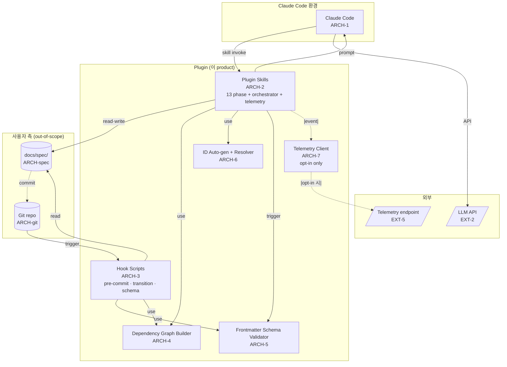
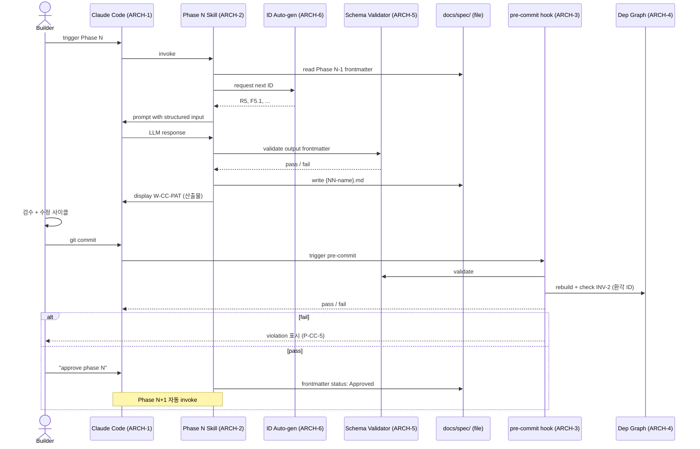
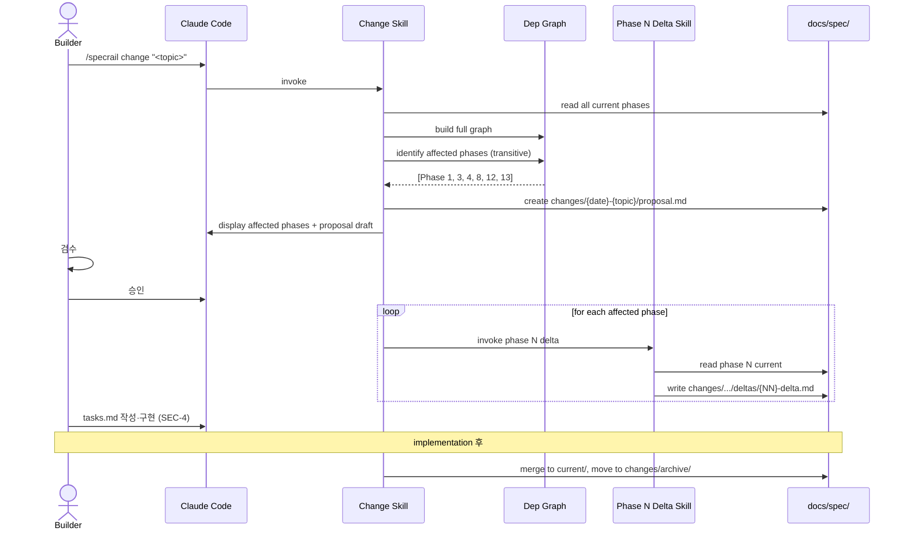

# System Architecture

**Mode:** HOLD SCOPE
**Inputs:** PRD §5, Phase 3 R/F (R1·R2·R4·R5·R6·R7·R8·R13), Phase 4 ENT
**Date:** 2026-05-10 (harness only)

> Dashboard scope 제거됨. Plugin은 Claude Code 안에서 작동하는 passive product.

## 1. C4 L1: System Context

```mermaid
flowchart TB
    Builder([Builder<br/>Persona])
    Plugin[("specrail Plugin<br/>(Claude Code skill collection)")]

    CC[/Claude Code<br/>EXT-1/]
    LLM[/LLM API<br/>EXT-2<br/>via Claude Code/]
    Git[/Git Hosting<br/>EXT-3/]
    Editor[/Editor·IDE<br/>(Markdown render)<br/>EXT-4/]
    Telem[/Telemetry endpoint<br/>EXT-5<br/>opt-in only/]

    Builder -->|명령·자연어| CC
    CC -->|skill 호출| Plugin
    Plugin -->|tool call·prompt| CC
    CC -->|API| LLM
    Plugin -->|hook script| Git
    Builder -->|markdown 검토| Editor
    Editor -.read-only.- Plugin
    Plugin -.|opt-in metric|.-> Telem
```

Plugin 자체는 **passive skill 모음** — Claude Code가 호출. 별 process 안 돌림 (dashboard 제거 후).

## 2. C4 L2: Container



## 3. Container Catalog

| ID | 이름 | 역할 | 책임 | 비책임 |
|---|---|---|---|---|
| ARCH-1 | Claude Code | host (사용자 측) | skill registry, tool call orchestration | plugin 비즈니스 로직 |
| ARCH-2 | Plugin Skills | application | 13 phase skill + orchestrator + telemetry skill | 검증 (hooks가) |
| ARCH-3 | Hook Scripts | gate | self-check·schema·transition gate enforcement | 산출물 작성 |
| ARCH-4 | Dependency Graph Builder | data | markdown parse → ENT-DependencyGraph 빌드 | 변경 추적 (Skills가) |
| ARCH-5 | Frontmatter Schema Validator | gate | YAML schema 검증 | schema 작성 (Skills가) |
| ARCH-6 | ID Auto-gen + Resolver | data | unique ID 부여 + 인용 valid ID list 노출 | 산출물 본문 |
| ARCH-7 | Telemetry Client | data | event queue + 전송 (opt-in 시) | endpoint host (외부) |
| ARCH-spec | 사용자 docs/spec/ | data (사용자 측) | spec markdown 파일 | 본 product 책임 외 |
| ARCH-git | Git repo | infra (사용자 측) | version control | 본 product 책임 외 |

<!-- specrail:attrs id=ARCH-1 -->
```yaml
status: Approved
c4-level: 1
linked-r: [R5]
linked-ext: [EXT-1]
last-modified: 2026-05-16
```
<!-- /specrail:attrs -->

<!-- specrail:attrs id=ARCH-2 -->
```yaml
status: Approved
c4-level: 1
linked-r: [R5, R8]
linked-ext: [EXT-1]
last-modified: 2026-05-16
```
<!-- /specrail:attrs -->

<!-- specrail:attrs id=ARCH-3 -->
```yaml
status: Approved
c4-level: 1
linked-r: [R2]
last-modified: 2026-05-16
```
<!-- /specrail:attrs -->

<!-- specrail:attrs id=ARCH-4 -->
```yaml
status: Approved
c4-level: 1
linked-r: [R4]
last-modified: 2026-05-16
```
<!-- /specrail:attrs -->

<!-- specrail:attrs id=ARCH-5 -->
```yaml
status: Approved
c4-level: 1
linked-r: [R1, R2]
last-modified: 2026-05-16
```
<!-- /specrail:attrs -->

<!-- specrail:attrs id=ARCH-6 -->
```yaml
status: Approved
c4-level: 1
linked-r: [R1]
last-modified: 2026-05-16
```
<!-- /specrail:attrs -->

<!-- specrail:attrs id=ARCH-7 -->
```yaml
status: Approved
c4-level: 1
linked-r: [R13]
linked-ext: [EXT-5]
last-modified: 2026-05-16
```
<!-- /specrail:attrs -->

## 4. External Integrations

| ID | 이름 | 카테고리 | 보내는 데이터 | 받는 데이터 | 분류 | Fallback |
|---|---|---|---|---|---|---|
| EXT-1 | Claude Code | host | skill metadata, tool calls | 사용자 입력, LLM 응답 | - | plugin 작동 불가 (필수) |
| EXT-2 | LLM API | AI | prompt + 사용자 paste content | 산출물 markdown | 사용자 spec 내용 (PII 가능) | LLM 다운 시 사용자가 다른 LLM (CC 통해) |
| EXT-3 | Git Hosting | VCS | 파일 + commit | repo content | public OSS / private 가능 | local git 작동 (push만 막힘) |
| EXT-4 | Editor·IDE | 도구 (사용자 측) | - | - | - | text editor 어떤 것이든 |
| EXT-5 | Telemetry endpoint | metrics | 익명 event | (응답 없음 — fire-and-forget) | 사용자 식별 X (anonProjectHash) | local queue 보존, 재전송 |

<!-- specrail:attrs id=EXT-1 -->
```yaml
status: Approved
protocol: "Claude Code skill host"
failure-mode: "plugin 작동 불가 (필수)"
last-modified: 2026-05-16
```
<!-- /specrail:attrs -->

<!-- specrail:attrs id=EXT-2 -->
```yaml
status: Approved
protocol: "LLM API (via Claude Code)"
failure-mode: "사용자가 다른 LLM (CC 통해) 시도"
last-modified: 2026-05-16
```
<!-- /specrail:attrs -->

<!-- specrail:attrs id=EXT-3 -->
```yaml
status: Approved
protocol: "git protocol (push/fetch)"
failure-mode: "local git 작동, push만 막힘"
last-modified: 2026-05-16
```
<!-- /specrail:attrs -->

<!-- specrail:attrs id=EXT-4 -->
```yaml
status: Approved
protocol: "none (passive markdown render)"
failure-mode: "text editor 어떤 것이든"
last-modified: 2026-05-16
```
<!-- /specrail:attrs -->

<!-- specrail:attrs id=EXT-5 -->
```yaml
status: Approved
protocol: "HTTPS POST (fire-and-forget)"
failure-mode: "local queue 보존, 재전송"
last-modified: 2026-05-16
```
<!-- /specrail:attrs -->

각 EXT의 구체 vendor 선정은 ADR-CAND.

## 5. Authentication & Authorization

이 product 자체는 인증 없음 (single-user, single machine).

사용자 환경의 인증:
- Claude Code: 사용자 자기 계정 (이 product 책임 외)
- LLM API: Claude Code 통해 사용자 key (이 product 책임 외)
- Git Hosting: 사용자 GitHub 계정 (이 product 책임 외)
- Telemetry endpoint: token-based (plugin 자체 token, project 정보 X)

**중요 안내:** 사용자가 spec 파일에 PII·secret·proprietary info를 적고 LLM에 paste할 때 위험 — README + 00-common 가이드 (NFR-PRIV-1).

## 6. API / Interface Surface

이 product의 "API"는 **Claude Code skill interface + hook script interface**. 형식은 ADR-CAND.

| Capability | Description | Container |
|---|---|---|
| Skill registration | Claude Code에 13 skill + orchestrator + telemetry skill 등록 | ARCH-2 |
| Skill invocation | trigger phrase 또는 명시 명령 | ARCH-1 → ARCH-2 |
| Skill internal data passing | Phase N 산출물 → Phase N+1 input (frontmatter parse) | ARCH-2 + ARCH-6 |
| Hook trigger | git pre-commit + plugin internal phase transition | ARCH-3 |
| Schema validation | YAML frontmatter check | ARCH-5 |
| Dependency graph query | skill·hook이 ID 정의·인용 lookup | ARCH-4 |
| Telemetry event emit | skill·hook이 event 발행 (consent OptedIn 시) | ARCH-7 |

(Dashboard·HTTP API — 향후 cycle.)

## 7. Storage Strategy

### Entity → Storage 매핑

| Entity | Storage Category | 위치 |
|---|---|---|
| ENT-Project | file system (docs/spec 디렉토리 자체) | 사용자 측 |
| ENT-Phase | markdown file + YAML frontmatter | docs/spec/{NN-name}.md |
| ENT-Spec | markdown section + frontmatter ID list | 동일 file |
| ENT-AcceptanceCriteria | markdown bullet list (R-tier) | 동일 file |
| ENT-DependencyGraph | in-memory only (ADR-9 option D) | 없음 — 프로세스 종료 시 휘발 |
| ENT-Hook | shell scripts | `.git/hooks/{pre-commit,...}` |
| ENT-Change | markdown + frontmatter | `docs/spec/changes/{date}-{topic}/` |
| ENT-Skill | plugin install 디렉토리 | Claude Code skill registry (`~/.claude/skills/` 또는 비슷) |
| ENT-Subagent | ephemeral (in-memory) | 없음 — task 종료 시 휘발 |
| ENT-TelemetryEvent | local queue (JSON Lines) | `~/.specrail/telemetry-queue.jsonl` |
| ENT-TelemetryConsent | local config | `~/.specrail/consent.json` |

### Backup·DR

- 사용자 docs/spec/: 사용자 책임 (`git push` 빈도 — README 가이드)
- Plugin 자체: 사용자 plugin re-install
- Telemetry queue: 일시 (재전송 후 삭제). 다운 시 일부 event 손실 (acceptable for opt-in metric)
- Consent: 사용자 직접 백업 X (재install 시 재opt-in 질문)

### `.specrail-cache/` (gitignore 권장)

- ~~`graph.json`~~ — **제거됨 (ADR-9 option D)**: DependencyGraph는 in-memory only. 디스크 cache 파일 없음.
- `id-counter.json` — auto-gen ID 카운터 (R{n}, F{n}.{m}, S{n}.{m}.{k} 다음 번호)

## 8. Sequence Diagram

### S1: Greenfield Phase N 진행



### S2: DELTA 변경



## 9. ADR-Candidates (Phase 12에서 결정)

| ID | 결정 영역 | 옵션 후보 |
|---|---|---|
| ADR-CAND-1 | Plugin skill 형식 | Claude Code official skill spec / custom |
| ADR-CAND-2 | Frontmatter schema 정의 형식 | JSON Schema / custom YAML / TypeScript types |
| ADR-CAND-3 | Hook script language | bash / Node.js / Python |
| ADR-CAND-4 | Markdown parser (for Graph builder + Schema validator) | unified/remark / marked / 자체 regex |
| ADR-CAND-5 | ID auto-gen 알고리즘 | sequential counter (per phase per project) / UUID / hash-based |
| ADR-CAND-6 | Subagent 구현 (R8) | Claude Code 자체 subagent 기능 / LLM API direct call / hybrid |
| ADR-CAND-7 | Telemetry endpoint host | Plausible / PostHog / Self-hosted minimal / 자체 build |
| ADR-CAND-8 | Skill orchestration mechanism | tool call chain (LLM driven) / explicit state machine (deterministic) |
| ADR-CAND-9 | Dep Graph cache invalidation | file watch (always live) / on-demand rebuild / manual refresh |
| ADR-CAND-10 | Phase N 산출물 파일 vs 디렉토리 | 단일 file / 디렉토리 (큰 산출물용) |

## 10. Open Questions

| Q ID | 질문 | 결정자 | Blocking? |
|---|---|---|---|
| OQ-8-1 | Skill orchestration LLM-driven vs deterministic (ADR-CAND-8) — 핵심 결정 | maintainer | Phase 12·13 |
| OQ-8-2 | Subagent 구현 — Claude Code SDK 기능 의존성 (A1 검증 필요) | maintainer | Phase 12 spike |
| OQ-8-3 | Hook script multi-OS 호환 (Windows WSL 시 bash·PowerShell 분기?) | maintainer | Phase 11 |
| OQ-8-4 | Markdown parser 라이브러리 — Phase 8 spike 후 결정 | maintainer | Phase 12 |

## 11. 다음 phase 인풋

Phase 9 (NFR)에:
- 모든 ARCH·EXT (Perf·Avail·Sec·Privacy NFR 매핑)
- Threat Boundaries: ARCH-spec (사용자 PII), EXT-5 (telemetry), Hook bypass
- Single-machine·single-user 보안 가정

Phase 10 (Test)에:
- ARCH-2 (Skills) test 종류 — skill input/output 검증
- ARCH-3 (Hooks) test — exit code, blocking 동작
- ARCH-4 (Graph) test — INV-1·INV-2 검증
- ARCH-5 (Schema) test — frontmatter validation

Phase 11 (Operations)에:
- ARCH 별 deploy: skill install (Claude Code marketplace), hook auto-install
- Monitoring: GitHub issue·PR + telemetry (opt-in)
- Cost: $0 (사용자 측 모두 사용자 책임, plugin 자체 free OSS)

Phase 12 (ADR)에:
- 모든 ADR-CAND-1~10

## 12. Phase 8 Container Detail (ARCH-8~12)

### ARCH-8: State Machine Container

<!-- specrail:attrs id=ARCH-8 -->
```yaml
status: Approved
c4-level: 2
linked-r: [R1, R2]
last-modified: 2026-05-16
```
<!-- /specrail:attrs -->

**Responsibility**: Phase lifecycle, change lifecycle, consent, subagent state machines (SM-Phase-Lifecycle, SM-Change-Lifecycle, SM-Consent, SM-Subagent).

**Interfaces**:
- `src/spec/state-machine.ts` — `transitionPhase`, `transitionChange`, `validateTransition`
- `src/hook/transition-gate.ts` — pre-commit gate that enforces SM rules

**Dependencies**: Hook Scripts container (frontmatter), Frontmatter Schema Validator container (ID counter)

### ARCH-9: Subagent Dispatch Container

<!-- specrail:attrs id=ARCH-9 -->
```yaml
status: Approved
c4-level: 2
linked-r: [R8]
last-modified: 2026-05-16
```
<!-- /specrail:attrs -->

**Responsibility**: 2-stage runWithReview pattern, BLOCKED escalation, audit trail preservation.

**Interfaces**:
- `src/subagent/dispatch.ts` — `dispatchTaskWithReview`, `dispatchWithRetry`
- `src/subagent/wrapper.ts` — invokeSubagent boundary

**Dependencies**: Claude Code host container (skill), Telemetry Client container

### ARCH-10: CLI Commands Container

<!-- specrail:attrs id=ARCH-10 -->
```yaml
status: Approved
c4-level: 2
linked-r: [R4, R6]
last-modified: 2026-05-16
```
<!-- /specrail:attrs -->

**Responsibility**: User-facing CLI entry points — change, approve, hook-install, orchestrator status/nextPhase.

**Interfaces**:
- `src/cli/change.ts` — draftChange, invokeDeltaChain, mergeChange, archiveChange
- `src/cli/approve.ts` — Draft → Approved transition
- `src/cli/hook-install.ts` — HOOK_TEMPLATE chain detection + install
- `src/skill/orchestrator.ts` — status, nextPhase

**Dependencies**: Plugin Skills container (hooks), Hook Scripts container (graph builder), State Machine container

### ARCH-11: Lint Module Container

<!-- specrail:attrs id=ARCH-11 -->
```yaml
status: Approved
c4-level: 2
linked-r: [R2]
last-modified: 2026-05-16
```
<!-- /specrail:attrs -->

**Responsibility**: Plan self-check automation — anti-sycophancy, atomic-commit, ac-traceability, inv-7, inv-5 invariant enforcement.

**Interfaces**:
- `src/lint/anti-sycophancy.ts` — scanFile, scanProject
- `src/lint/atomic-commit.ts` — checkCommit
- `src/lint/ac-traceability.ts` — checkAcCoverage
- `src/lint/inv-enforce.ts` — checkInv5, checkInv7, checkInv7File
- `src/lint/run-all.ts` — runAllChecks orchestrator

**Dependencies**: Hook Scripts container (frontmatter), Dependency Graph Builder container (schema validator)

### ARCH-12: Markdown Utilities Container

<!-- specrail:attrs id=ARCH-12 -->
```yaml
status: Approved
c4-level: 2
linked-r: [R1, R4]
last-modified: 2026-05-16
```
<!-- /specrail:attrs -->

**Responsibility**: Markdown parsing primitives — frontmatter, YAML safe-load, leading HTML comment strip.

**Interfaces**:
- `src/markdown/frontmatter.ts` — parseFrontmatter, stripLeadingHtmlComments
- `src/markdown/yaml.ts` — safeYamlParse with prototype pollution defense

**Dependencies**: unified/remark/remark-frontmatter (external)
