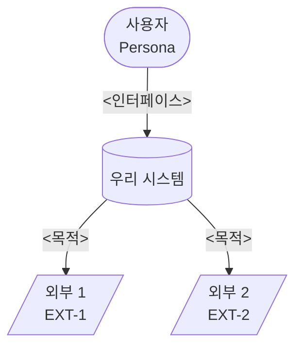
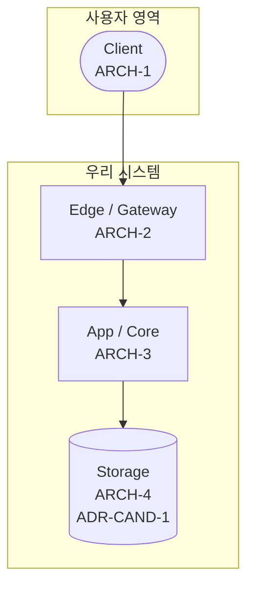
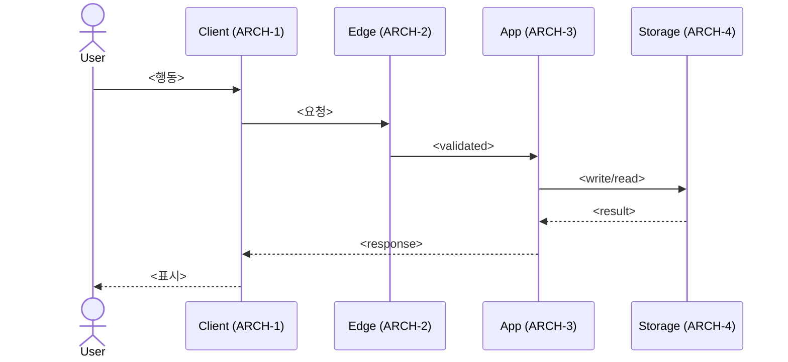

<!-- plugin-refinement (T2.5c, architect 옵션 B): self-check bash blocks → ARCH-5 schema validator + ARCH-3 hooks 자동 강제. HARD-GATE 수동 승인 step → ADR-8 state machine 자동 enforce. 상대 경로 file 참조 → plugin runtime의 docs/spec/ resolver. -->

---
name: phase-8-system-architecture
description: C4 L1 (Context) + L2 (Container), External integrations, Auth model, API surface intent, Storage strategy. ADR-CAND 식별.
inputs-from: Phase 1 §5(환경) + Phase 3 R/F + Phase 4 ENT
trigger-words: architecture, system design, C4, integrations
mode: GREENFIELD | DELTA
---

# Phase 8: System Architecture

## Purpose

시스템 경계·외부 의존성·내부 구성·데이터 흐름을 사양화. 구체 기술 결정은 Phase 12 ADR로 미룸.

## Inputs

- PRD §5 환경 / 카테고리
- Phase 3 모든 R / F
- Phase 4 모든 Entity
- Phase 6 URL Conventions (해당 시)
- (DELTA) `current/08-system-architecture.md`

<HARD-GATE>
Phase 7 사용자 승인 없이 진행 금지.
</HARD-GATE>

## Mode 상속

- EXPANSION: 추가 container, scaling 옵션 surface
- SELECTIVE: PRD 시나리오 cover하는 minimum + cherry-pick
- HOLD: PRD 시나리오 cover 충분
- REDUCTION: P0 Spec cover하는 minimum architecture

---

## Anti-Sycophancy

00-common 참조 + Phase 8 특화:

**금지:**
- "Microservices가 더 확장성 있어요" (정당화 없는)
- 구체 vendor·기술 명시 (Phase 8은 abstract, 구체는 ADR)
- "Best practice는 X예요"

**대신:**
- 추상 컴포넌트만 명시
- 구체 기술 후보는 `ADR-CAND-{n}`으로 마킹 (Phase 12에서 결정)
- Cognitive Pattern: **Boring by default** — innovation token 약 3개 신중히

---

## Reasoning Procedure

1. PRD §5 환경에서 client 정의 (Web / iOS / Android / Desktop / API / CLI / 콘솔 등)
2. C4 L1 (Context) — 시스템과 외부 인물·외부 시스템
3. C4 L2 (Container) — 시스템 내부 abstract container
4. External Integration 표 (외부 의존이 있는 경우)
5. Authentication & Authorization Model (multi-user product)
6. API / Interface Surface (intent only)
7. Storage Strategy (abstract — Entity → category 매핑)
8. ADR-CAND 표시 (모든 구체 기술 결정 후보)
9. Self-Check + 승인

---

## Constraints

1. **C4 L1 + L2 강제** — Mermaid flowchart로.
2. **추상 컴포넌트만** — 구체 product 이름 금지, "관계형 DB"·"key-value 캐시"·"객체 스토리지"·"메시지 큐" 등 카테고리만.
3. **모든 구체 기술 결정 → ADR-CAND** — `ADR-CAND-{n}: <영역> (Phase 12)`.
4. **External은 데이터 분류 + 실패 fallback 명시** — 무엇을 보내고 받는지, 다운 시 무엇.
5. **Auth model: Role × Resource matrix** (multi-role product).
6. **API Surface는 intent만** — endpoint 형식·payload는 미정.
7. **Sequence diagram 1개 이상** — 핵심 flow의 component 간 메시지.
8. **Cognitive Pattern**: Boring by default, Reversibility, Make change easy then easy change.

---

## Output Format

````markdown
# System Architecture

**Mode:** {inherited}
**Inputs:** PRD §5, Phase 3 R/F, Phase 4 ENT
**Date:** YYYY-MM-DD

## 1. C4 L1: System Context



(외부 의존이 없는 경우 — 단순 client + system만 표시)

## 2. C4 L2: Container



## 3. Container Catalog

| ID | 이름 | 역할 (data/app/edge/infra) | 책임 | 비책임 |
|---|---|---|---|---|
| ARCH-1 | Client | UI | 렌더링·입력 | 비즈니스 로직 |
| ARCH-2 | Edge | edge | 인증·rate limit·routing | 비즈니스 로직 |
| ARCH-3 | App | application | 비즈니스 로직 | UI·async |
| ARCH-4 | Storage | data | 영구 데이터 | 캐시·blob |
| ... | ... | ... | ... | ... |

## 4. External Integrations (해당 시)

| ID | 이름 | 카테고리 | 보내는 데이터 | 받는 데이터 | 분류 | Fallback |
|---|---|---|---|---|---|---|
| EXT-1 | <서비스> | <카테고리> | <데이터> | <데이터> | <PII / public / sensitive> | <다운 시 처리> |

각 External의 구체 vendor 선정은 **ADR-CAND-{n}** 후보로 Phase 12.

(외부 의존 없으면 이 섹션 생략)

## 5. Authentication & Authorization (multi-user product)

### Auth Model

- 인증 방식: <패턴> (ADR-CAND-{n})
- 세션 / 토큰: <메커니즘>
- 비밀번호 / 자격증명: <해시·저장 방식> (ADR-CAND-{n})

### Role × Resource Matrix

| Resource | ROLE-1 | ROLE-2 | ROLE-3 |
|---|---|---|---|
| <리소스 1> | RWD | R | - |
| <리소스 2> | RWD | RW | R |

(R=Read, W=Write, D=Delete)

### Threat Boundaries

```
[Public] ──TLS──▶ [Edge: rate limit, auth]
                    │
                    ▼
[Authenticated] ──internal──▶ [App: authz check]
                                 │
                                 ▼
[Trusted] ──────────────────▶ [Storage]
```

(single-user product면 Auth 섹션 단순화 또는 생략)

## 6. API / Interface Surface (intent only)

Phase 8은 **what**만. **how**(REST/GraphQL/RPC/CLI/etc.)는 ADR-CAND-{n}.

| Capability | Description | Container |
|---|---|---|
| <기능 영역 1> | <목적> | ARCH-{n} |
| <기능 영역 2> | <목적> | ARCH-{n} |

## 7. Storage Strategy (abstract)

### Entity → Storage 매핑

| Entity | Storage Category | 이유 |
|---|---|---|
| ENT-{Name} | <관계형 DB / KV / 객체 / 큐 / 인메모리> | <강한 일관성 / 빠른 조회 / binary / async / etc.> |
| ... | ... | ... |

### Backup·DR 후보 정책

- <Storage>: <RPO / RTO 후보> (ADR-CAND-{n})

## 8. Sequence Diagram (핵심 flow 1개 이상)



## 9. ADR-Candidates (Phase 12에서 결정)

| ADR-CAND ID | 결정 영역 | 옵션 후보 |
|---|---|---|
| ADR-CAND-1 | <영역 1> | <A> / <B> / <C> |
| ADR-CAND-2 | <영역 2> | ... |
| ... | ... | ... |

## 10. Open Questions

| Q ID | 질문 | 결정자 | Blocking? |
|---|---|---|---|
| OQ-8-1 | <전체 architecture 영향> | CTO | Y |

## 11. 다음 phase 인풋

Phase 9 (NFR)에:
- 모든 ARCH·EXT
- Threat Boundaries

Phase 10 (Test)에:
- ARCH 별 테스트 종류 매핑

Phase 11 (Operations)에:
- ARCH·EXT 운영 (deploy·monitoring)
- DR 후보 정책

Phase 12 (ADR)에:
- 모든 ADR-CAND-{n} 항목
````

---

## DELTA Mode

기존 architecture 위에 변경.

### 형식

`changes/{date}-{topic}/deltas/08-architecture-delta.md`:

````markdown
## ADDED Containers
| ID | 이름 | 역할 | 책임 |

## MODIFIED Containers
### ARCH-{existing}
- Responsibility Δ
- Migration: <기존 책임을 어디로 옮길지>

## ADDED External Integrations
| ID | 이름 | 카테고리 | Fallback |

## MODIFIED External
### EXT-{existing}
- 데이터 Δ
- Fallback Δ

## REMOVED
- ARCH-{n}: Migration plan

## Auth Model Δ (multi-user)
- Role 추가/변경
- Matrix 변경분

## Storage Δ
| Entity | Before | After | Migration |

## Sequence Diagram Δ
새 flow 또는 변경된 flow

## ADR-CAND 추가
| ID | 결정 영역 |
````

---

## Self-Check

```bash
# 구체 기술명 노출 검출 (도메인-specific 라이브러리·서비스 명)
# 사용자가 자기 도메인에 맞춰 검사 — 일반적 예시 키워드:
grep -iE "PostgreSQL|MySQL|MongoDB|Redis|Memcached|AWS|GCP|Lambda|S3|Stripe" 08-system-architecture.md

# C4 L1 + L2 둘 다
grep -c "flowchart" 08-system-architecture.md   # 2 이상

# Sequence diagram
grep -c "sequenceDiagram" 08-system-architecture.md   # 1 이상

# Container ID 형식
grep -E "^\| ARCH-[0-9]+" 08-system-architecture.md | wc -l

# External ID 형식 (있는 경우)
grep -E "^\| EXT-[0-9]+" 08-system-architecture.md | wc -l

# 모든 EXT에 fallback (있는 경우)
grep -E "^\| EXT-[0-9]+" 08-system-architecture.md | awk -F'|' '{print $7}' | grep -c .

# Auth Matrix 존재 (multi-user)
grep "Role.*Resource.*Matrix\|Role × Resource" 08-system-architecture.md

# ADR-CAND 표시
grep -c "ADR-CAND-[0-9]" 08-system-architecture.md
```

체크리스트:
- [ ] C4 L1 (Context) + L2 (Container) 모두 mermaid
- [ ] Sequence diagram 1개 이상
- [ ] 추상 컴포넌트만 (구체 기술명 0건)
- [ ] 모든 ARCH가 책임·비책임 명시
- [ ] 모든 EXT가 fallback 정책 (있는 경우)
- [ ] 모든 EXT가 데이터 분류 (있는 경우)
- [ ] Role × Resource matrix (multi-role)
- [ ] Threat boundaries (multi-user)
- [ ] Storage Strategy: Entity → category 매핑
- [ ] 모든 구체 기술 결정 → ADR-CAND
- [ ] Open Questions Blocking 표시

---

<HARD-GATE>
Self-check 통과 + 사용자 승인. Phase 9 진행.
</HARD-GATE>

## 12. Phase 8 Container Detail (ARCH-8~12)

### ARCH-8: State Machine Container

**Responsibility**: Phase lifecycle, change lifecycle, consent, subagent state machines (SM-Phase-Lifecycle, SM-Change-Lifecycle, SM-Consent, SM-Subagent).

**Interfaces**:
- `src/spec/state-machine.ts` — `transitionPhase`, `transitionChange`, `validateTransition`
- `src/hook/transition-gate.ts` — pre-commit gate that enforces SM rules

**Dependencies**: Hook Scripts container (frontmatter), Frontmatter Schema Validator container (ID counter)

### ARCH-9: Subagent Dispatch Container

**Responsibility**: 2-stage runWithReview pattern, BLOCKED escalation, audit trail preservation.

**Interfaces**:
- `src/subagent/dispatch.ts` — `dispatchTaskWithReview`, `dispatchWithRetry`
- `src/subagent/wrapper.ts` — invokeSubagent boundary

**Dependencies**: Claude Code host container (skill), Telemetry Client container

### ARCH-10: CLI Commands Container

**Responsibility**: User-facing CLI entry points — change, approve, hook-install, orchestrator status/nextPhase.

**Interfaces**:
- `src/cli/change.ts` — draftChange, invokeDeltaChain, mergeChange, archiveChange
- `src/cli/approve.ts` — Draft → Approved transition
- `src/cli/hook-install.ts` — HOOK_TEMPLATE chain detection + install
- `src/skill/orchestrator.ts` — status, nextPhase

**Dependencies**: Plugin Skills container (hooks), Hook Scripts container (graph builder), State Machine container

### ARCH-11: Lint Module Container

**Responsibility**: Plan self-check automation — anti-sycophancy, atomic-commit, ac-traceability, inv-7, inv-5 invariant enforcement.

**Interfaces**:
- `src/lint/anti-sycophancy.ts` — scanFile, scanProject
- `src/lint/atomic-commit.ts` — checkCommit
- `src/lint/ac-traceability.ts` — checkAcCoverage
- `src/lint/inv-enforce.ts` — checkInv5, checkInv7, checkInv7File
- `src/lint/run-all.ts` — runAllChecks orchestrator

**Dependencies**: Hook Scripts container (frontmatter), Dependency Graph Builder container (schema validator)

### ARCH-12: Markdown Utilities Container

**Responsibility**: Markdown parsing primitives — frontmatter, YAML safe-load, leading HTML comment strip.

**Interfaces**:
- `src/markdown/frontmatter.ts` — parseFrontmatter, stripLeadingHtmlComments
- `src/markdown/yaml.ts` — safeYamlParse with prototype pollution defense

**Dependencies**: unified/remark/remark-frontmatter (external)