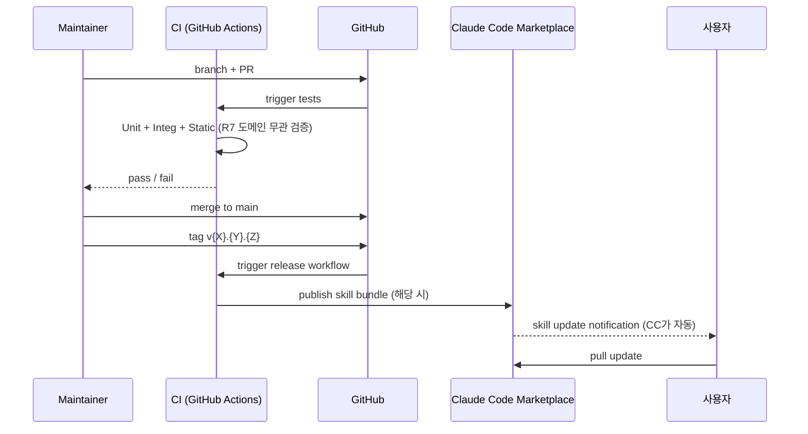

# Operations

**Mode:** HOLD SCOPE
**Inputs:** Phase 8 ARCH·EXT, Phase 9 AVAIL·SEC·PRIV
**Date:** 2026-05-10

> Plugin은 passive skill·hook 모음 — server 안 돌림. Ops는 두 영역 분리:
> 1. **Plugin code 운영** (maintainer 측) — GitHub OSS, Claude Code marketplace
> 2. **Telemetry endpoint 운영** (maintainer 측) — opt-in 사용자 metric 수집
> 사용자 측 (사용자 spec, hook 실행 환경)은 사용자 책임 — out of plugin ops scope.

## 1. Environments

| Env | 목적 | 데이터 | 외부 EXT | 누가 접근 |
|---|---|---|---|---|
| Dev (개인) | maintainer 로컬 작업 | local git | LLM API (개인 key), Telemetry endpoint dev | maintainer |
| Staging | release 전 검증 | dev fixture | LLM API, Telemetry endpoint staging | maintainer + 베타 사용자 |
| Production | OSS 사용자 | (사용자 측 spec) | live LLM, Telemetry endpoint prod | 누구나 (OSS) |

Plugin 자체 prod = main branch + tagged release. Telemetry endpoint = 별도 서비스 (호스트 — ADR-CAND-7).

## 2. Deploy Strategy

### Plugin code (skills + hooks + builders)

**OPS-1 — Deploy 방식:** Git tag-based release + Claude Code marketplace 등록.

| 단계 | 비율 | 검증 시간 | Rollback trigger |
|---|---|---|---|
| Branch + PR | 0% (사용자 영향 없음) | 24-72h review | review 거부 |
| Merge to main | 0% (release 전) | - | revert PR |
| Tag release | 점진 (사용자 update 시점 결정) | 24h | hot fix patch tag (v{X}.{Y}.{Z+1}) |
| Marketplace publish | 점진 | 사용자 update 후 24-72h | yank + advisory |

**Marketplace 미등록 시:** GitHub install 명령 (e.g. `claude code skill install <repo>` — Claude Code SDK에 의존).

### Hook script (사용자 머신에 install)

**OPS-2 — Hook deploy:** Plugin 첫 setup 시 `.git/hooks/`에 plugin 자체 hook script 자동 install (AC-R6-3, 사용자 confirm).

Plugin 업데이트 시:
- Hook script 자체도 업데이트 — 사용자 git pre-commit이 hash 비교 후 alert
- 사용자가 plugin update 명령 실행 → hook script 재install (사용자 confirm)

### Telemetry endpoint

**OPS-3 — Endpoint deploy:** Standard 웹 서비스 (Plausible / PostHog 호스트 또는 자체) — ADR-CAND-7 결정 후.

- 단일 region (default UTC, GDPR 가능 시 EU region OQ-9-4)
- TLS 강제
- Token-based auth (plugin 자체 token, 사용자별 X)

DB / 데이터 migration: telemetry event는 append-only — 미정 event field 추가 시 schema versioning.

## 3. Observability — Logs (Plugin code)

OSS code라 traditional log 없음. 대신:

**OPS-4 — GitHub Activity:**

| 신호 | 의미 |
|---|---|
| Issue 생성 | 사용자 PAIN 보고 (PAIN-* 또는 새) |
| PR 생성 | 사용자 직접 수정 제안 |
| Discussion | 질문·feedback |
| Star·Fork | adoption (KPI-4) |
| Issue resolution time | maintainer 반응성 |

**OPS-5 — Telemetry stream (opt-in):**

| Event | 의미 |
|---|---|
| PhaseStarted | 사용자가 phase N 진입 |
| PhaseApproved | 사용자가 phase N 승인 (HARD-GATE 통과) |
| HookBlock | hook이 commit 차단 (NFR-SEC-2 detection) |
| ChangeProposed | DELTA mode 시작 |
| ImplementationStarted | Phase 13 후 SEC-4 진입 |
| Other | (events list ADR-CAND-7 결정 시 확장) |

각 event metadata: timestamp, anonProjectHash, pluginVersion, phaseId / changeId 등 (INV-8 spec 내용 0건 강제).

**OPS-6 — Retention:**
- Plugin GitHub issue·PR: 영구 (GitHub 자체)
- Telemetry event: 12개월 (privacy 부담 감소). Aggregate metric은 무기한.

**OPS-7 — 금지 (Plugin code):**
- Plugin 자체에 사용자 spec 내용 log 절대 금지 (NFR-PRIV-1)
- LLM prompt 자체도 log X (CC 측 책임)
- Telemetry payload에 spec 내용 (INV-8 schema enforce)

## 4. Observability — Metrics

### Plugin (사용자 보고 + Telemetry)

| ARCH | Rate | Errors | Duration |
|---|---|---|---|
| ARCH-2 Skills | telemetry PhaseStarted/일 | issue-reported skill failure | LLM 응답 시간 (자기보고) |
| ARCH-3 Hooks | HookBlock event/주 | hook script error rate (telemetry 시) | NFR-PERF-3 (사용자 보고) |
| ARCH-4 Graph | (telemetry 없음 — 내부) | issue 보고 | NFR-PERF-4·5 (자체 bench) |
| ARCH-7 Telemetry Client | event/일 | local queue retry count | endpoint 응답 시간 |

### KPI Dashboard (maintainer 측)

| KPI | Metric | 측정 도구 |
|---|---|---|
| KPI-1 (완주율) | telemetry: PhaseApproved 13 도달 / PhaseStarted 1 비율 | telemetry analytics |
| KPI-2 (환각 ID 0) | hook telemetry: HookBlock with reason="invalid-id-ref" 비율 | telemetry |
| KPI-3 (시간 <6h) | self-report (사용자 survey) + telemetry timestamp diff | survey + telemetry |
| KPI-4 (stars 500) | GitHub stars | GitHub API |
| KPI-6 (정당 차단 >85%) | HookBlock + 후속 PhaseApproved 비율 (사용자 수정 후 통과) | telemetry |

(KPI-5 dashboard 사용 빈도 — 향후 dashboard cycle.)

## 5. Observability — Traces

- **Plugin internal trace:** Skill chain (Phase N → Phase N+1) — telemetry event sequence per session_id (anonymous)
- **사용자 측 trace:** out of scope (CC 측 또는 사용자 IDE 측)
- **Telemetry endpoint trace:** 표준 server logging (request id)

## 6. Alert Policy

OSS 프로젝트라 새벽 3시 pager 없음. 대신 **maintainer attention**:

<!-- specrail:deftable -->
| OPS-{n} | 조건 | severity | channel | maintainer response |
|---|---|---|---|---|
| OPS-8 | Critical issue (사용자 spec 깨짐 보고) | P0 | GitHub label | 24h ack |
| OPS-9 | Telemetry endpoint 다운 (5xx > 1%/5분) | P1 | maintainer email | 4h ack |
| OPS-10 | Plugin marketplace install failure 보고 | P0 | GitHub label | 24h ack |
| OPS-11 | KPI-2 (환각 ID 0) 위반 보고 — Hook fail이지만 사용자가 이상 ID 작성 성공 | P0 | issue label | 48h fix |
| OPS-12 | KPI-1 (완주율 80%) telemetry 측정 < 60% | P1 | dashboard | 다음 release cycle 검토 |
| OPS-13 | NFR-SEC-3 PR jailbreak 시도 감지 (PR review 시) | P0 | maintainer review | 즉시 reject + advisory |
| OPS-14 | NFR-SEC-12 hook RCE 보고 | P0 | security email | 24h fix + CVE if needed |
| OPS-15 | Telemetry endpoint storage 80% | P2 | dashboard | retention 정책 검토 |
| OPS-16 | Stars 성장 정체 (KPI-4) | P3 | GitHub | manual investigation |

**Alert hygiene:** Plugin code OSS이라 24h ack가 minimum. 사용자 critical block (install·hook 실패 등)는 즉시.

## 7. Backup & Disaster Recovery

<!-- specrail:deftable -->
| OPS-{n} | 영역 | 정책 |
|---|---|---|
| OPS-17 | Plugin GitHub repo | GitHub 자체 + maintainer local clone (사실상 multi-region) |
| OPS-18 | 사용자 docs/spec | 사용자 책임 — README "git push 자주" |
| OPS-19 | Telemetry endpoint DB | 일일 backup, 7일 retention (privacy 부담) |
| OPS-20 | TelemetryConsent (사용자 측) | 사용자 직접 (재install 시 재opt-in 질문) |
| OPS-21 | Plugin marketplace listing | maintainer가 release tag로 재publish 가능 (사실상 backup) |

**RPO·RTO:**
- Plugin code: RPO 0 (git에 모두 보존), RTO 즉시 (clone)
- Telemetry endpoint: RPO 24h, RTO 4h
- 사용자 spec: 사용자 git push 빈도 결정

**DR drill:** 분기마다 maintainer가 fresh 환경에서 plugin install + Phase 1 진행 시뮬 (regression test).

## 8. Feature Flags

현재 feature flag 없음 (단순 markdown skill collection). 유사 mechanism:

| 종류 | 적용 |
|---|---|
| Telemetry consent | OptedIn / OptedOut — feature flag와 유사 (R13) |
| Plugin version | 사용자가 pin 가능 (semver) |
| Hook bypass | `--no-verify` (사용자 측 git 자체 mechanism — plugin 무관) |

(Real feature flag mechanism — A/B 테스트 등 — 향후 dashboard cycle.)

## 9. Cost Model

| 항목 | 작음 (KPI×0.1) | 기준 (KPI 목표 500 stars) | 큼 (10x 5000 stars) |
|---|---|---|---|
| GitHub repo | $0 (public OSS) | $0 | $0 (or Pro $4/월 maintainer) |
| Telemetry endpoint host (Plausible / PostHog cloud) | $0 (free tier) | $20/월 (Plausible 10k events) | $50/월 (PostHog 100k events) |
| Maintainer 시간 | 5h/월 | 10h/월 | 30h/월 + 다른 maintainer |
| LLM API (자체 dogfood + spike) | $5/월 | $20/월 | $50/월 |
| **Total / 월** | **$5** | **$40** | **$100** |
| Per-user cost | $0.05 | $0.08 | $0.02 |

이 product의 cost는 사용자 수에 부분 의존 (telemetry event 수). Plugin code 자체는 $0.

## 10. Runbook 후보

<!-- specrail:deftable -->
| RB | 시나리오 |
|---|---|
| RB-1 | "B2B 표현 발견" issue (R7 위반) → 위치 확인 + PR + merge |
| RB-2 | Hook install 실패 사용자 보고 → OS 별 troubleshooting 문서 |
| RB-3 | Plugin update 후 사용자 spec frontmatter schema mismatch → migration script |
| RB-4 | Telemetry endpoint 다운 → fallback (사용자 측 local queue 재전송) |
| RB-5 | Malicious PR (jailbreak 시도) → revert + advisory |
| RB-6 | KPI-1 < 60% 추세 (사용자 이탈) → Phase 별 PhaseStarted vs PhaseApproved 분석 + 약점 phase 식별 |
| RB-7 | Plugin marketplace publish 실패 → manual GitHub release fallback |
| RB-8 | Subagent BLOCKED escalation 패턴 분석 (telemetry) → 자주 막히는 task 종류 식별 |

## 11. Open Questions

| Q ID | 질문 | 결정자 | Blocking? |
|---|---|---|---|
| OQ-11-1 | Telemetry endpoint host (Plausible / PostHog / 자체) — ADR-CAND-7 결정 + Phase 11 운영 결과 | maintainer | ADR Phase 12 |
| OQ-11-2 | Marketplace 등록 시점 — 초기 release 동시 vs 안정 후 | maintainer | OQ-1-1 (PRD) |
| OQ-11-3 | Survey mechanism (KPI-3 self-report) — Google Form / Tally / GitHub issue template | maintainer | 출시 전 |
| OQ-11-4 | Hot fix release 정책 — patch tag 자동 vs maintainer 명시 | maintainer | 첫 production incident 후 |

## 12. 다음 phase 인풋

Phase 12 (ADR)에:
- 모든 OPS 관련 ADR-CAND (telemetry host·marketplace registration·hook lang 등)
- ADR-CAND-7 (telemetry endpoint host) — Phase 11 비용·privacy 분석 종합

Phase 13 (Implementation)에:
- OPS-1 deploy 단계 (마지막 milestone)
- OPS-5·11·12 telemetry instrumentation (R13 task)
- OPS-2 hook auto-install (R6 task)
- RB-1~8 runbook은 incident 발생 시 작성 (P1 — 출시 후)
