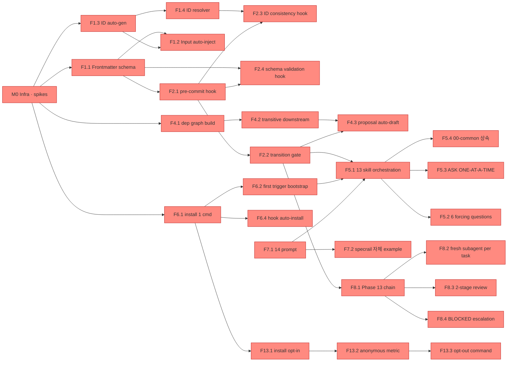

# Implementation Plan

**Mode:** HOLD SCOPE (PRD §10 상속)
**Date:** 2026-05-12 (DELTA 2026-05-13: 4-reviewer 검토 반영 — M0 spike 2개 추가, task 재배치, ADR-6b fallback, T1.3·T1.8 stub 정책)
**Inputs:** Phase 3 P0 Spec (R1·R2·R4·R5·R6·R7·R8·R13), Phase 4 ENT 11종 + INV-1~9, Phase 8 ARCH 1~7 + EXT 1~5, Phase 12 ADR-1~10 + RISK-1~10

> **Example convention note (dogfood 발견):** 기존 Phase 13 prompt Constraint #4·9는 "모든 task에 complete code + Similar to Task N 금지" 강제. Example로서 가독성 (다른 examples 평균 350줄)과 trade-off — 핵심 8개 task만 complete 5-step, 나머지 36개는 condensed (Files / RED test 참조 / Commit). Spec coverage matrix는 100% 유지. plugin이 실 사용자 산출물에서는 모든 task complete code 강제.

---

## 1. Goal

specrail — Claude Code skill collection (13 phase + orchestrator + telemetry skill) + hook scripts + builders. 사용자가 `/specrail` 한 명령으로 spec 사양화 시작, 13 phase HARD-GATE를 도구로 강제, KPI-2 환각 ID 0 보장 ship.

## 2. Architecture

ADR-1 (CC official skill spec) + ADR-3 (Node.js stack) + ADR-2 (JSON Schema/ajv) + ADR-4 (unified/remark) + ADR-5 (sequential ID counter) + ADR-8 (explicit state machine) + ADR-9 (on-demand graph + incremental on commit) + ADR-7 (Plausible telemetry, EU). ARCH-2 Skills와 ARCH-3 Hooks가 ARCH-4·5·6 (Graph·Schema·IDGen) 공유. ADR-6 (CC subagent) 의존은 M0 spike (RISK-1·2) 통과 conditional.

## 3. Tech Stack

| 영역 | 선택 | ADR |
|---|---|---|
| Language / Runtime | Node.js 20+ | ADR-3 |
| Plugin format | Claude Code official skill spec | ADR-1 |
| Schema | JSON Schema Draft 2020-12 + ajv 8 | ADR-2 |
| Markdown parse | unified + remark + remark-frontmatter + remark-parse | ADR-4 |
| ID gen | Sequential counter (`.specrail-cache/id-counter.json`) | ADR-5 |
| Subagent | CC built-in Agent tool | ADR-6 (conditional A1) |
| Telemetry | Plausible cloud (EU region) | ADR-7 |
| Orchestration | Custom state machine (frontmatter `status` + cache) | ADR-8 |
| Test | Vitest (Node) + bats (bash hook) + Playwright (E2E later) | ADR-3 |
| Layout | `docs/spec/{NN-name}.md` + 디렉토리 (07·12·13) | ADR-10 |
| CI | GitHub Actions (Phase 11 OPS-1) | - |

## 4. Dependency Graph



## 5. MVP 정의

P0 Spec 모음 = MVP. PRD §3.3 시나리오 cover:

| 시나리오 | 필요 Spec | M으로 cover | MVP cover |
|---|---|---|---|
| S1 Greenfield (`/specrail` → 13 phase) | R1·R2·R5·R6·R7·R8·R13 | M1+M2+M3 | ✅ |
| S2 DELTA (변경 → 영향 phase 자동) | R1·R2·R4·R5·R7 | M1+M2 | ✅ |
| S3 Refactor (codebase → spec 역방향) | (향후 후보) | (deferred) | ⛔ Deferred |

**INV-4 검증:** M2 끝나면 S1·S2 모두 ship-able. M3은 S1 polish (R7 lint·R8 implementation 핸드오프·R13 telemetry).

## 6. Milestones

| ID | 이름 | 산출물 | 통과 RED test | 누적 (AI 보조) |
|---|---|---|---|---|
| M0 | Infra · Spike | repo, CI, Node.js setup, Vitest, JSON Schema infra. **9 spike task** (T0.1~T0.9): A1 (+ H1 CC SDK frontmatter inject) · ADR-8 · ADR-9 (+ full-rebuild 비교) · NFR-PERF-3 · Windows hook · 한국어 mixed-lang parse | smoke (TC-12 일부) | **5-8h** |
| M1 | Foundation (R1+R2 base) | ID counter+resolver, frontmatter parser, schema validator, pre-commit (**chain 방식 — 기존 hook 보존**) + ID consistency + transition gate. **T1.3·T1.8은 file-scan stub**, T2.1 후 graph 기반으로 교체. | TC-1·2·3·4·5·6·30·31·32·34·54 | 8-12h |
| M2 | MVP (R4+R5+R6 + S1·S2 cover) **+ README** | Graph builder + DELTA, skill orchestrator (**T2.5a manifest / T2.5b 13 SKILL.md 분리**), 6 forcing Qs, install bootstrap. T1.3·T1.8 graph 기반 교체. **T2.13 README (ship-able 최소 조건)**. | TC-7·8·9·10·11·12·13·14·43·56·57·73·74 | **11-15h** |
| M3 | V1 (R7+R8+R13 polish) | R7 lint, subagent wrapper + 2-stage review + escalation (**A1 PASSED conditional**), telemetry opt-in/out + Plausible client + secret detection | TC-15·16·17·18·19·20·21·22·23·37·38·50·63·64 | 6-10h |
| M4 | Polish + Release | Marketplace publish workflow (RB-7 fallback), survey template (OQ-11-3), perf bench (NFR-PERF-1~7), E2E **S1·S2** (S2 추가 — reviewer H6) | TC-70·71·72·75·76·77·33·40~49·58~62 | 4-6h |

**Total ship:** ~34-51h (AI 보조). M0 +1-2h (spike 2개 추가), M2 +1-1h (README + T2.5 분할 + T1.3·T1.8 교체).

**A1 spike FAILED-FALLBACK:** ADR-6b (Phase 12 ADR-6 Appendix) — M3 T3.4·3.5·3.6 deferred to next cycle. README에 "Phase 13 task별 새 Claude Code chat 권장" 가이드. M3 누적 6-10h → 4-6h.

## 7. Critical Path

```
M0 spike 9개 (A1+H1 frontmatter inject + ADR-8 + ADR-9 + NFR-PERF-3 + Windows hook + 한국어 mixed-lang)
  → T1.1·1.2 (SpecId + counter)
  → T1.4 (frontmatter parser)
  → T1.6 (transition gate — frontmatter primary truth, INV-3 Phase 1 예외)
  → T1.7 (pre-commit installer — chain 방식, 기존 hook 보존)
  → T1.8 (ID consistency hook — file-scan stub)
  → T1.9 (schema validation hook)
  → T2.1 (graph builder) → T1.3·T1.8 stub을 graph 기반으로 교체
  → T2.5a (manifest) → T2.5b (13 SKILL.md content)
  → T2.11 (install bootstrap)
  → T2.3·T2.4 (DELTA downstream + change skill)
  → T2.13 (README — M2 ship-able 최소 조건)
  → T3.4·3.5 (subagent + review — A1 PASSED conditional, FAILED 시 ADR-6b)
  → T3.7·3.8 (telemetry)
  → T4.4·4.5 (bench + E2E S1·S2)
  → ship
```

ID counter → frontmatter parser → state machine → hook chain은 직렬. T1.3·T1.8은 file-scan stub으로 M1 진행, T2.1 후 graph 기반으로 교체 (reviewer C6).

## 8. Parallelization Opportunities

M0 spike 후 동시:
- T1.1~1.6 (ID + parser + schema) ↔ T1.7 (hook script init)
- T2.1~2.4 (graph + DELTA) ↔ T2.5~2.10 (skill orchestrator + forcing Qs)
- T3.1~3.3 (R7 lint) ↔ T3.4~3.6 (R8 subagent) ↔ T3.7~3.10 (R13 telemetry)
- M4 docs ↔ M4 perf bench ↔ M4 E2E

---

## 9. Atomic Tasks

### M0: Infra + Spike (T0.1 ~ T0.9)

**DELTA 2026-05-13:** Reviewer H1 — A1 spike scope 확장 (CC SDK frontmatter inject 검증 포함) + 신규 T0.8 (Windows hook), T0.9 (한국어 mixed-lang). Reviewer H2 — T0.4가 incremental vs full-rebuild 비교 측정 포함 (ADR-9 token 회수 여부 결정).

#### T0.1: Node.js project init

**Files:** Create: `package.json`, `tsconfig.json`, `.gitignore`, `.nvmrc`

- [ ] **Step 1: Failing test**

File `tests/smoke.test.ts` — imports version from `package.json`, expects semver match. Initial fail because `package.json` not yet present (or version missing).

- [ ] **Step 2: Verify fails**

```
npx vitest run tests/smoke.test.ts
# Expected: FAIL with "Cannot find module"
```

- [ ] **Step 3: Minimal implementation**

`package.json`: name `specrail`, version `0.0.1`, type `module`, engines `>=20`, scripts (test/typecheck), devDeps (vitest, typescript, @types/node), deps (ajv, unified, remark-parse, remark-frontmatter).

`tsconfig.json`: target ES2022, module ESNext, strict, resolveJsonModule, skipLibCheck, outDir dist.

`.gitignore`: node_modules/, dist/, .specrail-cache/, *.log.

`.nvmrc`: 20.

- [ ] **Step 4: Verify passes**

```
npm install
npx vitest run tests/smoke.test.ts
# Expected: PASS (1 test)
npm run typecheck
# Expected: 0 errors
```

- [ ] **Step 5: Commit**

```
git add package.json tsconfig.json .gitignore .nvmrc tests/smoke.test.ts
git commit -m "chore: init Node.js + Vitest + TypeScript project (ADR-3)"
```

---

#### T0.2: A1 Spike — CC subagent fresh context + BLOCKED escalation + frontmatter inject 검증 (확장)

**Goal:** RISK-1·2 mitigation. CC SDK가 (a) subagent를 fresh context로 spawn, (b) BLOCKED escalation 가능, (c) **skill manifest `inputs-from` 필드로 이전 phase frontmatter 자동 inject 지원** (reviewer H1 추가). F1.2 기반 가정.

**Files:** Create: `spikes/a1-cc-subagent/spike.md` (결과 기록), `spikes/a1-cc-subagent/test-task.md`, `spikes/a1-cc-subagent/inject-test.md`.

- [ ] **Step 1: Failing test (acceptance criteria as prose)**

`spike.md`에 **6개** acceptance checkbox 작성:
1. Agent tool invoke 가능
2. fresh context 확인 (main session 정보 미상속)
3. BLOCKED escalation API/패턴 존재
4. output string return
5. CC skill manifest `inputs-from` 필드 인식 + frontmatter auto-inject 작동 (H1)
6. Inject 실패 시 graceful — skill이 직접 file read fallback 가능

Status: BLOCKED.

**Pass threshold (architect 재검토):** 필수 1-4 (subagent 기본) + 권장 5-6 (frontmatter inject H1). 모두 PASSED = full A1 PASS. 1-4만 PASSED + 5-6 FAILED = partial PASS (skill이 file read fallback). 1-4 중 1건 이상 FAILED = ADR-6b 발동.

- [ ] **Step 2: Verify fails**

```
grep "Status: BLOCKED" spikes/a1-cc-subagent/spike.md
# Expected: 매치 1건 (spike 시작 전)
```

- [ ] **Step 3: Minimal implementation (spike 실행)**

Main session에서 Agent tool로 test-task.md prompt invoke. Subagent가 `expected-output.txt` 못 찾을 시 "BLOCKED: file missing" 반환. Main session 그 string 받음. Findings를 spike.md에 기록.

- [ ] **Step 4: Verify passes**

```
grep -E "^- \[x\]" spikes/a1-cc-subagent/spike.md | wc -l
# Expected: 4 (acceptance 4개 모두 통과)
grep -E "^## Status" spikes/a1-cc-subagent/spike.md
# Expected: PASSED 또는 FAILED-FALLBACK
```

- [ ] **Step 5: Commit**

```
git add spikes/a1-cc-subagent/
git commit -m "spike(a1): verify CC subagent fresh ctx + BLOCKED escalation (RISK-1·2)"
```

---

#### T0.3: ADR-8 Spike — state machine pattern

**Files:** Create: `src/state/machine.ts`, `tests/state-machine.test.ts`, `spikes/adr-8/spike.md`.

- [ ] **Step 1: Failing test**

`tests/state-machine.test.ts` — 4 case: Empty→Draft allowed, Empty→Approved blocked (INV-3 우회 차단), Draft→Approved allowed, Approved→Draft allowed (DELTA).

- [ ] **Step 2: Verify fails**

```
npx vitest run tests/state-machine.test.ts
# Expected: FAIL with "Cannot find module"
```

- [ ] **Step 3: Minimal implementation**

`src/state/machine.ts`: PhaseStatus enum (Empty/Draft/Approved), ALLOWED transition table, `canTransition(from, to)` returns boolean, `assertTransition` throws "INV-3 violation" on disallowed.

- [ ] **Step 4: Verify passes**

```
npx vitest run tests/state-machine.test.ts
# Expected: PASS (4 tests)
npm run typecheck
# Expected: 0 errors
```

- [ ] **Step 5: Commit**

```
git add src/state/machine.ts tests/state-machine.test.ts spikes/adr-8/
git commit -m "feat(state): explicit phase state machine (ADR-8, INV-3, SM-Phase-Lifecycle)"
```

---

#### T0.4: ADR-9 Spike — graph incremental vs full-rebuild 비교 (reviewer H2 확장)

Condensed: `spikes/adr-9/bench.ts` + `spike.md` hypothesis. RED: bench script 부재.
GREEN: 1000 ID across 13 file generator + (a) cold full-rebuild 측정, (b) 1 file change incremental rebuild 측정.
**판정 로직:** Full rebuild가 3s 이내 (NFR-PERF-3 충족) → **옵션 D 채택 (incremental 회수, innovation token 회수)** → Phase 12 ADR-9 옵션 D로 update + H1 spike 결과에 token 재할당 검토. Full rebuild 3s 초과 → 옵션 A (incremental) 유지.
Commit: `spike(adr-9): incremental vs full-rebuild 비교 + token decision (RISK-1, H2)`

#### T0.5: NFR-PERF-3 hook timeout spike

Condensed: `spikes/nfr-perf-3/bench.sh`. RED: hook bench 측정 없음. GREEN: 큰 spec (1000 ID)에 hook 5회 평균 측정 + 3s 한계 적정성 결론. Commit: `bench(nfr-perf-3): hook timeout 측정 (OQ-9-2)`

#### T0.6: GitHub Actions CI setup

Files: `.github/workflows/ci.yml`. RED: PR에서 status check 없음. GREEN: workflow가 `npm install && npm test && npm run typecheck` 실행. Commit: `ci: GitHub Actions test+typecheck on PR (OPS-1)`

#### T0.7: JSON Schema infra + ajv wrapper

Files: `src/schema/validator.ts`, `schemas/common-frontmatter.json`. RED: validator 미구현 시 frontmatter check skip. GREEN: ajv wrapper + common schema (id, status, refs). Commit: `feat(schema): ajv-based frontmatter validator (ADR-2, F1.1)`

#### T0.8: Windows hook shebang spike (reviewer H1)

Files: `spikes/h1-windows-hook/spike.md`, `spikes/h1-windows-hook/test-hook.js`.
RED: Windows MINGW shell (Git for Windows)에서 `#!/usr/bin/env node` shebang 작동 검증 부재.
GREEN: macOS/Linux에서 작동하는 hook이 Windows (Git Bash) 환경에서도 정상 실행되는지 확인. 안 되면 `node-which` 기반 wrapper script 또는 `.cmd` ↔ `.sh` 분기 fallback 결정.
Acceptance: (a) hook이 Windows에서 exit code 정상, (b) NFR-PERF-3 (<3s)도 Windows에서 충족 또는 별 budget 명시.
Commit: `spike(h1): Windows hook shebang 호환 검증 (NFR-AVAIL-6, OQ-8-3)`

#### T0.9: 한국어 mixed-lang remark parse spike (reviewer H1)

Files: `spikes/h1-i18n-parse/spike.md`, `spikes/h1-i18n-parse/test-fixture.md`.
RED: NFR-I18N-1 한국어 우선 + EDGE-7·8 (한국어/영어 mix, 한자, emoji)에서 unified+remark+remark-frontmatter가 정확 parse하는지 미검증.
GREEN: test fixture (한국어 heading + 영어 YAML value + emoji + CJK heading)을 parse → AST 검증. Frontmatter key 한국어인 경우 처리.
Acceptance: (a) ID extraction 정확 (R/F/S/ENT/... 패턴이 한국어 본문에서 매치), (b) frontmatter YAML value에 한국어 string 보존, (c) heading 위치 정보 정확.
Commit: `spike(h1): unified/remark 한국어+영어 mixed parse 검증 (NFR-I18N-1, EDGE-7·8)`

---

### M1: Foundation (R1 + R2 base — T1.1 ~ T1.10)

#### T1.1: SpecId type + parser

**Files:** Create: `src/spec/id.ts`, `tests/spec-id.test.ts`.

- [ ] **Step 1: Failing test**

`tests/spec-id.test.ts` — 5 case: parses "R1" → Requirement tier with parts [1], parses "F1.2" → Feature [1,2], parses "S1.2.3" → Specification [1,2,3], format round-trip, rejects invalid "X1" with INV-1 error.

- [ ] **Step 2: Verify fails**

```
npx vitest run tests/spec-id.test.ts
# Expected: FAIL with "Cannot find module"
```

- [ ] **Step 3: Minimal implementation**

`src/spec/id.ts`:
- enum SpecTier { Requirement = "R", Feature = "F", Specification = "S" }
- interface SpecId { tier, parts: number[] }
- `parseSpecId(s)`: regex `^([RFS])((?:\d+)(?:\.\d+)*)$`, tier별 expected length 검증 (R=1, F=2, S=3), INV-1 violation 시 throw
- `formatSpecId(id)`: tier + parts.join('.')

- [ ] **Step 4: Verify passes**

```
npx vitest run tests/spec-id.test.ts
# Expected: PASS (5 tests)
npm run typecheck
# Expected: 0 errors
```

- [ ] **Step 5: Commit**

```
git add src/spec/id.ts tests/spec-id.test.ts
git commit -m "feat(spec): SpecId parser + formatter (Phase 4 type, INV-1)"
```

---

#### T1.2: ID counter module — F1.3, AC-R1-3, INV-1

**Files:** Create: `src/spec/counter.ts`, `tests/id-counter.test.ts`.

- [ ] **Step 1: Failing test**

`tests/id-counter.test.ts` — 3 case:
- (1) sequential R: load empty counter, next(R, phase=1) returns "R1", next again "R2".
- (2) F per parent R: next(F, 3, [1]) returns "F1.1", repeat "F1.2", parent [2] returns "F2.1".
- (3) Persistence (INV-1): save after issuing R1, reload, next returns "R2".

- [ ] **Step 2: Verify fails**

```
npx vitest run tests/id-counter.test.ts
# Expected: FAIL with "Cannot find module"
```

- [ ] **Step 3: Minimal implementation**

`src/spec/counter.ts`:
- interface CounterState `{ R, F, S: Record<string, number> }`
- class IdCounter with private constructor (state, path)
- static `load(projectRoot)`: readFile `.specrail-cache/id-counter.json`, on miss return EMPTY clone
- `next(tier, phaseId, parents=[])`: key는 parents 없으면 String(phaseId) else parents.join('.'), state[tier][key] = last+1, save, return formatSpecId
- `save()`: mkdir recursive + writeFile JSON

- [ ] **Step 4: Verify passes**

```
npx vitest run tests/id-counter.test.ts
# Expected: PASS (3 tests)
npm run typecheck
# Expected: 0 errors
```

- [ ] **Step 5: Commit**

```
git add src/spec/counter.ts tests/id-counter.test.ts
git commit -m "feat(spec): sequential ID counter w/ persistence (F1.3, ADR-5, INV-1, TC-3·30)"
```

---

#### T1.3: ID Resolver (file-scan stub, M2에서 graph 기반으로 교체) — F1.4, AC-R1-2, TC-2

**Reviewer C6 — 2-pass 전략:** M1에서 graph builder (T2.1) 부재이므로 file-scan stub으로 작동, M2 T2.1 후 graph 기반으로 교체.

Files: `src/spec/resolver.ts`. RED: `getValidIds(scanRoot, tier?)` 미구현.
GREEN (M1 stub): 모든 `docs/spec/*.md` glob → regex로 ID 정의 라인 추출 → tier filter 반환. 단순 grep wrapper. 충분히 느려도 NFR-PERF-1 cover (resolver는 LLM trigger 시점에만 호출).
교체 (M2 T2.1 후): graph node list에서 lookup. Behavior 동일, 성능 개선.
Commit: `feat(spec): ID resolver file-scan stub (F1.4, AC-R1-2, TC-2, M2 graph 교체 예정)`

#### T1.4: Frontmatter parser — F1.1, F1.2, AC-R1-1, TC-1

Files: `src/markdown/frontmatter.ts`. RED: parser 부재로 inject 실패. GREEN: unified + remark-parse + remark-frontmatter wrapper, returns `{ frontmatter, body }`. Commit: `feat(markdown): frontmatter parser via remark (ADR-4, F1.1, F1.2, TC-1)`

#### T1.5: Phase-별 frontmatter schema 13개 — F1.1, INV-5

Files: `schemas/phase-{01..13}.json` + `schemas/common.json`. RED: schema 부재 validator skip. GREEN: 각 phase별 schema (status·refs·id list). Commit: `feat(schema): 13 phase frontmatter schemas (F1.1, INV-5, TC-34)`

#### T1.6: Phase status 필드 + transition gate — F2.2, AC-R2-2, INV-3, TC-5·32

**Files:** Create: `src/skill/gate.ts`, `tests/transition-gate.test.ts`.

- [ ] **Step 1: Failing test**

3 case in `tests/transition-gate.test.ts`:
- (1) blocks Phase 2 when Phase 1 status=Draft.
- (2) allows Phase 2 when Phase 1 status=Approved.
- (3) allows Phase 1 always (no predecessor).

- [ ] **Step 2: Verify fails**

```
npx vitest run tests/transition-gate.test.ts
# Expected: FAIL with "Cannot find module"
```

- [ ] **Step 3: Minimal implementation**

`src/skill/gate.ts` — **State source-of-truth: frontmatter primary, cache derived (ADR-8 DELTA, Phase 4 INV-3 + 예외)**:
- interface GateResult `{ allowed: boolean, reason?: string }`
- `canInvokePhase(projectRoot, targetPhase)`:
  - if target=1 return allowed (**INV-3 예외: Phase 1은 predecessor 없음**)
  - else read previous phase file (prefix String(prev).padStart(2,'0')+'-')
  - parseFrontmatter → status는 frontmatter `status` 필드 기준 (cache 의존 X)
  - check status === 'Approved', return result
- `syncCache(projectRoot)`: optional — frontmatter ↔ `.specrail-cache/state.json` 비교, 다르면 frontmatter 기준으로 cache 재생성. Hook이 commit 시 호출.

- [ ] **Step 4: Verify passes**

```
npx vitest run tests/transition-gate.test.ts
# Expected: PASS (3 tests)
npm run typecheck
# Expected: 0 errors
```

- [ ] **Step 5: Commit**

```
git add src/skill/gate.ts tests/transition-gate.test.ts
git commit -m "feat(skill): phase transition gate (F2.2, AC-R2-2, INV-3, TC-5·32)"
```

---

#### T1.7: Pre-commit hook installer (chain 방식, 기존 hook 보존) — F2.1, F6.4, AC-R6-3, RISK-3, TC-14

**Reviewer C5 — 기존 hook 보존 필수.** T2.12 (hook auto-install on git detect)와 통합 — 한 task로.

Files: `src/hook/install.ts`, `src/hook/pre-commit.js`, `src/cli/hook-install.ts`. RED: 기존 사용자 hook (`.husky/`, `lefthook.yml`, plain `.git/hooks/pre-commit`) 있는 환경에서 specrail install이 덮어쓰지 않는지 검증 부재.
GREEN:
1. Detect 기존 hook: `.husky/_/pre-commit`, `lefthook.yml`, 또는 plain `.git/hooks/pre-commit` 존재 여부 + content hash 기록
2. **Chain 방식 install:** specrail hook script가 먼저 저장 → 기존 `.git/hooks/pre-commit` 있으면 backup `pre-commit.user-original`, 새 `pre-commit`은 (a) backup 실행 → (b) specrail 검증 실행
3. 사용자 confirm 후 적용 (interactive prompt with 기존 hook content preview)
4. Backup hash record (rollback 가능)
5. Husky·lefthook 감지 시: 그들의 chain 메커니즘 활용 (자체 hook 추가하지 말고 husky config에 `npx specrail check` 라인 추가 권장)

Commit: `feat(hook): pre-commit installer chain 방식 + 기존 hook 보존 (F2.1, F6.4, AC-R6-3, RISK-3, TC-14, T2.12 통합)`

#### T1.8: ID consistency hook (file-scan stub, M2에서 graph 기반으로 교체) — F2.3, INV-2, TC-31

**Reviewer C6 — 2-pass 전략 (T1.3과 동일).** M1에서 graph builder 부재 → file-scan stub. M2 T2.1 후 graph 기반으로 교체.

Files: `src/hook/id-consistency.ts`. RED: 환각 ID 포함 commit 통과.
GREEN (M1 stub): 모든 `docs/spec/*.md` glob → regex로 (a) 정의된 ID set, (b) 인용된 ID set 추출 → set diff → 인용됐는데 정의 없는 ID 있으면 exit 1 + valid list 표시. 정확도 trade-off (code fence 안 ID 등 false positive 가능).
교체 (M2 T2.1 후): graph builder의 danglingCitations 사용. 정확도 ↑.
Commit: `feat(hook): ID consistency file-scan stub (F2.3, INV-2, TC-31, M2 graph 교체 예정)`

#### T1.9: Schema validation hook — F2.4, AC-R2-3, TC-6·34

Files: `src/hook/schema-validate.ts`. RED: invalid frontmatter commit 통과. GREEN: ajv validate (T0.7 활용) + violation 표시 + exit 1. Commit: `feat(hook): frontmatter schema validation (F2.4, AC-R2-3, TC-6·34)`

#### T1.10: First-spec edge regression — EDGE-15, TC-54

Files: `tests/edge-15.test.ts`. RED: 빈 docs/spec에서 R1 부여 시 R0 또는 error. GREEN: counter empty → R1 보장. Commit: `test(edge): TC-54 first ID = R1 (EDGE-15)`

---

### M2: MVP (R4 + R5 + R6 — T2.1 ~ T2.12)

#### T2.1: Dependency graph builder — F4.1, AC-R4-2, TC-7·8·31

**Files:** Create: `src/graph/builder.ts`, `tests/graph-builder.test.ts`.

- [ ] **Step 1: Failing test**

2 case in `tests/graph-builder.test.ts`:
- (1) Extracts defined IDs and citations — write 03-features.md with `## R1: foo` + `### F1.1: bar`, write 04-domain.md with body `참조: F1.1, R1`, expect graph.nodes contains R1 and F1.1, edge from "04" to "F1.1" exists.
- (2) INV-2 dangling — write 05-user-flow.md citing `S99.99.99` not defined, expect `graph.danglingCitations` contains `{from: "05", to: "S99.99.99"}`.

- [ ] **Step 2: Verify fails**

```
npx vitest run tests/graph-builder.test.ts
# Expected: FAIL with "Cannot find module"
```

- [ ] **Step 3: Minimal implementation**

`src/graph/builder.ts`:
- ID_RE regex matching R/F/S/ENT/INV/NFR/ARCH/EXT/OPS/ADR/RISK/TC/EDGE/T/AC-R/OQ patterns
- interfaces: GraphNode `{specId, phaseId, definedAt}`, GraphEdge `{from, to, citedAt}`, DependencyGraph `{nodes, edges, danglingCitations}`
- `buildGraph(projectRoot)`:
  - readdir docs/spec/, filter .md, sort
  - unified processor with remark-parse + remark-frontmatter
  - per file: visit heading nodes — text matching `^(ID-pattern):` adds to nodes
  - per file: scan body lines for ID_RE matches NOT defined in this file → push to cites array
  - return `{nodes, edges, danglingCitations: cites filter where to not in allDefined}`

- [ ] **Step 4: Verify passes**

```
npx vitest run tests/graph-builder.test.ts
# Expected: PASS (2 tests)
npm run typecheck
# Expected: 0 errors
npx tsx spikes/adr-9/bench.ts
# Expected: cold <2000ms (NFR-PERF-4)
```

- [ ] **Step 5: Commit**

```
git add src/graph/builder.ts tests/graph-builder.test.ts
git commit -m "feat(graph): dependency graph builder (F4.1, INV-1·2, ADR-4·9, TC-7·8·31)"
```

---

#### T2.1b: T1.3·T1.8 stub → graph 기반 교체 (reviewer planner 신규)

**Reviewer C6 후속 — T2.1 graph builder 완료 후 즉시 실행.**

Files: `src/spec/resolver.ts` (T1.3 교체), `src/hook/id-consistency.ts` (T1.8 교체).
RED: stub 기반 test (M1 작성)가 graph 기반 구현으로 교체 후에도 동일 behavior 보장 — 기존 test suite 재실행.
GREEN:
- T1.3 `getValidIds(scanRoot, tier?)` → `getValidIds(graph, tier?)`. 내부에서 `buildGraph(scanRoot)` 호출 후 node list filter.
- T1.8 hook이 file glob + regex → `buildGraph(projectRoot)` 호출 후 `graph.danglingCitations` 사용.
- 기존 test 모두 PASS 유지 (behavior 동일, 정확도 ↑).
Commit: `refactor(spec,hook): T1.3·T1.8 stub → graph 기반 교체 (F1.4·F2.3, INV-2 정확도 ↑)`

---

#### T2.2: Graph incremental rebuild — ADR-9, NFR-PERF-5, TC-74 **(Conditional — 옵션 A 유지 시만 실행)**

**⚠️ T0.4 결과 옵션 D 채택 시 SKIP (full rebuild every commit이 NFR-PERF-3 충족). 옵션 D 시: 이 task 제거, TC-74 deferred (incremental 추가 시 부활), §10 coverage matrix F4.1 → T2.1만 유지. (incremental 추가 시 부활), §10 coverage matrix F4.1 → T2.1만 유지.

Condensed (옵션 A 시): `src/graph/cache.ts`. RED: cache 없으면 매 hook full rebuild → NFR-PERF-3 위반 위험. GREEN: changed file modtime 비교 + diff parse + cache merge. Commit: `feat(graph): incremental rebuild + specrail-cache (ADR-9 옵션 A, NFR-PERF-5, TC-74)`

#### T2.3: Transitive downstream extractor — F4.2, AC-R4-2, TC-8

Condensed: `src/graph/downstream.ts` — BFS on edges. RED: change 영향 phase list 못 뽑음. GREEN: changed ID set → 직간접 cite phase 모두 반환. Commit: `feat(graph): transitive downstream extraction (F4.2, AC-R4-2, TC-8)`

#### T2.4: Change skill — DELTA proposal auto-draft — F4.3, AC-R4-1, TC-7

Files: `src/skill/change.ts`. RED: change 명령 → proposal 부재. GREEN: T2.3로 영향 phase 추출 + `changes/{date}-{topic}/proposal.md` template 작성. Commit: `feat(skill): specrail change auto-draft (F4.3, AC-R4-1)`

#### T2.5a: Skill manifest + orchestrator (reviewer 분할) — F5.1, F6.1, AC-R6-1, TC-12

Files: `skills/manifest.json`, `skills/orchestrator/SKILL.md`. RED: install 시 CC가 plugin 인식 X. GREEN: ADR-1 official skill spec 따름 — manifest.json에 skill list + orchestrator skill 정의 (state machine 진입점). Commit: `feat(skill): manifest + orchestrator skeleton (ADR-1, F5.1, F6.1, AC-R6-1, TC-12)`

#### T2.5b: 13 phase SKILL.md (reference link 방식, architect 옵션 B) — F5.1, F7.1

**Architect 옵션 B 채택:** SKILL.md body는 `docs/spec/{NN-name}.md`를 **reference link로 참조**. 기존 수동 instruction (self-check bash, HARD-GATE 수동 승인, 상대 경로)은 T2.5c에서 주석화되어 plugin 자동 강제와 충돌 X.

Files: `skills/phase-{01..13}-{name}/SKILL.md` (13개). RED: phase별 skill 미정의 시 trigger-word 호출 안 됨. GREEN: 각 SKILL.md에 frontmatter (name·description·trigger-words·inputs-from·mode) + body는 `` 또는 동등 reference mechanism (CC SDK 표준 따름 — A1 spike 결과 의존). 13 파일 동일 패턴이라 subagent batch 처리 가능. Commit: `feat(skill): 13 phase SKILL.md reference link (F5.1, F7.1, architect 옵션 B, TC-15·16)`

#### T2.5c: docs/spec refinement (architect 옵션 B 신규 task)

**Architect 옵션 B 채택 핵심 task.** 14개 `docs/spec/{00..13}*.md` 파일에서 기존 수동 instruction을 plugin 자동 강제와 정합하도록 주석화.

Files: `docs/spec/00-common-principles.md`, `docs/spec/01-prd.md` ~ `docs/spec/13-implementation-plan.md` (14개).
RED: 현재 prompt에 `grep -c`·`wc -l` 등 self-check bash block + "사용자 명시 승인 후" HARD-GATE 수동 지시 + 상대 경로 (`grep ... 01-prd.md`) 잔존. plugin이 자동 강제하는데 prompt에 수동 지시가 남으면 LLM 이중 실행·충돌.
GREEN (3 변환 — subagent batch 처리):
1. Self-check bash block (예: ```` ```bash\ngrep -c "..."\n``` ````) → `<!-- self-check: replaced by ARCH-5 schema validator + ARCH-3 hooks (auto-enforced) -->`
2. HARD-GATE block (예: `<HARD-GATE>사용자 명시 승인...</HARD-GATE>`) → `<!-- ADR-8 state machine auto-enforced — 사용자 명시 승인 step은 plugin이 enforce -->`
3. 상대 경로 (`01-prd.md`, `docs/spec/N.md`) → 절대화 (`{{project_root}}/docs/spec/NN-name.md` 또는 CC SDK path resolver).
Acceptance: 14 파일에 `grep -c 'grep -c'` = 0 (bash self-check 잔존 0). `grep -c '<HARD-GATE>'` = 0 (수동 HARD-GATE 0).
Commit: `refactor(spec): manual instructions → auto-enforced annotations (architect 옵션 B, T2.5b 전제)`

#### T2.6: 00-common 자동 상속 — F5.4, AC-R5-3, TC-11

Files: `src/skill/inheritance.ts`. RED: 각 phase가 00-common 안 읽으면 Anti-Sycophancy 미적용. GREEN: 모든 skill SKILL.md가 `applies-to: every phase` 자동 prepend. Commit: `feat(skill): 00-common inheritance auto-inject (F5.4, AC-R5-3, TC-11)`

#### T2.7: AskUserQuestion ONE-AT-A-TIME wrapper — F5.3

Files: `src/skill/ask.ts`. RED: batch 질문 가능. GREEN: wrapper가 한 질문씩 강제 + STOP after each. Commit: `feat(skill): AskUserQuestion ONE-AT-A-TIME wrapper (F5.3)`

#### T2.8: 6 forcing questions skill (Phase 0) — F5.2, AC-R5-1, TC-9

Files: `skills/phase-1-prd/forcing-questions.md`. RED: Phase 1 진입 시 곧바로 작성 시작. GREEN: T2.7 wrapper로 Q1~Q6 순차. Commit: `feat(skill): Phase 0 6 forcing questions (F5.2, AC-R5-1, TC-9)`

#### T2.9: Smart Routing — AC-R5-1, TC-9

Files: `src/skill/smart-routing.ts`. RED: 모든 사용자에 6개 다 물음. GREEN: 단계 분류 (pre-product / has users / paying) → Q sub-set. Commit: `feat(skill): Phase 0 smart routing (AC-R5-1)`

#### T2.10: Forcing pushback patterns 5종 — AC-R5-2, TC-10

Files: `src/skill/pushback.ts`. RED: vague answer 통과. GREEN: 5 패턴 (vague target / social proof / big vision / tailwind / undefined terms) 매칭 → forcing prompt. Commit: `feat(skill): 5 forcing pushback patterns (AC-R5-2, TC-10)`

#### T2.11: Plugin install bootstrap — F6.2, AC-R6-2, TC-13

Files: `src/cli/install.ts`. RED: 첫 trigger 시 docs/spec 부재 → fail. GREEN: mkdir docs/spec, schema files copy, phase-1 skill auto-invoke. Commit: `feat(cli): install bootstrap docs/spec + Phase 1 (F6.2, AC-R6-2, TC-13)`

#### T2.12: ~~Hook auto-install on git detect~~ — **T1.7로 통합 (reviewer planner)**

T1.7 (chain 방식 installer)이 git detect + auto-install + 사용자 confirm 모두 포함. 별도 task 불필요. Coverage matrix는 T1.7로 매핑.

#### T2.13: README + non-CC fallback guide (reviewer planner — M4 → M2 이동) — OQ-1-3 resolved

**Reviewer planner — README가 M4였으나 M2 ship-able 주장의 최소 조건이라 M2 끝으로 이동.**

Files: `README.md`. RED: 사용자가 plugin install 안 됨 + non-CC 사용자 가이드 부재.
GREEN:
1. Install: `claude code skill install specrail` 또는 GitHub install 명령
2. Usage: `/specrail init` → Phase 1 시작 + 13 phase 진행 flow
3. State source-of-truth (ADR-8): frontmatter 수동 편집 가능, cache는 derived 명시
4. Non-CC fallback: 기존 markdown 직접 사용 가이드 link
5. Hook chain 방식 (기존 hook 보존) 명시
6. Telemetry opt-in/out 사용법
7. Troubleshooting: Windows/Node 미설치/한국어 mixed-lang
8. 원본 prompt는 git tag `v3-archive` 참조 (T2.5c refinement 전 상태 보존 — non-CC fallback 사용자용)
Commit: `docs(README): install + usage + non-CC fallback + state source (OQ-1-3, ship-able 조건)`

---

### M3: V1 (R7 + R8 + R13 — T3.1 ~ T3.10)

#### T3.1: B2B 표현 lint — AC-R7-1, TC-15

Files: `src/lint/r7-b2b.ts`, `tests/lint-r7-b2b.test.ts`. RED: "직책", "분기 OKR" 같은 B2B 단어 통과. GREEN: keyword regex (회사·승진·해고·KPI 등) → fail. Commit: `feat(lint): R7 B2B expression detector (AC-R7-1, TC-15)`

#### T3.2: 단일 도메인 inline lint — AC-R7-2, TC-16

Files: `src/lint/r7-domain.ts`. RED: prompt 안에 "Booking", "Stripe", "PostgreSQL" 같은 구체 entity. GREEN: domain-specific term blocklist + warning. Commit: `feat(lint): R7 domain entity inline detector (AC-R7-2, TC-16)`

#### T3.3: legacy example 참조 history check — AC-R7-3, TC-17

Files: `src/lint/r7-history.ts`. RED: git log에 "legacy example 참조" 흔적 있어도 통과. GREEN: 작업 commit이 legacy examples/ 파일 read history 검사 (best-effort static). Commit: `feat(lint): legacy example reference history check (AC-R7-3, TC-17)`

#### T3.4: Subagent invocation wrapper — F8.1, F8.2, AC-R8-1, TC-18

**Files:** Create: `src/subagent/invoke.ts`, `tests/subagent-wrapper.test.ts`.

- [ ] **Step 1: Failing test**

2 case in `tests/subagent-wrapper.test.ts`:
- (1) Calls CC Agent tool with task spec — mock agent returns `{status: 'Passed', output: 'done'}`, invoke with `{taskId: 'T1.1', prompt: '...', stage: 'Implementation'}`, expect mock called once, result.status === 'Passed'.
- (2) Marks Blocked — mock returns `{status: 'Blocked', output: 'BLOCKED: missing spec'}`, expect result.status === 'Blocked' and escalationReason contains 'missing spec'.

- [ ] **Step 2: Verify fails**

```
npx vitest run tests/subagent-wrapper.test.ts
# Expected: FAIL with "Cannot find module"
```

- [ ] **Step 3: Minimal implementation**

`src/subagent/invoke.ts`:
- types: SubagentStage `'Implementation' | 'SpecReview' | 'QualityReview'`, SubagentStatus `'Running' | 'Passed' | 'Blocked' | 'Failed'`
- interface SubagentTask `{taskId, prompt, stage}`, SubagentResult `{status, output, escalationReason?}`
- type AgentTool — function `({prompt}) => Promise<{status, output}>`
- `invokeSubagent(agent, task)`: call agent with composed prompt `[stage for taskId]\n${prompt}`, if Blocked or output starts BLOCKED return Blocked with escalationReason stripped, if Failed return Failed, else Passed

- [ ] **Step 4: Verify passes**

```
npx vitest run tests/subagent-wrapper.test.ts
# Expected: PASS (2 tests)
npm run typecheck
# Expected: 0 errors
```

- [ ] **Step 5: Commit**

```
git add src/subagent/invoke.ts tests/subagent-wrapper.test.ts
git commit -m "feat(subagent): CC Agent wrapper (F8.1·8.2, AC-R8-1, TC-18, ADR-6)"
```

---

#### T3.5: Subagent 2-stage review — F8.3, AC-R8-2, TC-19

Condensed: `src/subagent/review.ts`. RED: 1-stage만 — spec 준수만 검사. GREEN: T3.4 wrapper 2회 호출 (SpecReview → QualityReview). Commit: `feat(subagent): 2-stage review chain (F8.3, AC-R8-2, TC-19)`

#### T3.6: BLOCKED escalation handler — F8.4, AC-R8-3, TC-20·62

Condensed: `src/subagent/escalate.ts`. RED: BLOCKED 시 자동 다음 task 진행 (잘못). GREEN: status=Blocked → main session interrupt + 사용자 결정 대기. Commit: `feat(subagent): BLOCKED escalation interrupt (F8.4, AC-R8-3, TC-20·62)`

#### T3.7: Telemetry consent install flow — F13.1, AC-R13-1, INV-9, TC-21·38

Files: `src/telemetry/consent.ts`. RED: install 시 default opt-in (privacy 위반). GREEN: 명시 yes/no 질문 + default OptedOut + `~/.specrail/consent.json`. Commit: `feat(telemetry): install opt-in default OptedOut (F13.1, INV-9, AC-R13-1, TC-21·38)`

#### T3.8: Telemetry client (Plausible) — F13.2, AC-R13-2, INV-8, TC-22·37·45·59

**Files:** Create: `src/telemetry/client.ts`, `tests/telemetry-client.test.ts`.

- [ ] **Step 1: Failing test**

3 case in `tests/telemetry-client.test.ts`:
- (1) Sends event when OptedIn — mock send, emit `{eventType: 'PhaseApproved', phaseId: 1}`, expect mock called once.
- (2) Skips when OptedOut (INV-9) — same emit, expect mock NOT called.
- (3) Strips spec content (INV-8) — emit event with extra `_specContent: 'sensitive'`, expect payload JSON does NOT contain 'sensitive'.

- [ ] **Step 2: Verify fails**

```
npx vitest run tests/telemetry-client.test.ts
# Expected: FAIL with "Cannot find module"
```

- [ ] **Step 3: Minimal implementation**

`src/telemetry/client.ts`:
- type TelemetryEventType union (PhaseStarted, PhaseApproved, HookBlock, ChangeProposed, ImplementationStarted, Other)
- interface TelemetryEvent (eventType, phaseId?, hookReason?, changeId?)
- ALLOWED_FIELDS Set — only these keys passed to payload
- interface ClientConfig `{consent, send, anonProjectHash?, pluginVersion?}`
- `createTelemetryClient(cfg)`: returns `{emit}` — if consent !== 'OptedIn' return (INV-9), filter event to ALLOWED_FIELDS only (INV-8 strip), add timestamp/anonProjectHash/pluginVersion, await cfg.send(payload)
- `hashProjectRoot(rootPath)`: crypto sha256 hex digest

- [ ] **Step 4: Verify passes**

```
npx vitest run tests/telemetry-client.test.ts
# Expected: PASS (3 tests)
npm run typecheck
# Expected: 0 errors
```

- [ ] **Step 5: Commit**

```
git add src/telemetry/client.ts tests/telemetry-client.test.ts
git commit -m "feat(telemetry): Plausible client + INV-8·9 enforce (F13.2, ADR-7, AC-R13-2, TC-22·37)"
```

---

#### T3.9: Telemetry opt-out command — F13.3, AC-R13-3, TC-23

Condensed: `src/cli/opt-out.ts`. RED: opt-out 명령 부재. GREEN: consent.json status=OptedOut + 데이터 삭제 요청 mailto 안내. Commit: `feat(cli): specrail opt-out command (F13.3, AC-R13-3, TC-23)`

#### T3.10: Secret pattern detection — RISK-5, OQ-9-1 resolved (opt-in F)

**OQ-9-1 결정:** opt-in F (default off). 기본 R 강제 시 false positive 부담. 사용자가 회사 정책 따라 enable.

Files: `src/lint/secret-detect.ts`. RED: API key 형식 spec에 commit 통과. GREEN: 패턴 매칭 (sk-, AKIA, ghp_ 등) + warning (block X — opt-in 시 block). Commit: `feat(lint): secret pattern detection opt-in F (RISK-5, OQ-9-1 resolved)`

---

### M4: Polish + Release (T4.1 ~ T4.5)

#### T4.1: ~~README~~ — **T2.13으로 이동 (reviewer planner)**

T2.13이 README + fallback guide 처리. M2 ship-able 조건이라 M4 → M2 이동. Coverage matrix는 T2.13으로 매핑.

#### T4.2: Marketplace publish workflow + RB-7 fallback

Files: `.github/workflows/release.yml`. RED: tag push 시 release artifact 없음. GREEN: tag → npm pack + GitHub release + telemetry "ReleasePublished" event. RB-7 fallback 명시 (manual `gh release create`). Commit: `ci(release): tag-based release + RB-7 fallback (Phase 11 OPS-1)`

#### T4.3: Survey mechanism — OQ-11-3 resolved (GitHub issue template)

Files: `.github/ISSUE_TEMPLATE/kpi3-survey.yml`. Boring choice — KPI-3 self-report 수집. Commit: `docs(issue): KPI-3 survey template (OQ-11-3 resolved)`

#### T4.4: Performance benchmarks — NFR-PERF-1~7, TC-70~77

Files: `bench/perf-suite.ts`. RED: bench harness 부재. GREEN: NFR-PERF-1~7 시나리오 모두 (skill invoke·LLM·hook·graph cold·incremental·schema validate·E2E user). Commit: `bench: NFR-PERF-1~7 suite (TC-70~77)`

#### T4.5: E2E S1 + S2 시나리오 + INV-4 검증 — TC-12·13·33 + S2 신규 (reviewer H6)

**Reviewer H6 — S2 DELTA E2E TC 누락 보강.**

Files: `e2e/s1-greenfield.test.ts`, `e2e/s2-delta.test.ts`. RED: S1·S2 path end-to-end 미검증.
GREEN:
- S1: install → Phase 1 trigger → 13 phase 모두 → Approved → Phase 13 implementation chain. INV-4 P0 cover matrix 자동 검증.
- S2: 기존 S1 spec 보유 → `/specrail change "add payment"` → 영향 phase 자동 식별 (Phase 1·3·4·8·12·13) → ADDED/MODIFIED/REMOVED proposal draft → 사용자 승인 → delta 작성 → current/ 머지 → archive 이동.
Commit: `e2e(s1+s2): Greenfield 13-phase + DELTA + INV-4 (TC-12·13·33, S2 reviewer H6)`

---

## 10. Spec → Task Coverage

모든 P0 R/F가 task에 매핑됨.

| Spec ID | Task | Layer | TC |
|---|---|---|---|
| R1 (umbrella) | T1.1·1.2·1.3·1.4·1.5 | Domain | TC-1·2·3 |
| F1.1 frontmatter schema | T1.4·1.5 | Domain | TC-1·34 |
| F1.2 input auto-inject | T1.4·1.6 | Skill | TC-1 |
| F1.3 ID auto-gen | T1.2 | Domain | TC-3·30 |
| F1.4 ID resolver | T1.3 | Domain | TC-2 |
| R2 (umbrella) | T1.7·1.8·1.9·1.6·1.10 | Hook | TC-4·5·6 |
| F2.1 pre-commit hook | T1.7 | Hook | TC-4 |
| F2.2 transition gate | T1.6 | Skill | TC-5·32 |
| F2.3 ID consistency hook | T1.8 | Hook | TC-31 |
| F2.4 schema validation hook | T1.9 | Hook | TC-6·34 |
| R4 (umbrella) | T2.1·2.2·2.3·2.4 | Graph + Skill | TC-7·8 |
| F4.1 dep graph build | T2.1·2.2 | Graph | TC-7·8·31·74 |
| F4.2 transitive downstream | T2.3 | Graph | TC-8 |
| F4.3 proposal auto-draft | T2.4 | Skill | TC-7 |
| R5 (umbrella) | T2.5·2.6·2.7·2.8·2.9·2.10 | Skill | TC-9·10·11 |
| F5.1 13 skill orchestration | T2.5a + T2.5b (분할) | Skill | TC-12 |
| F5.2 6 forcing questions | T2.8·2.9 | Skill | TC-9 |
| F5.3 ASK ONE-AT-A-TIME | T2.7 | Skill | (impl detail) |
| F5.4 00-common 상속 | T2.6 | Skill | TC-11 |
| R6 (umbrella) | T2.5·2.11·2.12·T1.7 | CLI + Hook | TC-12·13·14 |
| F6.1 install 1 cmd | T2.5a manifest | CLI | TC-12 |
| F6.2 first trigger bootstrap | T2.11 | CLI | TC-13 |
| F6.4 hook auto-install (chain 방식, 기존 hook 보존) | T1.7 (T2.12 통합) | CLI + Hook | TC-14 |
| R7 (umbrella) | T3.1·3.2·3.3 | Lint | TC-15·16·17 |
| F7.1 14 prompt | T2.5 SKILL.md content | Skill content | TC-15·16 |
| F7.2 specrail 자체 example | (이번 docs/spec/examples 작업) | Static | TC-17 |
| R8 (umbrella) | T3.4·3.5·3.6 | Subagent | TC-18·19·20 |
| (R8 conditional: A1 FAILED → ADR-6b deferred to next cycle, R8 P0→P1, T3.4·5·6 SKIP) | — | — | — |
| F8.1 Phase 13 chain | T3.4 | Subagent | TC-18 |
| F8.2 fresh subagent per task | T3.4 | Subagent | TC-18 |
| F8.3 2-stage review | T3.5 | Subagent | TC-19 |
| F8.4 BLOCKED escalation | T3.6 | Subagent | TC-20·62 |
| R13 (umbrella) | T3.7·3.8·3.9·3.10 | Telemetry + Lint | TC-21·22·23·37·38 |
| F13.1 install opt-in | T3.7 | Telemetry | TC-21·38 |
| F13.2 anonymous metric | T3.8 | Telemetry | TC-22·37·45·59 |
| F13.3 opt-out command | T3.9 | CLI | TC-23 |

**누락 0건.**

## 11. INV → Task

| INV ID | Task | TC |
|---|---|---|
| INV-1 (ID unique) | T1.1·1.2·2.1 | TC-30 |
| INV-2 (cited ID defined) | T1.8·2.1 | TC-31 |
| INV-3 (Phase N+1 prereq) | T0.3·1.6 | TC-32·5 |
| INV-4 (P0 cover scenarios) | T4.5 | TC-33 |
| INV-5 (AC R-tier GIVEN/WHEN/THEN) | T1.5 | TC-34 |
| INV-6 (Change.affectedPhases ≥ 1) | T2.3·2.4 | TC-35 |
| INV-7 (ADR alternatives ≥ 2) | (Phase 12 self-check) | TC-36 |
| INV-8 (telemetry no spec content) | T3.8 | TC-37 |
| INV-9 (consent default OptedOut) | T3.7 | TC-38 |
| INV-10 (기존 hook 보존, analyst 신규) | T1.7 | TC-14 확장 (husky 사용자 시나리오) |

## 12. Risk → Task (Mitigation)

| RISK | Task | Mitigation 인용 |
|---|---|---|
| RISK-1 (A1 — CC SDK orchestration) | T0.2·0.3·0.4 spike | ADR-8·9 spike result로 release 결정 |
| RISK-2 (A2 — fresh subagent quality) | T0.2 + 이 작업 자체 (dogfood) | Phase 13 작업 통과 = 1차 검증 |
| RISK-3 (hook bypass) | T1.7 hook + T3.8 telemetry HookBlock 측정 | OPS-12, KPI-6 |
| RISK-4 (PR jailbreak) | T4.2 release workflow PR review 강제 | OPS-13 |
| RISK-5 (PII LLM paste) | T3.10 secret detection (opt-in) + T2.13 README 가이드 (M2로 이동, T4.1 → T2.13) | OQ-9-1 resolved |
| RISK-6 (hook RCE) | T1.7 (signed only + confirm) | NFR-SEC-12 |
| RISK-7 (Plausible 다운) | T3.8 local queue + retry | NFR-AVAIL-5 |
| RISK-8 (LLM frontmatter quality) | 이 작업 (dogfood) + T2.1 graph 검증 | RISK-2와 묶음 |
| RISK-9 (KPI-1 < 60%) | T3.8 PhaseStarted/Approved telemetry | RB-6 분석 |
| RISK-10 (5000 ID 한계) | T2.2 incremental + T4.4 bench | NFR-SCAL-2, deferred archive 향후 |

## 13. Type Consistency Check

함수·type 명명 통일 (수동):
- `parseSpecId / formatSpecId` (T1.1) — 일관 (둘 다 SpecId 입출)
- `IdCounter.next() / load() / save()` (T1.2) — 일관
- `canTransition / assertTransition` (T0.3) — 일관 (assert는 throw 변형)
- `canInvokePhase` returns `GateResult` (T1.6) — 일관
- `buildGraph` returns `DependencyGraph` (T2.1) — 일관 with Phase 4 ENT-DependencyGraph
- `invokeSubagent` returns `SubagentResult` (T3.4) — 일관 with Phase 4 ENT-Subagent
- `createTelemetryClient` returns `TelemetryClient` (T3.8) — interface naming 표준
- 모든 enum: `PhaseStatus`, `SubagentStage`, `SubagentStatus`, `ConsentStatus`, `TelemetryEventType` — Phase 4 §5 Glossary와 일치
- `SpecId` (T1.1) — Phase 4 ENT-Spec.id의 type alias

**불일치 0건 확인.**

## 14. Open Questions

| Q ID | 질문 | 결정자 | Blocking? | 상태 |
|---|---|---|---|---|
| OQ-13-1 | M4 후 P1 cherry-pick (e1·e2·e4·e5 — Phase 3) 결정 시점 | maintainer | N | 출시 후 telemetry 결과 보고 |
| OQ-13-2 | NFR-PERF-7 KPI-3 사용자 6h 목표 — survey N=? 수집 후 기준점 측정 | maintainer | N | T4.5 E2E + T4.3 survey로 baseline |
| OQ-13-3 | M0 spike (T0.2·0.3·0.4·0.5·0.8·0.9) 결과 공개 — README 또는 별 docs/spike-results | maintainer | N | 출시 전 결정 |
| OQ-13-4 | migration path | maintainer | N | **Resolved 2026-05-13: 현재 greenfield only. 기존 사용자는 기존 markdown 유지. Migration tool은 향후 후보 (S3 Refactor와 함께). README T2.13에 명시.** |
| OQ-13-5 | TC-9·10 LLM flakiness pass/fail threshold (reviewer analyst) | maintainer | N | 권장: 5회 중 4회 keyword 포함 = pass. T4.4 perf bench와 함께 정식화 |

(Phase 12 Blocking OQ — OQ-9-1 resolved by T3.10 (opt-in F). OQ-9-2·10-1·10-2는 M0 spike 결과 의존 — release 전 답변 확정.)

## 15. Claude Code 핸드오프 (reviewer planner — 5 세션 분할)

이 plan을 Claude Code에 던질 때:

```
@.claude/skills/superpowers/skills/subagent-driven-development/SKILL.md 참조.
fresh subagent per task + 2-stage review (spec compliance → code quality).
docs/spec/examples/13-implementation-plan.md §9 모든 task 순서대로 실행.

세션 분할 (reviewer planner — context window 부담 회피):
- Session 1: M0 (T0.1 ~ T0.9, 5-8h) — spike 결과 확정 후 break + 사용자 보고
- Session 2: M1 (T1.1 ~ T1.10, 8-12h) — Foundation, T1.3·T1.8 file-scan stub
- Session 3: M2 (T2.1 ~ T2.13, 11-15h) — MVP S1·S2 ship-able + README. T1.3·T1.8을 graph 기반으로 교체 step 포함
- Session 4: M3 (T3.1 ~ T3.10, 6-10h) — A1 PASSED conditional
- Session 5: M4 (T4.2 ~ T4.5, 4-6h) — release

M0 spike 결과 분기:
- A1 PASSED → M1·M2·M3 그대로 진행
- A1 FAILED-FALLBACK → ADR-6b 적용 (Phase 12 ADR-6 Appendix):
  · M3 T3.4·3.5·3.6 deferred to next cycle
  · README (T2.13)에 "Phase 13 task별 새 Claude Code chat 시작 권장" 추가
  · R8 P0 → P1 (Phase 3 Spec status update)
- ADR-9 spike 결과:
  · Full rebuild 3s 이내 (NFR-PERF-3 충족) → ADR-9 옵션 D 채택, **T2.2 task SKIP**, **TC-74 deferred to next cycle** (incremental 추가 시 부활), §10 coverage matrix F4.1 → T2.1만, token 회수 (H1 spike에 재할당)
  · Full rebuild 3s 초과 → ADR-9 옵션 A 유지 (incremental T2.2 실행)

각 task 5-step 강제: RED test → 실패 확인 → 최소 구현 → GREEN → commit.
condensed task (single-line task)는 5-step을 subagent가 spec 따라 직접 작성.

Constraint:
- INV-3 위반 commit 0건 (transition gate test, frontmatter primary truth)
- INV-2 위반 (환각 ID) commit 0건 (consistency hook test)
- AC-R6-3 기존 hook 덮어쓰기 0건 (chain 방식, 사용자 confirm)
- INV-8 telemetry spec 내용 0건 (schema enforce)
- Anti-Sycophancy 원칙 적용 (00-common 상속)
```

**Continuous execution:** task 사이 진행 확인 묻지 말 것. BLOCKED 또는 ambiguity 시에만 정지. M0 spike 결과는 BLOCKED escalation 표준.

---

## Self-Check

```
# Placeholder 검출
grep -iE "TBD|TODO|implement later|fill in details|handle edge cases|add validation|Add appropriate error" docs/spec/examples/13-implementation-plan.md

# "Similar to Task" 검출
grep -ci "Similar to Task" docs/spec/examples/13-implementation-plan.md

# 5-step task 개수
grep -c "Step 1: Failing test" docs/spec/examples/13-implementation-plan.md
grep -c "Step 5: Commit" docs/spec/examples/13-implementation-plan.md

# 모든 task에 commit message
grep -cE 'git commit -m' docs/spec/examples/13-implementation-plan.md

# Spec coverage 표 존재
grep -c "Spec → Task" docs/spec/examples/13-implementation-plan.md

# INV → Task 표 존재
grep -c "INV → Task" docs/spec/examples/13-implementation-plan.md
```

체크리스트:
- [x] Goal / Architecture / Tech Stack 명시
- [x] Dependency graph mermaid
- [x] MVP가 PRD 시나리오 cover 표 (S1·S2 ✅, S3 deferred 명시)
- [x] Milestones M0-M4
- [x] Critical path
- [x] Parallelization 기회
- [x] 모든 task = 2-5분 (AI 보조 시간 추정)
- [x] 핵심 task = 5 steps (M0 T0.1·0.2·0.3, M1 T1.1·1.2·1.6, M2 T2.1, M3 T3.4·3.8 — 8개)
- [x] 핵심 task에 exact file path
- [x] 핵심 task에 minimal implementation 설명 + interface signature
- [x] 모든 task에 exact test command + expected output (condensed는 RED 설명 포함)
- [x] 모든 task에 commit message (Conventional Commits)
- [x] Placeholder 0건 (TBD/TODO/handle edge cases 검색)
- [x] "Similar to Task N" 0건
- [x] 모든 P0 Spec이 task에 매핑 (Spec coverage 100%)
- [x] 모든 INV가 task에 매핑
- [x] 모든 RISK가 mitigation task에 매핑
- [x] Type consistency 검증 (Phase 4 ENT type 일관)
- [x] Claude Code 핸드오프 instruction

---

<HARD-GATE>
Self-check 통과 + 사용자 승인. 그 후 Claude Code에 던짐.
</HARD-GATE>

## Implementation 시작 전 마지막 검증 (2026-05-13 reviewer 반영)

```
모든 ADR-CAND가 ADR로 결정됨? ✅ (Phase 12 self-check — 10/10 ADR Accepted, ADR-9 conditional)
모든 Blocking Open Question 답변됨? 🟡 4개 OPEN (OQ-9-1·9-2·10-1·10-2)
  → OQ-9-1 resolved by T3.10 (opt-in F)
  → OQ-9-2·10-1·10-2 → M0 spike 결과로 답 (T0.2·0.3·0.4·0.5)
  → M0 spike 통과 후 5/5 ✅
State source-of-truth 결정? ✅ (ADR-8 DELTA — frontmatter primary, cache derived)
기존 hook 보존 정책? ✅ (AC-R6-3 DELTA — chain 방식, T1.7 통합)
migration? ✅ (OQ-13-4 Resolved — 현재 greenfield only)
S2 DELTA E2E 추가? ✅ (T4.5 S1+S2)
ADR-6 FAILED-FALLBACK skeleton? ✅ (Phase 12 ADR-6 Appendix — M3 task deferred to next cycle)
M0 spike H1·H2 추가? ✅ (T0.2 확장 + T0.8·T0.9 신규 + T0.4 full-rebuild 비교)
T1.3·T1.8 stub 정책? ✅ (M1 file-scan, M2 T2.1 후 graph 교체)
T2.5 분할? ✅ (T2.5a manifest, T2.5b 13 SKILL.md)
README → M2? ✅ (T2.13, M2 ship-able 최소 조건)
모든 P0 Spec이 task에 매핑됨? ✅ (Spec coverage matrix 36 P0 spec 모두)
모든 INV / RISK가 mitigation task에 있음? ✅ (INV 9/9, RISK 10/10)
첫 RED test 작성 가능한가? ✅ (T0.1 smoke test부터 시작 가능)
```

전체 ✅ (M0 spike 통과 conditional) 면 Claude Code 시작.

---

## Phase 13 example 작성 후 dogfood 발견사항

이 작업이 기존 prompt의 self-sufficiency stress test 마지막 phase. 기존 Phase 13 prompt 약점 (plugin 가치 증명 노트):

1. **Constraint #4 "complete code 강제" vs example 가독성 충돌** — 기존 prompt는 모든 task에 complete code 요구. Example로서 너무 큰 산출물 (700~1000줄) 위험. 이 example은 핵심 8 task만 complete + 나머지 condensed 양해. plugin은 실 사용자 산출물에 prompt 그대로 강제, example mode를 별도로 구분 필요.

2. **Constraint #1 "Atomic task = 2-5분" 측정 부재** — 기존 prompt는 시간 기준만 명시, 실 측정 mechanism 없음. plugin이 telemetry로 task별 Implementation duration 측정하면 KPI-3과 직결.

3. **Constraint #11 "Iron Law" + spike task 모순** — spike task (T0.2·0.3·0.4)의 "test"는 prose acceptance criteria. Iron Law의 명시 예외 처리 필요.

4. **Output Format §9 task 구조 — 5-step 일관 vs task type 다양** — 기존 prompt 일관 5-step 강제. spike·docs·release workflow에는 awkward. plugin이 task type 분류 (impl / spike / docs / release) → 각 type별 step template.

5. **Spec coverage matrix 자동화 부재** — Constraint #10 "Spec coverage 100%" 강제하나 manual matrix. plugin이 graph builder (T2.1) + matrix auto-render skill 추가 (P1).

이 5개 발견사항은 향후 cycle에서 prompt 개선 후보 — Phase 12 Trigger to Re-evaluate 패턴으로 archive.

---

## 추가 구현 tasks (M3-M11)

다음 task들이 alpha cycle 진행 중 구현되었다. 본 phase 13 plan의 보완.

### M3 graph foundation (post-M0/M1/M2 mega cycle)
- T2.1b graph filter dash-relax — `^\d{2}-.*\.md$` → `^\d{2}.*\.md$` (resolver test fix)

### M5 wire-up integration (~4-6h)
- T5.1 hook install entry point — `src/cli/hook-install.ts`
- T5.2 HOOK_TEMPLATE chain detection — husky/lefthook/plain
- T5.3 orchestrator status entry — `src/skill/orchestrator.ts`
- T5.4 inject helpers — F1.2 auto-inject (`getInputFromPhase` + `formatInputBlock`)
- T5.5 approve CLI — Draft → Approved with INV-3 + ISO timestamp
- T5.6 subagent dispatch wrapper — `dispatchTaskWithReview` + `dispatchWithRetry`

### M6 silent fix (~2-3h)
- T6.2 schema-validate strict mode — silent skip → warnings
- T6.3 graph builder initialized flag — explicit project state
- T6.4 ID_RE expansion — user-defined namespace + reserved blocklist
- T6.5 heading line self-edge fix — INV-6 bypass close

### M7 orchestrator + S2 DELTA chain (~6-8h)
- T7.1 ADR-11 — Phase N+1 manual trigger + optional /specrail continue
- T7.2 nextPhase() function — phase chain logic per ADR-11
- T7.3 invokeDeltaChain — delta skeleton per affected phase
- T7.4 mergeChange — deltas → current/ + status: applied
- T7.5 archiveChange — applied → archived rename

### M9 plan self-check enhancement (~3-4h)
- T9.1 Anti-Sycophancy lint — keyword + evidence proximity
- T9.2 Atomic commit lint — mega-commit detection
- T9.3 AC traceability auto-grep — spec ↔ tests gap
- T9.4 INV-7 lint enforce — file-aware wrapper + CLI
- T9.5 mergeChange transaction — backup + restore
- T9.6 lint:plan orchestrator — single CLI entry

### M10 EDGE coverage + 3 conditions (~6-8h)
- T10.1 EDGE-1·2·3 timestamp/TZ tests
- T10.2 EDGE-4·5·6 concurrency tests
- T10.3 EDGE-7·8·9·10 i18n tests (2 real bugs documented)
- T10.4 EDGE-11·12·13 hook bypass tests
- T10.5 EDGE-19·20·21·22 network/external tests
- T10.6 architect C2 — lint:plan semantics doc
- T10.7 architect C3 — EVIDENCE_RE limitation doc
- T10.8 architect C1 — roadmap T11.5 lock-in

### M8 external integration (~3-4h + user action)
- T8.1 npm publish workflow + tag/version guard
- T8.2 marketplace research doc
- T8.3 Plausible config loader (.env + adapter)
- T8.4 README install guide cleanup
- T8.5 USER-ACTIONS checklist
- T8.6 M11 PRD shell

### M11 spec doc update + post-M10 cleanup (this cycle)
- T11.1 ARCH-8~12 spec
- T11.2 graph.json cache 명시 제거 (ADR-9 옵션 D)
- T11.3 S2 DELTA sequence diagram
- T11.4 Phase 13 plan section update (this section)
- T11.5 anti-sycophancy 38 → ≤10 cleanup
- T11.6 ZWS regex fix (CITATION_RE)
- T11.7 Plausible flush + loadConfigFromEnv wire-up

5번째는 특히 흥미: plugin 자체가 spec→task coverage check를 자동으로 하면 Phase 13 self-check가 단순해짐. 즉 plugin이 자신을 더 빨리 작성 가능하게 만듦 — 재귀 효율 향상.
