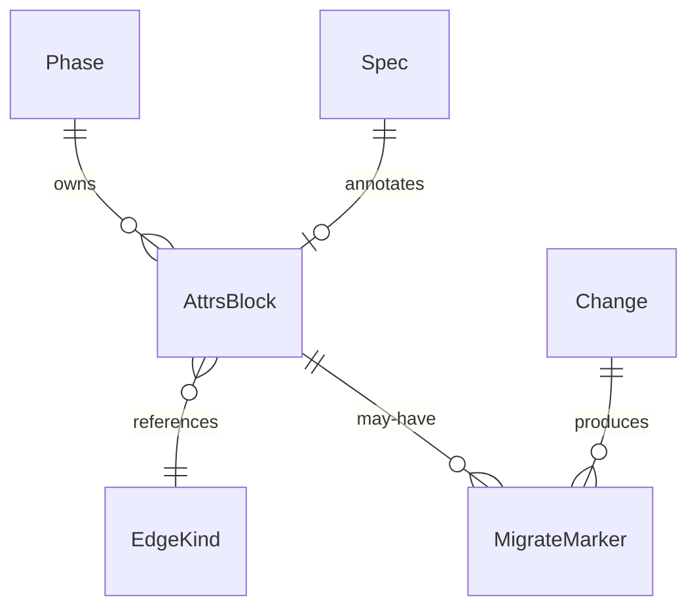
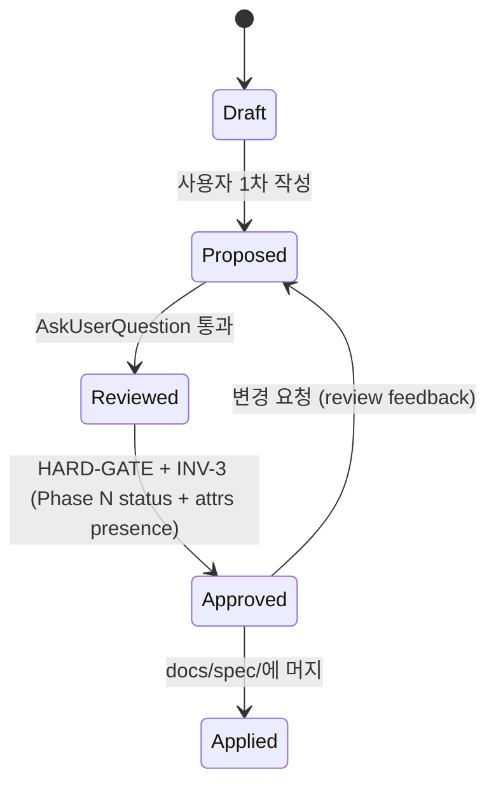
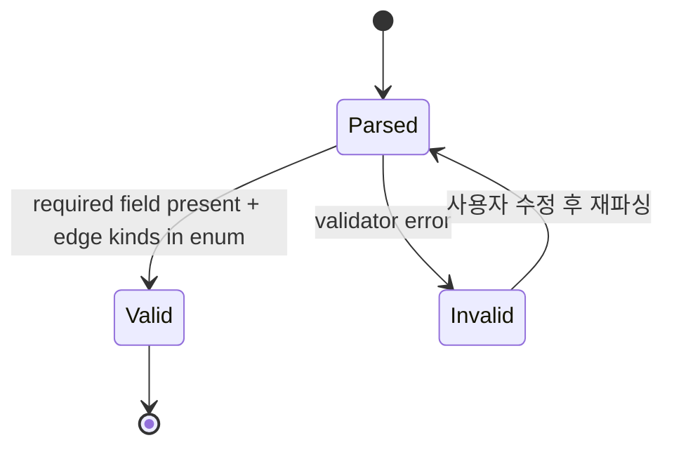
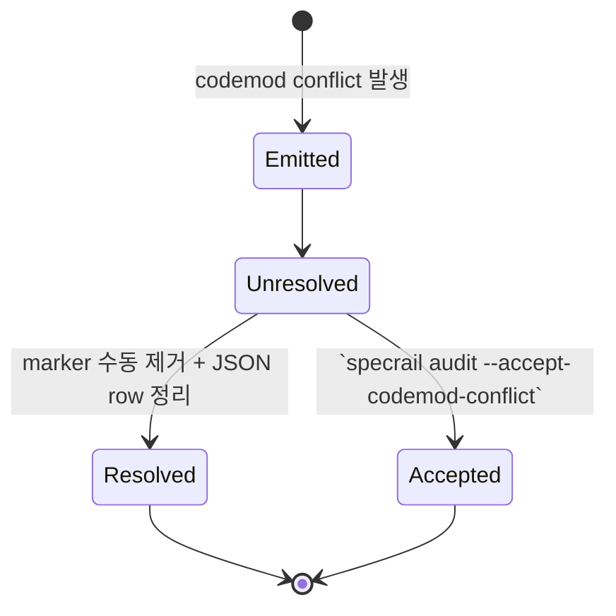

# Phase 4 DELTA: Domain Model changes for `core-schema-attrs`

> Strategy: `../proposal.md`. Phase 1·2·3 delta upstream.

---

## 0. Provenance & Mode

| Field | Value |
|---|---|
| Mode (re-confirmed) | **SCOPE EXPANSION** |
| Cognitive Patterns 활성화 | Edge case paranoia (Phase 4) — orphan AttrsBlock? Duplicate entity-id? Stale state-machine 전이? |
| 자체 리뷰 면책 | verifier lane 예정. |

---

## 1. Why (Phase 4 specific)

3 변경:

1. **신규 ENT 3개** — `AttrsBlock`·`EdgeKind`·`MigrateMarker`. R-CSA를 domain model에 anchor. dashboard·schema·validator·codemod 모두 이 3 entity를 share.
2. **INV-3 확장** — Phase N+1 진입 시 Phase N status=Approved (current)에 *"모든 first-class entity attrs presence"* 추가. HARD-GATE 강화.
3. **신규 INV-11·INV-12** — edge kind closed enum 강제 · review-required marker = always ERROR. (INV-10은 live spec `04-domain-model.md:403`에 이미 정의(pre-commit hook 보존) — 충돌 회피로 INV-11·INV-12 할당.)
4. **ER diagram update** — 3 신규 entity와 기존 ENT-Phase·ENT-Spec·ENT-DependencyGraph의 관계.

---

## 2. What Changes

### 2.1 ADDED Entities

#### ENT-AttrsBlock

```markdown
### ENT-AttrsBlock

**Description:** first-class entity 정의 heading 직후 부착된 fenced YAML attribute payload. R-CSA의 normative manifestation.
**Aggregate root:** No (entity-종속, owning entity = aggregate)
**Source spec:** R-CSA, F-R-CSA.1

| Name | Type | Required | Source | 설명 |
|---|---|---|---|---|
| `entityId` | string | yes | F-R-CSA.1 parser | 소유 entity ID (heading match) |
| `entityKind` | enum | yes | proposal §5 | 21 entity 종류 중 하나 |
| `payload` | object | yes | YAML | required·optional field per kind |
| `linePositionFile` | string + line range | yes | `src/markdown/attrs.ts` | source 위치 |
| `validationErrors` | list | derived | validator | required field 누락·unknown kind 등 |
```
<!-- specrail:attrs id=ENT-AttrsBlock -->
```yaml
status: Approved
aggregate-root: false
linked-r: [R-CSA]
state-machine: SM-AttrsBlock
last-modified: 2026-05-15
```
<!-- /specrail:attrs -->

#### ENT-EdgeKind

```markdown
### ENT-EdgeKind

**Description:** closed enum 8 typed edge kind. OQ-CSA-5 resolution의 first-class entity화. dashboard switch statement 대상.
**Aggregate root:** No
**Source spec:** R-CSA, F-R-CSA.2 (`schemas/edge-kinds.schema.json`)

| Name | Type | Required | Source | 설명 |
|---|---|---|---|---|
| `kind` | enum-of-8 | yes | proposal §3.4 | `solves`·`linked-features`·`parent`·`tested-by`·`covers-ac`·`mitigates`·`linked-arch`·`depends-on` |
| `sourceEntities` | list | yes | §3.4 표 | 발행 가능 entity 종류 |
| `targetEntities` | list | yes | §3.4 표 | 타겟 entity 종류 |
| `yamlField` | string | yes | §3.4 표 | YAML field 명 (plural-noun) |
| `schemaVersion` | semver | yes | EXT-{N} (Phase 8) | v1.0 frozen |
```
<!-- specrail:attrs id=ENT-EdgeKind -->
```yaml
status: Approved
aggregate-root: false
linked-r: [R-CSA]
linked-features: [F-R-CSA.2]
last-modified: 2026-05-15
```
<!-- /specrail:attrs -->

#### ENT-MigrateMarker

```markdown
### ENT-MigrateMarker

**Description:** codemod이 ambiguous transform에서 발행한 in-band marker + `.specrail/migrate-report.json` row. OQ-CSA-10 resolution의 entity화.
**Aggregate root:** Yes
**Source spec:** R-CSA, F-R-CSA.4

| Name | Type | Required | Source | 설명 |
|---|---|---|---|---|
| `file` | string | yes | codemod | 적용 file path |
| `line` | int | yes | codemod | marker 부착 line |
| `entityId` | string | yes | codemod | 적용 entity ID |
| `reason` | enum | yes | codemod | `yaml-conflict` · `ambiguous-id-mapping` · `partial-cross-ref` |
| `resolvedBy` | string optional | optional | user action | 해소 시 actor 기록 |
| `ts` | ISO 8601 | yes | codemod | 발행 시각 |
```
<!-- specrail:attrs id=ENT-MigrateMarker -->
```yaml
status: Approved
aggregate-root: true
linked-r: [R-CSA]
linked-features: [F-R-CSA.4]
state-machine: SM-MigrateMarker
last-modified: 2026-05-15
```
<!-- /specrail:attrs -->

### 2.2 MODIFIED Existing ENTs — codemod-generated attrs (documented contract)

> **Approach:** 11 기존 ENT에 attrs block 일괄 부착. T-CSA.5 codemod step `--phase=4 --tier=ENT`가 본 절의 **template + parameter table**을 oracle로 사용.

#### 2.2.1 ENT-tier attrs template

```yaml
status: Approved
aggregate-root: <bool>     # parameter
linked-r: [<R IDs>]         # parameter (scalar metadata per proposal §5; not §3.4 typed edge)
state-machine: <SM ID>      # parameter (scalar reference)
last-modified: 2026-05-15
```

> **`linked-r` semantics (verifier 지적 해소):** proposal §5는 ENT-* optional field `linked-r`을 *scalar metadata* (entity가 어떤 R를 serve하는지 provenance)로 정의. §3.4 closed enum의 typed edge 아님. validator는 `linked-r`을 unknown-kind ERROR 발생시키지 않고 scalar pass-through. dashboard는 별 query path로 reverse-index 가능.

#### 2.2.2 ENT-tier parameter table

| Entity (`04-domain-model.md`) | aggregate-root | linked-r | state-machine |
|---|---|---|---|
| `ENT-Project:14` | true | `[R6]` | — |
| `ENT-Phase:27` | false | `[R1]` | SM-Phase-Lifecycle |
| `ENT-Spec:43` | false | `[R1]` | SM-Spec-Status |
| `ENT-AcceptanceCriteria:60` | false | `[R1]` | — |
| `ENT-DependencyGraph:74` | true | `[R4]` | — |
| `ENT-Hook:101` | false | `[R2]` | SM-Hook |
| `ENT-Change:115` | true | `[R4]` | SM-Change-Lifecycle |
| `ENT-Skill:134` | false | `[R5]` | — |
| `ENT-Subagent:149` | false | `[R8]` | SM-Subagent |
| `ENT-TelemetryEvent:163` | false | `[R13]` | — |
| `ENT-TelemetryConsent:178` | true | `[R13]` | SM-Consent |

머지 시 codemod이 각 entity heading 직후 위 parameter로 채워진 attrs block 부착. T-CSA.5 RED test가 본 표를 expected output으로 검증.

### 2.3 MODIFIED INV-3 — attrs presence 추가

**Before** (`04-domain-model.md:359`):
```markdown
### INV-3: Phase N+1 진입 시 Phase N status=Approved
```

**After:**
```markdown
### INV-3: Phase N+1 진입 시 Phase N status=Approved + 모든 first-class entity attrs presence

기존 transition gate에 추가 조건: Phase N의 모든 first-class entity (R·F·S·ENT·INV·NFR·ARCH·EXT·OPS·ADR·RISK·TC·EDGE·OQ·KPI·T·PERSONA·SCEN·JNY·ZN·P-CC)가 valid attrs block 보유. 누락 시 state machine reject.

v0.1.0~v0.3.0 dual-parse window 동안에는 lint WARN으로 surface하되 transition gate는 v0.4.0부터 enforce (proposal §3.2와 동기화).
```

attrs block:
```yaml
# INV-3
status: Approved
applies-to: [ENT-Phase, ENT-AttrsBlock, R-CSA]
last-modified: 2026-05-15
```

### 2.4 ADDED INV-11·INV-12 (INV-10 collision 회피)

> Live `04-domain-model.md:403`이 `INV-10: 기존 사용자 pre-commit hook 보존` 보유. INV-11 미정의 확인됨. 본 delta는 INV-11·INV-12 할당. (verifier batch-checkpoint 지적 해소.)
>
> **머지 시 wrapper form 의무 (verifier 후속 지적):** 본 절의 INV-11·INV-12 attrs는 documentation 목적의 *content 표시*. 머지 시 codemod이 각 INV heading 직후에 canonical `<!-- specrail:attrs id=INV-11 -->` ... `<!-- /specrail:attrs -->` wrapper로 감싸서 부착. bare YAML 직접 게재 금지 (proposal §3.1 컨벤션 일관).

```markdown
### INV-11: Edge kind는 closed enum 8 안 (OQ-CSA-5)
모든 typed edge의 `kind` field는 `schemas/edge-kinds.schema.json`의 v1.0 enum 8개 중 하나. unknown kind = validator ERROR. 추가는 ADR 경유 minor schema-version bump.
```
```yaml
# INV-11
status: Approved
applies-to: [ENT-EdgeKind, ENT-AttrsBlock]
last-modified: 2026-05-15
```

```markdown
### INV-12: review-required marker = always ERROR (OQ-CSA-10)
`<!-- specrail:attrs-review-required -->` marker가 존재하는 file은 lint level WARN window 무관 ERROR. 해소 = marker 제거 또는 `specrail audit --accept-codemod-conflict`.
```
```yaml
# INV-12
status: Approved
applies-to: [ENT-MigrateMarker]
last-modified: 2026-05-15
```

### 2.5 MODIFIED ER Diagram — 3 신규 ENT 관계 추가

기존 mermaid `erDiagram`(`docs/spec/04-domain-model.md:193-229`)에 추가. **Entity 명명 unprefixed (live spec 일관)** — `Phase`·`Spec`·`Change` 형식 (`ENT-` prefix는 markdown heading용, mermaid 안에서는 short name).



머지 시 `docs/spec/04-domain-model.md:193` erDiagram block에 위 5 line append. 기존 entity 명명(`Project`·`Phase`·`Spec`·`Change`·`DependencyGraph`·`Hook`·`Subagent`·`TelemetryConsent`·`TelemetryEvent`·`AcceptanceCriteria`)와 형식 일치.

### 2.6 MODIFIED SM-Phase-Lifecycle — attrs presence transition condition

```markdown
### SM-Phase-Lifecycle (MODIFIED)
```

기존 5 state (Draft → Proposed → Reviewed → Approved → Applied) 그대로. Approved 전환 조건에 *attrs presence check* 추가 (INV-3 확장과 평행).



attrs presence가 v0.1.0~v0.3.0에는 WARN으로 surface하되 v0.4.0부터 reject.

### 2.7 ADDED SM-AttrsBlock + SM-MigrateMarker





---

## 3. Impact (Phase 4 차원)

| 차원 | 변화 |
|---|---|
| 신규 ENT | 3 (AttrsBlock·EdgeKind·MigrateMarker) |
| 기존 ENT attrs 부착 | 11 (mechanical codemod) |
| INV 신규 | INV-11·INV-12 (2) — INV-10 collision 회피 |
| INV 수정 | INV-3 (attrs presence 추가) |
| SM 신규 | SM-AttrsBlock·SM-MigrateMarker (2) |
| SM 수정 | SM-Phase-Lifecycle (transition condition) |
| ER diagram | 5 신규 관계 |
| 기존 entity 의미 | 0 변경 |

---

## 4. Open Questions (Phase 4 차원)

**OQ-4-CSA-1 (Non-Blocking):** `JNY-{scen}.{step}` dotted form을 INV에 어떻게 명시? `INV-13: JNY-N.M pattern은 SCEN-N과 1:N 관계` 추가? 또는 SM-Journey로 분리? — 결정자: maintainer. 마감: Phase 5 delta 시작 전. (INV-11·INV-12는 본 delta가 할당, INV-13이 다음 가용 슬롯.)

---

## 5. Self-Check (Phase 4 DELTA용)

| Check | 결과 |
|---|---|
| 신규 ENT 3개 attrs block 부착 | ✓ |
| INV-3 transition gate clause 명시 | ✓ "v0.1.0~v0.3.0 WARN, v0.4.0부터 reject" (PRD §12와 동기화) |
| INV-11·INV-12 명시 enum/marker rule (INV-10 collision 회피 확인) | ✓ — live spec INV-11 미정의 확인 (`grep ^### INV-11 04-domain-model.md` empty) |
| ER diagram mermaid valid | ✓ |
| SM 다이어그램 2 신규 + 1 수정 = 3 mermaid block 추가 | ✓ |
| `grep -iE "TBD\|TODO\|implement later"` | 0 |
| Mode tag | SCOPE EXPANSION 단일 |
| dogfood | ✓ ENT-AttrsBlock 자체에 attrs block 부착 (재귀 dogfood) |
| Cross-ref — ENT-MigrateMarker가 ENT-Change 인용 | ✓ ER diagram에 명시 |

---

## 6. Lifecycle

```
Phase 4 delta: Proposed
  ↓ verifier lane checkpoint (3·4·5 batch)
Approved
  ↓
다음 → Phase 5 delta (User Flow — FLN/FLE rename)
```
