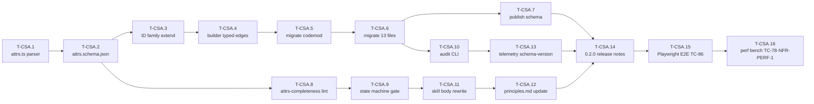

# Phase 13 DELTA: Implementation Plan changes for `core-schema-attrs`

> Strategy: `../proposal.md`. Phase 1~12 Approved/in batch.

---

## 0. Provenance & Mode

| Field | Value |
|---|---|
| Mode | **SCOPE EXPANSION** |
| Milestone ordering (RISK-CSA-7 mitigation) | M-CSA은 core milestone M0~M11 종료 후 시작 — plugin shipping 일정 보호. |
| 자체 리뷰 면책 | verifier final checkpoint 예정. tasks.md 동반 생성. |

---

## 1. Why (Phase 13 specific)

proposal §8 M-CSA milestone과 T-CSA.1~16 task를 implementation-ready 형식으로 등재. R-CSA · AC-R-CSA-* · NFR-CSA-* · TC-78~87 · EDGE-26~37 모두 task에 매핑 의무 (INV-3 + Phase 13 skill body §1 RED-first).

---

## 2. What Changes

### 2.1 ADDED Milestone M-CSA

```markdown
### M-CSA: Core Schema Attrs Migration

**Goal:** specrail/core markdown attribute layer를 product-grade dashboard data source로 격상.
**Ordered after:** M0~M11 (core shipping 일정 보호 — RISK-CSA-7).
**Duration estimate:** ~43h net (proposal §8 hours total). 검토·논의 제외.
**Exit criteria:** AC-R-CSA-1~7 all green · NFR-CSA-PERF-1~3 all green · TC-78~87 all green · `specrail audit` reports KPI-7 ≥ 100% on dogfood spec.
```

<!-- specrail:attrs id=M-CSA -->
```yaml
status: Approved
ordered-after: ["M11"]
duration-estimate-hours: 43
exit-criteria: ["AC-R-CSA-1..7 green", "NFR-CSA-PERF-1..3 green", "TC-78~87 green", "KPI-7 ≥ 100%"]
linked-r: [R-CSA]
last-modified: 2026-05-15
```
<!-- /specrail:attrs -->

### 2.2 ADDED T-CSA.1~16 (proposal §8 expansion)



| Task | Subject | RED test | linked-ac | linked-tc | Hours |
|---|---|---|---|---|---|
| T-CSA.1 | `src/markdown/attrs.ts` parser | TC-78 (valid block · invalid YAML · orphan id · duplicate id) | AC-R-CSA-2 | TC-78 | 3 |
| T-CSA.2 | `schemas/attrs.schema.json` + `schemas/edge-kinds.schema.json` | TC-79 (ajv 21 entity type validation) | AC-R-CSA-2, AC-R-CSA-4 | TC-79 | 4 |
| T-CSA.3 | `src/spec/patterns.ts` extend — `R-[A-Z]+`·`F-R-[A-Z]+\.\d+`·`AC-R-[A-Z]+-\d+`·`FLN-\d+`·`FLE-\d+`·`PERSONA-\d+`·`SCEN-\d+`·`JNY-\d+\.\d+`·`ZN-[A-Z0-9-]+-\d+`·`E-CC-\d+`·`P-CC-\d+` | regex test — 모든 신규 family 매치 | — | TC-79 (validator side) | 3 |
| T-CSA.4 | `src/graph/builder.ts` typed edges from `linked-*` field | TC-80 (typed edge kind preserved · source-target invariant) | — | TC-80 | 3 |
| T-CSA.5 | `bin/specrail-migrate.ts` codemod | TC-81 (idempotency 0-byte diff on re-run) + TC-82 (conflict marker emit) | AC-R-CSA-5, AC-R-CSA-7 | TC-81, TC-82 | 5 |
| T-CSA.6 | Codemod 13 spec file 실행 + manual review + git diff | TC-86 (full-chain e2e on dogfood) | AC-R-CSA-1~7 | TC-86 | 6 |
| T-CSA.7 | Publish `schemas/attrs.schema.json` (npm + GH raw URL) | OPS-CSA-1 acceptance (CI npm pack + curl GH 검증) | — | — | 2 |
| T-CSA.8 | `src/lint/attrs-completeness.ts` + `attrs-placement.ts` + `run-all.ts` 통합 | TC-83 (required field missing) + TC-84 (placement invariant) | AC-R-CSA-1, AC-R-CSA-3, AC-R-CSA-6 | TC-83, TC-84 | 3 |
| T-CSA.9 | `src/state/machine.ts` transition gate update (INV-3 확장) | TC-85 (transition reject 시 attrs presence 부재) | AC-R-CSA-1 | TC-85 | 2 |
| T-CSA.10 | `bin/specrail-audit.ts` CLI | manual smoke test (output format markdown vs JSON — OQ-CSA-6 결정 후) | — | — | 4 |
| T-CSA.11 | 13 phase `skills/phase-NN-*/SKILL.md` 본문에 attrs block 작성 단계 추가 | grep test: 각 skill body에 `<!-- specrail:attrs` 예시 1+ | — | — | 4 |
| T-CSA.12 | `skills/_common/principles.md` §"Attrs Blocks Are Mandatory" 추가 | grep test | — | — | 1 |
| T-CSA.13 | Telemetry payload에 `schema-version` key 추가 (OPS-5 modification) | TC-87 (semver-only PII-detector) | — | TC-87 | 1 |
| T-CSA.14 | 0.2.0 release notes + CHANGELOG + version bump (OQ-CSA-7 Resolved: 0.1.0 = M0~M11 only, 0.2.0 = M-CSA) | npm pack dry-run · semver lint | — | — | 2 |
| T-CSA.15 | Playwright E2E (TC-86) full chain on copied dogfood spec | TC-86 green | AC-R-CSA-1~7 | TC-86 | (T-CSA.6에 포함) |
| T-CSA.16 | Perf bench (NFR-CSA-PERF-1·2·3) | TC-78·TC-79·TC-81 perf assertion | — | TC-78, 79, 81 | (split out from T-CSA.1·2·5) |
| **Total** | | | | | **~43h** |

> **Mermaid vs `depends-on` 정정 (verifier 지적):** §2.2 mermaid의 edge는 *conservative build order* (직렬 권장). `T-CSA.* depends-on` field는 *strict blocker* (병렬 가능 task 식별). 두 view 차이 — implementing lane은 strict blocker 기준으로 parallelism 활용 가능 (예: T-CSA.7과 T-CSA.8은 T-CSA.2 직후 병렬). mermaid는 시각화 우선, depends-on은 정합 source.

### 2.3 T-CSA.* attrs blocks — codemod scaffolding (oracle = §2.2 표)

T-CSA-tier attrs template:

```yaml
status: Approved        # all M-CSA tasks: Approved at delta merge
milestone: M-CSA
red-test: <TC ID>       # parameter
commit-msg-stub: "<type>(scope): <subject>"   # parameter
linked-ac: [...]         # parameter
linked-tc: [...]         # parameter
depends-on: [...]        # parameter — dependency graph row
last-modified: 2026-05-15
```

T-CSA.1 example:

<!-- specrail:attrs id=T-CSA.1 -->
```yaml
status: Approved
milestone: M-CSA
red-test: TC-78
commit-msg-stub: "feat(markdown): add attrs block parser (T-CSA.1)"
linked-ac: [AC-R-CSA-2]
linked-tc: [TC-78]
depends-on: []
last-modified: 2026-05-15
```
<!-- /specrail:attrs -->

(T-CSA.2~16 동형 — codemod scaffolding from §2.2 표.)

### 2.4 MODIFIED 기존 T-tasks — codemod attrs

T-tier attrs template (기존 T0.x~T11.x):

```yaml
status: <existing>
milestone: <M0~M11>
red-test: <existing>
commit-msg-stub: <existing>
linked-ac: [...]
linked-tc: [...]
depends-on: [...]
last-modified: 2026-05-15
```

codemod이 §M-x milestone subsection의 표를 oracle로 attrs scaffolding (row-based, Phase 9·10·11·12 동형).

### 2.5 ADDED §14 신설: Coverage matrix

```markdown
## 14. R-CSA × T-CSA Coverage Matrix (DELTA core-schema-attrs)

| AC-R-CSA | T-CSA mapping |
|---|---|
| AC-R-CSA-1 (transition gate reject) | T-CSA.8 (lint) + T-CSA.9 (state machine) |
| AC-R-CSA-2 (id mismatch lint) | T-CSA.1 (parser) + T-CSA.2 (schema) + T-CSA.8 (lint) |
| AC-R-CSA-3 (placement invariant) | T-CSA.8 (attrs-placement.ts) |
| AC-R-CSA-4 (unknown kind ERROR) | T-CSA.2 (edge-kinds.schema.json) + T-CSA.4 (builder) |
| AC-R-CSA-5 (review marker always ERROR) | T-CSA.5 (codemod marker emit) + T-CSA.8 (lint) |
| AC-R-CSA-6 (WARN→ERROR transition v0.4.0) | T-CSA.8 (version-aware lint) + T-CSA.14 (release versioning) |
| AC-R-CSA-7 (codemod idempotency) | T-CSA.5 (codemod design) + T-CSA.6 (13 file 실행) |

| NFR-CSA | T-CSA mapping |
|---|---|
| NFR-CSA-PERF-1 (parser 50ms) | T-CSA.1 + T-CSA.16 perf bench |
| NFR-CSA-PERF-2 (validator 500ms) | T-CSA.2 + T-CSA.16 perf bench |
| NFR-CSA-PERF-3 (codemod 0-byte) | T-CSA.5 + T-CSA.16 perf bench |
| NFR-CSA-AVAIL-1 (schema fetch SLO) | T-CSA.7 publish + 외부 측정 |
| NFR-CSA-SEC-1 (schema integrity) | T-CSA.14 git tag signing |
| NFR-CSA-PRIV-1 (semver-only) | T-CSA.13 telemetry payload |
| NFR-CSA-A11Y-1 (CLI colour-blind) | T-CSA.10 audit CLI |
```

### 2.6 ADDED §15 신설: tasks.md generation

```markdown
## 15. tasks.md generation (DELTA core-schema-attrs)

별도 file `docs/spec/changes/2026-05-15-core-schema-attrs/tasks.md` 생성 — Phase 13 본 delta가 normative source, tasks.md는 implementing lane이 사용할 actionable expansion.

각 T-CSA.* task는 tasks.md에 다음 형식:

```text
## T-CSA.{N}: {subject}
**Status:** Pending
**RED test:** {TC ID} ({file path})
**Files to create/modify:**
- {path 1}
- {path 2}
**Steps:**
1. RED — write {TC ID} test
2. Run pytest/vitest — verify RED
3. GREEN — minimal impl
4. Run test — verify GREEN
5. REFACTOR — clean up
6. Commit: {commit-msg-stub}
```

본 generation은 Phase 13 delta Approved 후 final-batch verifier에서 별 step으로.
```

---

## 3. Impact (Phase 13 차원)

| 차원 | 변화 |
|---|---|
| 신규 milestone | M-CSA (1) |
| 신규 task | T-CSA.1~16 (16) |
| 기존 T-tasks attrs | 모든 T0.x~T11.x (codemod) |
| §14 신설 | Coverage matrix (AC + NFR × T-CSA) |
| §15 신설 | tasks.md generation contract |
| Mermaid | 1 (dependency graph) |

---

## 4. Open Questions (Phase 13 차원)

**OQ-13-CSA-1 (Non-Blocking):** T-CSA.6 (codemod 13 spec file 실행)이 conflict marker 발견 시 — 각 conflict 수동 해소 후 commit vs batch commit? 결정자: maintainer. 마감: T-CSA.6 실행 시점.

---

## 5. Self-Check (Phase 13 DELTA용)

| Check | 결과 |
|---|---|
| M-CSA + T-CSA.1~16 ID 충돌 | ✓ live max T11.7, M-CSA suffix distinct |
| Dependency graph mermaid valid + 16 task | ✓ §2.2 |
| 모든 T-CSA red-test field 명시 | ✓ §2.2 표 (T-CSA.7·10·11·12·14는 "—" 또는 CI/smoke test으로 명시 — RED test는 unit/integ TC, infrastructure task는 CI gate) |
| AC ↔ T-CSA coverage matrix | ✓ §2.5 — AC-R-CSA-1~7 모두 ≥ 1 T mapping |
| NFR ↔ T-CSA coverage matrix | ✓ §2.5 — NFR-CSA 7개 모두 mapping (외부 측정 명시 포함) |
| principles §13 ETHOS Boil the Lake | ✓ 16 task 단일 milestone — follow-up PR 없음 |
| Edge kind enum compliance | ✓ `linked-ac`·`linked-tc`·`depends-on` 모두 proposal §5 T-N row required/optional (`depends-on`은 closed enum kind, source = T, target = T → enum compliant) |
| `grep -iE "TBD\|TODO\|implement later"` | 0 |
| Mode tag | SCOPE EXPANSION 단일 |
| Mermaid graph (Phase 13 mandatory per principles §Diagrams) | ✓ §2.2 dependency graph |

---

## 6. Lifecycle

```
Phase 13 delta: Proposed
  ↓ verifier final batch checkpoint (12·13)
Approved (final)
  ↓
tasks.md generation
  ↓ verifier sign-off
Implementing 단계 진입 가능 (T-CSA.1 RED test 작성 시작)
```
