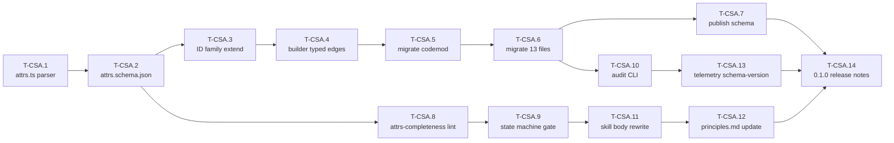
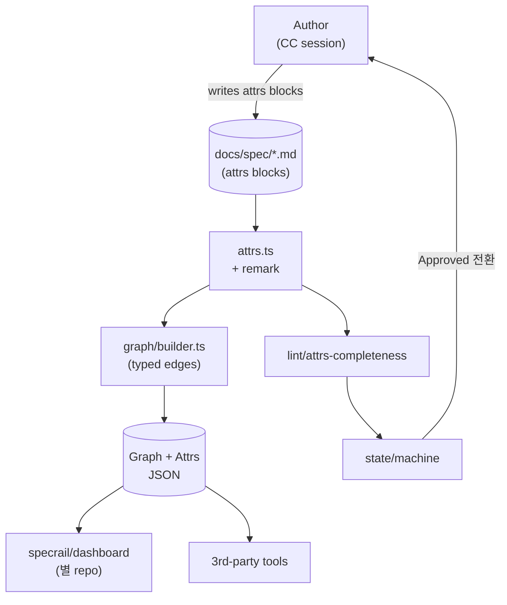

# DELTA Proposal: core-schema-attrs

> Status: **Proposed**. 본 문서는 사용자 Review · HARD-GATE 통과 전 산출물.
> Anti-shortcut Clause 준수 — 5 결정을 AskUserQuestion으로 순차 잠금 후 작성 (Mode·Audit scope·Audit verdict 수용·Direction·Migration mode).

---

## 0. 한 줄

specrail/core의 markdown을 product-grade dashboard data source로 격상하기 위해 **per-entity attribute schema(`<!-- specrail:attrs -->` + fenced YAML)** + **User-flow ID rename** + **Persona·Scenario ID family** + **plugin builder/skills/validator 통합 확장**을 도입. PRD §10(dashboard 별 cycle = 별 repo `specrail/dashboard`)은 그대로 유지.

---

## 1. Context

### 1.1 Trigger 체인

1. 2026-05-15 — `spec-visualizer` proposal: webapp 통합 시도, 보류 (`docs/spec/changes/archive/2026-05-15-spec-visualizer/`).
2. 2026-05-15 — 사용자 재요청: 별 repo `specrail/dashboard` (product-grade webapp, manyfast.io 급). 기존 markdown이 데이터 source로 충분한지 audit 요청.
3. 2026-05-15 — Full audit 산출: `docs/research/2026-05-15-markdown-audit.md` (663 lines).
   - Verdict: ID layer 95% / attribute layer 45-55%.
   - Top 3 blocker: (a) user-flow `N-001`·`E-1` regex 불통과 → graph view 불가, (b) entity 속성이 prose에 묻힘 → filter 불가, (c) Persona·Scenario ID family 부재 → end-to-end traceability 끊김.
   - 단일 schema (`<!-- specrail:attrs -->` + per-entity YAML)로 top 10 gap 중 8개 해결, ~15h.
4. 2026-05-15 — Direction 결정: "Core schema 먼저 안정화". Mode 결정: **SCOPE EXPANSION**.

### 1.2 잠금된 선행 결정

| ID | 결정 | 값 |
|---|---|---|
| D-1 | Audit 범위 | Full audit (13 phase × dashboard data 매핑) |
| D-2 | Audit verdict 수용 | Yes — 45-55% 평가·top 3 blocker 채택 |
| D-3 | Direction | Core schema 먼저 안정화, dashboard repo는 후속 |
| D-4 | Repo layout | Multi-repo (`specrail/core` 본 plugin · `specrail/dashboard` 별 product) — PRD §10 유지 |
| D-5 | Mode (본 proposal) | SCOPE EXPANSION — schema + data contract + skill body + validator + migration tool + telemetry 통합 |

### 1.3 Mode = SCOPE EXPANSION 근거

SCOPE EXPANSION의 정의("2x 노력으로 10x 더 좋아지는 것은?")가 본 작업에 부합. 최소 ~15h audit 권장 작업만 하면 markdown은 product-grade 80%로 가지만 *권위 있는 contract*가 plugin 차원에 없어 dashboard·third-party 도구가 임의 해석. +25h를 더 쓰면:

- plugin이 attrs schema를 **lint·validator·state machine으로 강제** → 사용자가 자기 spec을 쓸 때부터 product-grade 데이터로 만들어짐.
- skill bodies가 새 컨벤션을 **teach** → 사용자가 처음부터 attrs blocks를 작성.
- `specrail/dashboard`가 read하는 **JSON schema published as contract** → repo 분리하면서도 강한 결합 유지.
- migration codemod (`specrail migrate`) → 기존 사용자 spec auto-rewrite.
- audit CLI (`specrail audit`) → 사용자가 자기 spec의 product-grade-readiness를 self-measure.

총 ~30-40h. plugin core를 한 단계 product로 격상.

### 1.4 거절된 대안

| 대안 | 거절 이유 |
|---|---|
| HOLD SCOPE (~15h, schema only) | data contract·migration tool·skill teach 빠지면 사용자 spec 품질이 plugin-uncontrolled. 거절. |
| SELECTIVE EXPANSION | top blocker가 cherry-pick 가능한 독립 단위 아님 (attrs schema가 다른 모든 fix의 enabler). 거절. |
| SCOPE REDUCTION (~1h, N/E rename만) | product-grade 목표 포기. D-4 multi-repo 결정과 부조화. 거절. |
| Schema 도입 + dashboard repo 동시 설계 | Audit가 dashboard 시작 전 schema 안정화 권장. 동시 시작 시 schema 변경→dashboard 재작업 loop. 거절. |

---

## 2. New Capability: `core-schema-attrs`

| Field | Value |
|---|---|
| Capability ID | `core-schema-attrs` (kebab-case, principles §DELTA Capability scoping) |
| Surface | specrail/core repo (이 repo). dashboard repo는 본 proposal scope 아님. |
| Authoring impact | 모든 신규 phase 산출물은 attrs block 작성 강제. 기존 13 spec file은 codemod로 일괄 migration. |
| Plugin code impact | `src/spec/`, `src/graph/`, `src/markdown/`, `src/lint/`, `src/state/`, `src/schema/`, `schemas/`, `skills/`, `tests/` 전반. |
| Public artifact | `schemas/attrs.schema.json` (JSON Schema of attrs block, dashboard·third-party가 import) + `specrail audit` CLI + `specrail migrate` CLI. |
| Version | M-CSA ships in **0.2.0** (OQ-CSA-7 Resolved 2026-05-15 — 0.1.0 = M0~M11 only, schema migration deferred). pre-1.0이므로 minor bump. principles §3 ETHOS Speed calibration: two-way door, 적극. |

---

## 3. `<!-- specrail:attrs -->` 컨벤션

기존 marker family(`specrail:deftable`, `specrail:def-list`, `specrail:ignore-*`)와 동형. 한 entity 정의 직후 fenced YAML.

### 3.1 형식

```markdown
### R3: 사용자가 PR 검토 시 우선순위가 명확해야 함

<!-- specrail:attrs id=R3 -->
```yaml
status: Approved
importance: P0
owner: PERSONA-1
solves-pains: [PAIN-3, PAIN-7]
linked-features: [F-R3.1, F-R3.2]
linked-tests: [TC-12, TC-13]
mode: HOLD
since: 2026-05-12
last-modified: 2026-05-14
```
<!-- /specrail:attrs -->

(기존 본문 prose는 그대로 유지)
```

### 3.2 규칙

- **ID 일치 의무:** `id=R3` ↔ heading의 `R3` 일치 안 하면 validator REJECT.
- **위치 (invariant, OQ-CSA-1 resolved):** entity 정의 heading 직후, **prose 이전, next-block adjacency**. table cell 안의 entity는 cell 내부 첫 줄. 다른 위치 placement 시 **lint ERROR** (warning 아님 — heading-immediate가 parser·grep·drift 모두에서 load-bearing).
- **Required key per entity 종류:** (§5 Schema 표 참조)
- **List-valued field에는 typed edge가 생성됨** — `solves-pains: [PAIN-3]`은 `R3 → PAIN-3` edge with `kind: solves` (YAML field는 plural-noun, edge kind는 §3.4 closed enum의 singular-verb). 현재 builder는 plain mention 기반 edge만 — 명시 typed edge가 dashboard에 결정적.
- **Backward compat (deprecation window, OQ-CSA-3 resolved):** plugin v0.2.0 ~ v0.4.0 동안 attrs 없는 entity는 status `legacy` 로 인식, lint **WARN**. WARN 메시지는 `specrail migrate --fix` 제안 포함 의무. v0.5.0부터 **ERROR**. (§4.3 legacy ID dual-parse window와 동기화 — 둘 다 v0.5.0 ERROR cut.)
- **Codemod review-required marker는 항상 ERROR (OQ-CSA-10 resolved):** `<!-- specrail:attrs-review-required reason="..." -->`는 WARN window 무관 즉시 ERROR. 사용자가 attrs 보정 + marker 제거 또는 `specrail audit --accept-codemod-conflict` 로만 해소.

### 3.3 Schema (`schemas/attrs.schema.json`)

JSON Schema draft 2020-12. dashboard·third-party는 npm `specrail` 또는 raw GitHub URL로 import. (T-CSA.7 참조.)

### 3.4 Edge kind enum — closed, frozen at schema-version v1.0 (first published at plugin 0.2.0, OQ-CSA-5 resolved)

YAML field는 plural-noun (authoring ergonomics), edge kind는 singular-verb. 둘은 의도된 별도 register. 추가는 ADR 경유 minor schema-version bump (1.0 → 1.1) + codemod.

| kind | source entity | target entity | YAML field 예시 | 의미 |
|---|---|---|---|---|
| `solves` | R, F, S | PAIN | `solves-pains: [PAIN-3]` | requirement가 pain을 해결 |
| `linked-features` | R | F | `linked-features: [F-R3.1]` | parent → child feature 분해 |
| `parent` | F, S, T | R, F, T | `parent-r: R3` | upward 계층 |
| `tested-by` | R, F, S, AC, INV, NFR | TC, EDGE | `linked-tests: [TC-12]` | coverage edge (YAML field uses plural-noun pattern `linked-tests`, matching `linked-features`·`linked-arch` style; edge kind은 singular-verb `tested-by`) |
| `covers-ac` | TC | AC | `covers-ac: [AC-R1-1]` | tested-by 역방향 (TC 측 authored) |
| `mitigates` | OPS, ARCH, RB | RISK, NFR | `mitigates-risks: [RISK-3]` | risk·NFR mitigation |
| `linked-arch` | R, F, NFR, EXT | ARCH | `linked-arch: [ARCH-2]` | requirement·NFR → architecture |
| `depends-on` | T, ARCH, OPS | T, ARCH, OPS, EXT | `depends-on: [T-CSA.2]` | execution·runtime dependency |

Unknown kind = validator ERROR.

---

## 4. ID family 확장

### 4.1 신규 ID family (OQ-CSA-8 resolved: full-stem `PERSONA-N`)

| Family | Pattern | 적용 phase | 근거 |
|---|---|---|---|
| `PERSONA-N` | `PERSONA-\d+` | Phase 2 | audit §Phase 2 — "Builder"가 prose에 묻힘, ID 부재. `PER-N` (3-char) 거절: "per"는 stem 아님, 모호. `PERSONA-`가 `ARCH-/RISK-/PAIN-` family와 일관. |
| `SCEN-N` | `SCEN-\d+` | Phase 1·2·5 | audit §Phase 1 — `S1`/`S2`/`S3`가 S-tier 3-part regex와 충돌, 현재 silently 무시 |
| `JNY-N` | `JNY-\d+` | Phase 2 | Journey step. 현재 prose 번호 매김. dashboard "step-by-step viewer" 데이터 |
| `ZN-{page}-N` | `ZN-[A-Z0-9-]+-\d+` | Phase 7 | Wireframe zone hotspot. P-CC-1 페이지의 zone N → `ZN-CC-1-3` |
| `KPI-N` | `KPI-\d+` | Phase 1·9 (이미 prose 인식) | family 공식화 |

### 4.2 Rename

| Old | New | 발생 위치 | 사유 |
|---|---|---|---|
| `N-001`, `N-002`, ... | **`FLN-1`, `FLN-2`, ...** (OQ-CSA-2 resolved) | Phase 5 user-flow nodes | `N-N`은 `USER_NAMESPACE_PATTERN` 2+ uppercase floor 실패. `FN-N`은 Feature tier `F{n}.{m}` 시각·구문 충돌. `FLN-N` 3-letter unambiguous prefix, regex floor clear, `FLE-N` (edge)와 paired. |
| `E-1`, `E-2`, ... | `FLE-1`, `FLE-2`, ... | Phase 5 user-flow edges | audit §1.5 — `E-1`은 2+ leading uppercase 미만 → regex 불통과. `FLE-N` (Flow Edge) |
| `S1`, `S2`, `S3` (Scenario) | `SCEN-1`, `SCEN-2`, `SCEN-3` | Phase 1·2·5 | `parseSpecId` (`src/spec/id.ts:33`)가 S-tier에 3-part 요구. 충돌 제거. |

> **Codemod로 자동:** `specrail migrate` 가 13 spec file × 모든 cross-ref 일괄 rewrite. idempotent. T-CSA.5.

### 4.3 충돌·역호환

- `S1` → `SCEN-1` 의 cross-ref도 모두 rewrite. 누락 검출은 `specrail audit`의 dangling-citation report로.
- v0.2.0 ~ v0.4.0 dual-parse window: legacy `S\d` (1-2 part)가 보이면 deprecation warning. v0.5.0 ERROR.

---

## 5. Schema by entity type

| Entity | Required attrs | Optional attrs |
|---|---|---|
| `R{n}` (Requirement) | `status`, `importance`, `owner` | `solves-pains`, `linked-features`, `linked-tests`, `mode`, `since`, `last-modified` |
| `F-R{n}.{m}` (Feature) | `status`, `parent-r` | `acceptance-criteria`, `linked-zones`, `linked-tests` |
| `S{n}.{m}.{k}` (Spec) | `status`, `parent-f` | `linked-zones` |
| `ENT-*` | `status`, `aggregate-root` (bool) | `linked-r` (scalar metadata — list of R IDs the entity serves; *not* a §3.4 typed edge — entity-to-requirement provenance), `state-machine` (scalar — SM ID reference, not a typed edge) |
| `INV-N` | `status`, `applies-to` (list of entity IDs) | — |
| `NFR-{domain}-N` | `status`, `target` (number/string), `unit`, `measure-method` | `violates-action`, `linked-arch`, `linked-r` (scalar metadata), `linked-ext` (scalar metadata) |
| `ARCH-N` | `status`, `c4-level` (1\|2\|3) | `linked-ext`, `linked-r` |
| `EXT-N` | `status`, `protocol`, `failure-mode` | — |
| `OPS-N` | `status`, `env` | `linked-arch`, `linked-r` (scalar metadata), `linked-ext` (scalar metadata), `linked-nfr` (scalar metadata) |
| `ADR-N` | `status` (Proposed/Accepted/Superseded), `decision`, `consequences` | `supersedes`, `superseded-by`, `alternatives-considered` |
| `RISK-N` | `severity` (L/M/H), `probability` (L/M/H), `mitigation` | `linked-arch`, `linked-nfr` |
| `TC-N` | `status`, `level` (unit/integ/e2e), `linked-ac` (list) | `flaky`, `last-run`, `linked-nfr` (scalar metadata — NFR ID list) |
| `EDGE-N` | `status`, `linked-ac` | `repro-steps` |
| `OQ-{phase}-N` | `decider`, `due`, `blocking` (bool) | `resolved-by`, `resolved-at` |
| `PERSONA-N` | `alias`, `role`, `primary-pain` | `tech-fluency`, `daily-context` |
| `SCEN-N` | `name`, `personas` (list), `triggers` | `outcome` |
| `JNY-N` | `scenario`, `step-order` (int), `surface` | `pain-touched`, `linked-features` |
| `ZN-*-N` | `page`, `purpose`, `visible-to-state` | `linked-feature`, `cta-target` |
| `KPI-N` | `target`, `unit`, `measure-when` | `linked-r` |
| `P-CC-N` (Page) | `surface`, `trigger` | `parent-section` |
| `T{n}.{m}` (Task) | `milestone`, `status`, `red-test`, `commit-msg-stub` | `depends-on` |

> required key 누락 entity = lint ERROR (v0.5.0+) / WARN (v0.2.0~0.4.0).

---

## 6. Phase-by-phase Deltas

> 각 phase 본문에 ADDED §"Attrs Convention" 절 1개 + 기존 entity에 attrs block 일괄 부착. 머지 시 정식 `deltas/phase-NN.md`에서 line-단위 diff.

### Phase 1 — PRD

- **ADDED §11 Schema commitment:** "본 spec의 모든 first-class entity는 `<!-- specrail:attrs -->` block을 가진다. v0.5.0부터 lint ERROR."
- **ADDED §12 Repo layout:** `specrail/core` (이 repo) · `specrail/dashboard` (별 repo, optional). PRD §10 "별 cycle" → "**별 repo로 재해석**" 추가. **Reverse 아님** — 원 결정 보존.
- **MODIFIED §4 KPI table:** 각 KPI row에 attrs block (target·unit·measure-when).
- **ADDED §13 Out-of-scope:** dashboard product 자체. (별 repo 자기 13-phase pass.)

### Phase 2 — Personas & Journey

- **ADDED PERSONA-1 (Builder)** with attrs.
- **ADDED JNY-1..JNY-N** (기존 prose journey step 일괄 ID 부여).
- **MODIFIED Primary Persona Card §기본:** prose 유지 + attrs block.
- **REMOVED:** "S1/S2/S3" prose 표기 → `SCEN-1/2/3` 일관 rewrite.

### Phase 3 — Features

- **MODIFIED R1~R13 + F-R*.*:** attrs block 부착. importance·status·owner·solves-pains.
- **ADDED AC-R{n}-{m}:** 이미 정의됨. attrs block에 `linked-test` 추가.

### Phase 4 — Domain Model

- **MODIFIED ENT-***: attrs block. aggregate-root·state-machine.
- **MODIFIED INV-1~INV-9:** attrs block. applies-to.
- **MODIFIED ER diagram:** mermaid frontmatter에 SM reference. (변경 작음.)

### Phase 5 — User Flow

- **MODIFIED 모든 user-flow node:** `N-001..N-076` → `FLN-1..FLN-76`. attrs (label·scenario·step-order·`feature` scalar metadata — `linked-feature`/`linked-features` 명명 거절 사유는 Phase 5 delta §2.3.1 참조: `linked-*` prefix는 §3.4 closed enum 신호이므로 source=FLN 미등록 시 validator unknown-kind ERROR. Phase 8 ADR enum 확장 시 typed edge 승격).
- **MODIFIED 모든 user-flow edge:** `E-1..E-50` → `FLE-1..FLE-50`. attrs (from·to·trigger·guard).
- **ADDED §X Flow Graph Format:** mermaid + parallel attrs blocks. dashboard data source.

### Phase 6 — Information Architecture

- **MODIFIED P-CC-1..P-CC-15:** attrs (surface·trigger·parent-section).
- **ADDED ZN-CC-*-N** (page별 zone IDs). attrs (purpose·visible-to-state).

### Phase 7 — Wireframe

- **MODIFIED W-CC-pattern·W-CC-*:** attrs block + zone enumeration.
- **ADDED ZN-* per wireframe variation.**

### Phase 8 — System Architecture

- **MODIFIED ARCH-1~ARCH-N, EXT-1~EXT-N:** attrs (c4-level·protocol·failure-mode·linked-r).
- **ADDED §X Schema artifact:** "`schemas/attrs.schema.json` is published artifact." referenced from EXT.

### Phase 9 — NFR

- **MODIFIED NFR table 전체:** attrs block (target·unit·measure-method·violates-action). 현재 표 column이 이미 거의 일치 — codemod로 직변환.

### Phase 10 — Test Strategy

- **MODIFIED TC-N·EDGE-N:** attrs (level·linked-ac·flaky).
- **ADDED §X Coverage view:** dashboard view 위한 reverse-index (`linked-ac` 역방향) 자동 계산 contract.

### Phase 11 — Operations

- **MODIFIED OPS-N:** attrs (env·linked-arch).

### Phase 12 — ADR + Risks

- **MODIFIED ADR-1~ADR-10:** attrs (status·decision·consequences·supersedes).
- **MODIFIED RISK-1~RISK-10:** attrs (severity·probability·mitigation·linked-arch).
- **ADDED ADR-{NEXT}: attrs schema as architectural contract** — 본 변경 자체를 ADR로 기록. boring-by-default 원칙 위반 가능성 검토 (innovation token 사용? — 아니다. attrs는 industry-standard JSON Schema + YAML frontmatter family.).

### Phase 13 — Implementation Plan

- **ADDED Milestone M-CSA (Core Schema Attrs)** — §8 참조.
- **MODIFIED 기존 T{n}.{m}:** attrs (milestone·status·red-test·commit-msg-stub·depends-on).

---

## 7. Plugin code changes

### 7.1 src/spec/

- **`patterns.ts`**: `ID_PATTERN_SOURCE` 확장 — `PERSONA`, `SCEN`, `JNY`, `FLN`, `FLE`, `ZN-*`. `RESERVED_ID_PREFIXES`는 그대로.
- **`id.ts`**: `parseSpecId`에 새 family 추가. legacy `S\d` (1-2 part) dual-parse 경고.
- **`counter.ts`**: 새 family 카운터 추가.
- **`resolver.ts`**: attrs `linked-*` field를 typed edge로 해석.

### 7.2 src/markdown/

- **`attrs.ts` (new)**: `<!-- specrail:attrs id=X -->`...`<!-- /specrail:attrs -->` 블록 파싱. YAML body → typed object per entity schema.
- **`frontmatter.ts`**: 변경 없음 (block-level은 별 모듈).

### 7.3 src/graph/

- **`builder.ts`**: attrs block scan → typed edges 생성 (`{from, to, kind: linked-features|...}`). 기존 mention-edge와 union.
- **`downstream.ts`**: filter by edge kind 지원.

### 7.4 src/schema/ + `schemas/`

- **`schemas/attrs.schema.json` (new)**: JSON Schema 2020-12. dashboard·third-party가 raw URL로 fetch.
- **`schemas/phase-NN.json`**: 각 phase가 어떤 entity family를 가질 수 있는지 enum. attrs presence required로.
- **`src/schema/validator.ts`**: ajv compile. lint pipeline에 추가.

### 7.5 src/lint/

- **`attrs-completeness.ts` (new)**: required attrs 누락 검출. v0.2.0~0.4.0 WARN / v0.5.0+ ERROR. WARN 메시지에 `specrail migrate --fix` 제안 의무. (OQ-CSA-3 resolved.)
- **`attrs-completeness.ts` review-marker rule (OQ-CSA-10 resolved):** `<!-- specrail:attrs-review-required -->` marker 발견 시 **WARN window 무관 즉시 ERROR**. resolution = marker 수동 제거 또는 `specrail audit --accept-codemod-conflict`.
- **`attrs-placement.ts` (new, OQ-CSA-1 resolved):** attrs block이 entity heading 직후가 아닌 경우 ERROR (invariant).
- **`run-all.ts`**: 위 3 check 등록.

### 7.6 src/state/

- **`machine.ts`**: phase status=Approved 전환 조건에 "모든 first-class entity attrs presence" 추가. (HARD-GATE 강화.)

### 7.7 bin/

- **`bin/specrail.ts`**: 두 sub-command 추가.
  - `specrail audit` — 현재 spec의 product-grade-readiness 계산. audit doc과 동형 report 출력. `--accept-codemod-conflict` flag로 review-required marker 일괄 accept (감사 audit log 기록).
  - `specrail migrate` — codemod. 기존 spec auto-rewrite (`N-NNN`→`FLN-N`·`E-N`→`FLE-N`·`S\d`→`SCEN-N`·attrs scaffolding).
- **Migration conflict artifact (OQ-CSA-10 resolved):**
  - In-band marker: `<!-- specrail:attrs-review-required reason="<short>" -->` entity heading 직전 부착.
  - Out-of-band index: `.specrail/migrate-report.json` — `{file, line, entityId, reason, ts}[]`. lint가 marker ↔ JSON row 양방향 consistency 강제 (둘 중 하나만 있으면 ERROR).
  - Conflict 유형: `yaml-conflict` (수동 작성된 YAML과 codemod 자동 fill 충돌), `ambiguous-id-mapping` (legacy ID가 복수 신규 family에 매핑 가능), `partial-cross-ref` (cross-ref 일부만 rewrite 가능).

### 7.8 skills/

- **모든 `skills/phase-NN-*/SKILL.md`**: 본문에 "각 first-class entity 정의 직후 attrs block 작성" 단계 추가. 예시 블록 포함.
- **`skills/_common/principles.md`**: §"Diagrams Are Mandatory" 옆에 §"Attrs Blocks Are Mandatory" 추가.
- **`skills/orchestrator/SKILL.md`**: `/specrail audit`·`/specrail migrate` 명령 등록.

### 7.9 tests/

- 각 신규 ID family 파싱 unit test.
- attrs block parser unit test (valid·invalid·orphan id·duplicate id).
- typed edge builder integ test.
- migrate idempotency test.
- 기존 13 spec file × 새 schema validator pass (post-migration).

---

## 8. Implementation Plan — Milestone M-CSA



| Task | 내용 | RED test | Hours |
|---|---|---|---|
| T-CSA.1 | `src/markdown/attrs.ts` parser | parses valid block · rejects mismatched id · rejects malformed YAML | 3 |
| T-CSA.2 | `schemas/attrs.schema.json` | ajv compile · 21 entity type validation tests | 4 |
| T-CSA.3 | ID family extend (`patterns.ts`, `id.ts`, `counter.ts`) | new patterns parse · legacy S\d dual-parse warning | 3 |
| T-CSA.4 | `src/graph/builder.ts` typed edges | typed edge emitted from `linked-*` · kind preserved | 3 |
| T-CSA.5 | `bin/specrail-migrate` codemod | idempotent · `N-NNN`→`FLN-N`·`E-N`→`FLE-N`·`S\d`→`SCEN-N` body+cross-refs rewrite · attrs scaffolding · `yaml-conflict`·`ambiguous-id-mapping`·`partial-cross-ref` 3 conflict types에서 marker+JSON 발행 (OQ-CSA-10) | 5 |
| T-CSA.6 | Run migrate on 13 spec files + manual review | post-migrate spec passes attrs-completeness | 6 |
| T-CSA.7 | Publish `schemas/attrs.schema.json` (npm package + GH raw URL) | downstream consumer fetch test | 2 |
| T-CSA.8 | `src/lint/attrs-completeness.ts` + integrate `run-all` | required field missing → WARN/ERROR per version | 3 |
| T-CSA.9 | `src/state/machine.ts` gate update | Approved 전환에 attrs presence 요구 | 2 |
| T-CSA.10 | `specrail audit` CLI | output 매치 docs/research audit doc 형식 | 4 |
| T-CSA.11 | 13 phase skill body rewrite + examples | 각 skill body grep "specrail:attrs" 통과 | 4 |
| T-CSA.12 | `principles.md` §Attrs Blocks Are Mandatory | grep test | 1 |
| T-CSA.13 | telemetry: schema-version 추가 (opt-in) | payload includes schema-version key | 1 |
| T-CSA.14 | 0.1.0 release notes + CHANGELOG + version bump | npm pack dry-run · semver lint | 2 |
| **Total** | | | **~43h** |

> Hours 추정은 1인 사용자 기준 net coding+test, 검토·논의 제외. SCOPE EXPANSION 30-40h 예상 일치.

### Sequencing

- **Phase A (data plane):** T-CSA.1·2·3·4 — parser + schema + ID family + edges.
- **Phase B (migration):** T-CSA.5·6 — codemod + 13 file rewrite.
- **Phase C (enforcement):** T-CSA.8·9 — lint + state machine gate.
- **Phase D (surface):** T-CSA.10·11·12 — CLI · skills · principles.
- **Phase E (ship):** T-CSA.7·13·14 — publish + telemetry + release.

병렬 가능: T-CSA.7은 T-CSA.2 직후 가능. T-CSA.11·12는 Phase C·D 사이에 병렬.

---

## 9. Mermaid — Data flow after migration



**Boundary:** `JSONOut` (graph + attrs) is the **public contract** between specrail/core and any consumer (dashboard, CI bot, IDE plugin, third-party). Schema versioned via `schema-version` telemetry key.

---

## 10. Open Questions

| Q ID | 질문 | 결정자 | 마감 | Blocking? | Status |
|---|---|---|---|---|---|
| OQ-CSA-1 | attrs YAML 위치: heading 직후 vs section 끝? | maintainer | 2026-05-22 | Y (T-CSA.1) | **Resolved 2026-05-15** — heading 직후 (§3.2). 9/10. |
| OQ-CSA-2 | Flow Node ID naming (`FLN-N`/`N-N`/`FN-N`) | maintainer | 2026-05-22 | Y (T-CSA.3) | **Resolved 2026-05-15** — `FLN-N`/`FLE-N` (§4.2). 9/10. |
| OQ-CSA-3 | required attrs 위반 severity 타이밍 | maintainer | 2026-05-22 | Y (T-CSA.8) | **Resolved 2026-05-15** — v0.2.0~0.4.0 WARN / v0.5.0 ERROR (§3.2·§7.5). 8/10. |
| OQ-CSA-4 | PAIN family 추가? | maintainer | 2026-05-29 | N | Open |
| OQ-CSA-5 | typed edge kind enum | maintainer | 2026-05-22 | Y (T-CSA.4) | **Resolved 2026-05-15** — closed enum 8 kinds frozen v0.1.0 (§3.4). 7/10 (closedness 9/10, 이름 6/10). |
| OQ-CSA-6 | `specrail audit` 출력 format | maintainer | 2026-05-29 | N | Open |
| OQ-CSA-7 | semver — 0.1.0 vs 0.2.0 | maintainer | T-CSA.14 전 | N | **Resolved 2026-05-15 (ralph 0.1.0 ship)** — **0.1.0 = M0~M11 only (current code, specrail verify + plugin skill + lint/hook subsystems). M-CSA schema migration = 0.2.0** (RISK-CSA-7 ordering 일관, Phase 1 delta §12 wording 정정). |
| OQ-CSA-8 | Persona ID prefix | maintainer | 2026-05-22 | Y (T-CSA.3) | **Resolved 2026-05-15** — `PERSONA-N` (§4.1). 9/10. |
| OQ-CSA-9 | dashboard schema fetch 방식 | dashboard maintainer | T-CSA.7 전 | N | Open (dashboard repo 시작 시) |
| OQ-CSA-10 | migrate codemod conflict marking | maintainer | 2026-05-22 | Y (T-CSA.5) | **Resolved 2026-05-15** — in-band marker + JSON index + lint always-ERROR (§7.5·§7.7). 8/10. |
| OQ-CSA-11 | Multi-repo 운영 디테일: GitHub namespace (org `specrail/` vs user prefix), 로컬 sibling dir layout, schema sync dev mode (npm link vs npm published), cross-repo PR coordination | maintainer | dashboard 시작 시점 (M-CSA 종료 후) | N — ADR-15 split 결정만 본 capability scope. 운영 디테일은 dashboard repo 작업 시작 시 재판단 (사용자 명시 보류 2026-05-15) |

### 10.1 Resolution provenance

6 Blocking OQ resolution은 architect agent (opus, read-only) first-principles 분석에 근거. 분석 doc: `docs/research/2026-05-15-csa-blocking-oq-decisions.md` (8 coherence-check invariant 통과, innovation token 0/3 소비). 각 resolution의 reversibility·trigger-to-reconsider는 분석 doc 참조.

---

## 11. Risks

| ID | Severity | Prob | Description | Mitigation |
|---|---|---|---|---|
| RISK-CSA-1 | H | M | 기존 13 spec file migration이 의미 보존 실패 (잘못된 attrs auto-fill) | T-CSA.6 manual review 단계 명시 · idempotent codemod · git diff review · attr 값 보수적 자동 채움(`status: legacy`) |
| RISK-CSA-2 | M | M | 사용자 hand-written spec이 attrs 없이 v0.5.0 upgrade 시 break | dual-parse window 3 minor version · migrate codemod 제공 · CHANGELOG 명시 |
| RISK-CSA-3 | M | L | typed edge enum이 dashboard view와 mismatch | OQ-CSA-5 결정을 dashboard repo와 align. schema-version 도입으로 평행 진화 가능. |
| RISK-CSA-4 | M | L | `<!-- specrail:attrs -->` HTML-comment marker가 markdown 렌더러에서 깨짐 | 기존 동형 marker가 이미 동작 중 (`deftable`, `def-list`) — empirical 안전 |
| RISK-CSA-5 | L | M | YAML 안에 indentation 실수 → silent parse 오류 | ajv strict mode + line-precise error 보고 + lint pre-commit |
| RISK-CSA-6 | H | L | innovation token 과사용 — boring-by-default 원칙 위반? | attrs schema는 JSON Schema + YAML — 둘 다 boring industry standard. innovation token 0개 소비. ADR에 명시. |
| RISK-CSA-7 | M | M | SCOPE EXPANSION 30-40h 추정 underestimate (실 사용 40-60h 가능) | M-CSA은 plugin shipping 일정 보호용으로 ordered — 다른 milestone 후. RISK-VIZ-3 동형. |

---

## 12. Self-Check

| Check | 결과 |
|---|---|
| placeholder grep (TBD\|TODO\|implement later\|handle edge cases\|add validation) | 0 의도된 placeholder (검증 hook으로 별도 실행) |
| Mode tag 일관 | `SCOPE EXPANSION` 단일 |
| 다이어그램 ≥ 2 | Mermaid 2 (Implementation Plan dep graph + Data flow) |
| principles §Capability scoping | `core-schema-attrs` 단일 kebab-case |
| principles §No Placeholders | 모든 ID는 명시 패턴. `T-CSA.x`·`OQ-CSA-x`·`RISK-CSA-x` 명시. |
| principles §Output Voice | Position-bearing 유지 |
| Anti-Sycophancy | audit verdict를 채택·SCOPE EXPANSION 근거를 명시·거절 대안 4개 명시·OQ 10개 surface |
| Confidence calibration | 핵심 주장(95% / 45-55%)은 audit doc(`docs/research/2026-05-15-markdown-audit.md`)에 9-10/10으로 보고된 finding 인용 |
| Boil the Lake | follow-up PR 없음. 모든 13 phase·plugin code·skill·schema·docs·tests 한 milestone에 묶음. |

> **자체 리뷰 면책:** 본 proposal을 제가 작성했으므로 self-check에는 맹점. 정식 reviewer pass는 별 lane (code-reviewer / critic / verifier agent) 권장.

---

## 13. Lifecycle next step

Status: **Proposed**.

```
[*] → Proposed (현재)
Proposed → Reviewed (사용자 본 문서 검토)
Reviewed → Approved (HARD-GATE: 명시 승인)
Approved → Implementing (deltas/phase-NN.md × 13개 + tasks.md 정식 작성)
Implementing → Applied (codemod 실행 + plugin code merge + 13 file rewrite + tests green)
Applied → Archived (changes/archive/로)
```

**HARD-GATE:** Approved 없이 `src/*`·`docs/spec/*.md`·`skills/*`·`schemas/*` 수정 금지. 본 proposal이 그 승인 trigger.

**Approver action:** "Approve `core-schema-attrs`" 명시 발화 또는 본 file frontmatter `status: Approved` 변경 + audit entry.

---

## 14. Anti-shortcut 기록

본 proposal 작성 전 잠근 결정 (AskUserQuestion):

1. Audit 범위 = Full audit (13 phase)
2. Audit verdict 수용 = Yes
3. Direction = Core schema 먼저 안정화 (dashboard 후속)
4. Repo layout = Multi-repo (specrail/core + specrail/dashboard)
5. Mode = SCOPE EXPANSION

거절·보류 옵션은 §1.4·OQ §10·prior proposal archive에 기록.
