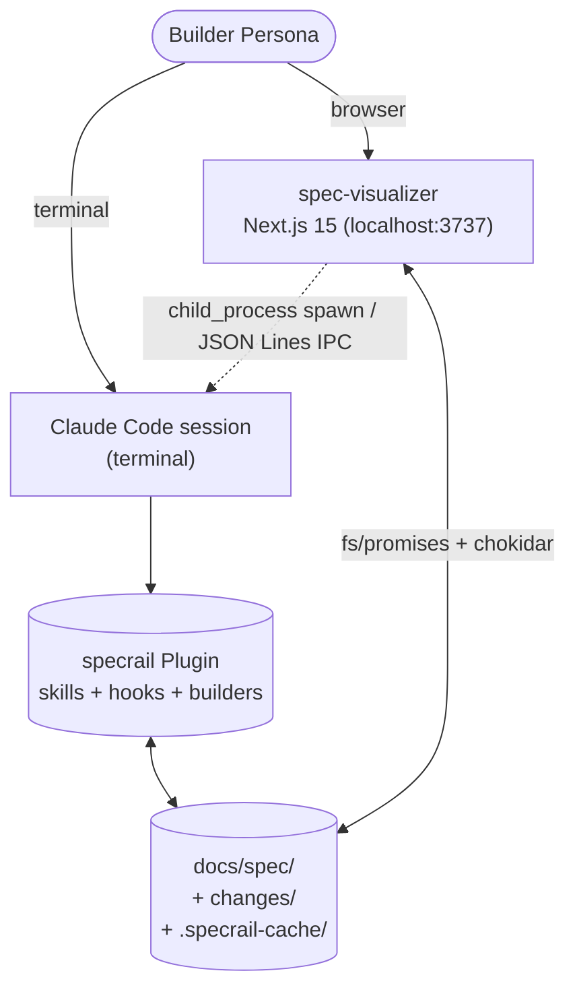
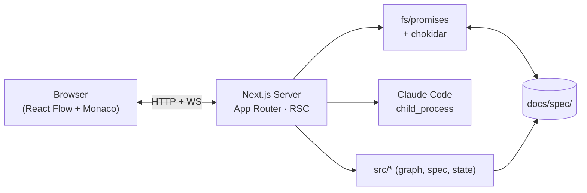
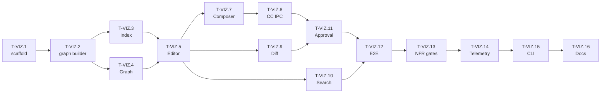
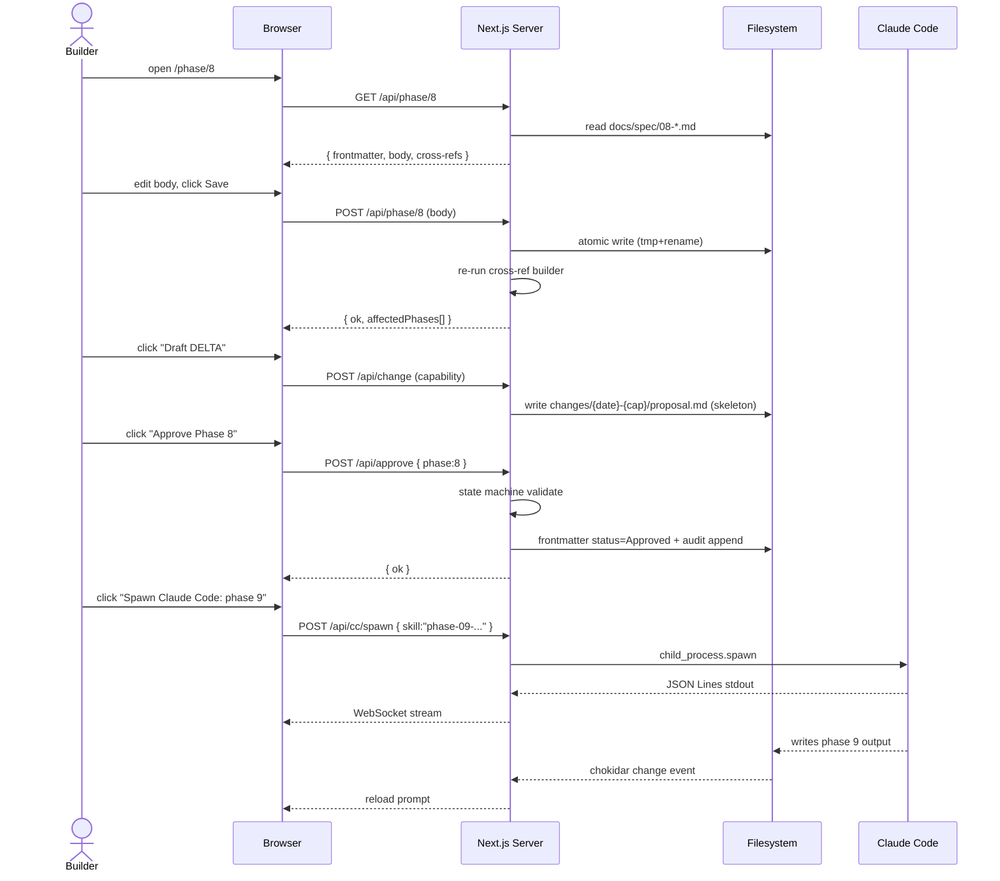

# DELTA Proposal: spec-visualizer

> Status: **Deferred** (2026-05-15). 사용자가 본 proposal을 reject·보류 선택. archive로 이동.
> 재검토 시 status를 `Proposed`로 되돌리고 archive 외부로 복귀. PRD §10 reverse 결정이 다시 필요.
> Anti-shortcut Clause 준수 — 모든 expansion·conflict는 본 Proposal 작성 *전에* AskUserQuestion으로 잠금 통과 (Mode, edit scope, tech stack, PRD §10 처치).

---

## 0. 한 줄

13-phase spec을 **graph로 시각화 + Monaco로 직접 편집 + Claude Code workflow 호출**까지 통합한 **Local Next.js 15 webapp(`spec-visualizer`)** 을 plugin 1급 산출물로 추가.

---

## 1. Context

### 1.1 Trigger
사용자 요청 (2026-05-15):
> "specrail 스킬을 사용해서 docs/spec 에 delta 계획 추가로 이 계획을 시각화된 형태로 보고 연결관계를 이해하기 쉽게 리뷰하고 수정할 수 있는, 그러한 webapp을 로컬에 띄우고 싶어"

### 1.2 잠금된 선행 결정 (AskUserQuestion 기록)

| ID | 결정 | 값 |
|---|---|---|
| D-1 | Delta mode | **SCOPE EXPANSION** (commit, silent drift 금지) |
| D-2 | webapp 수정 수준 | **Spec editor + workflow driver** (markdown 편집 + DELTA 생성 + HARD-GATE 승인 + Claude Code spawn) |
| D-3 | Tech stack | **Next.js 15 + React Flow + Monaco** (Node 20·TS·ESM, 기존 `src/*` 재사용) |
| D-4 | PRD §10 충돌 처치 | **Reverse — dashboard plugin scope 재포함** |

### 1.3 Reverse 근거 (PRD §10)
PRD §10 (2026-05-12)은 "Local web dashboard는 별 cycle"을 명시했고 Phase 2·6·7·8 모두 "dashboard scope 제거됨" 또는 "단일 surface"를 반복. 본 Proposal은 그 결정을 **명시적으로 뒤집는다**.

근거(confidence 9/10, PRD 직접 인용):
- AI 시대 marginal cost of completeness near-zero (principles.md ETHOS §1 Boil the Lake).
- 13 phase × 수십 cross-ref ID × HARD-GATE를 terminal text만으로 navigate하는 cognitive load가 product fit과 충돌. Phase 6·7의 reduction이 실 사용 마찰을 발생.
- spec discipline의 **review·diff·approval**은 본질적으로 visual·spatial task — terminal-only 강제는 tool↔task mismatch.

### 1.4 거절된 대안
| 대안 | 거절 이유 |
|---|---|
| 별 repo (companion tool) | spec과 plugin이 두 source-of-truth로 갈라짐. cross-ref 일관성 breakage risk. |
| Annotation-only layer | "수정 가능" 요구사항 미충족. |
| Visual graph editing-only | markdown body 편집은 여전히 필요. tool 두 개로 mode-switch cost. |
| TUI | "webapp 로컬에 띄우고 싶어" 명시 어긋남. |

---

## 2. New Capability: `spec-visualizer`

| Field | Value |
|---|---|
| Capability ID | `spec-visualizer` (kebab-case, OpenSpec 차용 — principles §DELTA) |
| Surface | Local Next.js 15 webapp, default `http://localhost:3737` |
| Trigger | `specrail visualize` CLI sub-command + `/specrail visualize` skill |
| Read | `docs/spec/**`, `docs/spec/changes/**`, `.specrail-cache/state.json` |
| Write | `docs/spec/**`, `docs/spec/changes/**`, `.specrail-cache/**` |
| Drive | Claude Code subprocess (spawn) — phase skill 재실행·DELTA proposal 자동 draft |
| Single-user | Yes (Phase 3 §0 일관) — no auth, localhost-bind 기본 |
| Code reuse | `src/graph/{builder,downstream}.ts`, `src/spec/{resolver,counter,id,patterns}.ts`, `src/markdown/frontmatter.ts`, `src/state/machine.ts` |

---

## 3. C4 L1 Context (ADDED)



**Boundary 변화:** plugin 시스템 경계가 *Claude Code session* 단일에서 *Claude Code session + spec-visualizer localhost* 두 deployable로 확장.

---

## 4. Phase-by-phase Deltas

> 본 섹션은 *outline*. 각 phase 본문 머지는 Approved 후 `docs/spec/changes/2026-05-15-spec-visualizer/deltas/phase-NN.md`에서 정식 작성. ID(`R{NEXT}`, `T{N}.x`)는 머지 시 `src/spec/counter.ts`로 allocate.

### Phase 1 — PRD

**MODIFIED §10 — Out-of-scope**
- Changed: "Local web dashboard는 별 cycle" → **"Local web dashboard(`spec-visualizer`) plugin scope 포함"**.
- Reason: D-4 reverse. SCOPE EXPANSION commit.

**ADDED §11 — Surfaces (신규 절)**
- Plugin은 **2 surface** single source-of-truth:
  1. Claude Code session (terminal) — primary authoring surface.
  2. spec-visualizer Next.js webapp — review · navigation · diff · workflow trigger surface.
- 양 surface는 동일 filesystem 공유. 충돌 시 mtime + chokidar watch로 reload prompt.

**MODIFIED §4 KPI**
- ADDED: KPI-VIZ-1 — "Builder가 13 phase cross-ref를 60초 안에 graph view에서 trace 가능" (NFR-VIZ-PERF-1과 연결).

### Phase 2 — Personas & Journey

**MODIFIED Primary Persona Card §기본**
- Changed: "인터랙티브 dashboard는 향후 cycle" → **"Builder는 두 surface 병행: 작성 중 terminal + 검토·navigation·diff·승인 시 browser. context-switch cost는 hot-reload·shared fs로 흡수"**.

**ADDED Journey J-VIZ — Spec Review·DELTA Flow**
1. Builder가 Phase 8 마침 → status=Approved.
2. visualizer Graph view에서 ARCH-N ↔ ADR-N edge 검토.
3. 누락 cross-ref 발견 → Monaco editor에서 즉시 보정.
4. Save → cross-ref builder 즉시 재계산 → 영향 phase chip 표시.
5. "Draft DELTA" 버튼 → Composer가 ADDED/MODIFIED/REMOVED skeleton 자동 작성.
6. "Spawn Claude Code"로 phase skill 실행 → stdout stream을 webapp Console panel에 표시.
7. HARD-GATE Approval 버튼 → frontmatter `status: Approved` + audit log.

### Phase 3 — Features

**ADDED R{NEXT}: spec-visualizer webapp**

| Sub | Feature | AC 핵심 |
|---|---|---|
| F-R{N}.1 | Local server startup | `specrail visualize` → port 3737 listen, browser auto-open (`--no-open` flag) |
| F-R{N}.2 | Phase Index Page | 13 phase tile · status badge · last-modified · OQ count · placeholder count |
| F-R{N}.3 | Cross-Reference Graph | React Flow. Node = {Phase,R,F,S,ADR,NFR,ENT,SM,TC,EDGE,RISK,OQ}. Edge = markdown 본문 + frontmatter cross-ref parser. zoom/pan, filter chip, click-to-source |
| F-R{N}.4 | Markdown Editor | Monaco. dual mode: frontmatter form + body. Save → atomic write (tmp+rename) → re-index |
| F-R{N}.5 | Live Mermaid Preview | `remark-mermaid` 또는 client-side mermaid.js. Phase 4·5·8·13 mermaid block fenced render |
| F-R{N}.6 | DELTA Composer | ADDED/MODIFIED/REMOVED column. affected-phase 자동 추정 (cross-ref reverse lookup). frontmatter template 채움 |
| F-R{N}.7 | HARD-GATE Approval | "Approve Phase N"버튼 → state machine 검증(`src/state/machine.ts`) → frontmatter `status: Approved` + audit log entry |
| F-R{N}.8 | Claude Code Driver | `child_process.spawn` + JSON Lines stdout 파싱. webapp Console에 stream. exit code 후 reload |
| F-R{N}.9 | Diff View | `docs/spec/` vs `changes/{...}/deltas/` unified diff + graph highlight overlay |
| F-R{N}.10 | Search · Orphan ID | 전역 ID 검색 + 정의 없는 ID 참조 검출 (principles §Self-Check grep을 webapp UI에 통합) |
| F-R{N}.11 | External-edit reconcile | chokidar watch + ETag. 외부 편집 감지 시 unsaved-changes 경고 모달 |
| F-R{N}.12 | Read-only mode | `--readonly` flag · UI에서 모든 mutation hidden · file lock 신호용 |

**MODIFIED R6 (install·setup)**
- Changed AC-R6: setup 후 `specrail visualize --health` 통과 확인 단계 추가.

**MODIFIED R13 (KPI)**
- ADDED: KPI-VIZ-1 측정 instrumentation (telemetry opt-in 시).

### Phase 4 — Domain Model

**ADDED Entities**
| Entity | Description | Aggregate root |
|---|---|---|
| `ENT-CrossRef` | `{sourcePhase, sourceId, targetPhase, targetId, kind: explicit\|implicit, lineRange}` | No (Phase 종속) |
| `ENT-EditSession` | `{sessionId, startedAt, files[], undoStack, dirty}` | Yes (webapp 한정) |
| `ENT-ApprovalEvent` | `{phase, fromStatus, toStatus, actor, ts, gateRule}` | Yes |
| `ENT-DeltaProposal` | `{capability, date, status, affectedPhases[], reverses?}` | Yes |

**MODIFIED INV-7 (state source of truth)**
- Changed: "spec frontmatter primary · `.specrail-cache/state.json` derived" → "+ visualizer in-memory cache는 fs mtime + chokidar invalidation"
- INV unchanged in essence: **frontmatter primary 유지**.

**ADDED INV-{NEXT}: visualizer는 절대 frontmatter `status`를 user 명시 클릭 없이 변경하지 않는다** (HARD-GATE 보존).

### Phase 6 — Information Architecture

**MODIFIED §1 Page Catalog**
- Changed: "단일 surface — Claude Code session" → **"두 surface: CC + web"**.

**ADDED Pages (P-WEB-*):**
| Page ID | 이름 | Trigger |
|---|---|---|
| P-WEB-1 | Index | `/` |
| P-WEB-2 | Cross-Ref Graph | `/graph` |
| P-WEB-3 | Phase Editor | `/phase/[n]` |
| P-WEB-4 | DELTA Composer | `/change/[date-topic]` |
| P-WEB-5 | Diff View | `/change/[date-topic]/diff` |
| P-WEB-6 | Workflow Console | `/console` |
| P-WEB-7 | Search | `/search?q=...` |
| P-WEB-8 | Approval Audit | `/audit` |

### Phase 7 — Wireframe

**MODIFIED W-CC-pattern**
- Changed scope clause: "Dashboard wireframe 9개는 향후 cycle" → 제거. W-WEB-* 별 계층 추가.

**ADDED W-WEB-***
- `W-WEB-Index`: left rail phase nav, center 13-tile status grid, top utility bar.
- `W-WEB-Graph`: full-bleed React Flow canvas, right inspector (node detail + outgoing/incoming refs), bottom filter chips.
- `W-WEB-Editor`: split Monaco | preview, frontmatter form drawer (top), save bar (bottom) with HARD-GATE warning slot.
- `W-WEB-Composer`: 3-column ADDED/MODIFIED/REMOVED, impact-phase chip ribbon, "Spawn Claude Code" CTA.
- `W-WEB-Diff`: side-by-side text diff + graph highlight overlay (toggle).
- `W-WEB-Console`: streaming stdout panel + cancel button + history.

각 W-WEB-*은 mobile read-only(scroll only) variation. principles의 "edge case paranoia" 충족.

### Phase 8 — System Architecture

**MODIFIED §1 C4 L1**
- Diagram을 본 Proposal §3로 교체.

**ADDED ARCH-{NEXT}: Visualizer Container (C4 L2)**


**ADDED EXT-{NEXT}: Claude Code IPC boundary**
- Protocol: JSON Lines over stdout (newline-delimited JSON events).
- Failure modes: CC 미설치 → fallback to file-only handoff; busy → queue; non-zero exit → red console + 원본 file 변동 없음 보장.

**ADDED ARCH-{NEXT+1}: Atomic write protocol**
- Write = `write(tmp) → fsync → rename(tmp, target)`. 부분 write 방지 (RISK-VIZ-1 mitigation).

**ADDED ARCH-{NEXT+2}: Single-user assumption**
- localhost bind 기본 (`127.0.0.1:3737`). `--host 0.0.0.0`은 explicit opt-in + 경고. No auth — 외부 노출은 사용자 책임 (Phase 9 NFR-VIZ-SEC-1 참조).

### Phase 9 — Non-Functional Requirements

**ADDED NFR-VIZ-***
| ID | NFR | 목표 | 측정 |
|---|---|---|---|
| NFR-VIZ-PERF-1 | Index page LCP (cold) | < 1.5s @ M1 Air | Playwright + Web Vitals |
| NFR-VIZ-PERF-2 | Cross-ref graph initial render | < 1.5s @ ≤ 500 nodes | perf.now() bracket |
| NFR-VIZ-PERF-3 | File save round-trip | < 300ms @ ≤ 50KB markdown | E2E timing |
| NFR-VIZ-AVAIL-1 | Read-only offline | CC 미설치·offline에서 read+graph+search 동작 | manual E2E |
| NFR-VIZ-SEC-1 | Bind 기본 | `127.0.0.1`만 listen. external bind explicit + 경고 | port scan test |
| NFR-VIZ-SEC-2 | Path traversal | `docs/spec/` + `changes/` 외 write 금지 | unit test |
| NFR-VIZ-PRIV-1 | Telemetry 통합 | PRD §10(수정본) 정책 상속, opt-in 동일 | integ test |
| NFR-VIZ-A11Y-1 | WCAG AA | 키보드 only navigation · graph fallback(table view) · screen reader landmark | axe-core + manual |
| NFR-VIZ-I18N-1 | UI chrome 한·영 토글 | spec body 그대로, UI만 | locale switch test |

### Phase 10 — Test Strategy

**ADDED**
- E2E (Playwright): 5 critical flows — Index, Graph navigation, Editor save, DELTA composer end-to-end, Claude Code spawn(mock).
- Integration: Next.js API route × fs driver × cross-ref builder × state machine.
- Unit: React Flow node·edge mapper, ENT-CrossRef parser, atomic write helper.
- Mutation test: status transition (Phase state machine) — invalid transition rejection.
- 80% coverage gate inherited (rules/testing.md).

### Phase 11 — Operations

**MODIFIED §0 prelude**
- Changed: "passive skill·hook 모음 — server 안 돌림" → **"Hybrid — passive skills + 사용자 측 localhost webapp(spec-visualizer). maintainer ops에는 변화 없음. user 측 localhost는 사용자 책임"**.

**ADDED Env `user-localhost`**
| Field | Value |
|---|---|
| 목적 | Spec authoring · review · approval surface |
| 데이터 | `docs/spec/**`, `.specrail-cache/**` (사용자 disk) |
| 외부 EXT | Claude Code IPC (subprocess) |
| 접근 | 본인 (localhost) |
| Maintainer 책임 | 미포함 — code 배포만 |

### Phase 13 — Implementation Plan

**ADDED Milestone M-VIZ (core 13 phase ship 이후 ordered)**

> Risk RISK-VIZ-3 mitigation: M-VIZ는 plugin core M0·M1·M2 milestone 종료 후 시작. core shipping 일정 보호.

| Task | 내용 |
|---|---|
| T-VIZ.1 | Next.js 15 scaffolding + tsconfig + fs driver (RED → GREEN) |
| T-VIZ.2 | Cross-ref builder integration (`src/graph/builder.ts` 재사용) + API route `/api/graph` |
| T-VIZ.3 | Phase Index Page (P-WEB-1) + status badge |
| T-VIZ.4 | Cross-ref Graph (P-WEB-2, React Flow) |
| T-VIZ.5 | Monaco editor (P-WEB-3) + atomic save + frontmatter form |
| T-VIZ.6 | Live Mermaid render |
| T-VIZ.7 | DELTA Composer (P-WEB-4) + affected-phase 자동 추정 |
| T-VIZ.8 | Claude Code IPC (subprocess + JSON Lines) + Console (P-WEB-6) |
| T-VIZ.9 | Diff View (P-WEB-5) |
| T-VIZ.10 | Search · Orphan ID detection (P-WEB-7) |
| T-VIZ.11 | Approval Audit log + HARD-GATE UI (P-WEB-8) |
| T-VIZ.12 | Playwright E2E × 5 flows |
| T-VIZ.13 | NFR-VIZ-PERF benchmarks + axe-core a11y CI gate |
| T-VIZ.14 | Telemetry hook (opt-in, KPI-VIZ-1) |
| T-VIZ.15 | `specrail visualize` CLI binding + `--readonly` · `--host` · `--port` flags |
| T-VIZ.16 | Docs — README section + CLAUDE.md update + skills/orchestrator/SKILL.md `/specrail visualize` 등록 |

Sequencing: **T-VIZ.1 → T-VIZ.2** (data plane) → **T-VIZ.3·T-VIZ.4** (read views) → **T-VIZ.5·T-VIZ.7** (edit) → **T-VIZ.8·T-VIZ.9·T-VIZ.11** (workflow + audit) → **T-VIZ.10** (search) → **T-VIZ.12·T-VIZ.13** (gates) → **T-VIZ.14·T-VIZ.15·T-VIZ.16** (handoff).



---

## 5. Sequence — Edit→Approve Flow



---

## 6. Open Questions

| Q ID | 질문 | 결정자 | 마감 | Blocking? |
|---|---|---|---|---|
| OQ-VIZ-1 | Claude Code IPC: 공식 SDK vs CLI subprocess? SDK는 mature한가? | maintainer (CC docs 검증) | 2026-05-22 | Y (T-VIZ.8 시작 전) |
| OQ-VIZ-2 | Approval audit log 저장: frontmatter `approvals: []` 배열 vs 별 `.specrail-cache/approvals.log` JSON Lines? | maintainer | 2026-05-22 | Y (T-VIZ.11) |
| OQ-VIZ-3 | DELTA composer affected-phase 자동 추정 정확도 목표 (precision/recall)? | maintainer | 2026-05-29 | N |
| OQ-VIZ-4 | port 3737 충돌 시 fallback: auto-increment vs error? | maintainer | 2026-05-22 | N |
| OQ-VIZ-5 | frontmatter 무결성 보호 — Monaco body 편집 시 frontmatter 영역 read-only lock vs form-only? | maintainer | 2026-05-22 | Y (T-VIZ.5) |
| OQ-VIZ-6 | Visualizer는 plugin과 same package vs `apps/visualizer/` workspace? | maintainer | 2026-05-22 | Y (T-VIZ.1) |
| OQ-VIZ-7 | Mermaid render — server-side (remark plugin) vs client-side (mermaid.js)? | maintainer | 2026-05-29 | N |
| OQ-VIZ-8 | webapp 한·영 UI chrome 우선순위 — M-VIZ 안 vs 후속 milestone? | user | 2026-05-29 | N |

---

## 7. Risks (additive to Phase 12)

| ID | Severity | Prob | Description | Mitigation |
|---|---|---|---|---|
| RISK-VIZ-1 | M | M | Filesystem write 도중 crash → partial write | Atomic write (ARCH-{NEXT+1}) |
| RISK-VIZ-2 | H | L | Claude Code IPC 미문서화 또는 breaking change | JSON Lines protocol + version pinning + fallback to file-only handoff |
| RISK-VIZ-3 | M | M | SCOPE EXPANSION으로 core plugin shipping 일정 지연 | M-VIZ는 core milestone 후 ordered |
| RISK-VIZ-4 | M | L | Single-user 가정에서 사용자가 `--host 0.0.0.0` 무지하게 사용 → external 노출 | NFR-VIZ-SEC-1 + UI 경고 + README 명시 |
| RISK-VIZ-5 | L | M | React Flow ≥ 500 node 시 perf 저하 | NFR-VIZ-PERF-2 측정 + virtualization fallback |
| RISK-VIZ-6 | M | L | Two-surface 동시 편집 충돌 (Builder가 CC와 web 둘 다에서 동일 file 수정) | chokidar + ETag + unsaved-changes 모달 (F-R{N}.11) |

---

## 8. Self-Check

| Check | 결과 |
|---|---|
| `grep -iE "TBD\|TODO\|implement later\|handle edge cases\|add validation"` (이 proposal) | 0 hits (검증 필요) |
| Mode tag 일관 | `SCOPE EXPANSION` 단일 표기 |
| 다이어그램 ≥ 2 (mandatory) | Context (§3) + Container (§Phase 8) + Sequence (§5) + Dep Graph (§Phase 13) = 4 |
| principles §No Placeholders | 모든 새 ID는 `R{NEXT}`·`T-VIZ.x`·`P-WEB-x`·`NFR-VIZ-*` 명시 패턴. `{NEXT}` 표기는 counter allocate trigger지 placeholder 아님 |
| principles §Output Voice | Position-bearing, hedging 제거 |
| Anti-Sycophancy | PRD §10 충돌을 surface하고 user 명시 reverse 후 작성 — sycophantic dump 아님 |
| Capability scoping (OpenSpec) | `spec-visualizer` 단일 kebab-case ID |

> **자체 리뷰 면책:** 이 proposal을 제가 작성했으므로 자체 self-check에는 맹점이 있을 수 있다. 정식 reviewer pass는 별 lane(예: code-reviewer / verifier agent)에서 수행해야 한다.

---

## 9. Lifecycle Next Step

Status: **Proposed**.

Lifecycle (principles §DELTA stateDiagram):
```
[*] → Proposed (현재)
Proposed → Reviewed (사용자 본 문서 검토)
Reviewed → Approved (HARD-GATE 통과: 명시 승인)
Approved → Implementing (deltas/phase-NN.md × 11개 phase 작성 + tasks.md)
Implementing → Applied (docs/spec/*.md 머지)
Applied → Archived (changes/archive/로 이동)
```

**HARD-GATE 적용:** Approved 없이 `docs/spec/*.md`에 본 변경을 머지하지 않는다.
**Approver action:** "Approve `spec-visualizer` proposal" 명시 발화 또는 본 file frontmatter `status: Approved` 수동 변경 + audit entry.

---

## 10. Anti-shortcut 기록

본 proposal은 다음 4 결정을 user AskUserQuestion으로 잠근 후에만 작성됨 — finding을 한 번에 dump하는 anti-pattern 회피:

1. Mode = SCOPE EXPANSION  
2. Edit scope = editor + workflow driver  
3. Tech = Next.js 15 + React Flow + Monaco  
4. PRD §10 = reverse

각 결정의 거절 옵션·근거는 §1.2·§1.4·각 phase 본문에 기록.
