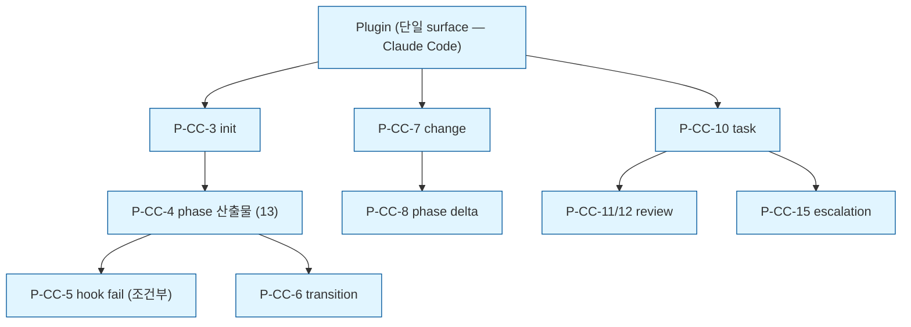

# Information Architecture

**Mode:** HOLD SCOPE
**Inputs:** Phase 5 페이지 Node + 섹션 최상위 페이지
**Reference:** `/reference-v3/06-information-architecture.md`
**Date:** 2026-05-10 (v4.0 — dashboard scope 제거 후)

> 단일 surface — Claude Code session (terminal text). Dashboard surface는 v4.5 cycle.

## 1. Page Catalog

### Claude Code surface (P-CC-*)

명령·skill 호출·LLM 응답이 페이지 역할. URL 없음 — 명령어가 entry.

| Page ID | 이름 | Phase 5 Node | Trigger / 위치 | 깊이 |
|---|---|---|---|---|
| P-CC-1 | README · marketplace landing | N-002 | GitHub URL 또는 Claude Code marketplace | 1 |
| P-CC-2 | Setup 완료 안내 | N-006 | install 직후 자동 출력 | 1 |
| P-CC-3 | Phase init 응답 (docs/spec 생성·skill 호출) | N-011 | `/plan-pipeline init` 또는 trigger phrase | 1 |
| P-CC-4 | Phase 산출물 출력 | N-014 | skill chain 자동 (13 phase 동일 layout) | 2 |
| P-CC-5 | Hook fail 차단 메시지 | N-019 | git commit 시 자동 | 2 |
| P-CC-6 | Phase transition 승인·진입 | N-022 | 사용자 "approve" 명령 | 2 |
| P-CC-7 | Change 명령 응답 (영향 phase + proposal draft) | N-032, N-033 | `/plan-pipeline change "<topic>"` | 1 |
| P-CC-8 | Phase delta 작성 | N-035 | DELTA 진행 중 영향 phase 별 | 2 |
| P-CC-9 | Change 머지·archive 알림 | N-039 | 자동 | 2 |
| P-CC-10 | Implementation task subagent | N-042 | Phase 13 후 자동 또는 명령 | 2 |
| P-CC-11 | Spec review subagent | N-046 | task별 자동 | 3 |
| P-CC-12 | Quality review subagent | N-047 | task별 자동 | 3 |
| P-CC-13 | Implementation 완료 알림 | N-051 | 자동 | 2 |
| P-CC-14 | Telemetry opt-in 질문 | N-071 | install 첫 사용 | 1 |
| P-CC-15 | Escalation prompt (BLOCKED) | N-049 | subagent 막힘 시 | 3 |

### 산출물 검토 surface (passive — markdown rendered)

본 v4는 인터랙티브 dashboard 없음. 산출물 검토는 사용자 환경의 markdown rendered:

| 검토 surface | 도구 | 가능성 |
|---|---|---|
| GitHub UI | Web browser | Mermaid 자동 render, 표·코드 highlight |
| VS Code preview | Cmd/Ctrl+Shift+V | Mermaid plugin 설치 시 render |
| Obsidian / Typora 등 | Markdown viewer | 독립 |
| Claude Code session 자체 | Terminal | 텍스트만 (Mermaid X) |

(인터랙티브 검토 — ID 클릭, dependency graph navigate, timeline view 등은 v4.5 dashboard cycle.)

## 2. Page Tree

깊이 ≤ 3 ✓

## 3. Navigation Strategy

### Claude Code surface — 명령·skill 자동 trigger

URL navigation 없음. 사용자 → 명령어 → LLM 응답이 "navigation".

| 명령 / Trigger | 도착 페이지 |
|---|---|
| `/plan-pipeline init` (또는 자연어 trigger phrase) | P-CC-3 |
| `/plan-pipeline change "<topic>"` | P-CC-7 |
| `/plan-pipeline implement` (또는 Phase 13 후 자동) | P-CC-10 |
| `/plan-pipeline status` | (CLI 출력 — Page 별 부여 X, raw 응답) |
| 사용자 "approve phase N" | P-CC-6 (transition) |
| 사용자 "opt out telemetry" | (CLI 응답) |
| skill chain 자동 | P-CC-4 → P-CC-6 → 다음 P-CC-4 (13회) |

`/plan-pipeline help`로 명령 list 표시.

### 산출물 검토 navigation (passive)

사용자가 자기 환경 markdown 도구로 navigate:
- File 간 — 자기 file 시스템 (VS Code Explorer / Finder)
- ID cross-reference — grep 또는 IDE search
- Mermaid graph — GitHub·VS Code preview에서 자동 render

(interactive cross-reference·search·timeline은 v4.5 dashboard.)

### 결정 근거 (Persona 환경 인용)

| 결정 | 근거 |
|---|---|
| 단일 surface (terminal) | Persona는 Claude Code 네이티브 사용. 추가 도구 install 마찰 0 |
| Markdown rendered fallback | Persona가 GitHub·VS Code 일상 — 추가 학습 0 |
| 명령어 navigation | CLI 일상, URL 없는 게 더 자연 |
| Help 명령 | Persona가 `--help` 일상 |

## 4. Deep Link Patterns

본 v4는 deep link 없음 (URL 없는 surface). v4.5 dashboard cycle에서 추가.

다만 markdown file path는 deep link 역할:
- `<repo>/docs/spec/03-features.md#L67` (line anchor)
- `<repo>/docs/spec/03-features.md#r3` (heading anchor — H2가 R3)
- 사용자가 git URL share 시 GitHub UI에서 navigate

## 5. Role Gating

**Single-user product. Permission Matrix 생략.**

## 6. Empty / Error States 매핑

| 상태 | Page 또는 처리 |
|---|---|
| 데이터 0개 (Project init 안 됨) | P-CC-3 (init 명령 또는 trigger phrase 안내) |
| Hook fail 차단 | P-CC-5 — violation 명시 + 수정 가이드 |
| Phase 미승인에 다음 phase trigger | F2.2 transition gate 차단 → Claude Code 응답: "Phase N-1 승인 필요" |
| Telemetry endpoint 다운 (R13) | local queue + 재전송. 사용자 무관. |
| Plugin install 실패 | Claude Code marketplace error → README troubleshooting |
| Subagent BLOCKED | P-CC-15 — escalation prompt (사용자 결정) |

(Dashboard 관련 empty/error state — Server down, 404, file watch fail 등 — 모두 v4.5 cycle.)

## 7. URL / 경로 Conventions

### Claude Code 명령

| 영역 | 패턴 |
|---|---|
| Plugin 명령 | `/plan-pipeline {action}` |
| Trigger phrase | "13단계로 사양화" · "phase {N} 시작" 등 — Skill의 triggerWords |
| 자연어 자동 trigger | LLM이 사용자 의도 파악 후 skill 호출 |

### File system path (사용자 spec)

| 영역 | 패턴 |
|---|---|
| Project root | `<user-project>/docs/spec/` |
| Greenfield 산출물 | `docs/spec/{NN-name}.md` |
| Current (DELTA 적용 후) | `docs/spec/current/{NN-name}.md` |
| Changes | `docs/spec/changes/{date}-{topic}/` |
| ADR | `docs/spec/12-adr-risks/ADR-{n}-{topic}.md` |
| Wireframe | `docs/spec/07-wireframe/W-{n}-{slug}.md` |

이 file system path는 미래 v4.5 dashboard가 read 호환 (frontmatter standard YAML).

## 8. 검색 가능성

본 v4는 사용자 자기 환경 검색:
- `/plan-pipeline status` — 현재 phase·진행
- `/plan-pipeline find <query>` — spec content search (CLI)
- 사용자 직접 grep / IDE search (file system level)

(인터랙티브 search bar는 v4.5 dashboard cycle.)

## 9. Open Questions

| Q ID | 질문 | 결정자 | Blocking? |
|---|---|---|---|
| OQ-6-1 | `/plan-pipeline find` 명령 v4 포함 vs v4.5 (간단 grep wrapper) | maintainer | Phase 8 |
| OQ-6-2 | Settings page (telemetry consent toggle) — Claude Code 명령으로 충분? 또는 v4.5 dashboard | maintainer | Phase 8 |

## 10. 다음 phase 인풋

Phase 7 (Wireframe)에:
- Page Catalog 15개 (P-CC-* 만)
- Page Tree (위계)
- Navigation Strategy (명령어 entry)
- Markdown zone 구조 wireframe (단일 W-CC-pattern)
- Empty / Error states list

Phase 8 (Architecture)에:
- File system path conventions (storage layout)
- 명령 entry → skill 매핑
- Markdown rendered fallback이 사용자 측 책임 (out of v4 scope)

Phase 9 (NFR)에:
- Markdown rendered a11y (Mermaid alt text, semantic 위계)
- Empty state UX (PAIN-base 완화)
