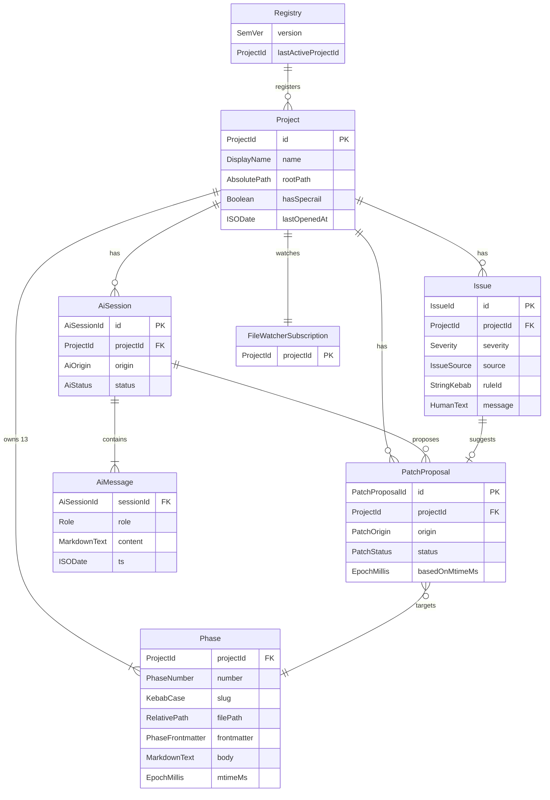
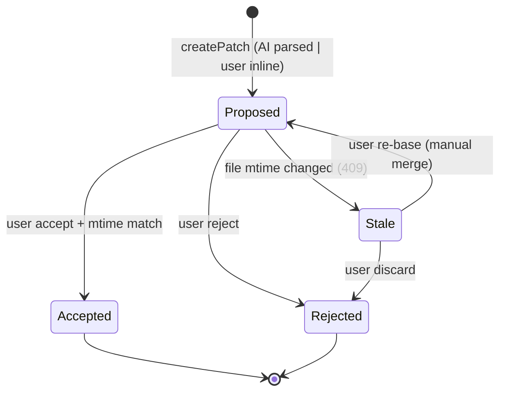
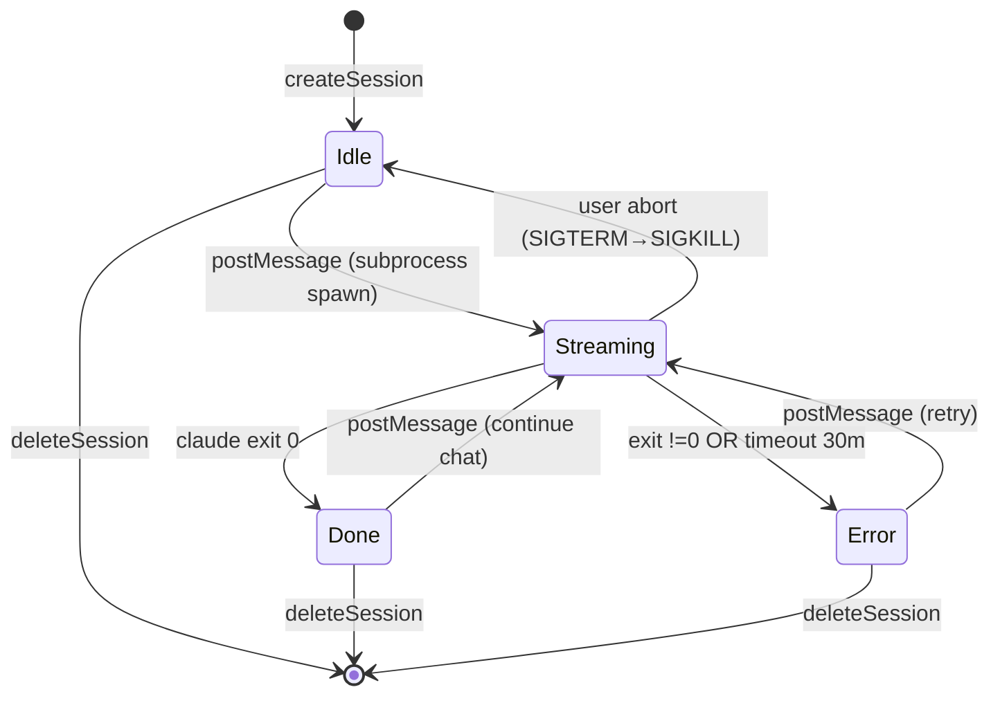
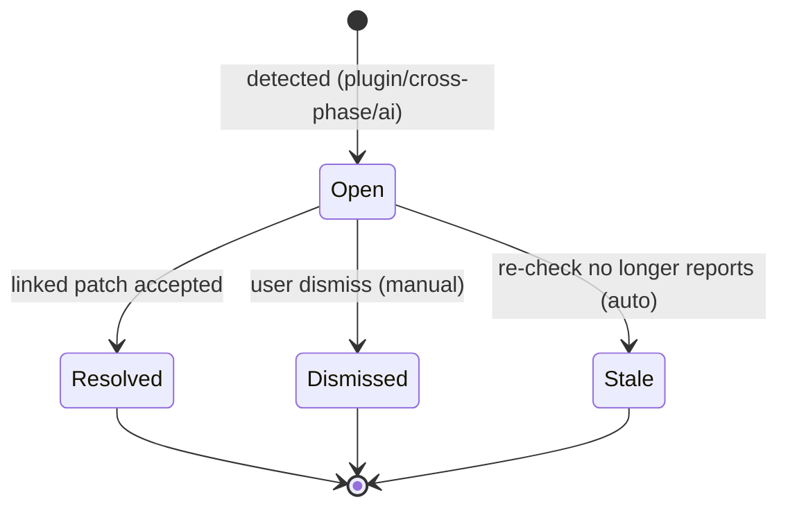

# Domain Model

**Mode:** HOLD SCOPE (inherited)
**Inputs:** Phase 3 R1-R6, F·S 명사 추출
**Date:** 2026-05-17

## 1. Entity Catalog

### ENT-Project

<!-- specrail:attrs id=ENT-Project -->
```yaml
status: Approved
aggregate-root: true
linked-features: [S1.4.1, S1.4.2]
```
<!-- /specrail:attrs -->

**Description:** Dashboard 에 등록된 specrail repo 한 단위. multi-project registry 의 원소.
**Aggregate root:** Yes
**Source spec:** S1.4.1, S1.4.2

#### Attributes

| Name | Type | Required | Source | 설명 |
|---|---|---|---|---|
| id | ProjectId | Y | system | repo absolute path 의 sha256 short |
| name | DisplayName | Y | system | 마지막 path segment 기본 |
| rootPath | AbsolutePath | Y | AC-R1-3 | repo root absolute |
| hasSpecrail | Boolean | Y | AC-R1-1 | docs/spec/01-prd.md 존재 |
| lastOpenedAt | ISODate | Y | AC-R1-3 | 정렬 키 |

### ENT-Phase

<!-- specrail:attrs id=ENT-Phase -->
```yaml
status: Approved
aggregate-root: false
linked-features: [S1.1.1, S1.1.2, S2.1.1]
```
<!-- /specrail:attrs -->

**Description:** 한 project 의 13 phase markdown 한 개.
**Aggregate root:** No (ENT-Project 안)
**Source spec:** S1.1.1, S1.1.2, S2.1.1

| Name | Type | Required | Source | 설명 |
|---|---|---|---|---|
| projectId | ProjectId | Y | system | parent |
| number | PhaseNumber (1..13) | Y | AC-R1-1 | phase 번호 |
| slug | KebabCase | Y | system | "prd" 같은 |
| filePath | RelativePath | Y | system | docs/spec/01-prd.md 등 |
| frontmatter | PhaseFrontmatter (zod schema/phase) | Y | AC-R1-1 | per-phase zod |
| body | MarkdownText | Y | AC-R1-1 | raw markdown |
| parsedIds | Set\<SpecId\> | Y | AC-R1-2 | 이 phase 정의 ID |
| parsedRefs | List\<{from: SpecId, to: SpecId, line: int}\> | Y | AC-R1-2 | outbound refs |
| mtimeMs | EpochMillis | Y | AC-R5-1, AC-R6-2 | 동시성 토큰 |

### ENT-Issue

<!-- specrail:attrs id=ENT-Issue -->
```yaml
status: Approved
aggregate-root: false
linked-features: [S3.1.1, S3.2.1, S3.2.2, S3.2.3, S3.2.4, S3.3.1]
```
<!-- /specrail:attrs -->

**Description:** 결정적 검사 또는 AI review 가 발견한 문제 단위.
**Aggregate root:** No
**Source spec:** S3.1.1, S3.2.*, S3.3.1

| Name | Type | Required | Source | 설명 |
|---|---|---|---|---|
| id | IssueId (uuid v7) | Y | system | |
| projectId | ProjectId | Y | system | |
| severity | enum {error, warn, info} | Y | AC-R3-2 | |
| source | enum {plugin-self-check, cross-phase, ai-quality} | Y | AC-R3-2 | 1급 표시 |
| ruleId | StringKebab | Y | AC-R3-1 | 검사 룰 식별 |
| message | HumanText | Y | AC-R3-2 | UI 표시용 |
| location | {phase: PhaseNumber, line?: int, specId?: SpecId} | Y | AC-R3-2 | 클릭 jump 대상 |
| suggestedPatch | PatchProposalId? | N | AC-R3-2 | 있으면 카드에 patch 첨부 |

### ENT-PatchProposal

<!-- specrail:attrs id=ENT-PatchProposal -->
```yaml
status: Approved
aggregate-root: true
linked-features: [S4.4.1, S4.4.2, S4.4.3]
```
<!-- /specrail:attrs -->

**Description:** 파일 수정 제안 1개. **모든 file mutation 의 단일 깔때기.**
**Aggregate root:** Yes — accept transaction 경계.
**Source spec:** S4.4.1-3, S3.3.2, S5.3.1-2

| Name | Type | Required | Source | 설명 |
|---|---|---|---|---|
| id | PatchProposalId (uuid v7) | Y | system | |
| projectId | ProjectId | Y | system | |
| createdAt | ISODate | Y | system | |
| origin | enum {issue-fix, chat, inline-rewrite} | Y | AC-R4-2, AC-R4-3 | 3 source |
| target | {phase: PhaseNumber, selection?: TextRange} | Y | AC-R5-1 | |
| hunks | List\<{before: string, after: string}\> | Y | AC-R3-2 | 적용 단위 |
| rationale | HumanText | Y | INV-2 | AI 가 왜 |
| status | enum {proposed, accepted, rejected} | Y | INV-1 | SM 참조 |
| basedOnMtimeMs | EpochMillis | Y | AC-R5-1 | 적용 시 mismatch → 409 |

### ENT-AiSession

<!-- specrail:attrs id=ENT-AiSession -->
```yaml
status: Approved
aggregate-root: true
linked-features: [S4.1.1, S4.1.2, S4.2.1, S4.2.2, S4.3.1]
```
<!-- /specrail:attrs -->

**Description:** Claude CLI subprocess 1회 호출의 논리 단위. chat session 의 경우 long-lived.
**Aggregate root:** Yes
**Source spec:** S4.1.*, S4.2.*, S4.3.*

| Name | Type | Required | Source | 설명 |
|---|---|---|---|---|
| id | AiSessionId (uuid v7) | Y | system | |
| projectId | ProjectId | Y | system | |
| phase | PhaseNumber? | N | AC-R4-3 | inline·chat 시 |
| origin | enum {review-scan, chat, inline} | Y | AC-R4-1, AC-R4-3 | |
| messages | List\<ENT-AiMessage\> | Y | system | |
| proposedPatches | List\<PatchProposalId\> | Y | AC-R4-2 | session 의 산출 |
| status | enum {idle, streaming, done, error} | Y | SM-AiSession-Lifecycle | |
| startedAt | ISODate | Y | system | |
| endedAt | ISODate? | N | system | done/error 시 |

### ENT-AiMessage

<!-- specrail:attrs id=ENT-AiMessage -->
```yaml
status: Approved
aggregate-root: false
linked-features: [S4.2.1]
```
<!-- /specrail:attrs -->

**Description:** AiSession 안의 한 turn.

| Name | Type | Required | Source | 설명 |
|---|---|---|---|---|
| sessionId | AiSessionId | Y | system | parent |
| role | enum {user, assistant} | Y | system | |
| content | MarkdownText | Y | system | 누적 또는 한 메시지 |
| ts | ISODate | Y | system | |

### ENT-Registry

<!-- specrail:attrs id=ENT-Registry -->
```yaml
status: Approved
aggregate-root: true
linked-features: [S1.4.1]
```
<!-- /specrail:attrs -->

**Description:** 등록된 ENT-Project 들의 집합. user-data 디렉토리에 영속.
**Aggregate root:** Yes

| Name | Type | Required | Source | 설명 |
|---|---|---|---|---|
| version | SemVer | Y | system | schema migration |
| projects | List\<ENT-Project\> | Y | AC-R1-3 | |
| lastActiveProjectId | ProjectId? | N | system | UX 복원용 |

### ENT-FileWatcherSubscription

<!-- specrail:attrs id=ENT-FileWatcherSubscription -->
```yaml
status: Approved
aggregate-root: false
linked-features: [S6.1.1]
```
<!-- /specrail:attrs -->

**Description:** project 당 chokidar watcher 1개의 운영 상태 (런타임만).

| Name | Type | Required | Source | 설명 |
|---|---|---|---|---|
| projectId | ProjectId | Y | system | |
| pathsWatched | List\<RelativePath\> | Y | AC-R6-1 | docs/spec/, changes/ |
| started | Boolean | Y | system | |
| lastEventTs | ISODate? | N | telemetry | |

## 2. Relations

### Mermaid erDiagram



### 관계 요약 표

| From | To | Cardinality | 의미 |
|------|----|-------------|------|
| Registry | Project | 1 : 0..N | OSS local 디바이스의 영속 등록 |
| Project | Phase | 1 : 13 | 고정 13 phase |
| Project | Issue | 1 : 0..N | 결정적/AI 검출 |
| Project | PatchProposal | 1 : 0..N | 모든 mutation source |
| Project | AiSession | 1 : 0..N | session 영속 |
| AiSession | AiMessage | 1 : 1..N | 최소 1 user msg |
| AiSession | PatchProposal | 1 : 0..N | session 별 산출 |
| Issue | PatchProposal | 1 : 0..1 | suggested patch |
| PatchProposal | Phase | N : 1 | target |
| Project | FileWatcherSubscription | 1 : 1 | 런타임 1대1 |

## 3. State Machines

### SM-PatchProposal-Lifecycle



### SM-AiSession-Lifecycle



### SM-Issue-Lifecycle



## 4. Invariants

### INV-1

<!-- specrail:attrs id=INV-1 -->
```yaml
status: Approved
applies-to: ["AC-R5-1"]
violation-impact: critical
```
<!-- /specrail:attrs -->

**Statement:** 모든 ENT-Phase 파일 수정은 정확히 status=Accepted 인 ENT-PatchProposal 한 개를 거친다.
**Violation 영향:** 단일 깔때기 무너짐 → audit log 누락, conflict detection 우회. **시스템 핵심 가정 깨짐.**
**Enforcement:** services.applyPatch 만 fs write 호출 가능. core.patch.apply 도 PatchProposal 객체 받음. lint rule (eslint custom) 으로 fs.writeFile 직접 호출 금지.

### INV-2

<!-- specrail:attrs id=INV-2 -->
```yaml
status: Approved
applies-to: ["AC-R5-1"]
violation-impact: high
```
<!-- /specrail:attrs -->

**Statement:** ENT-PatchProposal.accept 는 basedOnMtimeMs == 현재 file mtime 인 경우만 실행한다.
**Violation 영향:** 외부 동시 편집 silently overwrite. PAIN-DRIFT-1 재발.
**Enforcement:** services.applyPatch 첫 단계에 fs.stat → mismatch 면 409 throw.

### INV-3

<!-- specrail:attrs id=INV-3 -->
```yaml
status: Approved
applies-to: ["AC-R4-1"]
violation-impact: high
```
<!-- /specrail:attrs -->

**Statement:** ENT-AiSession 의 모든 subprocess spawn 은 cwd = ENT-Project.rootPath 이어야 한다.
**Violation 영향:** AI 가 잘못된 repo 의 CLAUDE.md/MCP/skill 컨텍스트를 가져옴. spec quality review 가 무관한 base 위에서 일어남.
**Enforcement:** claudeCli.stream(opts) 시그니처에 cwd 필수, services 가 항상 project.rootPath 전달.

### INV-4

<!-- specrail:attrs id=INV-4 -->
```yaml
status: Approved
applies-to: ["AC-R6-1", "AC-R6-2"]
violation-impact: medium
```
<!-- /specrail:attrs -->

**Statement:** ENT-FileWatcherSubscription.pathsWatched ⊆ `{<rootPath>/docs/spec/**, <rootPath>/changes/**}`.
**Violation 영향:** node_modules·.git·build artifacts watch → 무관 이벤트 폭주, 성능 저하 + 보안 (다른 secret 변경 감지).
**Enforcement:** watcher 생성 시 path validation, allowlist 외 path 거부.

### INV-5

<!-- specrail:attrs id=INV-5 -->
```yaml
status: Approved
applies-to: ["AC-R5-1", "AC-R4-2"]
violation-impact: high
```
<!-- /specrail:attrs -->

**Statement:** 모든 mutation HTTP 요청은 X-CSRF 헤더 = csrf cookie 검증을 통과해야 한다.
**Violation 영향:** localhost 라도 임의 사이트의 JS 가 dashboard mutation 호출 가능 → 의도치 않은 spec 수정.
**Enforcement:** Hono middleware 가 모든 non-GET 라우트에 적용. unit + e2e test 로 위조 시도 403 검증.

### INV-6

<!-- specrail:attrs id=INV-6 -->
```yaml
status: Approved
applies-to: ["AC-R1-1"]
violation-impact: medium
```
<!-- /specrail:attrs -->

**Statement:** ENT-Project.hasSpecrail = true 이어야 등록 가능.
**Violation 영향:** spec 없는 일반 repo 가 등록되어 phase 없음 → UI crash 또는 빈 화면.
**Enforcement:** POST /api/projects 라우트가 fs.stat(docs/spec/01-prd.md) 검증.

## 5. Type Glossary (도메인 타입)

| Domain Type | Definition |
|------|------|
| ProjectId | sha256(rootPath) substring 16 chars |
| PhaseNumber | 1..13 정수 |
| SpecId | `^(R\|F\|S\|NFR\|TC\|AC\|EDGE\|OQ\|ADR\|RISK\|T\|KPI\|PERSONA\|SCEN\|JNY\|ZN\|P-CC)[A-Z0-9\-\.]*$` |
| AbsolutePath | OS-native absolute path string |
| RelativePath | repo root 기준 상대 |
| ISODate | RFC 3339 |
| EpochMillis | int64 |
| TextRange | {startLine, startCol, endLine, endCol} 1-based |
| MarkdownText | UTF-8 string |
| Severity | enum {error, warn, info} |
| IssueSource | enum {plugin-self-check, cross-phase, ai-quality} |
| PatchOrigin | enum {issue-fix, chat, inline-rewrite} |
| PatchStatus | enum {proposed, accepted, rejected, stale} |
| AiOrigin | enum {review-scan, chat, inline} |
| AiStatus | enum {idle, streaming, done, error} |

## 6. Open Questions

| Q ID | 질문 | 결정자 | Blocking? |
|---|---|---|---|
| OQ-4-1 | ENT-Issue 가 ENT-PatchProposal accept 시 자동 Resolved 로 가는 매핑이 1:1 보장되는가 (issue 가 patch 보다 더 많은 영역 cover 시) | maintainer | N |
| OQ-4-2 | ENT-AiSession 의 message content 가 SQLite TEXT 컬럼에 충분 vs 별도 file blob 필요 (긴 patch JSON 포함 시) | maintainer | N |
| OQ-4-3 | INV-4 의 allowlist 에 `.specrail-cache/` 도 watch (state machine 변동) vs 제외 (자기 변경 감지 무한 loop 위험) | maintainer | Y |

<!-- specrail:attrs id=OQ-4-1 -->
```yaml
blocking: false
decider: maintainer
due: "Phase 10"
```
<!-- /specrail:attrs -->

<!-- specrail:attrs id=OQ-4-2 -->
```yaml
blocking: false
decider: maintainer
due: "Phase 13"
```
<!-- /specrail:attrs -->

<!-- specrail:attrs id=OQ-4-3 -->
```yaml
blocking: true
decider: maintainer
due: "Phase 8"
```
<!-- /specrail:attrs -->

## 7. 다음 phase 인풋

- **Phase 5 (User Flow):** Entity → Section/Node 매핑 (Project=switcher, Phase=phase view, Issue=inbox, PatchProposal=accept dialog, AiSession=chat drawer)
- **Phase 8 (Architecture):** Aggregate root 3개 (Project, PatchProposal, AiSession) → service 경계
- **Phase 9 (NFR):** State machine timeout (AiSession 30m) → NFR 대상
- **Phase 10 (Test):** 모든 INV → invariant test
