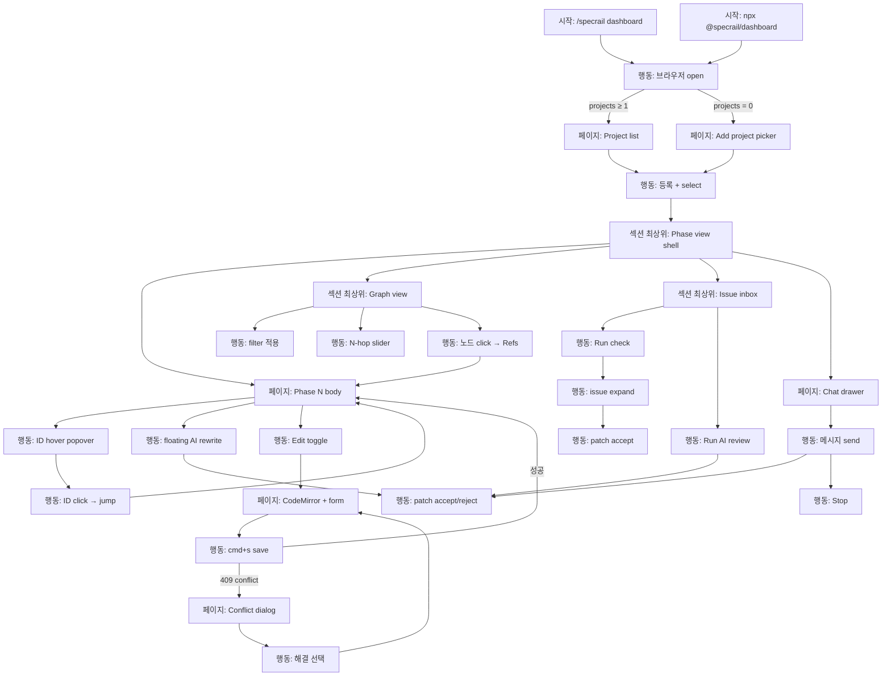

# User Flow

**Mode:** HOLD SCOPE (inherited)
**Inputs:** Phase 1 §3.2 Role (single-user), Phase 3 Spec ID, Phase 4 ENT/SM
**Date:** 2026-05-17

## 1. Section 목록

| Section ID | 이름 | 포함 시나리오 |
|---|---|---|
| SEC-1 | Bootstrap & Project entry | SCEN-1·2·3 (공통 진입) |
| SEC-2 | Phase view & navigation | SCEN-1 |
| SEC-3 | Graph exploration | SCEN-3 |
| SEC-4 | Issue inbox & quality | SCEN-2 (전), SCEN-3 |
| SEC-5 | AI interaction (chat·inline·scan) | SCEN-2 (전), SCEN-3 |
| SEC-6 | Edit & save | SCEN-2 (보조), 일반 |

## 2. Node Catalog

### SEC-1: Bootstrap & Project entry

<!-- specrail:attrs id=FLN-1 -->
```yaml
status: Approved
scenario: "bootstrap"
step-order: 1
surface: dashboard
```
<!-- /specrail:attrs -->
<!-- specrail:attrs id=FLN-2 -->
```yaml
status: Approved
scenario: "bootstrap"
step-order: 2
surface: dashboard
```
<!-- /specrail:attrs -->
<!-- specrail:attrs id=FLN-3 -->
```yaml
status: Approved
scenario: "bootstrap"
step-order: 3
surface: dashboard
```
<!-- /specrail:attrs -->
<!-- specrail:attrs id=FLN-4 -->
```yaml
status: Approved
scenario: "bootstrap"
step-order: 4
surface: dashboard
```
<!-- /specrail:attrs -->
<!-- specrail:attrs id=FLN-5 -->
```yaml
status: Approved
scenario: "bootstrap"
step-order: 5
surface: dashboard
```
<!-- /specrail:attrs -->
<!-- specrail:attrs id=FLN-6 -->
```yaml
status: Approved
scenario: "bootstrap"
step-order: 6
surface: dashboard
```
<!-- /specrail:attrs -->

| Node ID | Type | 이름 | Spec | SM 영향 |
|---|---|---|---|---|
| FLN-1 | 시작 | `/specrail dashboard` slash command | - | - |
| FLN-2 | 시작 | `npx @specrail/dashboard --project <path>` 직접 호출 | - | - |
| FLN-3 | 행동 | 브라우저 자동 open (localhost:random) | - | - |
| FLN-4 | 페이지 | Project list landing (등록된 project 0개면 onboarding) | S1.4.1 | - |
| FLN-5 | 페이지 | "Add project" picker | S1.4.2 | - |
| FLN-6 | 행동 | Project select → 활성 전환 | S1.4.1 | - |

### SEC-2: Phase view & navigation

<!-- specrail:attrs id=FLN-10 -->
```yaml
status: Approved
scenario: SCEN-1
step-order: 10
surface: dashboard
```
<!-- /specrail:attrs -->
<!-- specrail:attrs id=FLN-11 -->
```yaml
status: Approved
scenario: SCEN-1
step-order: 11
surface: dashboard
```
<!-- /specrail:attrs -->
<!-- specrail:attrs id=FLN-12 -->
```yaml
status: Approved
scenario: SCEN-1
step-order: 12
surface: dashboard
```
<!-- /specrail:attrs -->
<!-- specrail:attrs id=FLN-13 -->
```yaml
status: Approved
scenario: SCEN-1
step-order: 13
surface: dashboard
```
<!-- /specrail:attrs -->
<!-- specrail:attrs id=FLN-14 -->
```yaml
status: Approved
scenario: SCEN-1
step-order: 14
surface: dashboard
```
<!-- /specrail:attrs -->

| Node ID | Type | 이름 | Spec | SM 영향 |
|---|---|---|---|---|
| FLN-10 | 섹션 최상위 페이지 | Phase view shell (sidebar + main + drawer) | S1.1.1, S1.1.2 | - |
| FLN-11 | 페이지 | Phase N 본문 렌더 (read mode) | S1.1.1, S1.2.1-3 | - |
| FLN-12 | 행동 | ID hover → popover | S1.2.2 | - |
| FLN-13 | 행동 | ID click → 정의처 phase jump | S1.2.3 | - |
| FLN-14 | 행동 | cmd+k quick switcher 열기 | S1.3.1 | - |

### SEC-3: Graph exploration

<!-- specrail:attrs id=FLN-20 -->
```yaml
status: Approved
scenario: SCEN-3
step-order: 20
surface: dashboard
```
<!-- /specrail:attrs -->
<!-- specrail:attrs id=FLN-21 -->
```yaml
status: Approved
scenario: SCEN-3
step-order: 21
surface: dashboard
```
<!-- /specrail:attrs -->
<!-- specrail:attrs id=FLN-22 -->
```yaml
status: Approved
scenario: SCEN-3
step-order: 22
surface: dashboard
```
<!-- /specrail:attrs -->
<!-- specrail:attrs id=FLN-23 -->
```yaml
status: Approved
scenario: SCEN-3
step-order: 23
surface: dashboard
```
<!-- /specrail:attrs -->

| Node ID | Type | 이름 | Spec | SM 영향 |
|---|---|---|---|---|
| FLN-20 | 섹션 최상위 페이지 | Graph view (React Flow) | S2.2.1 | - |
| FLN-21 | 행동 | Filter 적용 (phase·prefix·orphan) | S2.2.2 | - |
| FLN-22 | 행동 | N-hop slider 조작 | S2.3.1 | - |
| FLN-23 | 행동 | 노드 click → Refs tab + "Open in phase view" | S2.1.2 | - |

### SEC-4: Issue inbox & quality

<!-- specrail:attrs id=FLN-30 -->
```yaml
status: Approved
scenario: SCEN-3
step-order: 30
surface: dashboard
```
<!-- /specrail:attrs -->
<!-- specrail:attrs id=FLN-31 -->
```yaml
status: Approved
scenario: SCEN-3
step-order: 31
surface: dashboard
```
<!-- /specrail:attrs -->
<!-- specrail:attrs id=FLN-32 -->
```yaml
status: Approved
scenario: SCEN-3
step-order: 32
surface: dashboard
```
<!-- /specrail:attrs -->
<!-- specrail:attrs id=FLN-33 -->
```yaml
status: Approved
scenario: SCEN-3
step-order: 33
surface: dashboard
```
<!-- /specrail:attrs -->

| Node ID | Type | 이름 | Spec | SM 영향 |
|---|---|---|---|---|
| FLN-30 | 섹션 최상위 페이지 | Issue inbox (filter + list) | S3.3.1 | - |
| FLN-31 | 행동 | "Run check" → 결정적 검사 enqueue | S3.1.1, S3.2.1-4 | SM-Issue: detected→Open |
| FLN-32 | 행동 | Issue 펼치기 (line/patch preview) | S3.3.1 | - |
| FLN-33 | 행동 | Patch accept | S3.3.2, S4.4.3 | SM-PatchProposal: Proposed→Accepted, SM-Issue: Open→Resolved |

### SEC-5: AI interaction

<!-- specrail:attrs id=FLN-40 -->
```yaml
status: Approved
scenario: SCEN-2
step-order: 40
surface: dashboard
```
<!-- /specrail:attrs -->
<!-- specrail:attrs id=FLN-41 -->
```yaml
status: Approved
scenario: SCEN-2
step-order: 41
surface: dashboard
```
<!-- /specrail:attrs -->
<!-- specrail:attrs id=FLN-42 -->
```yaml
status: Approved
scenario: SCEN-2
step-order: 42
surface: dashboard
```
<!-- /specrail:attrs -->
<!-- specrail:attrs id=FLN-43 -->
```yaml
status: Approved
scenario: SCEN-2
step-order: 43
surface: dashboard
```
<!-- /specrail:attrs -->
<!-- specrail:attrs id=FLN-44 -->
```yaml
status: Approved
scenario: SCEN-2
step-order: 44
surface: dashboard
```
<!-- /specrail:attrs -->
<!-- specrail:attrs id=FLN-45 -->
```yaml
status: Approved
scenario: SCEN-2
step-order: 45
surface: dashboard
```
<!-- /specrail:attrs -->

| Node ID | Type | 이름 | Spec | SM 영향 |
|---|---|---|---|---|
| FLN-40 | 행동 | Issue inbox "Run AI review" | S4.1.1 | SM-AiSession: Idle→Streaming |
| FLN-41 | 행동 | Phase view 선택 텍스트 → floating menu "AI: rewrite" | S4.3.1 | SM-AiSession: Idle→Streaming |
| FLN-42 | 페이지 | Chat drawer (우측 sidebar) | S4.2.1 | - |
| FLN-43 | 행동 | Chat 메시지 send | S4.2.1, S4.2.2 | SM-AiSession: Idle/Done→Streaming |
| FLN-44 | 행동 | AI 응답 stream 중 Stop | S4.1.2 | SM-AiSession: Streaming→Idle (abort) |
| FLN-45 | 행동 | Patch preview accept/reject (inline diff card) | S4.3.2, S4.4.3 | SM-PatchProposal: Proposed→Accepted/Rejected |

### SEC-6: Edit & save

<!-- specrail:attrs id=FLN-50 -->
```yaml
status: Approved
scenario: SCEN-2
step-order: 50
surface: dashboard
```
<!-- /specrail:attrs -->
<!-- specrail:attrs id=FLN-51 -->
```yaml
status: Approved
scenario: SCEN-2
step-order: 51
surface: dashboard
```
<!-- /specrail:attrs -->
<!-- specrail:attrs id=FLN-52 -->
```yaml
status: Approved
scenario: SCEN-2
step-order: 52
surface: dashboard
```
<!-- /specrail:attrs -->
<!-- specrail:attrs id=FLN-53 -->
```yaml
status: Approved
scenario: SCEN-2
step-order: 53
surface: dashboard
```
<!-- /specrail:attrs -->
<!-- specrail:attrs id=FLN-54 -->
```yaml
status: Approved
scenario: SCEN-2
step-order: 54
surface: dashboard
```
<!-- /specrail:attrs -->

| Node ID | Type | 이름 | Spec | SM 영향 |
|---|---|---|---|---|
| FLN-50 | 행동 | Phase view toolbar [Read]/[Edit] toggle | S5.1.1 | - |
| FLN-51 | 페이지 | CodeMirror 6 editor + frontmatter form | S5.1.1, S5.2.1, S5.2.2 | - |
| FLN-52 | 행동 | cmd+s save → atomic write | S5.3.1 | SM-PatchProposal: (manual edit 도 Patch wrapper, accept) |
| FLN-53 | 페이지 | Conflict dialog (409) | S6.3.1 | SM-PatchProposal: Proposed→Stale |
| FLN-54 | 행동 | Conflict 해결 선택 (외부 보기 / 강제 / 취소) | S6.3.1 | SM-PatchProposal: Stale→Rejected or Proposed |

## 3. Edge Catalog

<!-- specrail:attrs id=FLE-1 -->
```yaml
status: Approved
from: FLN-1
to: FLN-3
```
<!-- /specrail:attrs -->
<!-- specrail:attrs id=FLE-2 -->
```yaml
status: Approved
from: FLN-2
to: FLN-3
```
<!-- /specrail:attrs -->
<!-- specrail:attrs id=FLE-3 -->
```yaml
status: Approved
from: FLN-3
to: FLN-4
```
<!-- /specrail:attrs -->
<!-- specrail:attrs id=FLE-4 -->
```yaml
status: Approved
from: FLN-3
to: FLN-5
```
<!-- /specrail:attrs -->
<!-- specrail:attrs id=FLE-5 -->
```yaml
status: Approved
from: FLN-5
to: FLN-6
```
<!-- /specrail:attrs -->
<!-- specrail:attrs id=FLE-6 -->
```yaml
status: Approved
from: FLN-6
to: FLN-10
```
<!-- /specrail:attrs -->
<!-- specrail:attrs id=FLE-7 -->
```yaml
status: Approved
from: FLN-10
to: FLN-11
```
<!-- /specrail:attrs -->
<!-- specrail:attrs id=FLE-8 -->
```yaml
status: Approved
from: FLN-11
to: FLN-12
```
<!-- /specrail:attrs -->
<!-- specrail:attrs id=FLE-9 -->
```yaml
status: Approved
from: FLN-12
to: FLN-13
```
<!-- /specrail:attrs -->
<!-- specrail:attrs id=FLE-10 -->
```yaml
status: Approved
from: FLN-11
to: FLN-20
```
<!-- /specrail:attrs -->
<!-- specrail:attrs id=FLE-11 -->
```yaml
status: Approved
from: FLN-20
to: FLN-23
```
<!-- /specrail:attrs -->
<!-- specrail:attrs id=FLE-12 -->
```yaml
status: Approved
from: FLN-23
to: FLN-11
```
<!-- /specrail:attrs -->
<!-- specrail:attrs id=FLE-13 -->
```yaml
status: Approved
from: FLN-10
to: FLN-30
```
<!-- /specrail:attrs -->
<!-- specrail:attrs id=FLE-14 -->
```yaml
status: Approved
from: FLN-31
to: FLN-32
```
<!-- /specrail:attrs -->
<!-- specrail:attrs id=FLE-15 -->
```yaml
status: Approved
from: FLN-32
to: FLN-33
```
<!-- /specrail:attrs -->
<!-- specrail:attrs id=FLE-16 -->
```yaml
status: Approved
from: FLN-30
to: FLN-40
```
<!-- /specrail:attrs -->
<!-- specrail:attrs id=FLE-17 -->
```yaml
status: Approved
from: FLN-40
to: FLN-45
```
<!-- /specrail:attrs -->
<!-- specrail:attrs id=FLE-18 -->
```yaml
status: Approved
from: FLN-11
to: FLN-41
```
<!-- /specrail:attrs -->
<!-- specrail:attrs id=FLE-19 -->
```yaml
status: Approved
from: FLN-11
to: FLN-50
```
<!-- /specrail:attrs -->
<!-- specrail:attrs id=FLE-20 -->
```yaml
status: Approved
from: FLN-52
to: FLN-53
```
<!-- /specrail:attrs -->

| Edge ID | From | To | 조건 |
|---|---|---|---|
| FLE-1 | FLN-1 | FLN-3 | slash command 실행, dashboard 미실행 시 spawn |
| FLE-2 | FLN-2 | FLN-3 | npx 실행 |
| FLE-3 | FLN-3 | FLN-4 | 브라우저 open 성공, registry projects.length ≥ 1 |
| FLE-4 | FLN-3 | FLN-5 | 브라우저 open 성공, registry projects.length == 0 |
| FLE-5 | FLN-5 | FLN-6 | path 입력 + validation 통과 (INV-PROJECT-1) |
| FLE-6 | FLN-6 | FLN-10 | active project 설정 |
| FLE-7 | FLN-10 | FLN-11 | phase N 선택 |
| FLE-8 | FLN-11 | FLN-12 | ID hover 발생 |
| FLE-9 | FLN-12 | FLN-13 | popover 안 link click |
| FLE-10 | FLN-11 | FLN-20 | sidebar "Graph" click 또는 `g g` |
| FLE-11 | FLN-20 | FLN-23 | 노드 click |
| FLE-12 | FLN-23 | FLN-11 | "Open in phase view" click |
| FLE-13 | FLN-10 | FLN-30 | "Issues" tab 또는 `g i` |
| FLE-14 | FLN-31 | FLN-32 | issues.updated SSE 수신 + 사용자 issue 선택 |
| FLE-15 | FLN-32 | FLN-33 | patch 첨부 시 Accept click |
| FLE-16 | FLN-30 | FLN-40 | "Run AI review" click |
| FLE-17 | FLN-40 | FLN-45 | AI 응답에 patch 포함, parse 성공 |
| FLE-18 | FLN-11 | FLN-41 | text selection + floating menu "AI: rewrite" |
| FLE-19 | FLN-11 | FLN-50 | toolbar [Edit] toggle |
| FLE-20 | FLN-52 | FLN-53 | atomic write 시 mtime mismatch (409) |

## 4. Mermaid Graph (전체)



## 5. Dead End / Loop 검증

- **Dead ends:** 없음. FLN-53 (conflict) 도 FLN-54 거쳐 FLN-51 로 복귀.
- **의도된 loop:** FLN-11 → FLN-12/013 → FLN-11 (탐색), FLN-51 → FLN-52 → FLN-51 (편집 저장). 무한 X.
- **의도치 않은 loop:** 없음. 모든 SEC 의 entrypoint → action → page 경로가 acyclic 으로 검증됨 (mermaid graph §4 의 모든 edge 추적).

## 6. SM 전이 매핑 표

| SM 전이 | 일으키는 Node | Edge |
|---|---|---|
| SM-Issue: detected→Open | FLN-31 (Run check) | FLE-14 |
| SM-Issue: Open→Resolved | FLN-33 (Patch accept) | (post-accept) |
| SM-PatchProposal: Proposed→Accepted | FLN-33, FLN-45, FLN-52 | FLE-15 외 |
| SM-PatchProposal: Proposed→Rejected | FLN-45, FLN-54 | - |
| SM-PatchProposal: Proposed→Stale | FLN-52 (409) | FLE-20 |
| SM-AiSession: Idle→Streaming | FLN-40, FLN-41, FLN-43 | FLE-16, FLE-18 |
| SM-AiSession: Streaming→Done | (claude exit 0) | system |
| SM-AiSession: Streaming→Error | (claude exit !=0 / timeout) | system |
| SM-AiSession: Streaming→Idle | FLN-44 (Stop) | - |

## 7. Open Questions

| Q ID | 질문 | 결정자 | Blocking? |
|---|---|---|---|
| OQ-5-1 | FLN-14 quick switcher 가 Phase 외에 Issue/Project 도 검색 대상? | maintainer | N |
| OQ-5-2 | FLN-53 conflict dialog 에서 "강제 적용" 선택지 노출 vs 안전 위해 제거 | maintainer | Y |

<!-- specrail:attrs id=OQ-5-1 -->
```yaml
blocking: false
decider: maintainer
due: "Phase 7"
```
<!-- /specrail:attrs -->

<!-- specrail:attrs id=OQ-5-2 -->
```yaml
blocking: true
decider: maintainer
due: "Phase 7"
```
<!-- /specrail:attrs -->

## 8. 다음 phase 인풋

- **Phase 6 (IA):** Section 6개 → navigation hierarchy
- **Phase 7 (Wireframe):** Node 별 layout (특히 FLN-10 shell, FLN-20 graph, FLN-30 inbox, FLN-42 chat, FLN-53 dialog)
- **Phase 8 (Architecture):** Edge 의 비동기 / SSE / mutation 분류 → API 분류
- **Phase 10 (Test):** 핵심 path (FLN-1→FLN-11→FLN-31→FLN-33) E2E
