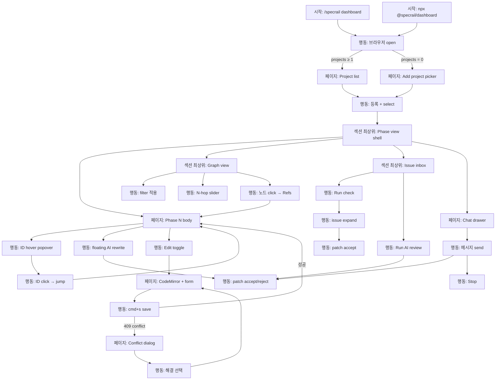

# User Flow

**Mode:** HOLD SCOPE (inherited)
**Inputs:** Phase 1 §3.2 Role (single-user), Phase 3 Spec ID, Phase 4 ENT/SM
**Date:** 2026-05-17

## 1. Section 목록

<!-- specrail:attrs id=SEC-1 --> ```yaml
status: Approved
``` <!-- /specrail:attrs -->
<!-- specrail:attrs id=SEC-2 --> ```yaml
status: Approved
``` <!-- /specrail:attrs -->
<!-- specrail:attrs id=SEC-3 --> ```yaml
status: Approved
``` <!-- /specrail:attrs -->
<!-- specrail:attrs id=SEC-4 --> ```yaml
status: Approved
``` <!-- /specrail:attrs -->
<!-- specrail:attrs id=SEC-5 --> ```yaml
status: Approved
``` <!-- /specrail:attrs -->
<!-- specrail:attrs id=SEC-6 --> ```yaml
status: Approved
``` <!-- /specrail:attrs -->

| Section ID | 이름 | 포함 시나리오 |
|---|---|---|
| SEC-1 | Bootstrap & Project entry | SCEN-1·2·3 (공통 진입) |
| SEC-2 | Phase view & navigation | SCEN-1 |
| SEC-3 | Graph exploration | SCEN-3 |
| SEC-4 | Issue inbox & quality | SCEN-2 (전), SCEN-3 |
| SEC-5 | AI interaction (chat·inline·scan) | SCEN-2 (전), SCEN-3 |
| SEC-6 | Edit & save | SCEN-2 (보조), 일반 |

## 2. Node Catalog

### SEC-1: Bootstrap & Project entry

<!-- specrail:attrs id=N-001 --> ```yaml
type: 시작
status: Approved
``` <!-- /specrail:attrs -->
<!-- specrail:attrs id=N-002 --> ```yaml
type: 시작
status: Approved
``` <!-- /specrail:attrs -->
<!-- specrail:attrs id=N-003 --> ```yaml
type: 행동
status: Approved
``` <!-- /specrail:attrs -->
<!-- specrail:attrs id=N-004 --> ```yaml
type: 페이지
status: Approved
``` <!-- /specrail:attrs -->
<!-- specrail:attrs id=N-005 --> ```yaml
type: 페이지
status: Approved
``` <!-- /specrail:attrs -->
<!-- specrail:attrs id=N-006 --> ```yaml
type: 행동
status: Approved
``` <!-- /specrail:attrs -->

| Node ID | Type | 이름 | Spec | SM 영향 |
|---|---|---|---|---|
| N-001 | 시작 | `/specrail dashboard` slash command | - | - |
| N-002 | 시작 | `npx @specrail/dashboard --project <path>` 직접 호출 | - | - |
| N-003 | 행동 | 브라우저 자동 open (localhost:random) | - | - |
| N-004 | 페이지 | Project list landing (등록된 project 0개면 onboarding) | S1.4.1 | - |
| N-005 | 페이지 | "Add project" picker | S1.4.2 | - |
| N-006 | 행동 | Project select → 활성 전환 | S1.4.1 | - |

### SEC-2: Phase view & navigation

<!-- specrail:attrs id=N-010 --> ```yaml
type: 섹션 최상위 페이지
status: Approved
``` <!-- /specrail:attrs -->
<!-- specrail:attrs id=N-011 --> ```yaml
type: 페이지
status: Approved
``` <!-- /specrail:attrs -->
<!-- specrail:attrs id=N-012 --> ```yaml
type: 행동
status: Approved
``` <!-- /specrail:attrs -->
<!-- specrail:attrs id=N-013 --> ```yaml
type: 행동
status: Approved
``` <!-- /specrail:attrs -->
<!-- specrail:attrs id=N-014 --> ```yaml
type: 행동
status: Approved
``` <!-- /specrail:attrs -->

| Node ID | Type | 이름 | Spec | SM 영향 |
|---|---|---|---|---|
| N-010 | 섹션 최상위 페이지 | Phase view shell (sidebar + main + drawer) | S1.1.1, S1.1.2 | - |
| N-011 | 페이지 | Phase N 본문 렌더 (read mode) | S1.1.1, S1.2.1-3 | - |
| N-012 | 행동 | ID hover → popover | S1.2.2 | - |
| N-013 | 행동 | ID click → 정의처 phase jump | S1.2.3 | - |
| N-014 | 행동 | cmd+k quick switcher 열기 | S1.3.1 | - |

### SEC-3: Graph exploration

<!-- specrail:attrs id=N-020 --> ```yaml
type: 섹션 최상위 페이지
status: Approved
``` <!-- /specrail:attrs -->
<!-- specrail:attrs id=N-021 --> ```yaml
type: 행동
status: Approved
``` <!-- /specrail:attrs -->
<!-- specrail:attrs id=N-022 --> ```yaml
type: 행동
status: Approved
``` <!-- /specrail:attrs -->
<!-- specrail:attrs id=N-023 --> ```yaml
type: 행동
status: Approved
``` <!-- /specrail:attrs -->

| Node ID | Type | 이름 | Spec | SM 영향 |
|---|---|---|---|---|
| N-020 | 섹션 최상위 페이지 | Graph view (React Flow) | S2.2.1 | - |
| N-021 | 행동 | Filter 적용 (phase·prefix·orphan) | S2.2.2 | - |
| N-022 | 행동 | N-hop slider 조작 | S2.3.1 | - |
| N-023 | 행동 | 노드 click → Refs tab + "Open in phase view" | S2.1.2 | - |

### SEC-4: Issue inbox & quality

<!-- specrail:attrs id=N-030 --> ```yaml
type: 섹션 최상위 페이지
status: Approved
``` <!-- /specrail:attrs -->
<!-- specrail:attrs id=N-031 --> ```yaml
type: 행동
status: Approved
``` <!-- /specrail:attrs -->
<!-- specrail:attrs id=N-032 --> ```yaml
type: 행동
status: Approved
``` <!-- /specrail:attrs -->
<!-- specrail:attrs id=N-033 --> ```yaml
type: 행동
status: Approved
``` <!-- /specrail:attrs -->

| Node ID | Type | 이름 | Spec | SM 영향 |
|---|---|---|---|---|
| N-030 | 섹션 최상위 페이지 | Issue inbox (filter + list) | S3.3.1 | - |
| N-031 | 행동 | "Run check" → 결정적 검사 enqueue | S3.1.1, S3.2.1-4 | SM-Issue: detected→Open |
| N-032 | 행동 | Issue 펼치기 (line/patch preview) | S3.3.1 | - |
| N-033 | 행동 | Patch accept | S3.3.2, S4.4.3 | SM-PatchProposal: Proposed→Accepted, SM-Issue: Open→Resolved |

### SEC-5: AI interaction

<!-- specrail:attrs id=N-040 --> ```yaml
type: 행동
status: Approved
``` <!-- /specrail:attrs -->
<!-- specrail:attrs id=N-041 --> ```yaml
type: 행동
status: Approved
``` <!-- /specrail:attrs -->
<!-- specrail:attrs id=N-042 --> ```yaml
type: 페이지
status: Approved
``` <!-- /specrail:attrs -->
<!-- specrail:attrs id=N-043 --> ```yaml
type: 행동
status: Approved
``` <!-- /specrail:attrs -->
<!-- specrail:attrs id=N-044 --> ```yaml
type: 행동
status: Approved
``` <!-- /specrail:attrs -->
<!-- specrail:attrs id=N-045 --> ```yaml
type: 행동
status: Approved
``` <!-- /specrail:attrs -->

| Node ID | Type | 이름 | Spec | SM 영향 |
|---|---|---|---|---|
| N-040 | 행동 | Issue inbox "Run AI review" | S4.1.1 | SM-AiSession: Idle→Streaming |
| N-041 | 행동 | Phase view 선택 텍스트 → floating menu "AI: rewrite" | S4.3.1 | SM-AiSession: Idle→Streaming |
| N-042 | 페이지 | Chat drawer (우측 sidebar) | S4.2.1 | - |
| N-043 | 행동 | Chat 메시지 send | S4.2.1, S4.2.2 | SM-AiSession: Idle/Done→Streaming |
| N-044 | 행동 | AI 응답 stream 중 Stop | S4.1.2 | SM-AiSession: Streaming→Idle (abort) |
| N-045 | 행동 | Patch preview accept/reject (inline diff card) | S4.3.2, S4.4.3 | SM-PatchProposal: Proposed→Accepted/Rejected |

### SEC-6: Edit & save

<!-- specrail:attrs id=N-050 --> ```yaml
type: 행동
status: Approved
``` <!-- /specrail:attrs -->
<!-- specrail:attrs id=N-051 --> ```yaml
type: 페이지
status: Approved
``` <!-- /specrail:attrs -->
<!-- specrail:attrs id=N-052 --> ```yaml
type: 행동
status: Approved
``` <!-- /specrail:attrs -->
<!-- specrail:attrs id=N-053 --> ```yaml
type: 페이지
status: Approved
``` <!-- /specrail:attrs -->
<!-- specrail:attrs id=N-054 --> ```yaml
type: 행동
status: Approved
``` <!-- /specrail:attrs -->

| Node ID | Type | 이름 | Spec | SM 영향 |
|---|---|---|---|---|
| N-050 | 행동 | Phase view toolbar [Read]/[Edit] toggle | S5.1.1 | - |
| N-051 | 페이지 | CodeMirror 6 editor + frontmatter form | S5.1.1, S5.2.1, S5.2.2 | - |
| N-052 | 행동 | cmd+s save → atomic write | S5.3.1 | SM-PatchProposal: (manual edit 도 Patch wrapper, accept) |
| N-053 | 페이지 | Conflict dialog (409) | S6.3.1 | SM-PatchProposal: Proposed→Stale |
| N-054 | 행동 | Conflict 해결 선택 (외부 보기 / 강제 / 취소) | S6.3.1 | SM-PatchProposal: Stale→Rejected or Proposed |

## 3. Edge Catalog

<!-- specrail:attrs id=E-001 --> ```yaml
status: Approved
``` <!-- /specrail:attrs -->
<!-- specrail:attrs id=E-002 --> ```yaml
status: Approved
``` <!-- /specrail:attrs -->
<!-- specrail:attrs id=E-003 --> ```yaml
status: Approved
``` <!-- /specrail:attrs -->
<!-- specrail:attrs id=E-004 --> ```yaml
status: Approved
``` <!-- /specrail:attrs -->
<!-- specrail:attrs id=E-005 --> ```yaml
status: Approved
``` <!-- /specrail:attrs -->
<!-- specrail:attrs id=E-006 --> ```yaml
status: Approved
``` <!-- /specrail:attrs -->
<!-- specrail:attrs id=E-007 --> ```yaml
status: Approved
``` <!-- /specrail:attrs -->
<!-- specrail:attrs id=E-008 --> ```yaml
status: Approved
``` <!-- /specrail:attrs -->
<!-- specrail:attrs id=E-009 --> ```yaml
status: Approved
``` <!-- /specrail:attrs -->
<!-- specrail:attrs id=E-010 --> ```yaml
status: Approved
``` <!-- /specrail:attrs -->
<!-- specrail:attrs id=E-011 --> ```yaml
status: Approved
``` <!-- /specrail:attrs -->
<!-- specrail:attrs id=E-012 --> ```yaml
status: Approved
``` <!-- /specrail:attrs -->
<!-- specrail:attrs id=E-013 --> ```yaml
status: Approved
``` <!-- /specrail:attrs -->
<!-- specrail:attrs id=E-014 --> ```yaml
status: Approved
``` <!-- /specrail:attrs -->
<!-- specrail:attrs id=E-015 --> ```yaml
status: Approved
``` <!-- /specrail:attrs -->
<!-- specrail:attrs id=E-016 --> ```yaml
status: Approved
``` <!-- /specrail:attrs -->
<!-- specrail:attrs id=E-017 --> ```yaml
status: Approved
``` <!-- /specrail:attrs -->
<!-- specrail:attrs id=E-018 --> ```yaml
status: Approved
``` <!-- /specrail:attrs -->
<!-- specrail:attrs id=E-019 --> ```yaml
status: Approved
``` <!-- /specrail:attrs -->
<!-- specrail:attrs id=E-020 --> ```yaml
status: Approved
``` <!-- /specrail:attrs -->

| Edge ID | From | To | 조건 |
|---|---|---|---|
| E-001 | N-001 | N-003 | slash command 실행, dashboard 미실행 시 spawn |
| E-002 | N-002 | N-003 | npx 실행 |
| E-003 | N-003 | N-004 | 브라우저 open 성공, registry projects.length ≥ 1 |
| E-004 | N-003 | N-005 | 브라우저 open 성공, registry projects.length == 0 |
| E-005 | N-005 | N-006 | path 입력 + validation 통과 (INV-PROJECT-1) |
| E-006 | N-006 | N-010 | active project 설정 |
| E-007 | N-010 | N-011 | phase N 선택 |
| E-008 | N-011 | N-012 | ID hover 발생 |
| E-009 | N-012 | N-013 | popover 안 link click |
| E-010 | N-011 | N-020 | sidebar "Graph" click 또는 `g g` |
| E-011 | N-020 | N-023 | 노드 click |
| E-012 | N-023 | N-011 | "Open in phase view" click |
| E-013 | N-010 | N-030 | "Issues" tab 또는 `g i` |
| E-014 | N-031 | N-032 | issues.updated SSE 수신 + 사용자 issue 선택 |
| E-015 | N-032 | N-033 | patch 첨부 시 Accept click |
| E-016 | N-030 | N-040 | "Run AI review" click |
| E-017 | N-040 | N-045 | AI 응답에 patch 포함, parse 성공 |
| E-018 | N-011 | N-041 | text selection + floating menu "AI: rewrite" |
| E-019 | N-011 | N-050 | toolbar [Edit] toggle |
| E-020 | N-052 | N-053 | atomic write 시 mtime mismatch (409) |

## 4. Mermaid Graph (전체)



## 5. Dead End / Loop 검증

- **Dead ends:** 없음. N-053 (conflict) 도 N-054 거쳐 N-051 로 복귀.
- **의도된 loop:** N-011 → N-012/013 → N-011 (탐색), N-051 → N-052 → N-051 (편집 저장). 무한 X.
- **의도치 않은 loop:** 없음 (검사 완료).

## 6. SM 전이 매핑 표

| SM 전이 | 일으키는 Node | Edge |
|---|---|---|
| SM-Issue: detected→Open | N-031 (Run check) | E-014 |
| SM-Issue: Open→Resolved | N-033 (Patch accept) | (post-accept) |
| SM-PatchProposal: Proposed→Accepted | N-033, N-045, N-052 | E-015 외 |
| SM-PatchProposal: Proposed→Rejected | N-045, N-054 | - |
| SM-PatchProposal: Proposed→Stale | N-052 (409) | E-020 |
| SM-AiSession: Idle→Streaming | N-040, N-041, N-043 | E-016, E-018 |
| SM-AiSession: Streaming→Done | (claude exit 0) | system |
| SM-AiSession: Streaming→Error | (claude exit !=0 / timeout) | system |
| SM-AiSession: Streaming→Idle | N-044 (Stop) | - |

## 7. Open Questions

| Q ID | 질문 | 결정자 | Blocking? |
|---|---|---|---|
| OQ-5-1 | N-014 quick switcher 가 Phase 외에 Issue/Project 도 검색 대상? | maintainer | N |
| OQ-5-2 | N-053 conflict dialog 에서 "강제 적용" 선택지 노출 vs 안전 위해 제거 | maintainer | Y |

<!-- specrail:attrs id=OQ-5-1 --> ```yaml
blocking: false
decider: maintainer
defer-to: "Phase 7"
``` <!-- /specrail:attrs -->

<!-- specrail:attrs id=OQ-5-2 --> ```yaml
blocking: true
decider: maintainer
defer-to: "Phase 7"
``` <!-- /specrail:attrs -->

## 8. 다음 phase 인풋

- **Phase 6 (IA):** Section 6개 → navigation hierarchy
- **Phase 7 (Wireframe):** Node 별 layout (특히 N-010 shell, N-020 graph, N-030 inbox, N-042 chat, N-053 dialog)
- **Phase 8 (Architecture):** Edge 의 비동기 / SSE / mutation 분류 → API 분류
- **Phase 10 (Test):** 핵심 path (N-001→N-011→N-031→N-033) E2E
