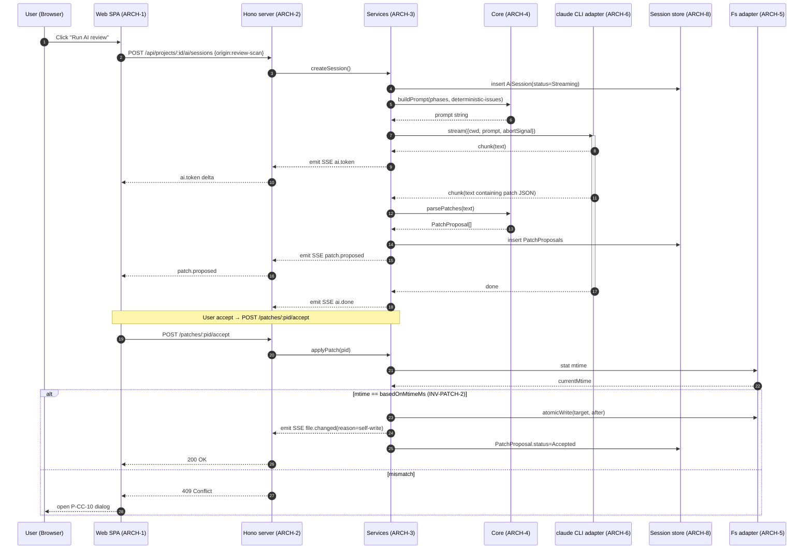

# System Architecture

**Mode:** HOLD SCOPE (inherited)
**Inputs:** PRD §5 (OSS local web app, desktop), Phase 3 R1-R6, Phase 4 ENT-Project / ENT-Phase / ENT-Issue / ENT-PatchProposal / ENT-AiSession / ENT-Registry / ENT-FileWatcherSubscription
**Date:** 2026-05-17

## 1. C4 L1: System Context

```mermaid
flowchart TB
    User([PERSONA-1<br/>Spec-Driven Builder])
    System[("specrail dashboard<br/>local web app")]

    Ext1[/Claude Code CLI<br/>EXT-1/]
    Ext2[/Local filesystem<br/>(spec markdown + cache)<br/>EXT-2/]
    Ext3[/Browser<br/>(chrome/arc/safari)<br/>EXT-3/]
    Ext4[/npm registry<br/>(update check)<br/>EXT-4/]

    User -->|HTTP localhost + SSE| Ext3
    Ext3 -->|fetch / EventSource| System
    System -->|spawn execa| Ext1
    System -->|fs read/write/watch| Ext2
    System -->|HEAD npm/@specrail/dashboard| Ext4
```

본 시스템은 single binary, single user, single host. 외부 hosted service 의존 0.

## 2. C4 L2: Container

```mermaid
flowchart TB
    subgraph "Browser (사용자 영역)"
        Web([Web SPA<br/>ARCH-1])
    end

    subgraph "Local Node.js process (specrail-dashboard)"
        HTTP[Hono HTTP/SSE server<br/>ARCH-2]
        Services[Use-case services<br/>ARCH-3]
        Core[core domain library<br/>ARCH-4]

        subgraph "Adapters"
            FsAdapter[Filesystem adapter<br/>+ chokidar watcher<br/>ARCH-5]
            CliAdapter[claude CLI adapter<br/>(execa, stream-json)<br/>ARCH-6]
            RegistryAdapter[Registry adapter<br/>(JSON, env-paths)<br/>ARCH-7]
            SessionStore[Session store<br/>(SQLite, better-sqlite3)<br/>ARCH-8<br/>ADR-CAND-1]
        end
    end

    Web -->|HTTP JSON · SSE event stream · CSRF| HTTP
    HTTP --> Services
    Services --> Core
    Services --> FsAdapter
    Services --> CliAdapter
    Services --> RegistryAdapter
    Services --> SessionStore

    FsAdapter -.->|spec dir| FS[(local fs<br/>docs/spec/*.md)]
    CliAdapter -.->|spawn| CLI[(claude binary)]
    RegistryAdapter -.->|read/write| RegistryFile[(env-paths/registry.json)]
    SessionStore -.->|read/write| SqliteFile[(env-paths/<projectId>/sessions.sqlite)]
```

## 3. Container Catalog

<!-- specrail:attrs id=ARCH-1 -->
```yaml
status: Approved
c4-level: container
linked-r: [R1, R2, R3, R4, R5, R6]
```
<!-- /specrail:attrs -->

<!-- specrail:attrs id=ARCH-2 -->
```yaml
status: Approved
c4-level: container
linked-r: [R1, R3, R4, R5, R6]
linked-ext: [EXT-3]
```
<!-- /specrail:attrs -->

<!-- specrail:attrs id=ARCH-3 -->
```yaml
status: Approved
c4-level: container
linked-r: [R1, R2, R3, R4, R5, R6]
```
<!-- /specrail:attrs -->

<!-- specrail:attrs id=ARCH-4 -->
```yaml
status: Approved
c4-level: container
linked-r: [R1, R2, R3, R5]
```
<!-- /specrail:attrs -->

<!-- specrail:attrs id=ARCH-5 -->
```yaml
status: Approved
c4-level: container
linked-r: [R5, R6]
linked-ext: [EXT-2]
```
<!-- /specrail:attrs -->

<!-- specrail:attrs id=ARCH-6 -->
```yaml
status: Approved
c4-level: container
linked-r: [R4]
linked-ext: [EXT-1]
```
<!-- /specrail:attrs -->

<!-- specrail:attrs id=ARCH-7 -->
```yaml
status: Approved
c4-level: container
linked-r: [R1]
linked-ext: [EXT-2]
```
<!-- /specrail:attrs -->

<!-- specrail:attrs id=ARCH-8 -->
```yaml
status: Approved
c4-level: container
linked-r: [R4]
linked-ext: [EXT-2]
```
<!-- /specrail:attrs -->

| ID | 이름 | 역할 | 책임 | 비책임 |
|---|---|---|---|---|
| ARCH-1 | Web SPA | app (client) | Vite + React + Hono RPC client + React Query + React Flow + CodeMirror. UI 인터랙션, SSE 수신, optimistic UI | 파일 직접 access, subprocess spawn |
| ARCH-2 | Hono HTTP/SSE server | edge | 라우트, CSRF, path validation, SSE 채널 단일화 | 비즈 로직, 도메인 (router 만) |
| ARCH-3 | Use-case services | app (server) | 라우트→ adapter+core 조합 use case, atomic write 깔때기 (INV-PATCH-1) | HTTP 처리, UI |
| ARCH-4 | core domain library | app (pure) | frontmatter parse·serialize, cross-phase check rules, graph 계산, patch apply 알고리즘. **net/fs/process 접근 0** | I/O, subprocess |
| ARCH-5 | Filesystem adapter + chokidar | infra | docs/spec/·changes/ read/write/watch, atomic write (write-file-atomic) | core 로직 |
| ARCH-6 | claude CLI adapter | infra | execa spawn (cwd=projectRoot), stream-json line 파싱, abort 처리 | prompt 합성 (services 가) |
| ARCH-7 | Registry adapter | infra | env-paths 기반 JSON registry CRUD | runtime project 상태 |
| ARCH-8 | Session store | data | ENT-AiSession + AiMessage SQLite 영속, schema migration | runtime state |

## 4. External Integrations

<!-- specrail:attrs id=EXT-1 -->
```yaml
status: Approved
protocol: subprocess-stdio
failure-mode: "claude 미설치 → ENOENT; CLI version 비호환 → stream-json 파싱 실패; timeout 30분 → SIGTERM"
```
<!-- /specrail:attrs -->

<!-- specrail:attrs id=EXT-2 -->
```yaml
status: Approved
protocol: posix-fs
failure-mode: "ENOENT/EACCES → 라우트 404/403; ENOSPC → write 실패 → UI 에러; mtime mismatch → 409 conflict (INV-PATCH-2)"
```
<!-- /specrail:attrs -->

<!-- specrail:attrs id=EXT-3 -->
```yaml
status: Approved
protocol: http+sse
failure-mode: "SSE 연결 끊김 → 클라이언트 자동 재연결 (5s); CSRF 위반 → 403; localhost 외 origin → 차단"
```
<!-- /specrail:attrs -->

<!-- specrail:attrs id=EXT-4 -->
```yaml
status: Approved
protocol: https-head
failure-mode: "offline 또는 npm 다운 → silent skip (--no-update-check 와 동일); rate limit → 1회만 시도"
```
<!-- /specrail:attrs -->

| EXT ID | 시스템 | 무엇을 주고 받나 | 실패 시 fallback |
|---|---|---|---|
| EXT-1 | Claude Code CLI | stdin: prompt; stdout: stream-json (text/tool_use/done) | UI 분류 에러 + 설치 가이드 |
| EXT-2 | Local fs | spec dir read/write/watch | 409 conflict dialog (P-CC-10), retry or discard |
| EXT-3 | Browser | HTTP JSON + SSE | 5s auto-reconnect, last-event-id catch-up |
| EXT-4 | npm registry | startup HEAD 1회 | silent skip (옵션 --no-update-check) |

## 5. Authentication & Authorization Model

**해당 없음 (single-user).** 보안 모델은 다음으로 대체:

- **Network 경계:** 127.0.0.1 only bind (host flag override 시 경고). 외부 host 차단.
- **CSRF (INV-CSRF-1):** double-submit cookie + X-CSRF header, 모든 mutation. localhost 라도 임의 사이트 JS 의 XHR 호출 방지.
- **Path validation:** 모든 file path 인자는 `path.resolve(projectRoot, p).startsWith(projectRoot + sep)` 검증. allowlist: `<root>/docs/spec/**`, `<root>/changes/**` (INV-WATCH-1).
- **Project 등록 검증:** `INV-PROJECT-1` (docs/spec/01-prd.md 존재 검증).
- **Subprocess 격리:** `execa({shell: false})`, args 만 전달 — shell interpolation 금지.
- **OS 권한:** 사용자 권한 그대로, sudo 안내 안 함.

## 6. API / Interface Surface (intent)

HTTP REST + SSE. 모든 mutation = CSRF. 라우트 분류:

- **Project lifecycle:** projects CRUD + open
- **Phase read:** phases list / single
- **Phase write:** PUT phases/:n (with basedOnMtimeMs)
- **Graph:** project graph (nodes+edges)
- **Issues:** list, refresh (async)
- **Patches:** propose, accept, reject (with basedOnMtimeMs)
- **AI sessions:** create, post message, abort
- **Events:** SSE single channel per project

Endpoint signature·payload·error code 는 Phase 13 implementation plan + 코드 단계에서 lock. ADR-CAND-2: REST + SSE vs tRPC + WebSocket (Phase 12).

## 7. Storage Strategy (abstract)

| Entity | 저장 매체 | 위치 | rationale |
|---|---|---|---|
| ENT-Project, ENT-Registry | JSON file | `<env-paths>/registry.json` | 인간 가독, 단순, git 외부 |
| ENT-Phase (frontmatter+body) | Markdown file | `<projectRoot>/docs/spec/0N-*.md` | source of truth, git-tracked |
| ENT-Phase parsed cache | JSON file | `<env-paths>/projects/<id>/cache/phases.json` | mtime-keyed, lazy |
| ENT-Issue (cross-phase result) | JSON file | `<env-paths>/projects/<id>/cache/issues.json` | re-derivable cache |
| ENT-PatchProposal | JSON file | `<env-paths>/projects/<id>/patches/<pid>.json` | session-recoverable |
| ENT-AiSession + AiMessage | SQLite | `<env-paths>/projects/<id>/sessions.sqlite` | message 검색·pagination |
| ENT-FileWatcherSubscription | RAM only | — | runtime state |
| Logs | text file | `<env-paths>/logs/specrail-dashboard.log` | rotation TBD (Phase 11) |

`<env-paths>` = `env-paths` 라이브러리 (macOS=Library/Application Support, Linux=XDG_DATA_HOME, Windows=AppData).

## 8. Sequence Diagram — AI review-scan flow (대표)



## 9. ADR Candidates (Phase 12 에서 확정)

| ADR Candidate | 영역 |
|---|---|
| ADR-CAND-1 | Session store 매체 |
| ADR-CAND-2 | API 형태 (REST+SSE / tRPC+WS) |
| ADR-CAND-3 | Graph layout 엔진 |
| ADR-CAND-4 | 패키지 매니저 |
| ADR-CAND-5 | Frontmatter form 라이브러리 |
| ADR-CAND-6 | Markdown editor 라이브러리 |

## 10. Open Questions

<!-- specrail:attrs id=OQ-8-1 -->
```yaml
decider: maintainer
due: "Phase 12"
blocking: true
```
<!-- /specrail:attrs -->

<!-- specrail:attrs id=OQ-8-2 -->
```yaml
decider: maintainer
due: "Phase 11"
blocking: false
```
<!-- /specrail:attrs -->

<!-- specrail:attrs id=OQ-8-3 -->
```yaml
decider: maintainer
due: "Phase 13"
blocking: false
```
<!-- /specrail:attrs -->

| Q ID | 질문 | 결정자 | Blocking? |
|---|---|---|---|
| OQ-8-1 | OQ-4-3 결의: `.specrail-cache/` watch? — INV-WATCH-1 에서 cache 디렉토리도 watch 제외로 가닥 | maintainer | Y |
| OQ-8-2 | OS 별 fs case-sensitivity 차이 (macOS HFS+ vs Linux) — phase 파일명 정규화 필요 여부 | maintainer | N |
| OQ-8-3 | Multi-project 동시 SSE 연결 — 각 project 당 별 EventSource vs 단일 multiplex | maintainer | N |

## 11. 다음 phase 인풋

- **Phase 9 (NFR):** ARCH-3/4 의 성능 (graph layout ≤ 200ms, phase load ≤ 2s), ARCH-2 의 SSE latency, ARCH-6 timeout.
- **Phase 10 (Test):** §8 sequence 의 각 분기 (atomic write 성공/409) e2e.
- **Phase 11 (Ops):** logs path, env-paths, npm publish, slash command 연결.
- **Phase 12 (ADR):** ADR-CAND-1~6 결정.
- **Phase 13 (Impl plan):** monorepo migration, 패키지 분리, 핵심 task 순서.
