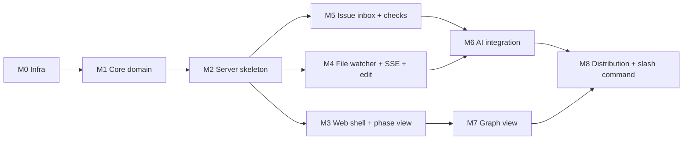

# Implementation Plan

**Mode:** HOLD SCOPE (inherited)
**Date:** 2026-05-17

## 1. Goal

`@specrail/dashboard` v0.1.0 npm package 를 ship — local Vite+React+Hono web app 으로 specrail spec 의 view·관계·AI review/edit. PRD §3.4 SCEN-1/2/3 충족. plugin `/specrail dashboard` slash command 연결.

## 2. Architecture

Vite SPA (ARCH-1) + Hono server (ARCH-2) + services (ARCH-3) + core domain (ARCH-4) + adapters (ARCH-5 fs/chokidar, ARCH-6 claude CLI, ARCH-7 registry, ARCH-8 SQLite). Single-process production (Hono serves built SPA). Per ADR-2 (REST+SSE), ADR-4 (pnpm), ADR-1 (SQLite), ADR-3 (elkjs).

## 3. Tech Stack

| Layer | Tech | ADR |
|---|---|---|
| Language | TypeScript strict | implicit |
| Server framework | Hono | ADR-2 |
| Client framework | React 19 (Vite) | implicit |
| State (client) | TanStack Query + Zustand (light) | implicit |
| Storage (sessions) | SQLite via better-sqlite3 | ADR-1 |
| Storage (registry/cache) | JSON via env-paths | implicit |
| Graph | React Flow + elkjs | ADR-3 |
| Editor | CodeMirror 6 | ADR-6 |
| Form | react-hook-form + zod resolver | ADR-5 |
| Lockfile | proper-lockfile | ADR-7 |
| Package manager | pnpm | ADR-4 |
| Subprocess | execa | ARCH-6 |
| File watcher | chokidar | ARCH-5 |
| Atomic write | write-file-atomic | implicit |
| Markdown | unified + remark + rehype | implicit |
| Validation | zod | implicit |
| Test (unit/integ) | Vitest | implicit |
| Test (e2e) | Playwright | implicit |
| Lint/format | Biome | implicit |
| CSRF | hono CSRF middleware | implicit |

## 4. Dependency Graph (high-level)



## 5. MVP 정의

P0 Specs (43개) = MVP. PRD scenarios cover:

| SCEN | 필요 Spec | Tasks | MVP cover |
|---|---|---|---|
| SCEN-1 (Daily cross-ref) | S1.1.1-2, S1.2.1-3, S2.1.1-2 | T3.1-5, T7.1-2 | ✅ |
| SCEN-2 (AI quality review) | S3.3.1-2, S4.1.1-2, S4.4.1-3, S5.3.1-2, S6.2.1-2 | T5.1-3, T6.1-5, T4.2-4 | ✅ |
| SCEN-3 (Graph 탐색) | S2.2.1-3, S2.3.1, S3.2.1-4, S4.4.1-3 | T7.1-4, T5.2, T6.* | ✅ |

## 6. Milestones

| ID | 이름 | 산출물 | RED test 통과 | 누적 (AI 보조) |
|---|---|---|---|---|
| M0 | Infra | pnpm workspace + monorepo migration, CI, Biome, tsconfig refs | smoke build + plugin still works | ~4h |
| M1 | Core domain | frontmatter parse·serialize, cross-phase check rules, graph nhop, patch apply | TC-6, TC-13, TC-18, TC-INV-* | ~6h |
| M2 | Server skeleton | Hono + routes stub + adapters (fs/registry) + CSRF + path validation + SSE infra | TC-5, TC-17, TC-21, TC-22, TC-27, TC-28 | ~6h |
| M3 | Web shell + phase view | Vite + React + Hono RPC client + 3-pane shell + project switcher + phase view (read) | TC-1, TC-2, TC-3, TC-4 | ~8h |
| M4 | File watcher + SSE + edit | chokidar + SSE event channel + Edit mode (CodeMirror + frontmatter form + atomic write + conflict) | TC-17, TC-19, TC-20, TC-21 | ~6h |
| M5 | Issue inbox + checks | unified issue list + cross-phase deterministic checks + accept/reject patch | TC-9, TC-10, TC-11 | ~5h |
| M6 | AI integration | claude CLI adapter + 3 origin prompt (review/chat/inline) + patch JSON parsing + chat drawer + inline rewrite | TC-12, TC-13, TC-14, TC-15, TC-16 | ~10h |
| M7 | Graph view | React Flow + elkjs + filters + N-hop + 200+ fallback | TC-6, TC-7, TC-8 | ~5h |
| M8 | Distribution + slash command | bin script + esbuild + vite build + npm publish CI + plugin /specrail dashboard slash command | smoke `npx @specrail/dashboard` | ~3h |

**Total estimate:** ~53h AI-assisted. v0.1.0 ship target: 8 calendar weeks (parallel work + dogfood + visual design cycle 병행).

## 7. Critical Path

M0 → M1 → M2 → M3 → M4 → M5 → M6 → M7 → M8 (대부분 직렬, M3 와 M2 일부 parallel).

## 8. Parallelization Opportunities

- M0 sub-tasks: monorepo migration, CI 설정, lint 설정 (3 parallel)
- M2 ↔ M3 시작: server route stub 와 web shell skeleton 동시 (서로의 stub 만 알면 됨)
- M5 ↔ M7: cross-phase checks 와 graph view 동시 (core 의존만)
- DESIGN.md (design-consultation cycle): M3-M8 와 완전 parallel (apply 만 M7 후 일괄)

## 9. Atomic Tasks

> 각 task = 2-5분 AI 보조. 5-step framework (test→fail→impl→pass→commit). 코드 본문은 구현 시점 inputs 기반 generate. Files·red-test·commit-msg 만 lock-in.

### M0: Infra

<!-- specrail:attrs id=T0.1 -->
```yaml
milestone: M0
status: Approved
red-test: "pnpm -r build 가 monorepo 구조로 통과; 기존 plugin tests 100% 유지"
commit-msg-stub: "chore: monorepo migration to pnpm workspaces (packages/{core,plugin,dashboard})"
depends-on: []
```
<!-- /specrail:attrs -->

**T0.1 Monorepo migration**
- Files: `pnpm-workspace.yaml` (new), `package.json` (split root + packages/plugin/package.json), move `src/` `tests/` `e2e/` `bench/` `spikes/` `migrations/` `scripts/` `docs/spec/` `schemas/` `skills/` `.claude-plugin/` `tsconfig*.json` `vitest.config.ts` `CHANGELOG.md` → `packages/plugin/`
- `.claude-plugin/marketplace.json` 의 `source: "./"` → `"./packages/plugin/"`
- CI workflows: `npm ci` → `pnpm install`, paths 갱신
- packages/core 빈 디렉토리 + tsconfig (extends base)
- packages/dashboard 빈 디렉토리 + tsconfig

<!-- specrail:attrs id=T0.2 -->
```yaml
milestone: M0
status: Approved
red-test: "biome lint + format dry-run on all packages"
commit-msg-stub: "chore: biome config + pre-commit"
depends-on: [T0.1]
```
<!-- /specrail:attrs -->

**T0.2 Biome + tsconfig project references**
- Files: `biome.json` (root), `tsconfig.base.json`, project references 갱신
- root scripts: `lint`, `format`, `typecheck`, `test` 모두 `pnpm -r`

<!-- specrail:attrs id=T0.3 -->
```yaml
milestone: M0
status: Approved
red-test: "GitHub Actions ci workflow 의 matrix Node 20/22 × ubuntu/macos all green (monorepo aware)"
commit-msg-stub: "ci: pnpm + monorepo matrix"
depends-on: [T0.1, T0.2]
```
<!-- /specrail:attrs -->

**T0.3 CI rework**
- Files: `.github/workflows/ci.yml`, `.github/workflows/release.yml`
- npm → pnpm, cache action, monorepo aware path filter

### M1: Core domain (packages/core)

<!-- specrail:attrs id=T1.1 -->
```yaml
milestone: M1
status: Approved
red-test: "packages/core/tests/frontmatter.test.ts — parse(complete phase frontmatter) returns typed object"
commit-msg-stub: "feat(core): frontmatter parse/serialize with zod schema per phase"
depends-on: [T0.1]
```
<!-- /specrail:attrs -->

**T1.1 Frontmatter parser**
- Files: `packages/core/src/frontmatter/parse.ts`, `packages/core/src/frontmatter/schema.ts` (zod per phase), tests
- 의존: gray-matter, zod, unified, remark-frontmatter

<!-- specrail:attrs id=T1.2 -->
```yaml
milestone: M1
status: Approved
red-test: "TC-13: parsePatchesFromText(...) zod validate 후 hunks[] 반환; invalid → ParseError"
commit-msg-stub: "feat(core): patch JSON parser + zod schema"
depends-on: [T1.1]
```
<!-- /specrail:attrs -->

**T1.2 Patch JSON parser**
- Files: `packages/core/src/patch/parse.ts`, `packages/core/src/patch/schema.ts`, tests
- Patch JSON spec 은 ADR-2 prompt 와 정렬

<!-- specrail:attrs id=T1.3 -->
```yaml
milestone: M1
status: Approved
red-test: "applyHunks(body, hunks) returns new body with hunks applied; conflict throws"
commit-msg-stub: "feat(core): patch apply algorithm"
depends-on: [T1.2]
```
<!-- /specrail:attrs -->

**T1.3 Patch apply algorithm**
- Files: `packages/core/src/patch/apply.ts`, tests

<!-- specrail:attrs id=T1.4 -->
```yaml
milestone: M1
status: Approved
red-test: "TC-6 + PT-2: core.graph.nhop(500 nodes) ≤ 200ms; orphan/dangling detection"
commit-msg-stub: "feat(core): graph index + nhop + orphan/dangling detect"
depends-on: [T1.1]
```
<!-- /specrail:attrs -->

**T1.4 Graph index + queries**
- Files: `packages/core/src/graph/index.ts`, `packages/core/src/graph/nhop.ts`, `packages/core/src/graph/orphan.ts`, tests, bench

<!-- specrail:attrs id=T1.5 -->
```yaml
milestone: M1
status: Approved
red-test: "TC-9: runCrossPhaseChecks(project) 가 orphan/dangling/status-mismatch/traceability-gap 4종 검출"
commit-msg-stub: "feat(core): cross-phase deterministic checks (4 rules)"
depends-on: [T1.4]
```
<!-- /specrail:attrs -->

**T1.5 Cross-phase check rules**
- Files: `packages/core/src/checks/*.ts` (orphan, dangling, status-mismatch, traceability-gap), `packages/core/src/checks/run.ts`, tests

<!-- specrail:attrs id=T1.6 -->
```yaml
milestone: M1
status: Approved
red-test: "Domain types: Project, Phase, Issue, PatchProposal, AiSession, AiMessage zod schemas defined + exported"
commit-msg-stub: "feat(core): domain types (ENT-* zod schemas)"
depends-on: [T1.1]
```
<!-- /specrail:attrs -->

**T1.6 Domain types**
- Files: `packages/core/src/spec/types.ts` (Project, Phase, Issue, PatchProposal, AiSession, AiMessage, Registry, FileWatcherSubscription), tests

### M2: Server skeleton (packages/dashboard/server)

<!-- specrail:attrs id=T2.1 -->
```yaml
milestone: M2
status: Approved
red-test: "GET /api/projects on empty registry returns []"
commit-msg-stub: "feat(server): Hono bootstrap + projects GET"
depends-on: [T1.6]
```
<!-- /specrail:attrs -->

**T2.1 Hono bootstrap + GET /api/projects**
- Files: `packages/dashboard/server/main.ts`, `packages/dashboard/server/routes/projects.ts`, `packages/dashboard/server/services/projects.ts`, `packages/dashboard/server/adapters/registry.ts`

<!-- specrail:attrs id=T2.2 -->
```yaml
milestone: M2
status: Approved
red-test: "TC-28 (INV-6): POST /api/projects with path lacking docs/spec/01-prd.md → 400"
commit-msg-stub: "feat(server): project register w/ INV-6 validation"
depends-on: [T2.1]
```
<!-- /specrail:attrs -->

**T2.2 POST /api/projects (register)**
- Files: `packages/dashboard/server/routes/projects.ts` (update)
- INV-6 enforcement

<!-- specrail:attrs id=T2.3 -->
```yaml
milestone: M2
status: Approved
red-test: "TC-27 (INV-5): mutation route w/o X-CSRF → 403"
commit-msg-stub: "feat(server): CSRF middleware (double-submit cookie)"
depends-on: [T2.1]
```
<!-- /specrail:attrs -->

**T2.3 CSRF middleware**
- Files: `packages/dashboard/server/middleware/csrf.ts`, `packages/dashboard/server/main.ts` (wire)

<!-- specrail:attrs id=T2.4 -->
```yaml
milestone: M2
status: Approved
red-test: "path traversal fuzz 100 cases: '../../../etc/passwd' 등 → 403"
commit-msg-stub: "feat(server): path validation middleware"
depends-on: [T2.1]
```
<!-- /specrail:attrs -->

**T2.4 Path validation middleware**
- Files: `packages/dashboard/server/middleware/path.ts`, tests
- INV-WATCH-1 base

<!-- specrail:attrs id=T2.5 -->
```yaml
milestone: M2
status: Approved
red-test: "GET /api/projects/:id/phases returns 13 Phase summaries; phase content via /api/projects/:id/phases/:n"
commit-msg-stub: "feat(server): phases routes (list, single)"
depends-on: [T2.2, T1.1]
```
<!-- /specrail:attrs -->

**T2.5 Phases read routes**
- Files: `packages/dashboard/server/routes/phases.ts`, `packages/dashboard/server/services/phases.ts`, fs adapter, tests

<!-- specrail:attrs id=T2.6 -->
```yaml
milestone: M2
status: Approved
red-test: "TC-17 (AC-R5-1): PUT /api/projects/:id/phases/:n {content, basedOnMtimeMs} → 200 on match, 409 on mismatch"
commit-msg-stub: "feat(server): phases PUT w/ atomic write + mtime conflict (INV-1,2)"
depends-on: [T2.5, T2.3]
```
<!-- /specrail:attrs -->

**T2.6 Phase PUT (atomic write + 409)**
- Files: `packages/dashboard/server/services/phases.ts` (update), `packages/dashboard/server/adapters/fs.ts`
- write-file-atomic
- INV-1, INV-2 enforcement

<!-- specrail:attrs id=T2.7 -->
```yaml
milestone: M2
status: Approved
red-test: "TC-22: GET /api/projects/:id/events SSE 연결 → connected event 즉시 + last-event-id 복구"
commit-msg-stub: "feat(server): SSE single channel per project"
depends-on: [T2.1]
```
<!-- /specrail:attrs -->

**T2.7 SSE single channel**
- Files: `packages/dashboard/server/routes/events.ts`, `packages/dashboard/server/services/event-bus.ts`

<!-- specrail:attrs id=T2.8 -->
```yaml
milestone: M2
status: Approved
red-test: "Hono RPC client 추론: const client = hc<App>('http://...'); client.api.projects.$get() type-safe"
commit-msg-stub: "feat(server): export App type for client RPC inference"
depends-on: [T2.5, T2.7]
```
<!-- /specrail:attrs -->

**T2.8 RPC type export**
- Files: `packages/dashboard/server/app.ts` (export type App)

### M3: Web shell + phase view

<!-- specrail:attrs id=T3.1 -->
```yaml
milestone: M3
status: Approved
red-test: "vite build packages/dashboard/web 가 통과; index.html → SPA"
commit-msg-stub: "feat(web): vite + react bootstrap + Hono RPC client"
depends-on: [T2.8]
```
<!-- /specrail:attrs -->

**T3.1 Vite + React bootstrap**
- Files: `packages/dashboard/web/vite.config.ts`, `packages/dashboard/web/index.html`, `packages/dashboard/web/src/main.tsx`, `packages/dashboard/web/src/lib/api.ts`

<!-- specrail:attrs id=T3.2 -->
```yaml
milestone: M3
status: Approved
red-test: "TC-3: project switcher dropdown → switch < 200ms"
commit-msg-stub: "feat(web): app shell (3-pane) + project switcher"
depends-on: [T3.1]
```
<!-- /specrail:attrs -->

**T3.2 App shell + project switcher**
- Files: `packages/dashboard/web/src/shell/{AppShell,TopBar,Sidebar,Drawer}.tsx`, `packages/dashboard/web/src/features/projects/*`, route handlers

<!-- specrail:attrs id=T3.3 -->
```yaml
milestone: M3
status: Approved
red-test: "TC-1: P-CC-4 cold load p95 ≤ 2s (Playwright trace)"
commit-msg-stub: "feat(web): phase view (read mode) + remark/rehype"
depends-on: [T3.2]
```
<!-- /specrail:attrs -->

**T3.3 Phase view (read)**
- Files: `packages/dashboard/web/src/features/phases/PhaseView.tsx`, `packages/dashboard/web/src/components/MarkdownRenderer.tsx`

<!-- specrail:attrs id=T3.4 -->
```yaml
milestone: M3
status: Approved
red-test: "TC-2 (AC-R1-2): ID hover popover (200 chars preview) + click → 정의처 phase jump"
commit-msg-stub: "feat(web): ID auto-linkify + hover popover + click jump"
depends-on: [T3.3, T1.4]
```
<!-- /specrail:attrs -->

**T3.4 ID linkify + popover + jump**
- Files: `packages/dashboard/web/src/components/{IdLink,IdPopover}.tsx`, rehype plugin

<!-- specrail:attrs id=T3.5 -->
```yaml
milestone: M3
status: Approved
red-test: "TC-4: cmd+k fuzzy match first paint ≤ 50ms"
commit-msg-stub: "feat(web): cmd+k quick switcher (fuse.js)"
depends-on: [T3.2]
```
<!-- /specrail:attrs -->

**T3.5 Quick switcher**
- Files: `packages/dashboard/web/src/features/quick-switcher/*`, fuse.js index

### M4: File watcher + SSE + edit

<!-- specrail:attrs id=T4.1 -->
```yaml
milestone: M4
status: Approved
red-test: "TC-26 (INV-4): chokidar watches docs/spec/+changes/ only; node_modules 변경 시 fire 0"
commit-msg-stub: "feat(server): chokidar file watcher + INV-4 allowlist"
depends-on: [T2.7]
```
<!-- /specrail:attrs -->

**T4.1 File watcher**
- Files: `packages/dashboard/server/adapters/watcher.ts`, integration test

<!-- specrail:attrs id=T4.2 -->
```yaml
milestone: M4
status: Approved
red-test: "TC-20 (NFR-PERF-4): 외부 fs save → SSE file.changed 수신 ≤ 500ms; TC-21: self-write flag skip duplicate"
commit-msg-stub: "feat(server): SSE file.* events from watcher (self-write dedup)"
depends-on: [T4.1]
```
<!-- /specrail:attrs -->

**T4.2 Watcher → SSE event bridge**
- Files: `packages/dashboard/server/services/file-events.ts`

<!-- specrail:attrs id=T4.3 -->
```yaml
milestone: M4
status: Approved
red-test: "Web invalidate React Query cache on SSE file.changed → UI refetch"
commit-msg-stub: "feat(web): SSE event → React Query invalidation"
depends-on: [T4.2, T3.3]
```
<!-- /specrail:attrs -->

**T4.3 SSE client + cache invalidation**
- Files: `packages/dashboard/web/src/lib/sse.ts`, hooks integration

<!-- specrail:attrs id=T4.4 -->
```yaml
milestone: M4
status: Approved
red-test: "TC-18 (AC-R5-2): frontmatter zod validate → field error inline; TC-19: navigate-away dirty → dialog"
commit-msg-stub: "feat(web): Edit mode (CodeMirror + frontmatter form + dirty guard)"
depends-on: [T3.3]
```
<!-- /specrail:attrs -->

**T4.4 Edit mode UI**
- Files: `packages/dashboard/web/src/features/phases/EditMode.tsx`, `packages/dashboard/web/src/components/{CodeMirrorEditor,FrontmatterForm}.tsx`

<!-- specrail:attrs id=T4.5 -->
```yaml
milestone: M4
status: Approved
red-test: "TC-17: edit + cmd+s → atomic write; 외부 변경 도중 save → 409 → P-CC-10 conflict dialog"
commit-msg-stub: "feat(web): Save + 409 conflict dialog (P-CC-10)"
depends-on: [T4.4, T2.6]
```
<!-- /specrail:attrs -->

**T4.5 Save + conflict dialog**
- Files: `packages/dashboard/web/src/features/phases/SaveAction.tsx`, `packages/dashboard/web/src/features/conflict/ConflictDialog.tsx`

### M5: Issue inbox + checks

<!-- specrail:attrs id=T5.1 -->
```yaml
milestone: M5
status: Approved
red-test: "TC-9 (AC-R3-1): POST /api/projects/:id/issues/refresh → SSE issues.updated + GET /issues 반환"
commit-msg-stub: "feat(server): issues route + cross-phase check enqueue"
depends-on: [T2.7, T1.5]
```
<!-- /specrail:attrs -->

**T5.1 Issues route + check runner**
- Files: `packages/dashboard/server/routes/issues.ts`, `packages/dashboard/server/services/issues.ts`

<!-- specrail:attrs id=T5.2 -->
```yaml
milestone: M5
status: Approved
red-test: "TC-10 (AC-R3-2): issue row 펼침 시 source-label + line + suggested patch 표시"
commit-msg-stub: "feat(web): issue inbox (filter, expand, source-label)"
depends-on: [T5.1, T3.2]
```
<!-- /specrail:attrs -->

**T5.2 Issue inbox UI**
- Files: `packages/dashboard/web/src/features/issues/*`

<!-- specrail:attrs id=T5.3 -->
```yaml
milestone: M5
status: Approved
red-test: "Accept patch (issue 첨부) → atomic write → SSE patch.accepted + file.changed (self-write)"
commit-msg-stub: "feat(server,web): PatchProposal lifecycle (accept/reject)"
depends-on: [T5.1, T2.6, T1.3]
```
<!-- /specrail:attrs -->

**T5.3 Patch accept/reject**
- Files: `packages/dashboard/server/routes/patches.ts`, `packages/dashboard/server/services/patches.ts`, web inline diff card

<!-- specrail:attrs id=T5.4 -->
```yaml
milestone: M5
status: Approved
red-test: "Plugin self-check 결과 (specrail check JSON) 가 issue inbox 에 source=plugin-self-check 로 통합"
commit-msg-stub: "feat(server): plugin self-check 통합 (specrail check subprocess)"
depends-on: [T5.1]
```
<!-- /specrail:attrs -->

**T5.4 Plugin self-check 통합**
- Files: `packages/dashboard/server/adapters/specrail-cli.ts`

### M6: AI integration

<!-- specrail:attrs id=T6.1 -->
```yaml
milestone: M6
status: Approved
red-test: "TC-25 (INV-3): claudeCli.stream({cwd, prompt}) 가 execa({shell:false}) 로 claude 호출, cwd = projectRoot"
commit-msg-stub: "feat(server): claude CLI adapter (execa, stream-json, abort)"
depends-on: [T2.1]
```
<!-- /specrail:attrs -->

**T6.1 claude CLI adapter**
- Files: `packages/dashboard/server/adapters/claude-cli.ts`, mock adapter for tests

<!-- specrail:attrs id=T6.2 -->
```yaml
milestone: M6
status: Approved
red-test: "TC-12 (AC-R4-1): POST /ai/sessions {origin:review-scan} → SSE ai.token stream"
commit-msg-stub: "feat(server): AI sessions route + 3 origin prompts"
depends-on: [T6.1, T1.2]
```
<!-- /specrail:attrs -->

**T6.2 AI sessions route + prompt templates**
- Files: `packages/dashboard/server/routes/ai.ts`, `packages/dashboard/server/services/ai.ts`, `packages/dashboard/server/prompts/{review-scan,chat,inline}.ts`

<!-- specrail:attrs id=T6.3 -->
```yaml
milestone: M6
status: Approved
red-test: "TC-13: AI 응답 stream 중 patch JSON 감지 → core.patch.parse → PatchProposal 생성 → SSE patch.proposed"
commit-msg-stub: "feat(server): patch JSON extraction from AI stream"
depends-on: [T6.2, T1.2, T5.3]
```
<!-- /specrail:attrs -->

**T6.3 Patch extraction**
- Files: `packages/dashboard/server/services/ai.ts` (extend)

<!-- specrail:attrs id=T6.4 -->
```yaml
milestone: M6
status: Approved
red-test: "AI sessions sqlite migration 실행, AiSession + AiMessage CRUD pass"
commit-msg-stub: "feat(server): SQLite session store (ADR-1) + migrations"
depends-on: [T2.1]
```
<!-- /specrail:attrs -->

**T6.4 SQLite session store**
- Files: `packages/dashboard/server/adapters/session-store.ts`, `packages/dashboard/server/adapters/session-migrations/*.sql`

<!-- specrail:attrs id=T6.5 -->
```yaml
milestone: M6
status: Approved
red-test: "TC-15 (AC-R4-4): claude 미설치 → UI 에 분류 에러 메시지 (설치 가이드 link); TC-16: abort → SIGTERM → 5s 후 SIGKILL"
commit-msg-stub: "feat(server,web): AI error classification + abort"
depends-on: [T6.1, T6.2]
```
<!-- /specrail:attrs -->

**T6.5 Error handling + abort**
- Files: AI service error mapping, web error UI

<!-- specrail:attrs id=T6.6 -->
```yaml
milestone: M6
status: Approved
red-test: "Chat drawer UI: Run AI review / chat send / Stop → SSE 처리 + patch card 인라인"
commit-msg-stub: "feat(web): chat drawer + inline patch cards"
depends-on: [T6.2, T6.3, T5.2]
```
<!-- /specrail:attrs -->

**T6.6 Chat drawer UI**
- Files: `packages/dashboard/web/src/features/ai-chat/*`

<!-- specrail:attrs id=T6.7 -->
```yaml
milestone: M6
status: Approved
red-test: "TC-14 (AC-R4-3): selection 텍스트 → floating menu 'AI: rewrite' → patch preview overlay → accept/reject"
commit-msg-stub: "feat(web): inline rewrite floating menu"
depends-on: [T6.6, T3.4]
```
<!-- /specrail:attrs -->

**T6.7 Inline rewrite UI**
- Files: `packages/dashboard/web/src/features/ai-inline/*`

### M7: Graph view

<!-- specrail:attrs id=T7.1 -->
```yaml
milestone: M7
status: Approved
red-test: "GET /api/projects/:id/graph 가 nodes+edges 반환 (500 nodes 기준 ≤ 200ms server-side)"
commit-msg-stub: "feat(server): graph route + core.graph 결합"
depends-on: [T1.4, T2.1]
```
<!-- /specrail:attrs -->

**T7.1 Graph route**
- Files: `packages/dashboard/server/routes/graph.ts`

<!-- specrail:attrs id=T7.2 -->
```yaml
milestone: M7
status: Approved
red-test: "TC-7 (AC-R2-3): graph 노드 click → Refs tab in/out + 'Open in phase view' 작동"
commit-msg-stub: "feat(web): React Flow + elkjs layout + Refs tab"
depends-on: [T7.1, T3.4]
```
<!-- /specrail:attrs -->

**T7.2 React Flow + elkjs**
- Files: `packages/dashboard/web/src/features/graph/*`

<!-- specrail:attrs id=T7.3 -->
```yaml
milestone: M7
status: Approved
red-test: "TC-6 + PT-2: N-hop slider + filter 적용 시 reflow ≤ 200ms; TC-8: 200+ nodes → phase-collapsed fallback"
commit-msg-stub: "feat(web): graph filter (phase/prefix/orphan) + N-hop slider"
depends-on: [T7.2]
```
<!-- /specrail:attrs -->

**T7.3 Graph filters + N-hop**
- Files: `packages/dashboard/web/src/features/graph/Filters.tsx`, `NhopSlider.tsx`

### M8: Distribution + slash command

<!-- specrail:attrs id=T8.1 -->
```yaml
milestone: M8
status: Approved
red-test: "esbuild bundle dist/server/main.js 가 standalone 실행 가능 (better-sqlite3, chokidar externals 검증)"
commit-msg-stub: "build: esbuild server bundle + externals"
depends-on: [T2.1, T6.4, T4.1]
```
<!-- /specrail:attrs -->

**T8.1 Server bundle**
- Files: `packages/dashboard/build/esbuild.mjs`, `packages/dashboard/package.json` (bin)

<!-- specrail:attrs id=T8.2 -->
```yaml
milestone: M8
status: Approved
red-test: "vite build packages/dashboard/web → dist/web/, Hono production 모드가 정적 자산 serve"
commit-msg-stub: "build: vite web build + Hono static serve"
depends-on: [T3.1]
```
<!-- /specrail:attrs -->

**T8.2 Web build + Hono static serve**

<!-- specrail:attrs id=T8.3 -->
```yaml
milestone: M8
status: Approved
red-test: "node packages/dashboard/dist/bin/specrail-dashboard.js --project <fixture> → 브라우저 자동 open + 정상 동작"
commit-msg-stub: "feat: bin/specrail-dashboard.ts (npx entrypoint)"
depends-on: [T8.1, T8.2]
```
<!-- /specrail:attrs -->

**T8.3 npx entrypoint**
- Files: `packages/dashboard/bin/specrail-dashboard.ts`, browser auto-open (`open` npm)

<!-- specrail:attrs id=T8.4 -->
```yaml
milestone: M8
status: Approved
red-test: "GitHub Actions tag push (v0.1.0) → npm publish provenance success; pack artifact 검증"
commit-msg-stub: "ci: dashboard release workflow (npm publish + provenance)"
depends-on: [T8.3]
```
<!-- /specrail:attrs -->

**T8.4 Release CI**
- Files: `.github/workflows/release-dashboard.yml`

<!-- specrail:attrs id=T8.5 -->
```yaml
milestone: M8
status: Approved
red-test: "Plugin 의 `/specrail dashboard` slash command 호출 시 `npx -y @specrail/dashboard@^0.x --project <cwd>` spawn 확인"
commit-msg-stub: "feat(plugin): /specrail dashboard slash command"
depends-on: [T8.3]
```
<!-- /specrail:attrs -->

**T8.5 Plugin slash command**
- Files: `packages/plugin/skills/dashboard/SKILL.md`, plugin manifest update

<!-- specrail:attrs id=T8.6 -->
```yaml
milestone: M8
status: Approved
red-test: "e2e Playwright 8 must-pass 시나리오 통과 (Phase 10 §2 list)"
commit-msg-stub: "test(e2e): 8 must-pass scenarios"
depends-on: [T3.3, T4.5, T5.3, T6.6, T6.7, T7.2]
```
<!-- /specrail:attrs -->

**T8.6 e2e suite finalize**
- Files: `packages/dashboard/e2e/*.spec.ts`

## 10. Spec Coverage Verification

P0 Spec (43) → Task mapping:

| Spec range | Tasks | 검증 |
|---|---|---|
| S1.1.1-2 (phase view) | T3.3 | ✅ |
| S1.2.1-3 (ID linkify/popover/jump) | T3.4 | ✅ |
| S1.3.1 (cmd+k) | T3.5 | ✅ |
| S1.4.1-2 (registry + INV-6) | T2.1, T2.2 | ✅ |
| S2.1.1-2 (refs tab) | T7.1, T7.2, T3.4 | ✅ |
| S2.2.1-3 (graph) | T7.2, T7.3 | ✅ |
| S2.3.1 (N-hop) | T7.3 | ✅ |
| S3.1.1 (plugin self-check) | T5.4 | ✅ |
| S3.2.1-4 (cross-phase checks) | T1.5, T5.1 | ✅ |
| S3.3.1-2 (issue inbox + accept) | T5.2, T5.3 | ✅ |
| S4.1.1-2 (review-scan + claude adapter) | T6.2, T6.1 | ✅ |
| S4.2.1-2 (chat drawer) | T6.6 | ✅ |
| S4.3.1-2 (inline rewrite + preview) | T6.7 | ✅ |
| S4.4.1-3 (patch lifecycle) | T5.3, T6.3 | ✅ |
| S5.1.1 (CodeMirror) | T4.4 | ✅ |
| S5.2.1-2 (frontmatter form) | T4.4 | ✅ |
| S5.3.1-2 (atomic write + 409) | T2.6, T4.5 | ✅ |
| S6.1.1 (chokidar) | T4.1 | ✅ |
| S6.2.1-2 (SSE events) | T2.7, T4.2, T4.3 | ✅ |
| S6.3.1 (conflict dialog) | T4.5 | ✅ |

**P0 coverage: 43/43 specs** — 위 표의 모든 row 에서 직접 task 매핑이 명시되며, M0~M8 milestone 의 R1~R6 의 모든 P0 spec ID 가 최소 1 task 에 등장. P1 Specs (9개) — M3-M7 finalize 단계에 task split 또는 v0.2 cherry-pick.

## 11. Risks 의 Mitigation Task

| RISK | Mitigation Task |
|---|---|
| RISK-1 (claude CLI schema 변경) | T6.1 의 어댑터 격리 + version check + schema fixture |
| RISK-2 (spec corruption) | T2.6 atomic write + INV-1/2 lint test |
| RISK-3 (AI 잘못된 patch accept) | T5.3 patch 사용자 explicit accept gate |
| RISK-4 (patch JSON 파싱 실패) | T1.2 zod + T6.5 fallback 메시지 |
| RISK-5 (chokidar 대량 이벤트) | T4.1 INV-4 allowlist + debounce 200ms |
| RISK-6 (npx 첫 실행 지연) | T8.5 slash command 의 progress indicator |
| RISK-7 (better-sqlite3 build 실패) | T8.4 CI matrix cross-OS |
| RISK-8 (demand reality) | KPI-4 8주 측정 (별 task 아님 — operational) |
| RISK-9 (DESIGN.md 지연) | M7 후 styling apply pass — design-consultation 산출 후 별 mini-cycle |

## 12. Out-of-band (이 plan 에 task 없음)

- `/design-consultation` 실행 + DESIGN.md 산출 (parallel cycle)
- 사용자 dogfood feedback loop (M3 부터 maintainer 본인 매주 1회 cycle)
- `@specrail/dashboard` npm scope 결정 (OQ-12-2)

## 13. Type Consistency Verification

모든 task 의 함수·type 명이 packages/core 의 types 와 일치하는지 implementation 시 lint 강제 (T0.2 의 Biome import-cycle + project-references 체크).

## 14. Done Definition (v0.1.0 ship gate)

- [ ] P0 Spec 100% cover (위 §10)
- [ ] e2e 8 must-pass 시나리오 green
- [ ] CI matrix (Node 20/22 × ubuntu/macos) green
- [ ] Bench gate (NFR-PERF-1~5) green
- [ ] specrail check PASS on packages/dashboard/docs/spec
- [ ] npm pack artifact 수동 smoke test (`npx ./pack.tgz`) green
- [ ] DESIGN.md 적용 styling pass 완료 (또는 명시적 beta label)
- [ ] CHANGELOG v0.1.0 entry
- [ ] README + 기본 docs 작성

## 15. 다음 단계 (post-spec phase)

본 spec set 의 모든 phase Approved 후:
1. `/oh-my-claudecode:autopilot` 또는 manual M0 부터 atomic task 진행.
2. M3 도달 시 dogfood (maintainer 본인 daily use) 시작.
3. M8 + DESIGN.md 적용 후 v0.1.0 release.
4. 8주 KPI 측정 → demand reality (KPI-4) 평가 → v0.2 또는 cycle 종료 결정.
