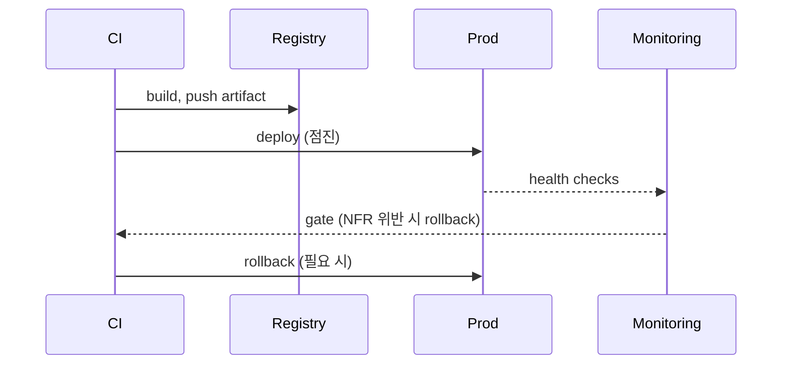

# Phase 11: Operations

## Purpose

어디서 어떻게 돌리고 관찰·복구할지 사양화. **Observability is scope, not afterthought.**

## Inputs

- Phase 8 모든 ARCH·EXT
- Phase 9 NFR-AVAIL (RPO/RTO), NFR-SEC, NFR-PRIV
- Phase 10 perf test scenario
- (DELTA) `docs/spec/11-operations.md` (기존 버전)

<HARD-GATE>
Phase 10 사용자 승인 없이 진행 금지.
</HARD-GATE>

## Mode 상속

- EXPANSION: multi-region, blue-green, canary 모두 surface
- SELECTIVE: minimum + cherry-pick (cost↔reliability tradeoff)
- HOLD: NFR-AVAIL cover하는 minimum
- REDUCTION: 단일 region, rolling deploy만

---

## Anti-Sycophancy

00-common 참조 + Phase 11 특화:

**금지:**
- 구체 vendor 추천 (Phase 11은 abstract)
- "Best practice는 X예요"
- "관측성을 잘 갖춰야..."

**대신:**
- 추상 도구만 — APM / log aggregator / metrics store / alerting platform
- 구체 vendor 결정은 ADR-CAND
- 모든 alert는 PRD KPI / NFR 인용 강제
- "이 alert가 깨지면 발생할 production 사고" 명시

---

## Reasoning Procedure

1. Environment 정의 (Dev / Staging / Prod 최소)
2. Deploy strategy (NFR-AVAIL과 일치)
3. Observability 3축 (Logs / Metrics / Traces) — 각 ARCH 별
4. Alert policy (severity / channel / on-call)
5. Backup·DR (NFR-AVAIL의 RPO/RTO 충족)
6. Feature flag 전략
7. Cost model (3 시나리오)
8. Runbook 후보 목록
9. Self-Check + 승인

---

## Constraints

1. **추상 도구만** — 구체 vendor는 ADR-CAND.
2. **모든 OPS-{n}는 NFR / KPI 인용**.
3. **Logs는 PII 마스킹 명시** — NFR-PRIV / NFR-SEC 일치.
4. **Alert 4 attribute** — 조건 / severity / channel / on-call response.
5. **Backup은 RPO/RTO 일치** — NFR-AVAIL 충족.
6. **Cost 3 시나리오** — 작음 / 기준 / 큼 (PRD §4 KPI 기반).
7. **Cognitive Pattern**: Systems over heroes (피곤한 인간 새벽 3시), Error budgets.

---

## Output Format

````markdown
# Operations

**Mode:** {inherited}
**Inputs:** Phase 8 ARCH·EXT, Phase 9 AVAIL·SEC·PRIV
**Date:** YYYY-MM-DD

## 1. Environments

| Env | 목적 | 데이터 | 외부 EXT | 누가 접근 |
|---|---|---|---|---|
| Dev | 로컬 개발 | seed (가상) | mock 또는 sandbox | 개발자 본인 |
| Staging | 통합 검증·QA | anonymized prod copy | sandbox | 팀 + QA |
| Prod | 실 사용자 | live | live | on-call만 직접 |

각 env 독립 인프라. 데이터 cross-env 금지.

## 2. Deploy Strategy

**OPS-1 — Deploy 방식:** <rolling / canary / blue-green> (default), 다른 옵션 (옵트인)

**근거:** NFR-AVAIL-{n} 충족.



| 단계 | 비율 | 검증 시간 | Rollback trigger |
|---|---|---|---|
| Canary | 10% | 5분 | error rate +50% / NFR-PERF 위반 |
| Partial | 50% | 10분 | 위와 동일 |
| Full | 100% | - | manual rollback only |

DB / 데이터 migration: forward-only, two-step (확장 → backfill → 사용 → 정리).

## 3. Observability — Logs

**OPS-2 — 구조화 로그:** JSON Lines, 모든 ARCH 동일 schema.

| 필드 | 예 | PII 마스킹 |
|---|---|---|
| timestamp | ISO 8601 | - |
| service | "ARCH-{n}" | - |
| level | INFO/WARN/ERROR | - |
| traceId | uuid | - |
| userId | hash 또는 internal | NFR-PRIV-{n} |
| <PII 필드> | <마스킹된 값> | NFR-SEC-{n} |
| event | <이름> | - |
| metadata | {} | PII 자동 redaction |

**OPS-3 — Retention:** Hot 7일 (검색), Warm 30일 (조사), Cold 1년 (감사).

**OPS-4 — 금지:** 비밀번호·토큰·카드번호·OAuth secret 로그 절대 금지. CI에서 grep ban.

## 4. Observability — Metrics

**OPS-5 — Metrics:** RED method per ARCH (Rate / Errors / Duration).

| ARCH | Rate | Errors | Duration |
|---|---|---|---|
| ARCH-{edge} | RPS | 4xx, 5xx | p50/p95/p99 |
| ARCH-{app} | calls/s | exceptions | latency |
| ARCH-{data} | queries/s | timeouts | query time |
| ARCH-{queue} | enqueue/s | DLQ size | wait time |

**OPS-6 — Business metrics:** PRD KPI 직접 dashboard화.

| KPI | Metric |
|---|---|
| KPI-1 | <측정 정의> |
| KPI-2 | <측정 정의> |
| KPI-3 | <측정 정의> |

## 5. Observability — Traces

**OPS-7 — Distributed trace:** 모든 inter-ARCH 호출에 traceId.

샘플링: prod 1%, error 100%, canary 10%.

## 6. Alert Policy

| OPS-{n} | 조건 | severity | channel | on-call response |
|---|---|---|---|---|
| OPS-{n} | 5xx > 1%/5분 | P0 | <pager> | 즉시 (15분 내 ack) |
| OPS-{n} | NFR-PERF 위반 (p95 초과 x 5분) | P1 | <pager + chat> | 30분 |
| OPS-{n} | NFR-AVAIL budget 30% 소진/주 | P1 | <chat> | 1시간 |
| OPS-{n} | EXT-{n} 다운 | P0 | <pager> | 즉시 |
| OPS-{n} | DB connection > 80% | P2 | <chat> | 다음 영업일 |
| OPS-{n} | Queue depth > <임계> | P1 | <chat> | 1시간 |
| OPS-{n} | Failed login spike (NFR-SEC-{n}) | P1 | <보안 chat> | 1시간 |
| OPS-{n} | Disk > 80% | P1 | <chat> | 4시간 |

**Alert hygiene:** 새벽 3시에 깨우는 alert는 actionable + 대응 가능. P0 false positive는 즉시 fix.

## 7. Backup & Disaster Recovery

**OPS-{n} — <Storage 1>:** PITR 또는 dump, RPO <시간> (NFR-AVAIL-{n}), RTO <시간> (NFR-AVAIL-{n}).

**OPS-{n} — <Storage 2>:** <cross-region replication / immutable lock for audit / etc.>

**OPS-{n} — <Cache>:** 백업 안 함 (re-derivable).

**OPS-{n} — <Queue>:** persistence + DLQ. 외부 호출 실패 시 retain (NFR-AVAIL-{n}).

**OPS-{n} — DR drill:** 분기마다 staging에서 RPO/RTO 검증.

## 8. Feature Flags

**OPS-{n} — Flag 종류:**

| 종류 | 목적 | TTL |
|---|---|---|
| Release | 새 기능 점진 출시 | 2주 (이후 제거) |
| Experiment | A/B 테스트 | 4주 |
| Ops | 긴급 차단 (서킷브레이커) | 영구 |
| Permission | role-based 점진 권한 | 영구 |

Flag 죽은 코드 금지: TTL 지나면 코드 + flag 모두 제거.

## 9. Cost Model

3 시나리오 (사용량 기반):

| 항목 | 작음 (KPI×0.1) | 기준 (KPI 목표) | 큼 (KPI×10) |
|---|---|---|---|
| Compute | $X | $Y | $Z |
| Storage | ... | ... | ... |
| Cache | ... | ... | ... |
| 외부 EXT 비용 | ... | ... | ... |
| 관측성 도구 | ... | ... | ... |
| **Total/월** | $A | $B | $C |
| Per-user cost | $A/n | $B/n | $C/n |

가격은 ADR-CAND-{n}별 vendor 결정 후 채워짐.

## 10. Runbook 후보

이번 phase에선 list만. 구체 runbook은 incident 발생 시 작성·축적.

| RB | 시나리오 |
|---|---|
| RB-1 | <Storage 다운> |
| RB-2 | <EXT-{n} 다운> |
| RB-3 | <보안 incident — brute force·suspicious activity> |
| RB-4 | DR 복구 (RPO/RTO) |
| RB-5 | secret rotation |
| RB-6 | rolling deploy 중단 / 롤백 |

## 11. Open Questions

| Q ID | 질문 | 결정자 | Blocking? |
|---|---|---|---|
| OQ-11-1 | <APM vendor 선택> | Eng | N (ADR-CAND) |
| OQ-11-2 | <Multi-region 시기> | CTO | N |
| OQ-11-3 | On-call rotation 인원 | Eng manager | Y |

## 12. 다음 phase 인풋

Phase 12 (ADR)에:
- 모든 OPS 관련 ADR-CAND

Phase 13 (Implementation)에:
- OPS-1 deploy 단계 (마지막 milestone)
- OPS-{n} alert 셋업 (infra task)
````

---

## DELTA Mode

`changes/{date}-{topic}/deltas/11-operations-delta.md`:

````markdown
## ADDED OPS
| ID | 항목 | 근거 NFR |

## MODIFIED OPS
### OPS-{existing}
- Changed: <뭐가 어떻게>
- Reason
- 영향 ARCH

## ADDED Alerts
| ID | 조건 | severity | channel |

## REMOVED Alerts
- OPS-{n}: 더 이상 유효 안 함

## Backup·DR Δ
RPO/RTO 변경, retention 변경

## Cost Δ
이번 변경의 monthly cost 증감 추정
````

---

## Self-Check

```bash
# 구체 vendor 노출 검출
grep -iE "Datadog|NewRelic|CloudWatch|Sentry|PagerDuty|Splunk|ELK" 11-operations.md

# OPS ID 형식
grep -E "^\| OPS-[0-9]+\|" 11-operations.md | wc -l

# 모든 Alert가 NFR / KPI 인용
grep -A1 "^\| OPS-1[0-7]" 11-operations.md | grep -cE "NFR-|KPI-"

# Backup이 NFR-AVAIL과 일치
grep "RPO\|RTO" 11-operations.md

# PII 로그 마스킹 명시
grep -i "마스킹\|redaction\|mask" 11-operations.md

# Cost 3 시나리오
grep -E "작음|기준|큼" 11-operations.md
```

체크리스트:
- [ ] Env 3종 (Dev/Staging/Prod), 데이터 분리 명시
- [ ] Deploy strategy + rollback trigger
- [ ] Logs PII 마스킹 명시
- [ ] Metrics RED method per ARCH
- [ ] Business metrics → PRD KPI 직접 매핑
- [ ] Alert 모두 4 attribute
- [ ] Backup·DR이 NFR-AVAIL 충족
- [ ] DR drill 정기 일정
- [ ] Feature flag TTL 명시
- [ ] Cost 3 시나리오
- [ ] 구체 vendor 노출 0건 (모두 ADR-CAND)

---

<HARD-GATE>
Self-check 통과 + 사용자 승인. Phase 12 진행.
</HARD-GATE>

---

## Runtime Integration

### State preconditions
- Previous phase status=Approved (INV-3, F2.2 transition gate)

### Auto-inject (F1.2)
이전 phase frontmatter의 `refs` 필드 + R/F/S/ENT/INV ID set이 input으로 inject됨.

### Hooks
- Pre-commit: F2.3 ID consistency + F2.4 schema validation
- Phase transition: F2.2 gate (frontmatter primary)

---

## Attrs Block Required (M-CSA — schema v1.0)

산출물의 모든 first-class entity (R·F·S·ENT·INV·NFR·ARCH·EXT·OPS·ADR·RISK·TC·EDGE·OQ·KPI·T·PERSONA·SCEN·JNY·ZN·P-CC)는 정의 heading 직후 attrs block을 갖는다. 누락 → `specrail check`의 `attrs-completeness` finding (v0.5.0+ ERROR).

```markdown
### R1: Title

<!-- specrail:attrs id=R1 -->
\`\`\`yaml
status: Approved
importance: P0
owner: PERSONA-1
\`\`\`
<!-- /specrail:attrs -->
```

Per-kind required fields: `schemas/attrs.schema.json` $defs/<kind>. Closed-enum edge kinds (8): `solves`·`linked-features`·`parent`·`tested-by`·`covers-ac`·`mitigates`·`linked-arch`·`depends-on`. 자세한 규칙은 `_common/principles.md` §"Attrs Blocks Are Mandatory" 참조.
